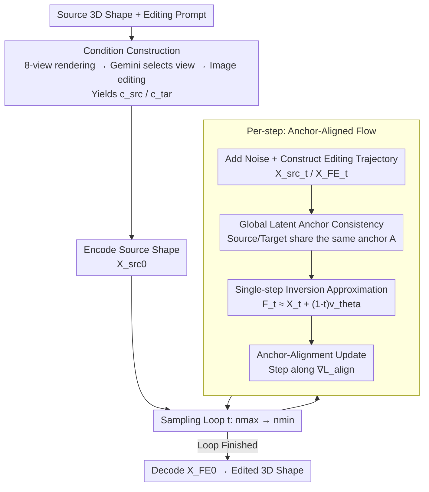

# AnchorFlow: Training-Free 3D Editing via Latent Anchor-Aligned Flows

**Conference**: CVPR 2026  
**Paper**: [CVF Open Access](https://openaccess.thecvf.com/content/CVPR2026/html/Zhou_AnchorFlow_Training-Free_3D_Editing_via_Latent_Anchor-Aligned_Flows_CVPR_2026_paper.html)  
**Code**: None (Project page only <https://zhenglinzhou.github.io/AnchorFlow/>)  
**Area**: 3D Vision / Diffusion Models  
**Keywords**: 3D Editing, Training-Free, Flow Matching, Latent Anchors, Mask-Free

## TL;DR
AnchorFlow attributes the failure of "inversion-free 3D editing" to the drift of latent anchors caused by re-sampling Gaussian noise at each timestep. To address this, it introduces a **global latent anchor** shared by both source and target trajectories, anchoring them to a single reference via a relaxed anchor-alignment loss. This enables effective 3D shape editing without fine-tuning or masks, while preserving geometry-level characteristics.

## Background & Motivation

**Background**: Training-free 3D editing refers to automatically modifying a 3D shape into a new one according to a human text prompt, without fine-tuning any model weights. It is a highly practical direction in 3D content creation. Recently, 3D Large Foundation Models (LFMs, such as Hunyuan3D 2.1) have provided strong shape generation priors, making such editing feasible. Among these, inversion-free strategies like FlowEdit have succeeded in 2D image editing by directly constructing an editing trajectory between the source and target trajectories instead of first inverting the image back to noise.

**Limitations of Prior Work**: Direct application of inversion-free pipelines to 3D foundation models leads to two main issues: either **under-editing** (e.g., failing to add a requested sword, resulting in almost no change) or **geometry distortion** (over-editing/distortion). Through a toy experiment, the authors identify the root cause: FlowEdit samples a new Gaussian noise as an anchor at each denoising step. Since 3D flow models are highly sensitive to noise perturbations, these "step-wise anchors" drift irregularly, causing flow directions to counteract each other and resulting in a synthesis velocity close to zero. Consequently, the trajectory remains trapped near the source manifold, preventing successful editing.

**Key Challenge**: Can we simply fix the noise? Experiments show that fixing the noise does enable editing, but it **erases the object identity** (over-constraining the anchors pushes the trajectory far from the source manifold, leading to over-editing). This reveals a trade-off: "achieving stable anchors" and "avoiding identity loss" are contradictory. Random step-wise anchors lead to under-editing, while rigidly fixed anchors lead to over-editing.

**Goal + Key Insight**: The goal is to obtain a **latent reference that remains consistent across all timesteps while simultaneously aligning with both the source and the target**. The authors' insight is: rather than letting the source and target implicitly depend on random noise correspondences, they can explicitly construct a global anchor shared by both trajectories, such that "the source can be reconstructed to it, and the target can also be reconstructed to it."

**Core Idea**: Replace step-wise random noise anchors with a globally shared latent anchor. By employing a relaxed anchor-alignment loss, the single-step inversion results of the source and target trajectories at each timestep are forced to approach each other in the latent space. The continuity of flows then propagates these local constraints into globally consistent anchors, achieving a balanced edit that is both visually expressive and geometrically stable.

## Method

### Overall Architecture
The inputs to AnchorFlow are a source 3D shape (mesh) and an editing text prompt; the output is the edited 3D shape. The entire pipeline requires neither fine-tuning of the flow model nor any mask. It begins with **condition construction**: rendering 8 views of the source model, using a Large Multimodal Model (Gemini-2.5-Flash) to select the view most aligned with the prompt as the source condition $c_\text{src}$, and then editing this image with an image editing model according to the prompt to obtain the target condition $c_\text{tar}$. Next, the source shape is encoded into a latent code $X^\text{src}_0$ and enters the **AnchorFlow sampling loop**: at each step, noise is added to the source trajectory to obtain $X^\text{src}_t$, and the editing trajectory $X^\text{FE}_t$ is constructed following FlowEdit. A single weight-shared flow model $v_\theta$ predicts velocity fields for the source and target samples, performing a **single-step inversion** that approximately maps both back to the noise space to obtain anchors $F_t(X^\text{src}_t)$ and $F_t(X^\text{tar}_t)$. Finally, an **anchor-alignment update** (gradient direction of the alignment loss $\mathcal{L}_\text{align}$) replaces the original velocity-difference update, steering the editing state towards sharing a single anchor. Once the loop is complete, the final latent code $X^\text{FE}_0$ is decoded back to the 3D space to yield the edited 3D shape.

### Key Designs

**1. Global Latent Anchor Consistency: Replacing "Step-wise Random Noise" with a "Shared Fixed Reference across Trajectories"**

This is the core thesis of the paper, directly tackling the dilemma where "step-wise anchor drift causes under-editing, while fixed anchors erase identity." The authors define an ideal anchor $A$ that should simultaneously reconstruct both the source and target under their respective conditions, meaning for all timesteps:
$$A = F_t(X^\text{src}_t, t, c_\text{src}) = F_t(X^\text{tar}_t, t, c_\text{tar}),\quad \forall t \in [0,1],$$
where $F_t(\cdot)$ is the mapping that approximately projects the current latent state back to the noise space (e.g., the noisy latent code at $t=1$). Requiring strict equality of $A$ for all $t$ is intractable (as the mapping $F_t$ is implicit in diffusion dynamics). It is therefore relaxed into a differentiable least-squares objective: minimizing the reconstruction deviation of both trajectories relative to the global anchor:
$$\min_A \sum_{t}\big[\,\|F_t(X^\text{src}_t)-A\|^2 + \|F_t(X^\text{tar}_t)-A\|^2\,\big].$$
Solving for the optimal $A$ yields $A^* = \tfrac{1}{2T}\sum_t [F_t(X^\text{src}_t)+F_t(X^\text{tar}_t)]$ (i.e., the average of the inversion results from both trajectories). Substituting this back yields the practical **relaxed anchor-alignment loss**:
$$\mathcal{L}_\text{align} = \tfrac{1}{2}\sum_{t}\|F_t(X^\text{tar}_t)-F_t(X^\text{src}_t)\|^2.$$
This formulation represents a lower bound of the original objective, with a straightforward meaning: forcing the inversion anchors of the source and target trajectories to approach each other at each timestep. Enabled by flow continuity, these step-wise pairwise constraints naturally propagate into a globally consistent latent reference. This avoids both flow cancellation caused by random anchors (resolving under-editing) and trajectory deviations caused by rigidly fixed noise (resolving over-editing).

**2. Single-Step Inversion Approximation: Making the Implicit Mapping $F_t$ Computable and Differentiable**

Computing $F_t$ is required in the anchor-alignment loss, but the true inversion (integrating from the current state back to noise) is computationally expensive and implicit, preventing its direct insertion into optimization. The authors approximate it using a first-order backward step:
$$F_t(X_t,t,c) \approx X_t + (1-t)\,v_\theta(X_t,t,c).$$
This step introduces negligible computational overhead while expressing the anchors entirely via the velocity field $v_\theta$. Consequently, the entire alignment loss can be written purely as a function of the velocity fields and remains differentiable, preparing the ground for computing gradients back to the editing state. Its significance lies in compressing the seemingly full-inversion task of "aligning the inversion anchors of two trajectories" into a single extra velocity prediction.

**3. Anchor-Alignment Update Rule: Replacing FlowEdit's Velocity-Difference Update with Alignment Loss Gradient**

With the differentiable $\mathcal{L}_\text{align}$, updates can be driven by taking the gradient with respect to the current editing state $X^\text{FE}_t$. Expanding the gradient yields a Jacobian term:
$$\nabla_{X^\text{FE}_t}\mathcal{L}_\text{align} = \big[I+(1-t)J_\theta\big]^\top\big(F_t(X^\text{tar}_t)-F_t(X^\text{src}_t)\big),$$
where $J_\theta = \partial v_\theta(X^\text{tar}_t,t,c_\text{tar})/\partial X^\text{FE}_t$. Since calculating Jacobian matrices in high-dimensional spaces is too costly, the authors adopt the Jacobian-free approximation from SDS, treating $[I+(1-t)J_\theta]^\top$ as a scalar multiple of the identity matrix and approximating it as $(2-t)I$. Consequently, the gradient simplifies to:
$$\nabla_{X^\text{FE}_t}\mathcal{L}_\text{align} \approx (2-t)\big(F_t(X^\text{tar}_t)-F_t(X^\text{src}_t)\big),$$
and the update rule becomes $X^\text{FE}_{t-\delta t} = X^\text{FE}_t - \delta t\,\nabla_{X^\text{FE}_t}\mathcal{L}_\text{align}$. This essentially performs a step of gradient descent on the anchor-alignment loss. Unlike FlowEdit which uses the source/target velocity difference (implicitly relying on random noise correspondences) for updates, this approach explicitly updates along the direction of "enabling both trajectories to share the same anchor," guaranteeing geometric consistency at each step and progressively transforming the source shape into the target while preserving identity structure.

**4. Condition Construction + Automatic Dataset: Obtaining Mask-Free Source/Target Conditions and Cheaply Creating Paired Data**

Driving the edit requires source and target conditions. Instead of relying on manual masks, the authors render the source model from 8 preset camera views, use Gemini-2.5-Flash to rank each rendering based on its alignment with the editing prompt, select the highest-scoring rendering as $c_\text{src}$, and then edit this image with an image editing model according to the prompt to obtain $c_\text{tar}$. Since the entire pipeline is mask-free and training-free, it also serves as a low-cost, scalable pipeline for generating **paired 3D editing data**—which is emphasized as a valuable byproduct contribution. Ultimately, sampling is performed over $T=50$ steps, the editing range is bounded from $n_\text{max}$ to $n_\text{min}$, and the source/target guidance strengths are controlled by $s_\text{src}, s_\text{tar}$ (defaulting to $s_\text{src}=3.5,\ s_\text{tar}=7.5,\ n_\text{min}=1,\ n_\text{max}=41$).

### A Full Example
Taking the prompt "change the character's T-pose to a waving gesture with one hand raised" as an example: First, the source character is rendered from 8 views. Gemini selects the view that best captures the pose as $c_\text{src}$, and the image editing model modifies it to a waving pose to obtain $c_\text{tar}$. The source mesh is encoded into $X^\text{src}_0$. At each step in the sampling loop: noise is added to the source to get $X^\text{src}_t$, and the editing trajectory $X^\text{FE}_t$ is constructed. The flow model predicts velocities for the source (conditioned on $c_\text{src}$) and the target (conditioned on $c_\text{tar}$), performing a single-step inversion to yield two anchors $F_t(X^\text{src}_t)$ and $F_t(X^\text{tar}_t)$. The difference between them multiplied by $(2-t)$ serves as the alignment gradient, pushing $X^\text{FE}_t$ by $\delta t$ steps towards anchor consistency. Since this is a non-rigid edit (action change) requiring strong global transforms, larger values of $(n_\text{max}, s_\text{tar})$ are used. After 50 steps, $X^\text{FE}_0$ is decoded into a mesh with its arm raised to wave, while body proportions and identity remain identical to the original character.

## Key Experimental Results

### Main Results
Evaluation is conducted on the self-built **Eval3DEdit** benchmark (containing 100 editing samples, uniformly covering five categories: action change, object addition, removal, replacement, and style change. Source shapes are harvested from Objaverse-XL with an aesthetic score threshold of 7.0, and prompts are generated by Gemini 2.5 Pro). Metrics include two CLIP similarities: $\text{CLIP}_\text{img}$ measures the similarity between the edited rendering and the target condition image (identity preservation), while $\text{CLIP}_\text{txt}$ measures the correspondence between the rendering and the target text prompt (semantic modification).

| Method | Type | CLIP_img↑ (Overall) | CLIP_txt↑ (Overall) |
|------|------|------|------|
| TextDeformer | Optimization-based | 0.5074 | 0.4150 |
| MeshUp | Optimization-based | 0.4736 | 0.3861 |
| MVEdit | LRM-based | 0.5074 | 0.3632 |
| EditP23 | LRM-based | 0.4775 | 0.3699 |
| Direct Editing | LFM-based | 0.6152 | 0.4451 |
| Editing-by-Inversion | LFM-based | 0.7119 | 0.4737 |
| Inversion-free Editing (FlowEdit) | LFM-based | 0.7106 | 0.4705 |
| **AnchorFlow (Ours)** | LFM-based | **0.7173** | **0.4866** |

Ours achieves the best overall performance. Compared to the most direct inversion-free baseline FlowEdit, $\text{CLIP}_\text{img}$ and $\text{CLIP}_\text{txt}$ are improved by 0.0067 and 0.0161, respectively. The improvement in semantic modification ($\text{CLIP}_\text{txt}$) is notably more significant, showing that the method succeeds primarily because it "edits more aggressively" without losing identity. LFM-based methods generally outperform LRM-based methods, which the authors attribute to the fact that LRM reconstruction from multi-view diffusion introduces cross-view inconsistencies, whereas LFM directly edits in the 3D latent space end-to-end.

### Ablation Study

| Configuration / Analysis | Key Findings | Explanation |
|------|---------|------|
| Direct Editing | Lowest identity preservation (0.6152) | Re-generating directly from edited 2D images loses identity details |
| Editing-by-Inversion | Second best across multiple categories (0.7119) | But requires inversion anchors; ours matches/outperforms without inversion costs |
| FlowEdit (Inversion-free) | Under-edits rigid segments, distorts non-rigid geometry | Ours directly addresses and mitigates both issues |
| Average Direction $n_\text{avg}$ | Compatible with ours, stackable | Both benefit from averaging, but averaging requires more compute; ours achieves higher gains with almost zero overhead |
| Time Cost | 26.71 s | Virtually identical to FlowEdit's 25.77 s but yields higher quality (TextDeformer takes 2229 s, MVEdit takes 513 s) |

### Key Findings
- **Gains mainly lie in CLIP_txt**: Compared to FlowEdit, the method primarily improves the degree of semantic modification while preserving identity, verifying the motivation that "stabilizing global anchors leads to editing that is both visually expressive and geometrically stable."
- **Parameters $(n_\text{max}, s_\text{tar})$ control editing intensity**: Larger values enhance semantic changes, while smaller values preserve identity. $n_\text{max}=37,\ s_\text{tar}=6.0$ offers a good trade-off. Different edit types exhibit distinct preferences: object removal/style change favor smaller values; addition/replacement favor medium-range values; action change requires larger values (pose changes demand more aggressive editing). For object removal, ours shows moderate performance, which authors attribute to parameter selection and is adjustable.
- **Complementary to Average Direction**: FlowEdit relies on averaging multiple random anchors to stabilize updates. Ours stabilizes updating directions fundamentally by aligning anchors. They are aligned in spirit and can be stacked for further improvements with almost no extra time overhead.

## Highlights & Insights
- **Diagnosing "failed/distorted edits" as an anchor drift issue**: A clean toy experiment (random noise $\to$ under-editing; fixed noise $\to$ over-editing) seamlessly links the phenomenon, the root cause, and the solution. This is the most satisfying aspect of the paper—it reformulates an empirical tuning problem into a fundamental question: "whether the latent reference should be stabilized."
- **Dual approximations (relaxation + Jacobian-free) make the method highly practical**: Ideal anchor equation is intractable $\to$ relaxed into a least-squares lower bound; inversion is uncomputable $\to$ approximated with a single-step first-order method; Jacobian is expensive $\to$ approximated as $(2-t)I$ following SDS. These three steps compress the theoretical objective into "one extra velocity prediction per step," making the runtime virtually identical to FlowEdit.
- **Training-free, mask-free, and capable of generating dataset**: The entire process involves no fine-tuning or masks and naturally becomes a low-cost pipeline for producing paired 3D editing data. This byproduct is highly valuable for future training-based 3D editing methods.
- **Generalizable methodology**: The paradigm of "using a global anchor shared by two trajectories + a relaxed alignment loss to stabilize flow direction" can theoretically be transferred to other flow matching/diffusion inversion-free editing scenarios (images, videos) to stabilize edit trajectories.

## Limitations & Future Work
- **Limitations acknowledged by the authors**: The method is bounded by the reconstruction capacity of the 3D VAE. Compared to the source model, reconstruction loses high-frequency geometry (e.g., facial details) and structural features (e.g., overall accessories), restricting detailed preservation during editing. The authors assume this will be mitigated with higher-fidelity 3D foundation models.
- **Independent observations**: ① Evaluation relies solely on CLIP_img/CLIP_txt and 100 samples, lacking human preference studies or larger-scale validation. CLIP scores are inherently insensitive to whether geometry is physically plausible. ② The average performance on object removal is attributed to "parameter tuning," illustrating that the method is sensitive to $(n_\text{max}, s_\text{tar})$ and requires separate tuning for different edit types without an automatic selection mechanism. ③ Condition construction heavily depends on proprietary Gemini + image editing models, setting an upper limit on the target condition's quality.
- **Avenues for improvement**: Implementing adaptive/learnable parameter selection tailored to editing categories; introducing geometric-level (non-CLIP) evaluation metrics; and exploring fully automatic, open-source, and controllable condition construction pipelines.

## Related Work & Insights
- **vs FlowEdit (Inversion-free 2D editing)**: FlowEdit updates via source/target velocity differences at each step, implicitly relying on random step-wise noise correspondences, which leads under-editing or distortion in 3D due to noise sensitivity. Ours replaces the update with the gradient of a global anchor-alignment loss, explicitly stabilizing the latent reference. The two methods are orthogonal and stackable.
- **vs Editing-by-Inversion**: Inverting shapes back to noise before editing achieves good identity preservation but at a high inversion cost. Ours avoids full inversion and matches or outperforms it using a single-step inversion approximation.
- **vs LRM-based editing (MVEdit / EditP23)**: These methods rely on multi-view diffusion generation followed by reconstruction, which easily introduces cross-view inconsistencies. Ours uses an LFM to edit directly in the 3D latent space end-to-end, offering superior consistency and speed.
- **vs Early SDS/Geometric deformation-based editing (TextDeformer / MeshUp)**: Guided by CLIP/SDS optimization or explicit geometric deformation, these approaches suffer from unstable gradients and high runtime (thousands of seconds). Ours relies on training-free forward sampling, completing editing within seconds.

## Rating
- Novelty: ⭐⭐⭐⭐ Reformulating 3D inversion-free editing as a "latent anchor consistency" problem and presenting an applicable alignment loss provides a clear perspective, though it is technically an evolutionary improvement over FlowEdit.
- Experimental Thoroughness: ⭐⭐⭐ Self-built benchmark + seven baselines + parameter/time/average direction analysis offer a comprehensive view, but evaluation is restricted to two CLIP metrics, 100 samples, and lacks user study.
- Writing Quality: ⭐⭐⭐⭐ The logical flow from the toy experiment to the motivation is coherent, the three approximations are well-articulated, and the equations are self-contained.
- Value: ⭐⭐⭐⭐ Being training-free, mask-free, fast, and capable of generating data makes it highly practical for both 3D content creation and subsequent dataset construction.

<!-- RELATED:START -->

## Related Papers

- [\[ICLR 2026\] Nano3D: A Training-Free Approach for Efficient 3D Editing Without Masks](../../ICLR2026/3d_vision/nano3d_a_training-free_approach_for_efficient_3d_editing_without_masks.md)
- [\[CVPR 2026\] Fast3Dcache: Training-free 3D Geometry Synthesis Acceleration](fast3dcache_training-free_3d_geometry_synthesis_acceleration.md)
- [\[CVPR 2026\] 3D-LATTE: Latent Space 3D Editing from Textual Instructions](3d-latte_latent_space_3d_editing_from_textual_instructions.md)
- [\[CVPR 2026\] Easy3E: Feed-Forward 3D Asset Editing via Rectified Voxel Flow](easy3e_feed-forward_3d_asset_editing_via_rectified_voxel_flow.md)
- [\[CVPR 2026\] OpenVoxel: Training-Free Grouping and Captioning Voxels for Open-Vocabulary 3D Scene Understanding](openvoxel_training-free_grouping_and_captioning_voxels_for_open-vocabulary_3d_sc.md)

<!-- RELATED:END -->
