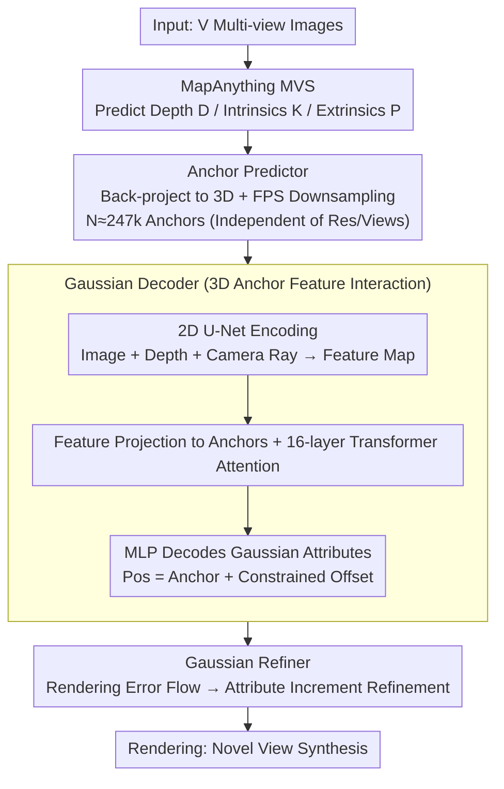

# AnchorSplat: Feed-Forward 3D Gaussian Splatting with 3D Geometric Priors

**Conference**: CVPR 2026  
**arXiv**: [2604.07053](https://arxiv.org/abs/2604.07053)  
**Code**: Coming soon  
**Area**: 3D Vision / Novel View Synthesis  
**Keywords**: 3D Gaussian Splatting, Feed-forward reconstruction, Anchor-aligned, Geometric priors, Novel view synthesis

## TL;DR
AnchorSplat proposes an anchor-aligned feed-forward 3DGS framework that predicts Gaussians directly in 3D space using 3D geometric priors (sparse point clouds) as anchors. It achieves SOTA performance on ScanNet++ v2 (PSNR 21.48) with approximately 20x fewer Gaussians and half the reconstruction time, while providing superior depth estimation accuracy.

## Background & Motivation
**Background**: Scene-level 3D reconstruction is a core problem in computer vision. Optimization-based methods (3DGS, NeRF) provide high quality but require long, per-scene iterative optimization. Feed-forward 3DGS methods enable cross-scene generalization via a single forward pass.

**Limitations of Prior Work**:
   - Existing feed-forward methods adopt pixel-alignment strategies: each 2D pixel maps to one 3D Gaussian, making the number of Gaussians $N = H \times W \times V$ grow linearly with the number of views;
   - Pixel-aligned representations are tied to 2D grids, leading to redundancy in flat areas and inadequacy in complex regions;
   - Sensitive to occlusions, low-texture areas, and motion parallax, with inconsistent cross-view sampling patterns;
   - Limited feature interaction in 2D space results in a lack of direct interaction between neighboring 3D points, producing floaters and fractured surfaces.

**Key Challenge**: How to achieve geometrically consistent, high-fidelity 3D reconstruction under feed-forward efficiency?

**Key Insight**: Start from 3D anchors instead of 2D pixels—utilize depth and poses predicted by MVS to construct sparse 3D anchors and predict Gaussians on those anchors.

**Core Idea**: Anchor-aligned Gaussian representation + Gaussian Refiner iterative refinement = fewer Gaussians, higher quality, independent of input resolution or view count.

## Method

### Overall Architecture
Input: $V$ multi-view images → MapAnything MVS module predicts depth and poses → Back-projection to 3D + FPS downsampling to obtain $N$ anchors → 2D U-Net extracts features and projects them to anchors → Gaussian Decoder interacts between 3D anchors via Transformer and predicts anchor-aligned Gaussians → Gaussian Refiner refines via rendering error → Rendering.

### Key Designs

**1. Anchor Predictor: Shifting Gaussian "Mounting Points" from 2D Pixels to 3D Anchors**

Previous feed-forward methods aligned Gaussians per pixel, where every pixel in every view generated a Gaussian. The total count $V \times H \times W$ expands linearly—AnySplat produces ~5.5M Gaussians for 32 views, creating redundancy on flat walls and insufficiency at complex edges. AnchorSplat bypasses pixels: it uses pre-trained MapAnything to predict depth $D_i$, intrinsics $K_i$, and extrinsics $P_i$, back-projecting each pixel to world coordinates:

$$P_w = R_i\big(D_i(u,v)\, K_i^{-1}[u,v,1]^\top\big) + T_i,$$

followed by Farthest Point Sampling (FPS) to sparsify the dense cloud into $N \ll H \times W \times V$ anchors. Crucially, the anchor count depends on geometric complexity rather than resolution or view count—staying stable at ~247k whether given 3 or 128 views, which is ~20x fewer than pixel-alignment.

**2. Gaussian Decoder: Feature Interaction Between 3D Anchors Instead of 2D Grids**

Pixel-alignment limits interaction to 2D views, causing spatially neighboring points from different views to be unaware of each other, resulting in fractured surfaces. The Decoder moves interaction to 3D: a 2D U-Net encodes images and rays into feature maps $F_i = E(I_i, D_i, \text{Ray}_i) \in \mathbb{R}^{h \times w \times C}$. These features are projected to anchors, followed by 16 Transformer layers for cross-anchor communication in 3D space. Each anchor decodes attributes $\{\delta\mu, \alpha, s, r, sh\}$ via MLP, with the final position being the anchor plus a constrained small offset:

$$\mu_j = A_j + \delta\mu_j,$$

where the offset is limited to approx. $10/128$. Since interaction happens in 3D neighborhoods rather than 2D grids, geometric consistency is significantly improved.

**3. Gaussian Refiner: One-step Rendering Error Backflow for "Quasi-Optimization"**

Feed-forward passes may leave holes or blurriness. The Refiner incorporates "one-step optimization": Multi-scale residuals $e_i = F_i - \hat{F}_i$ are calculated between rendered and ground-truth features using ResNet-18. This 2D error is back-projected to 3D Gaussian positions. A Transformer combined with a Point Transformer predicts attribute increments based on current attributes, anchor features, and error features:

$$\hat{\mathcal{G}}_j = \mathcal{G}_j + \delta\mathcal{G}_j.$$

This plug-and-play module can be attached to any feed-forward 3DGS to improve boundary sharpness and color consistency without retraining the entire core model.

### Loss & Training
- **Two-stage Training**:
    - Stage 1: Train Gaussian Decoder (84M params), 5k steps.
    - Stage 2: Freeze Decoder, train Gaussian Refiner (31M params), 5k steps.
- **Decoder Loss**: $L = \lambda_I \ell_I + \lambda_D \ell_D + \lambda_\alpha \ell_\alpha + \lambda_s \ell_s$
    - Rendering Loss: $\ell_I = \ell_1 + 0.2(1- \text{SSIM}) + 0.2 \text{LPIPS}$
    - Depth loss, opacity regularization, volume regularization.
- **Refiner**: Uses only rendering loss $\ell_I$.

## Key Experimental Results

### Main Results (ScanNet++ v2, 32 Input Views, 4 Novel Views)

| Method | Category | PSNR↑ | SSIM↑ | δ₁↑ | AbsRel↓ | Gaussians | Recon Time |
|------|------|-------|-------|-----|---------|--------|---------|
| 3DGS | Optimization | 19.98 | 0.72 | 0.31 | 0.42 | 496K | 391s |
| AnySplat | Feed-forward | 20.20 | 0.73 | 0.71 | 0.16 | **5.55M** | 6.83s |
| AnchorSplat⋆ | Feed-forward | 20.96 | 0.78 | **0.94** | 0.068 | 247K | **3.11s** |
| **Ours** | Feed-forward | **21.48** | **0.79** | **0.94** | **0.066** | 247K | 5.52s |

### Ablation Study (Varying Input View Counts)

| Setting | Method | PSNR↑ | Gaussians | Recon Time |
|------|------|-------|--------|---------|
| 3 Views | AnySplat | 19.51 | 544K | 1.34s |
| 3 Views | Ours⋆ | **19.99** | **247K** | 3.18s |
| 128 Views | AnySplat | 20.47 | 21.6M | 14.2s |
| 128 Views | Ours⋆ | **21.23** | **247K** | 3.94s |

### Key Findings
- Gaussian count is constant at 247k, independent of view count (AnySplat grows from 550k to 21.6M).
- Depth accuracy is significantly better than AnySplat (δ₁: 0.94 vs 0.71), reflecting stronger 3D-aware anchor alignment.
- Refiner significantly improves boundary sharpness and color consistency.
- Performance remains stable across extremely sparse (3 views) and extremely dense (256 views) settings.

## Highlights & Insights
- **Anchor-alignment is the key innovation**: It decouples Gaussian representation from 2D pixels, with quantities determined by the scene geometry.
- The Gaussian Refiner's plug-and-play design is elegant and can be used independently to enhance any feed-forward 3DGS method.
- The massive gain in depth estimation (0.94 vs 0.71) proves that feature interaction in 3D space is critical for geometric understanding.

## Limitations & Future Work
- Dependency on MapAnything's depth and pose quality; poor MVS predictions lead to degraded anchor quality.
- Spherical harmonics (SH) are limited to degree 0 (no view-dependent color), restricting performance on specular materials.
- SH degree 0 may be insufficient for scenes with complex lighting.

## Related Work & Insights
- Compared to voxel-alignment in AnySplat, anchor-alignment utilizes 3D geometric priors more directly.
- The rendering error feedback in Refiner is conceptually similar to G3R but more lightweight.

## Rating
- Novelty: ⭐⭐⭐⭐⭐ Anchor-alignment is a significant advancement for feed-forward 3DGS.
- Experimental Thoroughness: ⭐⭐⭐⭐ Comprehensive evaluation on ScanNet++ with view count ablations.
- Writing Quality: ⭐⭐⭐⭐ Clear method description and fair comparisons.
- Value: ⭐⭐⭐⭐⭐ 20x efficiency gain with improved quality; highly practical.

<!-- RELATED:START -->

## Related Papers

- [\[CVPR 2026\] Off The Grid: Detection of Primitives for Feed-Forward 3D Gaussian Splatting](off_the_grid_detection_of_primitives_for_feed-forward_3d_gaussian_splatting.md)
- [\[CVPR 2026\] TokenSplat: Token-aligned 3D Gaussian Splatting for Feed-forward Pose-free Reconstruction](tokensplat_token-aligned_3d_gaussian_splatting_for_feed-forward_pose-free_recons.md)
- [\[CVPR 2026\] Z-Order Transformer for Feed-Forward Gaussian Splatting](z-order_transformer_for_feed-forward_gaussian_splatting.md)
- [\[CVPR 2026\] SparseSplat: Towards Applicable Feed-Forward 3D Gaussian Splatting with Pixel-Unaligned Prediction](sparsesplat_towards_applicable_feed-forward_3d_gaussian_splatting_with_pixel-una.md)
- [\[CVPR 2026\] SR3R: Rethinking Super-Resolution 3D Reconstruction With Feed-Forward Gaussian Splatting](sr3r_rethinking_super-resolution_3d_reconstruction_with_feed-forward_gaussian_sp.md)

<!-- RELATED:END -->
