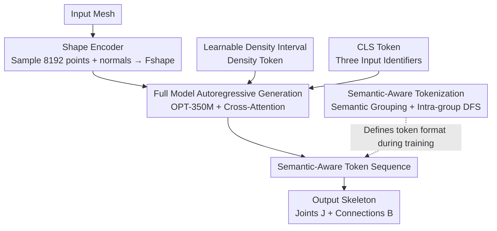

# Animator-Centric Skeleton Generation on Objects with Fine-Grained Details

**Conference**: CVPR 2026  
**Paper**: [CVF Open Access](https://openaccess.thecvf.com/content/CVPR2026/html/Sun_Animator-Centric_Skeleton_Generation_on_Objects_with_Fine-Grained_Details_CVPR_2026_paper.html)  
**Code**: To be confirmed  
**Area**: 3D Vision  
**Keywords**: Skeleton Generation, Auto-rigging, Autoregressive Modeling, Semantic Tokenization, Controllable Generation

## TL;DR
Addressing the two major pain points of existing automatic skeleton generation (rigging)—inability to handle complex structures and lack of controllability—this work constructs a large-scale dataset of 82,633 rigged meshes and proposes two mechanisms: "semantic-aware tokenization" and "learnable density intervals." This enables an OPT-350M-based decoder-only autoregressive model to generate complete skeletons for fine-grained structures like dresses, long sleeves, and reins, while allowing animators to directly control bone density and complete auxiliary bones given the primary bones.

## Background & Motivation
**Background**: Skeleton Generation (SG) is the first step of animating 3D assets—skeletons act both as simplified representations of objects and the initial editing handles for animators. Early methods (e.g., RigNet, TARig) treated SG as geometric optimization or regression problems. Recently, the mainstream has shifted towards data-driven approaches: training neural networks to align the geometric encoding of objects with human-annotated skeletons. The latest works (e.g., Puppeteer, MagicArticulate, UniRig) represent the skeleton as token sequences and predict them token-by-token using autoregressive (AR) models.

**Limitations of Prior Work**: The authors identify two commonly overlooked bottlenecks. First, while 3D generative models enable large-scale, low-cost creation of high-quality assets with complex structures (complex hairstyles, clothing, accessories), existing SG methods treat the object as a single entity and rely heavily on geometric encoding, failing to adapt to this growing structural complexity. The Breadth-First-Search (BFS) token order commonly used in AR methods is purely geometric, leading to errors under geometric ambiguity (e.g., UniRig incorrectly attaching a horse's reins to its neck). Second, both axiomatic and learning-based methods are mostly end-to-end and lack conditional control, forcing animators to perform tedious post-processing, which yields poor flexibility and efficiency.

**Key Challenge**: Purely geometric representations introduce ambiguity when structures are complex (as identical geometric locations may belong to different semantic parts), whereas end-to-end black boxes exclude animators from the generation loop. Both issues fundamentally stem from a "lack of understanding of the semantic structure of the skeleton."

**Goal**: Establish an "animator-centric" SG framework that produces high-quality skeletons on complex inputs while offering two types of control handles for animators. By directly engaging with industry animators, the authors extract two concrete requirements: (R1) the ability to specify rough skeletons or specific local regions, and (R2) the desire for more direct, explicit control over bone density.

**Key Insight**: The authors observe that grouping bones by semantics (primary body / hair / clothing / accessories) naturally mitigates geometric ambiguity, and this "primary-first, auxiliary-second" grouping order conveniently enables the primary-bone conditional generation required by R1.

**Core Idea**: Replace purely geometric BFS tokenization with "semantic-aware tokenization" to reduce structural ambiguity and unlock primary-bone control, paired with a "learnable density interval module" to formulate the bone count as a soft constraint, ultimately achieving both high quality and controllability within a single autoregressive model.

## Method

### Overall Architecture
This work formalizes skeleton generation as a **conditional autoregressive problem**: given an input mesh $M$, predict its skeleton $S$, consisting of joint positions $J \in \mathbb{R}^{k\times3}$ and bone connections $B \in \mathbb{R}^{b\times2}$. The entire pipeline is as follows: the input mesh is first processed by a pre-trained point cloud encoder (sampling 8,192 points + normals on the surface) to extract shape features $F_{shape}$; meanwhile, the skeleton is represented by the proposed **semantic-aware token sequence** (during training, a semantic understanding model annotates joints with semantic labels to define the grouping order); additionally, a **learnable density token** and a **CLS token** are introduced as conditions; these conditional features are fed into an OPT-350M-based decoder-only autoregressive model to generate the skeleton sequence token by token, which is eventually decoded back to joints and connections.

Since the method involves the synergy of multiple modules—"shape encoding, semantic tokenization, density control, CLS identification, and autoregressive decoding"—the overall architecture diagram is shown below (node names match the key designs in order):

### Key Designs

**1. Large-Scale, Highly Complex Rigging Dataset: Exposing the model to a world of 5 to 400 bones**

Existing public rigging datasets (e.g., ModelsResource with 2,703 samples, Articulation-XL with 48,637 samples) are predominantly dominated by simple structures with low bone counts (typically <200), leaving models incapable of learning complex skeletons. The authors crawled over 150,000 rigged 3D models from the web and designed a filtering pipeline to ensure skeleton-mesh alignment: requiring end joints of each bone chain to lie within reasonable geometric ranges of the corresponding mesh connected components (filtering out drifting/penetrated skeletons), requiring the skeleton hierarchy to be a single connected tree (filtering out multiple subtrees or loops), and discarding samples with fewer than 5 joints. This yields **82,633 high-quality instances with bone counts ranging from 5 to 400**, covering various categories like humanoid, quadruped, avian, aquatic, weapons, vehicles, etc. Stratified sampling based on category and joint count is applied to split them into 81,142 for training and 1,491 for testing, ensuring consistent distributions. This dataset acts as the foundation for all subsequent capabilities—without these complex samples, semantic tokenization and density control would be impossible to learn.

**2. Semantic-Aware Tokenization: Replacing pure geometric BFS with semantic grouping, naturally unlocking primary-bone control**

This is the core design of the paper, directly addressing the pain point where "purely geometric BFS ordering creates ambiguity under complex structures." The authors first **pre-train a semantic understanding model**: manually annotating fine-grained semantic labels for 10,000 humanoid and quadruped samples (humanoids have 29 classes: primary bones like head, shoulder, arm, torso, leg; auxiliary bones like hair, skirt, ribbon, backpack; quadrupeds have 31 sub-classes in total, with auxiliary bones including fins, horns, wings). A GraphTransformer is trained with cross-entropy loss, taking normalized joint positions and an undirected graph representing topology as inputs to predict semantic labels for each joint.

Armed with semantic labels, they perform **semantic tokenization**: bones are grouped by semantics, with a special `<group>` token inserted at the start of each group. Within each group, Depth-First Search (DFS) is used to maintain local topological consistency, where child nodes are sorted by spatial coordinates in $(z, y, x)$ order to align topological and spatial hierarchies. Groups are arranged in a fixed order (typically main $\to$ hair $\to$ cloth $\to$ other in practice), and the primary group uses the root node as the group root, while other groups select the node closest to the primary group as their root to maintain structural cohesion. Each joint is represented using **6 tokens**—the discretized results of its own 3D coordinates and its parent node's 3D coordinates. For categories other than humanoids and quadrupeds (which make up nearly 95%), DFS is directly applied to represent the skeleton as a compact subsequence. This design explicitly divides the skeleton into semantic groups while maintaining stable spatial sorting and consistent parent-child encoding, which is highly suited for autoregressive sequence modeling and significantly suppresses geometric ambiguities like UniRig's misconnection of reins to the neck.

Crucially, this naturally **unlocks the primary-bone control required by R1**: in industrial pipelines, primary bones are usually predefined and fixed, and animators build auxiliary bones over them. Because semantic tokenization naturally forces the model to "generate primary bone tokens first, then auxiliary bone tokens," passing the given primary bones through the same tokenization, computing their embeddings, prefixing them to other conditional vectors, and then decoding enables the autoregressive decoder to seamlessly complete auxiliary bones under the primary-bone constraint—a capability that naive tokenization can hardly achieve.

**3. Learnable Density Interval Module: Elevating bone count to a differentiable soft constraint**

Addressing R2—where animators want to generate varying numbers of bones for the same mesh (mainly by adjusting the number of auxiliary bones to match motions of different complexity). Applying hard constraints directly on bone counts is overly rigid, and fixed interval thresholds cannot portray the continuous transition from simple skeletons (primary only) to complex ones enriched with auxiliary bones. The authors therefore propose **learnable density intervals**: using $K$ intervals for learnable binning, where the global left and right boundaries $e_0, e_K$ are constants, and the learnable split points $\{c_i\}_{i=1}^{K-1}$ are constrained to be monotonic using cumulative softplus:

$$c_i = c_{i-1} + \mathrm{softplus}(\Delta_i),\quad i=2,\dots,K-1.$$

Given the bone count $n$ and temperature $\tau>0$, the soft probability of the $k$-th bin is represented by the difference of sigmoids:

$$p_k(n) = \sigma\!\left(\frac{n-e^{left}_k}{\tau}\right) - \sigma\!\left(\frac{n-e^{right}_k}{\tau}\right),$$

and is then normalized to ensure $\sum_k p_k(n)=1$. Each bin is associated with a learnable embedding $\mathbf{e}_k\in\mathbb{R}^C$, and the final density conditional vector is a probability-weighted combination: $F_{density}(n)=\sum_{k=1}^K p_k(n)\,\mathbf{e}_k$ (during inference, an $\arg\max$ one-hot hard mode can be used). During training, the model adaptively learns the distribution of bone counts, and the split points are dynamically adjusted; during inference, the split points are fixed, providing stable and interpretable control over complexity. Compared to "strictly enforcing a precise bone count," this soft design that encourages "falling into a user-specified interval" is both flexible and learnable.

**4. Full Model & Conditional Fusion: Injecting conditions into the autoregressive decoder via CLS token + Cross-Attention**

Integrating these components yields the trainable full model. On the shape side, a pre-trained point cloud encoder extracts $F_{shape}$ from 8,192 sampled points as a condition. To allow the model to judge "whether auxiliary bones should be generated," the data is categorized into three classes—humanoids with primary bones only, humanoids with auxiliary bones, and non-humanoids—and a **learnable classification token $F_{cls}$** is introduced to the conditional input. The backbone uses an OPT-350M-based decoder-only autoregressive model to predict the discrete skeleton token sequence $\hat{T}$. To better inject conditions, conditional features are not only prefixed before `<BOS>` as decoder inputs but also integrated by **inserting a cross-attention layer after each self-attention layer**, where the hidden embeddings act as queries and conditional features act as keys/values, realizing deep fusion of conditional representations. The entire model is optimized using a standard cross-entropy loss for token-level autoregressive prediction: $\mathcal{L}_{ce} = \mathrm{CE}(\hat{T}, T)$. Ablation studies show that this seemingly auxiliary CLS token also yields a minor performance boost.

### Loss & Training
The training objective is the token-level autoregressive cross-entropy $\mathcal{L}_{ce}=\mathrm{CE}(\hat T, T)$ (Eq. 4); the semantic understanding model is pre-trained separately using cross-entropy. To enhance robustness and generalization, data augmentations like scaling, translation, and rotation are applied to the geometry, with a batch size of 12. The distance threshold $\tau$ is set to 0.01.

## Key Experimental Results

### Main Results
On the self-built test set (1,491 samples), the method is compared with three representative automatic SG baselines: UniRig (template-prompted AR), Puppeteer (AR framework with improved connections), and MagicArticulate (an AR transformer, retrained on this paper's dataset). Eight metrics are used: Precision, Recall, Accuracy, and F1 compare predicted and ground-truth joints within the distance threshold $\tau$, supplemented by three Chamfer distance metrics, CD-J2J (joint-to-joint), CD-J2B (joint-to-bone), and CD-B2B (bone-to-bone), to evaluate spatial alignment (↓ is better).

| Method | Precision↑ | Recall↑ | Accuracy↑ | F1↑ | J2J↓ | J2B↓ | B2B↓ |
|------|-----------|---------|-----------|-----|------|------|------|
| UniRig | 0.105 | 0.066 | 0.078 | 0.077 | 0.038 | 0.031 | 0.026 |
| Puppeteer (Untrained) | 0.168 | 0.086 | 0.106 | 0.105 | 0.046 | 0.038 | 0.033 |
| MagicArticulate (Retrained) | 0.712 | 0.701 | 0.697 | 0.707 | 0.044 | 0.034 | 0.032 |
| **Ours** | **0.745** | **0.731** | **0.729** | **0.730** | **0.036** | **0.027** | **0.025** |

Compared to UniRig and Puppeteer, which were not trained on this paper's dataset, Ours achieves a 5–9$\times$ improvement in Precision and F1 (F1 0.730 vs. 0.077 $\approx$ 9.5$\times$, vs. 0.105 $\approx$ 7$\times$), indicating its capability to generate more complete and detailed skeletons; these two baselines have never seen the proposed complex data and can only predict overly simplified skeletons. Even compared to MagicArticulate retrained on this data, Ours still outperforms on all metrics—MagicArticulate lacks the comprehension of complex skeleton topology, finding it hard to yield high-quality auxiliary bones. Qualitatively, UniRig/Puppeteer frequently miss fine joints like hands, tails, and hair accessories, while clothing-related skeletons are completely omitted. Though retrained MagicArticulate achieves higher coverage, its skeletons in head regions are severely distorted, and joints are tangled with the mesh. In contrast, Ours produces structurally complete skeletons that closely align with the ground truth.

### Ablation Study
Ablation study of the two control tokens (density token, CLS token) and tokenization strategies (↑ is better / ↓ is better):

| Configuration | Accuracy↑ | J2J↓ | J2B↓ | B2B↓ | Description |
|------|-----------|------|------|------|------|
| w/o Density token | 0.699 | 0.041 | 0.033 | 0.032 | Remove density token |
| w/o CLS token | 0.714 | 0.037 | 0.028 | 0.027 | Remove classification token |
| naive tokenization | 0.701 | 0.043 | 0.032 | 0.031 | Pure global DFS tokenization |
| w/o Part DFS | 0.712 | 0.040 | 0.029 | 0.028 | Semantic grouping without intra-group DFS |
| w. Part BFS | 0.723 | 0.037 | 0.028 | 0.026 | Using BFS instead of DFS within groups |
| **Full Model** | **0.729** | **0.036** | **0.027** | **0.025** | Full model |

### Key Findings
- **Density tokens act as both control knobs and accuracy boosters**: Adding the density token decreases the J2J distance by 12.2% (0.041 $\to$ 0.036), indicating that explicitly modeling the distribution of bone counts intrinsically benefits generation quality.
- **Semantic tokenization is the main driver of quality**: Compared to naive global DFS tokenization and the "semantic grouping without intra-group DFS" variant, the proposed semantic tokenization reduces J2J by 16.3% (0.043 $\to$ 0.036) and 10% (0.040 $\to$ 0.036), respectively. Furthermore, using DFS within groups outperforms BFS (0.036 vs. 0.037), validating the value of local topological consistency.
- **Density control application**: Three density ranges are initialized based on empirical distributions of primary/auxiliary bones: [0–50] / [50–150] / >150 (low/medium/high). As the density token value increases, primary bones remain stable while auxiliary bones increase reasonably (for humanoids, bones are added around skirts/ribbons/accessories; for non-humanoids, bones are added to non-torso and attachment parts), reflecting that the model has learned realistic structural priors.
- **Primary bone control application**: Given a template primary skeleton, the model can automatically complete detailed auxiliary bones for skirts, hair strands, and accessories, which is extremely difficult for naive tokenization to achieve.

## Highlights & Insights
- **Kill two birds with one stone via "semantic grouping order"**: The same semantic tokenization not only suppresses geometric ambiguity to improve the quality of complex structures, but also naturally unlocks primary-bone conditional generation (R1) due to the fixed "primary-first, auxiliary-second" sequence. This elegant concept of "representation design driving controllability" is highly worth transferring to other structured sequence generation tasks.
- **Transforming discrete control into a differentiable soft constraint**: The learnable density interval employs cumulative softplus for monotonicity and sigmoid differences for soft binning. This converts the originally rigid constraint of "falling into a certain bone count interval" into a learnable, weighted conditional vector. It provides control handles without sacrificing the degree of freedom in generation, making it a reusable component for controllable generation.
- **Reverse-engineering methods from user needs**: The authors directly engaged with industry animators to extract R1/R2, guiding the methodology instead of optimizing metrics behind closed doors. This "animator-centric" problem formulation makes the two applications (density control and primary bone completion) very practical and grounded.

## Limitations & Future Work
- The authors acknowledge that, despite the dataset's breadth, categories like vehicles and accessories remain under-sampled, limiting generalization in these domains. Furthermore, the density token only allows for **global** bone density control and does not yet support precise **local** control over bone counts in specific regions.
- Our observation: All evaluations are conducted on the self-built test set, lacking cross-dataset generalization experiments (e.g., on Articulation-XL). Since the untrained UniRig/Puppeteer baselines are inherently at a disadvantage, the 5–9$\times$ improvement claims must be interpreted with caution (⚠️ horizontal comparisons under different training data configurations are not directly equivalent to methodological superiority). Additionally, the semantic understanding model relies on 10,000 fine-grained manual annotations, requiring re-annotation when transferring to entirely new categories.
- Future directions: Refining density control to the local region level and pipeline-coupling skeleton generation with subsequent fully automatic animation generation are future goals explicitly highlighted by the authors.

## Related Work & Insights
- **vs. UniRig**: UniRig employs a skeletal tree tokenization strategy but relies on manually defined joint orders and lacks automatic semantic understanding, leading to connectivity errors in complex structures (e.g., connecting reins to the neck). Ours utilizes a pre-trained semantic understanding model to automate grouping, yielding better generalization and scalability.
- **vs. MagicArticulate**: MagicArticulate represents each bone as a token encoding both parent-child geometry and semantic class, which implicitly learns connections but suffers from redundancy and spatial ordering ambiguity. Ours proposes a 6-token joint representation with semantic grouping + intra-group DFS, resulting in stabler ordering and higher auxiliary bone quality (outperforming MagicArticulate even after retraining it on our data).
- **vs. Puppeteer**: Puppeteer uses joint tokens with explicit parent indices + BFS to eliminate redundancy and stabilize connections but overlooks the semantic structure of the skeleton, making it difficult to generate application-oriented complex skeletons. Ours fills this gap by introducing the "semantic" dimension.

## Rating
- Novelty: ⭐⭐⭐⭐ Both semantic-aware tokenization and learnable density intervals target real pain points of SG, and the study is the first to explore density control and primary-bone conditional completion.
- Experimental Thoroughness: ⭐⭐⭐⭐ Main results, ablations, and two applications are comprehensively included across eight metrics; however, evaluations are limited to the self-built test set, lacking cross-dataset generalization.
- Writing Quality: ⭐⭐⭐⭐ Clear progression from motivation to method and applications; well-designed pipeline and tokenization diagrams; minor typos present (e.g., "UnRig" and "Metircs").
- Value: ⭐⭐⭐⭐ The large-scale complex rigging dataset + controllable generation have direct practical value for industrial rigging pipelines.

<!-- RELATED:START -->

## Related Papers

- [\[CVPR 2026\] iSplat: Iterative Learning for Fine-Grained Gaussian Splatting](isplat_iterative_learning_for_fine-grained_gaussian_splatting.md)
- [\[CVPR 2026\] InfiniDepth: Arbitrary-Resolution and Fine-Grained Depth Estimation with Neural Implicit Fields](infinidepth_arbitrary-resolution_and_fine-grained_depth_estimation_with_neural_i.md)
- [\[CVPR 2026\] Fresco: Frequency-Spatial Consistent Optimization for Fine-Grained Head Avatar Modeling](fresco_frequency-spatial_consistent_optimization_for_fine-grained_head_avatar_mo.md)
- [\[CVPR 2026\] FISHuman: Fine-grained Single-image 3D Human Reconstruction via Multi-view 4D Remeshing](fishuman_fine-grained_single-image_3d_human_reconstruction_via_multi-view_4d_rem.md)
- [\[CVPR 2026\] Grounded Latents for Entity-Centric 4D Scene Generation](grounded_latents_for_entity-centric_4d_scene_generation.md)

<!-- RELATED:END -->
