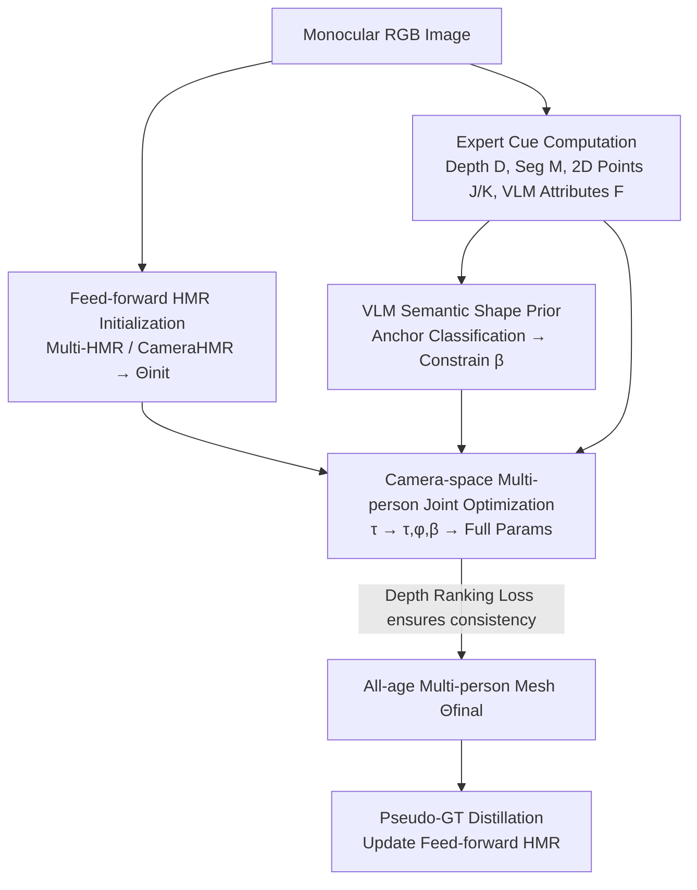

# Anny-Fit: All-Age Human Mesh Recovery

**Conference**: CVPR 2026  
**arXiv**: [2605.04728](https://arxiv.org/abs/2605.04728)  
**Code**: https://github.com/naver/anny-fit (Available)  
**Area**: 3D Vision / Human Mesh Recovery (HMR)  
**Keywords**: All-age human reconstruction, Monocular HMR, Camera space optimization, VLM semantic prior, Depth-shape ambiguity

## TL;DR
Addressing the limitation that monocular Human Mesh Recovery (HMR) methods are often restricted to adults, this paper proposes Anny-Fit—a framework for joint multi-person optimization directly in the camera coordinate system. By leveraging off-the-shelf expert models (metric depth, instance segmentation, 2D keypoints) and age/gender semantic attributes extracted by VLMs, the method constrains the depth-shape ambiguity of "whether a small figure is a distant adult or a nearby child." It adapts adult-centric models to all age groups from infants to seniors in a zero-shot manner without retraining and generates high-quality pseudo-ground truth to further improve feed-forward models.

## Background & Motivation
**Background**: Monocular HMR is a fundamental task in human-centric vision. Mainstream approaches use parametric body models (SMPL/SMPL-X) to regress or optimize 3D pose and shape. Most methods assume all subjects in the image are adults, allowing the apparent size of a person to serve as a direct depth cue—smaller figures are assumed to be farther away.

**Limitations of Prior Work**: This assumption fails when children are present. A small silhouette could either be a distant adult or a nearby child; thus, "apparent size" no longer uniquely determines depth. Furthermore, most methods crop and fit each person independently, leading to contradictory relative depths and inconsistent spatial layouts of the entire scene.

**Key Challenge**: In all-age scenes, the two unknowns—depth (distance) and shape (adult vs. child)—are coupled and entangled. 2D evidence from a single person cannot decouple them, and independent optimization lacks cross-scene relative depth constraints, often leading to degenerate solutions that satisfy 2D reprojection but fail in 3D depth.

**Goal**: To recover all-age, multi-person, camera-consistent 3D human meshes without retraining or relying on large-scale datasets labeled with children, and to encapsulate this capability into a tool for generating pseudo-ground truth.

**Key Insight**: The authors make two observations: first, the newly released Anny body model covers the human lifecycle from infancy to old age using a single model, and its shape space is directly parameterized by **semantic attributes** (age, gender, height, weight), which naturally aligns with observable image cues. Second, general VLMs can now reliably extract high-level semantics such as "this is a child" or "this is an adult." By connecting these, a training-free approach can provide shape priors for optimization.

**Core Idea**: The method reformulates "estimating continuous shape attributes" as "anchor classification on each $\beta$ dimension," using a VLM as a training-free shape estimator to bound the body shape. It then performs multi-stage joint optimization for all persons in camera space, utilizing off-the-shelf metric depth maps to impose cross-person depth ranking constraints, thereby decoupling the depth-shape ambiguity in all-age scenes.

## Method

### Overall Architecture
Anny-Fit treats all-age multi-person HMR as an "expert-guided optimization" problem. It starts with initial Anny parameters $\Theta_{\text{init}}$ for each person from a feed-forward HMR network (e.g., Multi-HMR or CameraHMR), then iteratively refines them using cues calculated by expert models to obtain consistent meshes $\Theta_{\text{final}}$ in the camera coordinate system. Each person is represented by Anny parameters $\Theta^i=\{\beta^i,\phi^i,\tau^i,\theta^i\}$ (shape $\beta\in\mathbb{R}^{10}$, root orientation $\phi$, root translation $\tau$, and pose $\theta\in\mathbb{R}^{163}$).

Expert cues are divided into two levels: **Person-level cues** $\mathcal{P}=\{J,F,K\}$ (2D joints $J$, VLM-estimated attributes $F$, and dense 2D keypoints $K$) and **Scene-level cues** $\mathcal{S}=\{D,M,\Theta_{t-1}\}$ (metric depth map $D$, instance segmentation $M$, and the previous optimization state $\Theta_{t-1}$ as a regularizer). These cues are integrated into a weighted objective function for multi-stage joint optimization. Finally, the high-quality fits can serve as pseudo-GT for distillation into feed-forward models.

### Key Designs

**1. Resolving Depth-Shape Ambiguity with the Anny Model**

Adult-specific settings work because "size = depth" holds; however, in all-age scenarios, the same 2D projection could be a distant adult or a nearby child. Depth and shape must be estimated jointly. Previous models like SMPL-A (interpolating SMPL-X and the SMIL baby model) are discontinuous between adult and infant forms, often producing distorted shapes (e.g., scaling a baby model to represent a child). Ours utilizes the Anny model, which offers two advantages: it provides a single continuous model covering the entire human life cycle, ensuring consistent reasoning in multi-person scenes, and its shape space is parameterized by **non-independent physical attributes** (age, gender, height, weight, muscle). Each $\beta$ dimension corresponds to an observable semantic attribute, making it directly constrainable by image cues. This transforms the "all-age ambiguity" from a geometric puzzle into a solvable task of "identifying semantic attributes then filling in depth."

**2. VLM as a Training-Free Semantic Shape Estimator**

Having an expressive body model is insufficient if the HMR model cannot reliably infer shape attributes. The authors' insight is to query a general VLM rather than training a specialized shape regressor. Crucially, they **do not let the VLM directly regress continuous attributes** (like exact age), as this is limited by tokenizers and suffers from the inherent ambiguity of continuous values. Instead, they reformulate shape estimation as a **classification task for each $\beta$ dimension**—a task VLMs perform more reliably. For the age axis, 6 semantic anchors are used (baby, toddler, child, teenager, adult, senior, with higher density in early years), and 3 anchors for gender (male, neutral, female). The VLM's predicted categorical labels are mapped to the normalized Anny space as $F$, which serves as initialization and constrains $\beta$ via $\mathcal{L}_{shape}=\text{MSE}(\beta,F)$ throughout optimization.

**3. Camera-Space Joint Optimization + Hierarchical Expert Fusion**

Independent fitting followed by mapping back to image coordinates inevitably leads to relative depth conflicts. Ours optimizes all individuals **jointly** in 3D camera space to enforce relational consistency. To prevent degenerate solutions, optimization is multi-stage: first optimizing only translation $\tau$, then $\{\tau,\phi,\beta\}$ to refine orientation and shape, and finally all parameters $\{\tau,\phi,\beta,\theta\}$ for detailed pose. The 2D alignment uses the Geman-McClure robust function $\rho(x, \sigma) = \frac{\sigma^2 x^2}{\sigma^2 + x^2}$ to handle outliers: $\mathcal{L}_{2D} = \mathcal{L}_{dense} = \frac{1}{|V|} \sum_{j \in V} \rho(c_j \|\hat{p}_j - p_j\|_2, \sigma)$, where $\hat{p}_j = \Pi(q_j)$ is the projection of 3D point $q_j$ and $c_j$ is the confidence.

**4. Depth Ranking Loss Driven by Metric Depth Maps**

To align all persons into a coherent scene, 2D reprojection is insufficient as degenerate solutions can satisfy 2D markers while failing in depth. This work extends depth ranking losses to **continuous pseudo-GT depth**, encouraging persons at similar predicted depths to align and those at different depths to separate. Unlike prior work (e.g., BEV) that relies on manually labeled discrete depth bins, Ours uses a metric depth estimator to compute a depth map $D$ and takes the **median depth** within each person's segmentation mask $M$ as the ranking reference. The total loss is $\mathcal{L} = \lambda_{2D}\mathcal{L}_{2D} + \lambda_{dense}\mathcal{L}_{dense} + \lambda_{shape}\mathcal{L}_{shape} + \lambda_{init}\mathcal{L}_{init} + \lambda_{depth}\mathcal{L}_{depth}$.

### Loss & Training
The optimization itself is zero-shot (no training required). For pseudo-ground truth distillation, the authors processed 30k images from MS-COCO with Anny-Fit to generate semantic pseudo-GT. This was mixed with synthetic data to train Multi-HMR (600k steps, $672\times672$ resolution), allowing the feed-forward model to learn semantically meaningful shape parameters.

## Key Experimental Results

### Main Results
On the Relative Human dataset, Anny-Fit significantly improved both initialization models, enabling adult-centric models to compete with BEV (the SOTA trained on this dataset):

| Initialization | Metric | Initial | +Anny-Fit | Gain Δ |
|----------------|--------|---------|-----------|--------|
| Multi-HMR | 2D ($mPCKh^{0.6}$↑) | 65.39 | 78.84 | +13.45 |
| Multi-HMR | Depth Ranking $PCRD^{0.2}$↑ | 59.79 | 66.11 | +6.32 |
| Multi-HMR | Age F1↑ | 23.29 | 48.57 | +25.28 |
| Multi-HMR | Gender F1↑ | 34.83 | 81.11 | +46.28 |
| CameraHMR | 2D↑ | 64.69 | 81.06 | +16.37 |
| CameraHMR | Depth Ranking↑ | 59.59 | 67.24 | +7.65 |

3D reconstruction metrics (CMU Panoptic child sequences, MPJPE↓ mm) further confirmed substantial error reductions:

| Initialization | Root MPJPE | +Ours | Δ | Joint-PA MPJPE | +Ours | Δ |
|----------------|-----------|-------|---|----------------|-------|---|
| Multi-HMR | 102.15 | 92.52 | -9.63 | 263.78 | 223.13 | -40.66 |
| CameraHMR | 149.52 | 119.93 | -29.60 | 658.90 | 348.03 | -310.86 |

### Ablation Study
Decomposition of components on the 'has child' subset of the Relative Human validation set (O: Multi-person optimization, S: VLM shape, D: Depth ranking):

| Configuration | 2D | $PCRD^{0.2}$ | Age F1 | Gender F1 |
|---------------|----|--------------|--------|-----------|
| Multi-HMR | 60.99 | 62.66 | 28.55 | 41.95 |
| + O | 71.76 | 60.09 | 36.05 | 77.41 |
| + O + S | 76.28 | 59.95 | 59.70 | 84.53 |
| + O + D | 79.21 | 63.37 | 30.61 | 38.38 |
| + O + S + D | 79.22 | 65.13 | 56.78 | 83.75 |

### Key Findings
- **VLM semantic shape priors are the primary contributor**: Adding 'S' alone boosts Age F1 by +30 and Gender F1 by +40. Once the shape is bounded, depth ranking and pose accuracy improve accordingly, highlighting the coupling of the task.
- **Depth ranking loss is vital for scale correction**: For adult-centric models (like CameraHMR) that mistype children as distant adults, the depth term is essential for pulling the scene back into a reasonable scale.
- **Depth ranking loss > Root depth regression**: While both improve multi-person consistency, ranking loss (D) proves superior overall.

## Highlights & Insights
- **Reformulating continuous regression as VLM-friendly discrete classification**: This is the most ingenious step—avoiding the difficulty of querying exact ages and instead using semantic anchors mapped back to shape space. This trick is applicable to any scenario requiring continuous physical quantities from VLMs.
- **Expert reuse without retraining**: By utilizing off-the-shelf models for depth, segmentation, and keypoints, Anny-Fit benefits from any improvements in upstream experts (e.g., better detectors), making it a sustainable "free-rider" design.
- **Optimizer as a pseudo-GT factory**: Feeding optimization results back into feed-forward models allows all-age capabilities to be distilled from "slow optimization" into "fast regression," proving that pseudo-GT quality is more important than sheer volume.

## Limitations & Future Work
- **Heavy reliance on initialization and expert quality**: Low-confidence keypoints or misclassified attributes can lead to optimization failure; poor global positioning results in person-to-person interpenetration.
- **Fine-grained age resolution**: VLMs still struggle with adjacent age groups (e.g., teen vs. adult), limiting the precision of shape estimation.
- **Computational cost**: As an optimization-based method, per-scene iterations are slower than pure feed-forward inference.
- **Future Work**: The authors suggest incorporating stronger global position initialization and interaction constraints to mitigate interpenetration.

## Related Work & Insights
- **vs BEV [50]**: BEV was the first to use weak supervision (age categories + depth layers) for all-age estimation but relied on discrete depth layers and SMPL-A, which produces distorted child shapes. Anny-Fit uses continuous metric depth and the Anny model, matching or exceeding BEV in a zero-shot manner.
- **vs SHAPY [9]**: While SHAPY uses text attributes (height/weight) for adult shape estimation, Anny-Fit extends semantic conditioning to VLM-inferred anchors covering the full human lifecycle without requiring shape labels.
- **vs Per-person optimization**: Traditional methods result in depth conflicts; Ours enforces scene-level consistency via camera-space joint optimization.

## Rating
- Novelty: ⭐⭐⭐⭐⭐ 
- Experimental Thoroughness: ⭐⭐⭐⭐ 
- Writing Quality: ⭐⭐⭐⭐ 
- Value: ⭐⭐⭐⭐⭐ 

<!-- RELATED:START -->

## Related Papers

- [\[CVPR 2026\] Fall Risk and Gait Analysis using World-Spaced 3D Human Mesh Recovery](fall_risk_gait_analysis_hmr.md)
- [\[CVPR 2026\] From None to All: Self-Supervised 3D Reconstruction via Novel View Synthesis](from_none_to_all_self-supervised_3d_reconstruction_via_novel_view_synthesis.md)
- [\[CVPR 2026\] ExMesh: EXplicit Mesh Reconstruction with Topology Adaptation](exmesh_explicit_mesh_reconstruction_with_topology_adaptation.md)
- [\[CVPR 2026\] Illumination-Consistent Human-Scene Reconstruction from Monocular Video](illumination-consistent_human-scene_reconstruction_from_monocular_video.md)
- [\[CVPR 2026\] HumanOrbit: 3D Human Reconstruction as 360° Orbit Generation](humanorbit_3d_human_reconstruction_as_360_orbit_generation.md)

<!-- RELATED:END -->
