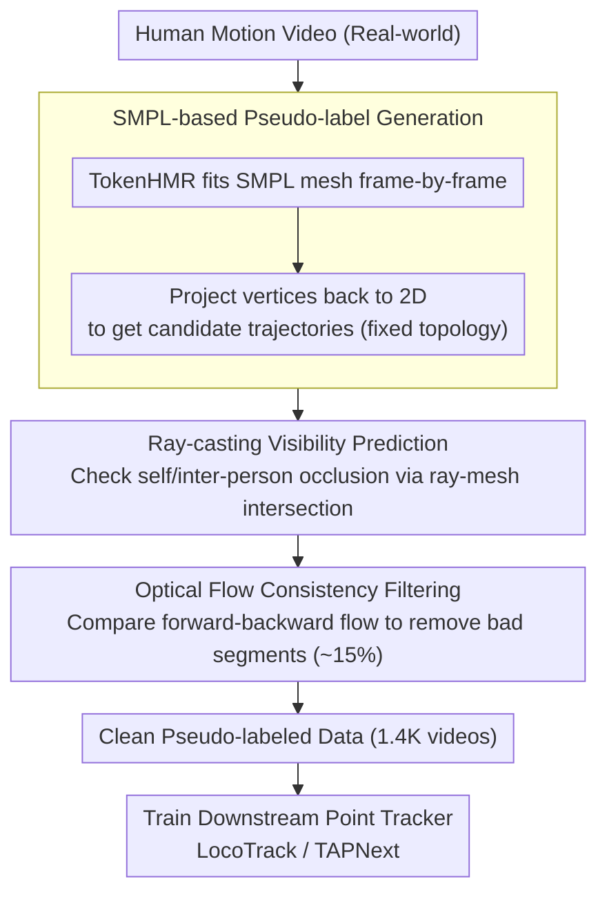

# AnthroTAP: Learning Point Tracking with Real-World Motion

**Conference**: CVPR 2026  
**arXiv**: [2507.06233](https://arxiv.org/abs/2507.06233)  
**Code**: [Project Page](https://cvlab-kaist.github.io/AnthroTAP/)  
**Area**: 3D Vision / Point Tracking  
**Keywords**: Point Tracking, Human Motion, Pseudo-labeling, SMPL, Optical Flow Consistency

## TL;DR
AnthroTAP proposes an automated pipeline to generate large-scale pseudo-labeled point tracking data from real-world human motion videos via SMPL fitting and optical flow filtering. Using only 1.4K videos and 4 GPUs for one day of training, it achieves SOTA performance on the TAP-Vid benchmark, surpassing BootsTAPIR which utilizes 15M videos.

## Background & Motivation
**Background**: Tracking any point (TAP) is a fundamental computer vision task, widely applied in robotics, 3D reconstruction, and video editing.

**Limitations of Prior Work**:
   - Large-scale training data relies almost entirely on synthesis (e.g., Kubric), but synthetic data fails to capture the complex visual features of the real world.
   - Manual labeling of point trajectories is extremely time-consuming and labor-intensive, making it impossible to scale.
   - Self-training methods (BootsTAPIR, CoTracker3) require massive video datasets (15M+) and large-scale computation (256 GPUs), while suffering from confirmation bias.

**Key Challenge**: Real-world data is crucial for generalization, but the cost of obtaining labels is prohibitively high. How can high-quality real-world point tracking training data be obtained efficiently?

**Key Insight**: Human motion naturally involves complex phenomena such as non-rigid deformation, articulated movement, and frequent occlusions, and the SMPL model can automatically establish point correspondences.

**Core Idea**: Utilizing the SMPL human model to automatically generate pseudo-labeled trajectories from real videos + optical flow consistency filtering = high-quality, low-cost real-world training data.

## Method

### Overall Architecture
AnthroTAP aims to address the issue that real-world point tracking data is expensive and difficult to label, while synthetic data (like Kubric) lacks realistic textures and motions. The core idea is to outsource the "labeling" task to an existing human model—since each vertex of the SMPL mesh corresponds to a fixed anatomical position, reconstructing the person in the video naturally yields a set of aligned, temporally consistent pseudo-labels for vertex trajectories without manual intervention.

The entire pipeline is a fully automated data factory: a human motion video is first fed into an HMR model (TokenHMR) to fit SMPL meshes frame-by-frame; mesh vertices are projected back to 2D to obtain a batch of candidate trajectories; ray casting is then used to determine whether each point is occluded by itself or others in each frame to provide visibility labels; finally, optical flow consistency is used to filter out trajectory segments distorted by fitting errors or scene occlusions. The remaining clean pseudo-label data is used to train any downstream point tracking model.

### Key Designs

**1. SMPL-based Pseudo-label Generation: Human Mesh as the Annotator**

Manual labeling cannot scale, and synthetic data is unrealistic. This step aims to obtain aligned trajectories from real videos at zero cost. For each person detected in each frame, a pre-trained TokenHMR fits an SMPL mesh to obtain $N_v$ 3D vertices, which are projected onto the image plane $\mathbf{x}_{p,t,j} = \Pi(\mathbf{v}_{p,t,j})$ as the 2D positions. Crucially, the SMPL vertex topology is fixed—the $j$-th vertex corresponds to the same anatomical position (e.g., a specific point on the left shoulder) in every frame, so cross-frame correspondence is established naturally without additional matching. Human motion is chosen because SMPL compresses complex non-rigid movements into low-dimensional pose and shape parameters, allowing HMR to maintain stable reconstruction even under motion blur or extreme joint twisting.

**2. Ray-casting Visibility Prediction: Geometry-based Occlusion Reasoning**

2D positions alone are insufficient; a point tracking model must know if a point is visible in a given frame. AnthroTAP casts a ray from the camera center toward the target vertex $\mathbf{v}_{p,t,j}$ and uses the Möller–Trumbore algorithm to detect if it intersects any triangular face of the human mesh. If blocked, it is set to $v_{p,t,j} = 0$. Since the reconstruction provides a full 3D geometry mesh, this ray-triangle intersection logic accurately handles self-occlusion (e.g., a hand blocking the torso) and inter-person occlusion. Its limitation is that it only considers intersections with the human mesh, meaning occlusions caused by non-human objects like furniture remain undetected—a gap addressed by the next step.

**3. Optical Flow Consistency Filtering: Using Real Image Motion to Verify SMPL**

SMPL only models humans, not the scene. When a person walks behind a table, SMPL might still "hallucinate" their position, creating a trajectory that appears normal but is incorrect. Fitting errors also produce outliers. Since optical flow does not rely on human priors and reflects the actual displacement occurring in the image, it acts as a validator. First, forward-backward optical flow is calculated between adjacent frames for consistency checking to identify reliable flow regions. Then, the frame-by-frame displacement predicted by SMPL is compared with the optical flow displacement. Frames where displacement diverges beyond a threshold are marked as unreliable. Finally, trajectories with a high ratio of bad frames are discarded; otherwise, only the inconsistent segments are clipped, preserving the reliable portions. Approximately 15% of trajectories are filtered out, resulting in significantly cleaner supervision.

### Loss & Training
- No new loss functions are introduced; standard training objectives of downstream models (LocoTrack / TAPNext) are used.
- Data Scale: Pseudo-labels generated from only 1,400 videos (compared to 15M videos used by BootsTAPIR).
- Training Cost: 4 GPUs for 1 day.

## Key Experimental Results

### Main Results (TAP-Vid Benchmark, 256×256 Resolution)

| Method | Training Data | DAVIS First AJ | DAVIS Strided AJ | Kinetics First AJ | Description |
|------|---------|---------------|-----------------|-------------------|------|
| LocoTrack | Kubric | 63.0 | 67.8 | 52.9 | Synthetic baseline |
| BootsTAPIR | Kubric+15M | 61.4 | 66.2 | **54.6** | 15M video self-training |
| **Anthro-LocoTrack** | Kubric+1.4K | **64.8** | **69.0** | 53.9 | Only 1.4K real videos |
| TAPNext | Kubric | 62.4 | 65.4 | - | Baseline |
| BootsTAPNext | Kubric+15M | 65.2 | 68.9 | - | Self-training |
| **Anthro-TAPNext** | Kubric+1.4K | **66.1** | **71.4** | - | Outperforms with 10000× less data |

### Ablation Study

| Configuration | DAVIS AJ | Description |
|------|---------|------|
| Kubric only | 63.0 | Synthetic baseline |
| + SMPL Trajectories (No filtering) | 63.5 | Limited gain due to noise |
| + Ray-casting Visibility | 64.1 | Importance of visibility labels |
| + Optical Flow Filtering | **64.8** | Optimized full pipeline |

### Key Findings
- Human motion pseudo-labels from only 1.4K videos outperform self-training methods using 15M videos.
- achieved SOTA performance even on general (non-human) object tracking benchmarks (DAVIS, Kinetics containing animals, vehicles, etc.).
- Optical flow filtering is critical: removing ~15% of trajectories significantly improves quality.
- The complexity metrics of human motion (trajectory complexity and diversity) are far higher than driving data like DriveTrack.

## Highlights & Insights
- **Thought-Provoking Core Finding**: The structured complexity of human motion provides the best training signal for general point tracking.
- Extremely high data efficiency: Outperforms CoTracker3 with 11× fewer videos and BootsTAPIR with 10000× fewer frames.
- Simple yet effective pipeline: Combines off-the-shelf components (HMR + Optical Flow).
- The dataset is non-proprietary and can be publicly contributed to the community.

## Limitations & Future Work
- Only utilizes human motion, potentially missing other valuable motion types (e.g., animals, fluids).
- SMPL does not model hand and face details, losing fine-grained trajectories in those areas.
- The robustness of HMR models in crowded scenes and extreme occlusions is still limited.

## Related Work & Insights
- Complementary to DriveTrack (driving scene pseudo-labels): Driving motion is simple (mostly rigid), while human motion is complex.
- Extensible approach: Any object with a parametric model (e.g., animals using SMAL) can generate pseudo-labels.

## Rating
- Novelty: ⭐⭐⭐⭐⭐ Using human motion as a signal for general point tracking is an elegant insight.
- Experimental Thoroughness: ⭐⭐⭐⭐⭐ Multiple benchmarks × multiple trackers × rich ablations × comparisons with several SOTA.
- Writing Quality: ⭐⭐⭐⭐⭐ Clear motivation and logically sound pipeline design.
- Value: ⭐⭐⭐⭐⭐ Efficient, reproducible, and likely to have a long-term impact.

<!-- RELATED:START -->

## Related Papers

- [\[CVPR 2026\] Learning a Particle Dynamics Model with Real-world Videos](learning_a_particle_dynamics_model_with_real-world_videos.md)
- [\[CVPR 2026\] Learning 3D Shape Fidelity Metric from Real-world Distortions](learning_3d_shape_fidelity_metric_from_real-world_distortions.md)
- [\[CVPR 2026\] OLATverse: A Large-scale Real-world Object Dataset with Precise Lighting Control](olatverse_a_large-scale_real-world_object_dataset_with_precise_lighting_control.md)
- [\[CVPR 2026\] KV-Tracker: Real-Time Pose Tracking with Transformers](kv-tracker_real-time_pose_tracking_with_transformers.md)
- [\[CVPR 2026\] Deformation-based In-Context Learning for Point Cloud Understanding](deformation-based_in-context_learning_for_point_cloud_understanding.md)

<!-- RELATED:END -->
