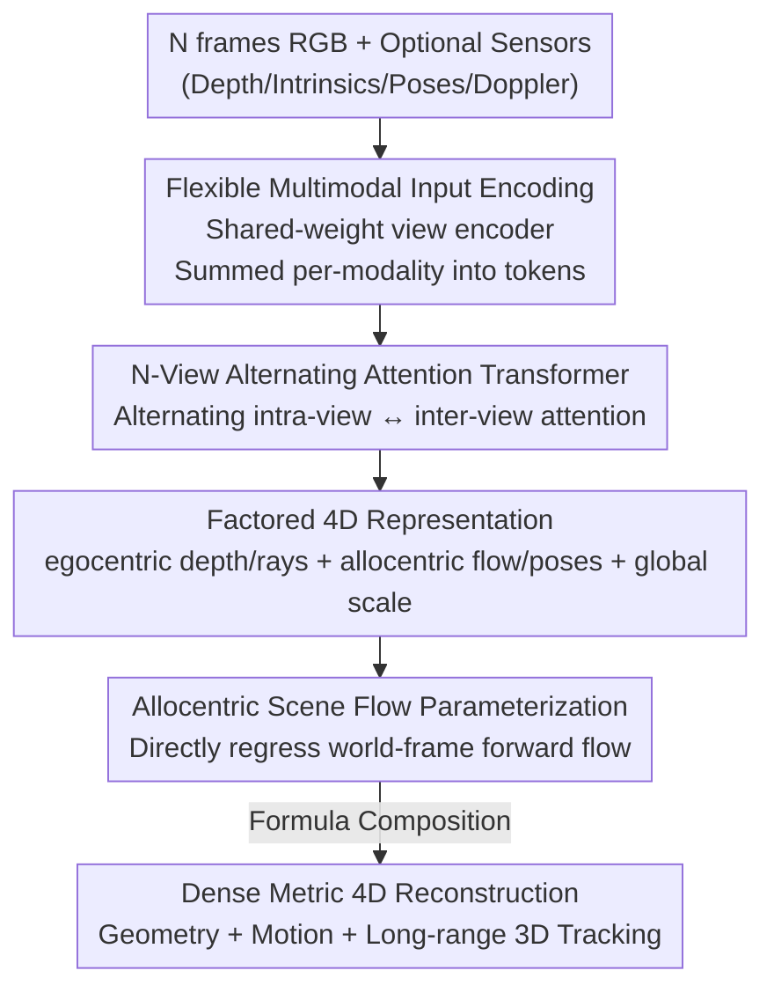

# Any4D: Unified Feed-Forward Metric 4D Reconstruction

**Conference**: CVPR 2026  
**Paper**: [CVF Open Access](https://openaccess.thecvf.com/content/CVPR2026/html/Karhade_Any4D_Unified_Feed-Forward_Metric_4D_Reconstruction_CVPR_2026_paper.html)  
**Code**: https://any-4d.github.io （项目页，开源承诺中）  
**Area**: 3D Vision / 4D Reconstruction  
**Keywords**: 4D reconstruction, scene flow, feed-forward Transformer, multimodal, metric scale

## TL;DR
Any4D directly regresses dense, metric-scale geometry and motion (depth, camera poses, and 3D scene flow) in a **single feed-forward pass** using a multi-view Transformer. By employing a factored representation of "egocentric/allocentric factorization + global scale factor," it enables training on mixed datasets with incomplete annotations. It can also optionally incorporate extra sensors like RGB-D, IMU, and radar Doppler, running 15× faster with 2–3× lower errors compared to previous state-of-the-art methods.

## Background & Motivation
**Background**: Reconstructing the "4D world" (3D + time) from sensory observations is a long-standing goal in computer vision, serving downstream tasks such as dynamic video generation, video understanding, and robot MPC control. Existing methods generally follow two paradigms: first, methods like MegaSaM that rely on **scene-by-scene iterative optimization**, which yield good quality but are too slow for real-time applications; second, **feed-forward** methods like MonST3R/St4RTrack, which either only handle 2-frame dense scene flow or output sparse 3D point trajectories, and often require post-processing optimization to establish explicit correspondence.

**Limitations of Prior Work**: The authors decompose the problem into three specific desiderata. First, **efficiency**: iterative optimization as post-processing is too slow. Second, **multimodality**: many robotic platforms possess depth, IMU, and radar alongside cameras, yet the vast majority of prior work cannot utilize these extra sensors. Third, **metric scale**: existing 4D methods can only output results in a normalized coordinate system (up-to-scale), whereas physical agents live in the real metric world.

**Key Challenge**: 4D reconstruction itself is severely under-constrained, coupled with a **lack of large-scale 4D datasets**—reliable dense scene flow annotations almost exclusively come from simulation, and real high-quality 4D scenes only number in the thousands. Consequently, prior research was forced to decompose "dynamic attribute prediction" into multiple decoupled sub-tasks (3D tracking, video-consistent depth, scene flow, camera pose in dynamic scenes) and tackle them separately, leading to fragmented datasets and benchmarks without a unified definition of 4D. However, these sub-tasks observe the **same underlying 4D world**.

**Goal / Key Insight**: To build a unified system that works reliably on in-the-wild videos while simultaneously satisfying the three desiderata: efficiency, multimodality, and metric scale. The key observation is that instead of predicting everything separately, it is better to design a **factored 4D representation** that decouples "which quantities are scale-invariant, which are in the local camera frame, and which are in the global world frame."

**Core Idea**: Utilize an $N$-view Transformer in a single feed-forward pass to output a factored representation of "global metric scale + local egocentric factors (depth, ray direction/intrinsics) + global allocentric factors (scene flow, camera poses)". This representation allows learning from mixed datasets with incomplete annotations (e.g., geometry-only or motion-without-scale) and enables plug-and-play performance improvements when extra sensors are available.

## Method

### Overall Architecture
Any4D is formulated as a function $(\tilde{s}, \{\tilde{R}_i, \tilde{D}_i, \tilde{T}_i, \tilde{F}_i\}_{i=1}^N) = \mathrm{Any4D}(I, O)$: the inputs are $N$ RGB images $I$ and optional multimodal sensor observations $O$ (depth, intrinsics, external poses, IMU, Doppler velocity), and the outputs are a set of **factored predictions**—the global metric scale factor $\tilde{s}$, the local-camera-frame ray directions $\tilde{R}_i$ and scale-normalized depths $\tilde{D}_i$ for each view (egocentric), as well as the camera poses $\tilde{T}_i=[p_i,q_i]$ globally unified in the world frame and the scale-normalized forward scene flow $\tilde{F}_i$ from the first frame to each frame (allocentric).

Once these factors are obtained, the metric-scale geometry (pointmap) and motion can be directly **composed**:

$$\tilde{G}_i = \tilde{s}\cdot\tilde{T}_i\cdot\tilde{R}_i\cdot\tilde{D}_i,\qquad \tilde{M}_i = \tilde{s}\cdot\tilde{F}_i,\qquad \tilde{G}'_i = \tilde{G}_i + \tilde{M}_i$$

Namely, the ray direction is first multiplied by depth to obtain the local point cloud, transformed to the world frame using the camera pose, and finally multiplied by the global scale to recover the metric geometry $\tilde{G}_i$. The scene flow $\tilde{F}_i$ multiplied by the scale yields the metric motion $\tilde{M}_i$, which resolves to the motion-adjusted geometry $\tilde{G}'_i$ when added, naturally supporting long-range dense 3D tracking.

Architecturally, it consists of three stages: modality-specific input encoders → cross-view alternating-attention Transformer backbone → dedicated output decoding heads for each factor.

### Key Designs

**1. Factored 4D Representation: Decoupling "Scale and Coordinate Frames" to Leverage Incomplete Annotation Data**

This is the core innovation. Directly regressing the "moved 3D points" end-to-end couples everything together, forcing training data to have geometry, motion, and metric scale annotations simultaneously, which is practically non-existent. Any4D decomposes a 4D scene into three orthogonal factor categories: **egocentric** (local camera-frame ray directions $\tilde{R}_i$ and scale-normalized depths $\tilde{D}_i$, corresponding to intrinsics and geometry), **allocentric** (global world-frame forward scene flow $\tilde{F}_i$ and camera poses $\tilde{T}_i$, corresponding to motion and poses), and a **global metric scale** $\tilde{s}$. In this way, geometry and motion are supervised in the scale-normalized space independently, and are finally composed back via $\tilde{G}_i=\tilde{s}\cdot\tilde{T}_i\cdot\tilde{R}_i\cdot\tilde{D}_i$ to recover the metric scale results. The benefit is the ability to pool mixed datasets with incomplete annotations during training: it can utilize 3D reconstruction datasets that are **metric-scale but lack motion annotations** (e.g., BlendedMVS, ScanNet++, MegaDepth), as well as simulation datasets that have **motion but lack metric scale** (e.g., PointOdyssey, Kubric, VKITTI2), with each supervising only the factors it can. Isolating the metric scale into an independent token/factor resolves the limitation of existing methods that only output up-to-scale results.

**2. Flexible Multimodal Input Encoding: Shared-Weight View Encoder + Probabilistic Conditioning for "Plug-and-Play Sensor Benefits"**

Robotic platforms often carry depth, IMU poses, or radar Doppler, but previous methods only take images. Any4D assigns an encoder to each modality, maps them to a shared $\mathbb{R}^{1024\times H/14\times W/14}$ feature space, and **sums them per-modality** into a per-view embedding. RGB images use DINOv2 ViT-Large to extract final patch features; depth, Doppler, and intrinsics (encoded as rays) use shallow CNNs; camera rotation and translation use 4-layer MLPs; and a learnable metric-scale token is appended. The challenge is ensuring the model remains robust to any arbitrary subset of input combinations. During training, **random conditional dropout** is applied: 70% of the iterations contain multimodal inputs, where each modality (depth, rays, poses, Doppler) is independently dropped out with a 0.5 probability. This forces the network to learn the flexible capability of "working without any missing modalities and leveraging whichever are present." Experiments (Tab. 4) show that adding geometry boosts the APD on LSFOdyssey from 71.5 to 80.8, and adding Doppler further improves scene flow, achieving the best performance with all modalities.

**3. N-View Alternating Attention Transformer + Single Feed-Forward Pass: Replacing Iterative Optimization and Pairwise Computations with One-Pass Inference**

This addresses the efficiency requirement. The backbone is a cross-$N$-view **alternating-attention** Transformer (inherited from VGGT designs) with 12 blocks, 12 attention heads per block + MLP, a latent dimension of 768, and an MLP ratio of 4 (close to ViT-Base). It uses Flash Attention for speed-ups and omits 2D RoPE. Alternating attention allows information to flow both intra-view and inter-view, thus **outputting the geometry and motion of all N frames simultaneously in a single feed-forward pass**, rather than predicting independently per frame and establishing correspondence afterwards (like MonST3R) or relying on costly iterative optimizations (like SpatialTrackerV2). At the output end, four lightweight heads handle different tasks: the Geometry DPT head predicts ray directions, depth, and confidence; the Motion DPT head predicts allocentric scene flow; the Pose decoder (average-pooled CNN) outputs translation and quaternions; and the Metric Scale decoder (an MLP) outputs the log-scale, which is then exponentiated. This design yields a direct 15× speed advantage (0.50s for 50 frames on H100 vs. 11.56s for SpatialTrackerV2).

**4. Allocentric Scene Flow as Motion Parameterization: Selecting the "Right Target" to Eliminate Noise Even in Static Regions**

Motion can be parameterized in four ways: directly predicting allocentric scene flow, predicting egocentric flow and mapping it via geometry, predicting the moved 3D points (like St4RTrack), or back-projecting 2D optical flow. The authors systematically compared these and found that **directly regressing allocentric scene flow is optimal**, delivering superior scene flow metrics and even more precise "moved dynamic points" than directly predicting the points themselves (Tab. 5). The insight is quite profound: most of the real-world scene is static, meaning the supervision target for allocentric flow is **almost everywhere 0** (i.e., very sparse and easy to learn). In contrast, "moved 3D points" or "egocentric flow" yield non-zero values even for static points when the camera moves, which introduces noise and causes artifacts on object boundaries and backgrounds. To tackle the issue where scene flow is dominated by static points, the training phase utilizes ground truth to compute a dynamic/static mask $M$ to **up-weight the scene flow loss in dynamic regions by 10×**, preventing the model from lazily learning only the background.

### Loss & Training
The training data is a mixture of geometry-only and dynamic datasets (synthetic + real, with varying annotation sparsity). Weights are initialized with MapAnything, and each batch samples at most 4 views, trained for 100 epochs on a single H100 node. Losses are combined based on the availability of annotation types: scale-invariant quantities (ray directions $L_{rays}$, quaternions $L_{rotation}$) use simple regression losses; scale-dependent quantities (translation, depth, scene flow, pointmap) first compute the scale $z$ from valid ground-truth points and the predicted scale $\tilde z$ to perform **scale-invariant supervision**, using $f_{\log}(x)=\frac{x}{\|x\|}\log(1+\|x\|)$ to transform to log-space for enhanced numerical stability; the scene flow loss is up-weighted by 10× on dynamic regions as mentioned; the metric scale $\tilde{s}$ is supervised in log-space with a stop-gradient applied to prevent scale supervision from corrupting other components. The total loss is $L = L_{trans}+L_{rot}+L_{rays}+L_{depth}+L_{pm}+L_{sf}+L_{mask}$.

## Key Experimental Results

### Main Results
Sparse 3D point tracking (allocentric benchmark adapted from TAPVID-3D, ~170 sequences / 4 datasets / up to 64 frames). Reported metrics are dynamic point EPE↓, APD↑, and scene flow inlier ratio τ↑; runtime is measured on an H100 with 50 input frames:

| Dataset / Metric | Any4D | Runner-up Baseline | Description |
|--------|------|----------|------|
| DriveTrack EPE↓ | **3.89** | 5.45 (SpatialTrackerV2) | Lower endpoint error for dynamic points |
| DriveTrack APD↑ | **7.81** | 4.80 (VGGT+CoTracker3) | |
| Dynamic Replica Scene Flow τ↑ | **86.99** | 83.66 (SpatialTrackerV2) | |
| LSFOdyssey APD↑ | **71.70** | 68.37 (SpatialTrackerV2) | |
| Runtime (s)↓ | **0.50** | 11.56 (SpatialTrackerV2) | **~15× faster** |

Dense scene flow (Kubric-4D static/dynamic camera + VKITTI-2, both are held-out to prevent leakage): Any4D's average APD is 2–3× higher than baselines, with even larger margins in scene flow metrics. For instance, scene flow τ on Kubric-4D static camera reaches 87.51 (compared to only 20.51 for St4RTrack), and VKITTI-2 scene flow τ reaches 93.08. On video depth (Tab. 3), Any4D achieves SOTA among single feed-forward methods and is competitive with iterative optimization/dedicated depth estimation methods.

### Ablation Study

| Configuration | Key Metrics (Kubric Static / LSFOdyssey) | Description |
|------|---------|------|
| Image Only | APD 21.33 / 71.47 | baseline input |
| Image + Geometry | APD 80.18 / 80.80 | adding depth/intrinsics/pose substantially boosts 3D points |
| Image + Doppler | APD 21.70 / 71.26 | mainly improves scene flow τ |
| Image + Geometry + Doppler | **APD 81.72 / 81.10** | best overall performance with all modalities |

Motion representation comparison (Tab. 5, Kubric static camera scene flow τ↑):

| Representation | Scene Flow τ↑ | Description |
|------|---------|------|
| Back-projected 2D optical flow | 75.69 | mediocre |
| Moved 3D points (St4RTrack) | 21.84 | high noise in static points, worst |
| Egocentric scene flow | 85.37 | runner-up |
| **Allocentric scene flow** | **87.51** | static targets are 0 everywhere, optimal |

### Key Findings
- **Geometry inputs contribute the most**: Simply adding geometry boosts 3D point APD from ~21 to ~80, because metric depth and poses directly resolve monocular scale ambiguity; Doppler mainly compensates for the direction of scene flow.
- **"Sparsity dividend" of allocentric flow**: Because the target is 0 in static regions, it actually makes the prediction of dynamic points more accurate than the "moved 3D points" parameterization—a counter-intuitive yet reasonable finding.
- **Speed moat**: The single N-view feed-forward pass makes it an order of magnitude faster than iterative/pairwise methods under 50 frames of input, and it inherently supports dense per-pixel tracking rather than sparse points (SpatialTrackerV2 can query at most 2500 points on H100 80GB).

## Highlights & Insights
- **Factored representation as a "data throttle/regulator"**: Decomposing 4D into orthogonally supervisable factors relaxes the hard constraint of "must having perfect 4D annotations" into "supervising whichever factors are available." This is the fundamental reason it scales up in the data-scarce 4D domain, and this mindset is transferable to any multi-task regression with expensive annotations.
- **"What to predict" is more important than "how to predict"**: With the exact same network and training scheme, merely changing the motion parameterization (allocentric flow vs. moved points) increases the scene flow τ from 21 to 87. Choosing a sparse structure for supervision targets directly filters out massive amounts of noise.
- **Plug-and-play multimodality via random conditional dropout**: Dropping each modality independently with a 0.5 probability during training cheaply guarantees robustness to "any arbitrary subset of inputs," making it highly suitable for robotic scenarios with varying sensor configurations.

## Limitations & Future Work
- **Reference frame dependency**: Scene flow is consistently computed from the reference frame (first frame) to subsequent frames, requiring the target objects to appear at the very beginning of the video; the authors suggest using permutation-invariant training (e.g., [83]) to mitigate this.
- **Idealized sensor assumption**: Training utilizes perfectly simulated multimodal inputs and does not model real-world sensor noise, which might degrade performance during real-world deployment.
- **Data-bound generalization**: Performance in highly dynamic scenes, wide-baseline, or low-frame-rate videos is still limited by the scale and diversity of the training set; richer 3D dynamic datasets are expected to bridge this gap.

## Related Work & Insights
- **vs St4RTrack**: Both do dense feed-forward 4D, but St4RTrack directly predicts "moved 3D points," leading to severe scene flow noise on object boundaries and backgrounds, and failing to cleanly extract binary motion masks. Any4D uses allocentric flow parameterization, which is dense and more accurate.
- **vs SpatialTrackerV2**: The latter offers reliable motion but is **sparse** (at most 2500 points on H100 80GB) and slow (11.56s). Any4D is natively dense, per-pixel, and ~15× faster in a single feed-forward pass.
- **vs hybrid solutions like MonST3R / MASt3R + CoTracker3**: These rely on "reconstruction model + external 2D/3D tracker" stitching and require post-processing optimization to establish correspondence. Any4D outputs geometry and motion end-to-end simultaneously, removing the correspondence step.
- **vs MapAnything**: It borrows its multi-view encoder design and initializes with its weights, but MapAnything only handles static geometry with pure image inputs. Any4D extends this to dynamic motion + multimodality + metric scale.

## Rating
- Novelty: ⭐⭐⭐⭐⭐ The combination of factored 4D representation, allocentric flow parameterization, and multimodal feed-forward is a solid step forward in unifying 4D reconstruction.
- Experimental Thoroughness: ⭐⭐⭐⭐⭐ Covers three types of tasks (3D tracking, dense scene flow, video depth) across multiple datasets, with comprehensive ablations on both modalities and representations.
- Writing Quality: ⭐⭐⭐⭐ Formulation and loss derivations are clear; the three main desiderata (efficiency, multimodality, and scale) are consistently addressed throughout.
- Value: ⭐⭐⭐⭐⭐ An order-of-magnitude faster speed, metric scale capability, and multimodality make this a highly viable foundation 4D model for robotics, AR/VR, and generative AI.

<!-- RELATED:START -->

## Related Papers

- [\[CVPR 2026\] AMB3R: Accurate Feed-forward Metric-scale 3D Reconstruction with Backend](amb3r_accurate_feed-forward_metric-scale_3d_reconstruction_with_backend.md)
- [\[CVPR 2026\] MoRe: Motion-aware Feed-forward 4D Reconstruction Transformer](more_motion-aware_feed-forward_4d_reconstruction_transformer.md)
- [\[CVPR 2026\] Feed-Forward One-Shot Animatable Textured Mesh Avatar Reconstruction](feed-forward_one-shot_animatable_textured_mesh_avatar_reconstruction.md)
- [\[CVPR 2026\] AREA3D: Active Reconstruction Agent with Unified Feed-Forward 3D Perception and Vision-Language Guidance](area3d_active_reconstruction_agent_with_unified_feed-forward_3d_perception_and_v.md)
- [\[CVPR 2026\] MotionCrafter: Dense Geometry and Motion Reconstruction with a 4D VAE](motioncrafter_dense_geometry_and_motion_reconstruction_with_a_4d_vae.md)

<!-- RELATED:END -->
