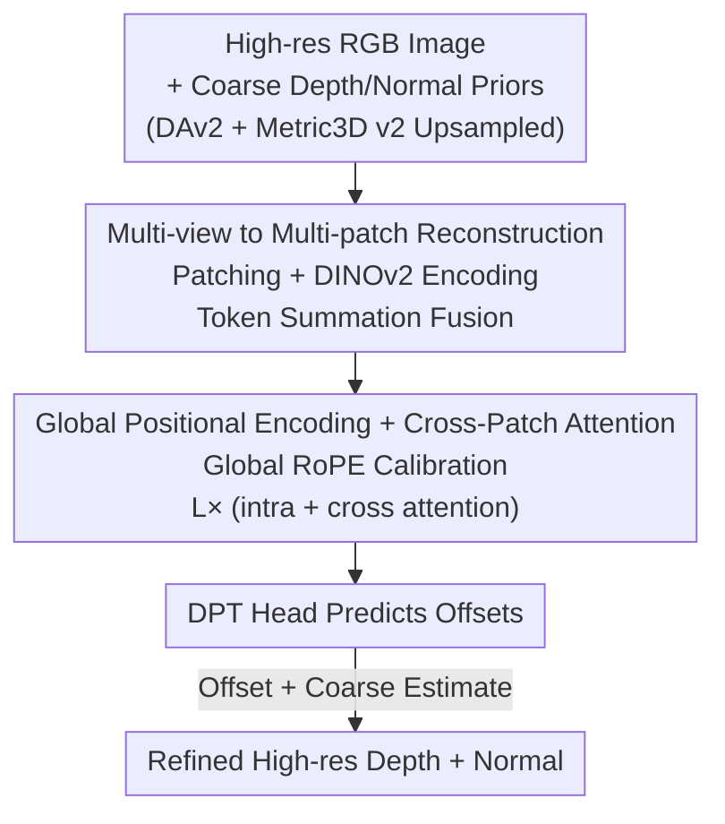

# Any Resolution Any Geometry: From Multi-View To Multi-Patch

**Conference**: CVPR 2026  
**Paper**: [CVF Open Access](https://openaccess.thecvf.com/content/CVPR2026/html/Cui_Any_Resolution_Any_Geometry_From_Multi_View_To_Multi_Patch_CVPR_2026_paper.html)  
**Code**: https://dreamaker-mrc.github.io/Any-Resolution-Any-Geometry (Project Page)  
**Area**: 3D Vision  
**Keywords**: High-resolution depth estimation, surface normals, multi-patch Transformer, cross-patch attention, VGGT

## TL;DR
A single ultra-high-definition image is decomposed into patches and treated as "virtual multi-views" within a VGGT-style framework for joint processing. Combined with cross-patch attention for global consistency reasoning, the model outputs sharp and globally coherent high-resolution depth maps and surface normals in a single forward pass, reducing AbsRel on UnrealStereo4K from 0.0582 to 0.0291.

## Background & Motivation
**Background**: High-resolution depth/normal estimation is essential for 3D reconstruction and scene understanding. However, mainstream joint depth-normal models (GeoWizard, Metric3D v2) are constrained by GPU memory and computation, often limited to low input resolutions, which blurs details when processing 4K/8K images.

**Limitations of Prior Work**: To handle high resolutions, the community has turned to patch-based refinement (PatchFusion, PatchRefiner, PRO), which predicts patches independently and stitches them. This approach suffers from two issues: ① Methods like PatchRefiner refine blocks in **isolation**, lacking information exchange between adjacent patches, leading to depth jumps and blocking artifacts at seams; ② These pipelines are primarily designed for **depth only**, making it difficult to extend to joint depth-normal estimation while ensuring geometric consistency at scale.

**Key Challenge**: High-resolution geometric prediction must satisfy two conflicting goals—preserving **local details** like object boundaries (requiring a small receptive field) while maintaining **global consistency** for the entire depth/normal field (requiring a large receptive field). Patching solves details and memory but sacrifices the global view; avoiding patching preserves the global view but fails at high resolutions.

**Key Insight**: The authors observe that multi-view Transformers (DUSt3R, VGGT) have demonstrated that "processing multiple views in a unified backbone using attention for global information propagation" effectively scales geometric prediction. This leads to the question: can **patches from a single high-res image be treated as "virtual multi-views"**? The relationships between patches correspond precisely to those between multiple views.

**Core Idea**: Transfer the "multi-view" paradigm to a "multi-patch" framework. Patches of a high-res image are processed jointly in a shared backbone, replacing inter-view attention with cross-patch attention to preserve local details while enforcing global consistency via global token communication. This results in the Ultra Resolution Geometry Transformer (URGT).

## Method

### Overall Architecture
URGT acts as a **geometry refiner**: given a high-resolution RGB image $I \in \mathbb{R}^{3 \times H \times W}$, it first obtains low-resolution coarse estimates using off-the-shelf models (Depth-Anything v2 for $D^{coarse}$, Metric3D v2 for $n^{coarse}$), aligned via bilinear upsampling. The image and coarse estimates are then patched and fed into a unified Transformer that outputs **offsets relative to the coarse estimates**, which are added back to obtain refined high-resolution depth and normals. The key is enabling the model to reason within patches (**local details**) and across patches (**global consistency**) in a single forward pass.

Specifically, the $k$-th RGB patch $J_k$ and its aligned coarse depth/normal crops are encoded by DINOv2 into visual, depth, and normal tokens. These are **element-wise summed** to fuse into a geometry-aware representation $t^{joint}_k = t_{J_k} + t_{D^{coarse}_k} + t_{n^{coarse}_k}$. The fused tokens of all patches form a unified sequence passing through $L$ blocks of alternating "intra-patch attention + cross-patch attention." Finally, a lightweight DPT-style head predicts the depth offset $\Delta^{Depth}_k$ and normal offset $\Delta^{Normal}_k$, yields $D^{refined}_k = D^{coarse}_k + \Delta^{Depth}_k$ and $n^{refined}_k = n^{coarse}_k + \Delta^{Normal}_k$.

### Key Designs

**1. Multi-view to Multi-patch: Treating Patches as Virtual Views for Joint Processing**

This directly addresses the loss of global context in patch-based methods. The authors reuse the unified Transformer architecture from VGGT designed for multi-views but redefine its semantics to "multi-patch." Each patch is no longer processed in isolation but is treated as a view within the **same sequence and backbone**. Every patch carries its aligned coarse geometric priors, making the tokens "geometry-aware" from the start. This allows the model to **learn residual offsets** rather than absolute values, simplifying the task, while cross-patch attention naturally provides a global communication mechanism.

**2. Global Positional Encoding + Cross-patch Attention: Enforcing Global Consistency while Preserving Details**

In standard patching, local coordinates start from (0,0) for each patch, making tokens at the same physical location indistinguishable across patches. The authors assign a global origin $(x_k, y_k)$ for each patch $J_k$, mapping local coordinates $p_i=(u_i,v_i)$ to global coordinates $p^g_i = (u_i + x_k, v_i + y_k)$, which are then used for RoPE encoding. 

Two types of attention are alternated: **intra-patch attention** performs self-attention within a patch ($\text{softmax}(\tilde Q_c \tilde K_c^\top/\sqrt{d})\tilde V_c$) to refine local details; **cross-patch attention** operates on the entire sequence ($\text{softmax}(\tilde Q \tilde K^\top/\sqrt{d})\tilde V$), allowing every token to attend to all others across the image. Removing cross-patch attention causes AbsRel to degrade from 0.0500 to 0.0678, while replacing global RoPE with local RoPE results in a consistency error (CE) spike from 0.0635 to 0.2830.

**3. GridMix Sampling: Probabilistic Multi-scale Patching as Data Augmentation**

To overcome the scarcity of high-resolution training data and improve generalization, GridMix is used. While the patch dimensions are fixed at $\frac{H}{4}\times\frac{W}{4}$, each iteration randomly selects one of four configurations based on a probability distribution: $M=1$ (single random patch), $M\in\{2,3\}$ (random $M\times M$ grid), and $M=4$ (fixed $4\times4$ grid covering the image). This forces the model to adapt to various granularities. Ablations show $(p_1,p_2,p_3,p_4)=(0.1,0.2,0.3,0.4)$ is optimal.

**4. Geometric Consistency Supervision: Binding Depth and Normals to the Same Geometry**

To prevent conflicts between predicted depth and normals, the authors derive a pseudo-normal field $n^{pseudo}$ from the GT depth $D^{gt}$ via local least squares. The depth loss $L_{depth}$ constrains numerical accuracy (MSE) and boundary sharpness (gradient), while the normal loss $L_{normal}$ constrains orientation (angular loss) and alignment. Since $n^{pseudo}$ is derived from $D^{gt}$, both heads are bound to the same underlying geometry, leading to self-consistency.

## Key Experimental Results

### Main Results
Joint depth and normal evaluation on UnrealStereo4K (4K images):

| Method | Inference Time↓ | AbsRel↓ | δ1↑ | RMSE↓ | CE↓ |
|------|----------|---------|-----|-------|-----|
| Depth-Anything v2 | – | 0.0812 | 0.924 | 2.86 | – |
| PatchRefiner (p=16) | 1.02s | 0.0633 | 0.950 | 2.28 | 0.0753 |
| PatchRefiner (p=49) | 4.12s | 0.0582 | 0.956 | 2.17 | 0.0715 |
| PRO | 1.88s | 0.0771 | 0.927 | 2.73 | 0.0549 |
| **Ours (Separate)** | 0.94s | 0.0295 | 0.982 | 1.38 | 0.0418 |
| **Ours (Joint)** | 0.97s | **0.0291** | **0.983** | **1.31** | 0.0415 |

Normal estimation (UnrealStereo4K, Angular Error):

| Method | Mean↓ | Median↓ | RMSE↓ | <5°↑ | <11.25°↑ | <30°↑ |
|------|-------|---------|-------|------|----------|-------|
| Metric3D v2 | 23.36 | 33.15 | 13.90 | 11.74 | 44.96 | 79.77 |
| **Ours (Joint)** | **18.51** | **28.83** | **9.60** | **29.37** | **59.43** | **85.06** |

Compared to PatchRefiner, AbsRel drops by over 49% and RMSE by 35%, with a faster inference time of 0.97s.

### Ablation Study

| Configuration | Key Metric | Description |
|------|---------|------|
| GridMix (0.1,0.2,0.3,0.4) | AbsRel 0.0295 / CE 0.0418 | Optimal mixed granularity |
| Pure 1×1 (1,0,0,0) | AbsRel 0.0500 / CE 0.0648 | Good details, poor global context |
| Pure 4×4 (0,0,0,1) | AbsRel 0.0321 / CE 0.0635 | Poor consistency |
| Global RoPE | AbsRel 0.0321 / CE 0.0635 | Core align mechanism |
| Local RoPE | AbsRel 0.0343 / CE **0.2830** | Causes severe cross-patch misalignment |
| w/ Cross-Patch Attn | AbsRel 0.0500 / RMSE 2.01 | Full model |
| w/o Cross-Patch Attn | AbsRel 0.0678 / RMSE 2.51 | Significant seam artifacts |

### Key Findings
- **Cross-patch attention is the bottleneck**: Removing it causes AbsRel and RMSE to degrade significantly, making patch seams visible.
- **Global RoPE is critical for alignment**: Switching to local RoPE causes the consistency error (CE) to surge, proving its role in cross-patch alignment.
- **Mixed sampling is superior**: Probabilistic mixing of different grid sizes outperforms any single fixed slicing method.
- **Joint training is beneficial**: Coupling depth and normals provides mutual refinement.
- **Scalable to 8K**: The framework can process 8K images without retraining, maintaining fine details and global coherence.

## Highlights & Insights
- **Elegant "Patch = Virtual View" paradigm**: Transfers the mature multi-view Transformer architecture to high-res single-image tasks by redefining semantics.
- **Predicting offsets instead of absolute values**: Building on frozen foundation model priors simplifies the task to refinement, leveraging pre-trained generalization.
- **Global RoPE utility**: A simple global coordinate shift enables standard RoPE to achieve cross-patch alignment with zero extra parameters.
- **GridMix as data augmentation**: Treats patching strategy as a stochastic training variable, enhancing robustness to various resolutions and slicing methods.

## Limitations & Future Work
- **Dependency on coarse priors**: URGT is a refiner; if the foundation models (DAv2/Metric3D v2) fail completely in a specific domain, the refinement cannot recover the geometry.
- **Noisy pseudo-normal supervision**: $n^{pseudo}$ is derived from GT depth and may contain noise, limiting the upper bound of normal accuracy.
- **Computational scaling**: Memory usage grows with the number of patches; the full scaling curve for resolutions beyond 8K is not finalized.
- **GridMix hyperparameter sensitivity**: The probabilities $(p_1, p_2, p_3, p_4)$ require manual tuning and lack an adaptive solution.

## Related Work & Insights
- **vs PatchRefiner / PatchFusion**: These methods rely on post-hoc fusion or consistency losses, whereas URGT uses **single-pass** global communication, proving faster and more consistent.
- **vs Metric3D v2 / GeoWizard**: Instead of competing with these foundation models, URGT builds upon them to achieve high-resolution refinement.
- **vs VGGT / DUSt3R**: Proves that set-based geometry reasoning is not limited to physical multi-view scenarios.

## Rating
- Novelty: ⭐⭐⭐⭐
- Experimental Thoroughness: ⭐⭐⭐⭐⭐
- Writing Quality: ⭐⭐⭐⭐
- Value: ⭐⭐⭐⭐

<!-- RELATED:START -->

## Related Papers

- [\[CVPR 2026\] ClipGStream: Clip-Stream Gaussian Splatting for Any Length and Any Motion Multi-View Dynamic Scene Reconstruction](clipgstream_clip-stream_gaussian_splatting_for_any_length_and_any_motion_multi-v.md)
- [\[CVPR 2026\] Block-Sparse Global Attention for Efficient Multi-View Geometry Transformers](block-sparse_global_attention_for_efficient_multi-view_geometry_transformers.md)
- [\[CVPR 2026\] SplatSuRe: Selective Super-Resolution for Multi-view Consistent 3D Gaussian Splatting](splatsure_selective_super-resolution_for_multi-view_consistent_3d_gaussian_splat.md)
- [\[CVPR 2026\] Confidence-Guided Multi-Scale Aggregation for Sparse-View High-Resolution 3D Gaussian Splatting](confidence-guided_multi-scale_aggregation_for_sparse-view_high-resolution_3d_gau.md)
- [\[CVPR 2026\] Multi-view Consistent 3D Gaussian Head Avatars 'without' Multi-view Generation](multi-view_consistent_3d_gaussian_head_avatars_without_multi-view_generation.md)

<!-- RELATED:END -->
