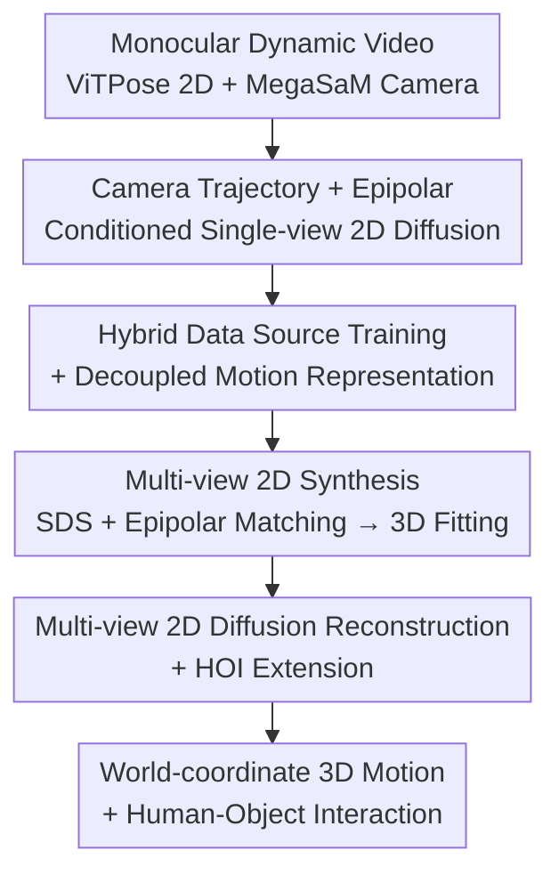

# AnyLift: Scaling Motion Reconstruction from Internet Videos via 2D Diffusion

**Conference**: CVPR 2026  
**arXiv**: [2604.17818](https://arxiv.org/abs/2604.17818)  
**Code**: Project page contains video results (no explicit repo link provided in the paper)  
**Area**: 3D Vision / Human Motion Reconstruction / Diffusion Models  
**Keywords**: Motion Reconstruction, Human-Object Interaction (HOI), 2D Diffusion Prior, Dynamic Camera, Multi-view Synthesis

## TL;DR
AnyLift introduces a two-stage framework—synthesizing multi-view 2D motion data followed by training a camera-conditioned multi-view 2D diffusion model—to lift 2D keypoints from monocular dynamic-camera internet videos into 3D human motion and Human-Object Interaction (HOI) in world coordinates. Without any 3D supervision, it reconstructs rare actions (e.g., gymnastics, martial arts) seldom found in MoCap datasets.

## Background & Motivation

**Background**: Large-scale 3D human motion and HOI data are critical for animation, simulation, and humanoid robot policy learning, but MoCap collection is high-cost and lacks diversity. Estimating 3D motion from monocular video is a more scalable alternative. Current research follows two paths: 3D-supervised methods (e.g., WHAM, GVHMR) trained on MoCap data like AMASS, and weakly-supervised methods (e.g., ElePose, MAS, MVLift) using only in-domain 2D keypoints.

**Limitations of Prior Work**: 3D-supervised methods achieve high precision for in-distribution motions but generalize poorly to intense activities like gymnastics or martial arts, for which 3D data is nearly impossible to collect. Among weakly-supervised methods, MVLift (the most similar to this work) can recover global 3D motion from 2D but **assumes static cameras for both training and inference**. Real internet videos, however, feature dynamic camera work and narrow view coverage. Furthermore, extending this framework to world-coordinate HOI reconstruction in real videos remains an open problem.

**Key Challenge**: Scaling requires massive internet videos, which inherently impose "dynamic cameras + insufficient view coverage." Dynamic cameras contaminate global root translation info with camera motion, while single forward views prevent models from learning cross-view consistency.

**Goal**: (1) Enable training and reconstruction from dynamic camera videos; (2) Learn reliable 2D motion priors even when training view coverage is insufficient; (3) Unify human motion and HOI into a single reconstruction framework.

**Key Insight**: Follow the "learning 2D motion priors for 3D reconstruction" philosophy of MVLift (as it breaks MoCap diversity limits and naturally incorporates HOI) but upgrade the condition from "no camera" to "camera trajectory + epipolar lines," while implementing a hybrid data source strategy to rescue view coverage.

**Core Idea**: Condition a 2D diffusion model on camera trajectories and epipolar lines to learn global 2D translation and cross-view geometric consistency under dynamic cameras. Use a hybrid training approach—combining global 2D from videos with local 2D reprojected from off-the-shelf estimators—to complement view coverage.

## Method

### Overall Architecture
AnyLift takes a single-view 2D keypoint sequence $\mathbf{X}\in\mathbb{R}^{T\times K\times 2}$ extracted from monocular dynamic video (using ViTPose for 2D pose and MegaSaM for camera motion) and outputs 3D human motion $\mathcal{H}$ (SMPL parameters: root translation $\mathbf{r}_t$, global orientation $\bm{\phi}_t$, body pose $\bm{\Theta}_t$) and object motion $\mathcal{O}$ (for HOI) in world coordinates. The pipeline consists of two stages: **Stage 1: Multi-view 2D Data Synthesis**—Since no multi-view supervision exists, a conditional single-view 2D diffusion prior is trained. SDS "imagines" multiple views from the single-view input, which are fitted to 3D and then reprojected into clean multi-view 2D. **Stage 2: Multi-view 2D Diffusion Reconstruction**—A multi-view diffusion model with cross-view attention is trained on the synthesized data. During inference, it directly generates consistent multi-view 2D from a single-view input to recover world-coordinate 3D motion and HOI. Both human and HOI tasks share this structure, differing only in Stage 1 data sources: internet videos for human motion and reprojected 3D HOI MoCap sequences for HOI.

### Key Designs

**1. Camera Trajectory + Epipolar Conditioned Single-view 2D Diffusion: Turning Camera Work into Signal**

MVLift’s diffusion prior assumes a static camera. If the camera moves, 2D root translation becomes entangled with camera motion. AnyLift disentangles this by adding two conditions: **Camera trajectory** $\mathbf{C}=\{\mathbf{C}_t\}_{t=1}^T$ (extrinsics $\mathbf{C}_t\in\mathbb{R}^{4\times 3}$ normalized by the first frame) allows the model to perceive global motion over time. **Epipolar lines** $\bm{l}=(a,b,c)^{\mathrm{T}}$ (satisfying $ax+by+c=0$) are paired with every keypoint per frame, forming a condition matrix $\mathbf{L}_t\in\mathbb{R}^{K\times 3}$ to encode pairwise geometric constraints and encourage cross-view consistency. The DDPM-based model predicts clean samples $\mathbf{X}_0$. The main loss is $L_1$ reconstruction $\mathcal{L}=\mathbb{E}_{\mathbf{X}_0,n}\|\mathbf{X}_0-\mathbf{X}_\theta(\mathbf{X}_n,n,\mathbf{C},\mathbf{L})\|_1$, supplemented by an epipolar matching loss $\mathcal{L}_{\text{line}}=\sum_{t=1}^T\langle\mathbf{L}_t,(\hat{\mathbf{X}}_t,\mathbf{1})\rangle$.

**2. Hybrid Data Source Training + Decoupled Motion Representation: Filling "Narrow Views" with Local Pose Estimators**

Internet videos like gymnastics usually feature a single forward view, leading to insufficient coverage for the prior to learn side/back poses. AnyLift mixes two 2D data streams: (1) global 2D keypoints from real videos; (2) local 2D $\mathbf{X}^{\text{proj}}$ reprojected from 3D reconstructions of off-the-shelf estimators (GVHMR). Since such estimators are only reliable for local pose, the authors use only "root-aligned" local projections. To prevent the model from biasing toward zero-translation patterns, each 2D motion is **decoupled** into root translation $\mathbf{X}^{\text{r}}$ and local pose $\mathbf{X}^{\text{l}}$. Global motion $\mathbf{X}^{\text{g}}$ is reconstructed from these. For reprojected data, the diffusion loss $\mathcal{L}^{\text{proj}}$ uses a binary mask $\mathbf{M}$ to exclude root joints and skips epipolar matching. This leverages multi-view local poses without contaminating the global translation prior.

**3. Multi-view 2D Synthesis: SDS "Imagination" + Epipolar Tightening + 3D Fitting**

Using the Stage 1 prior, single-view sequences are expanded. Score distillation sampling (SDS) optimizes $V-1$ additional 2D keypoint sequences $\{\mathbf{X}_v\}_{v=1}^V$ at uniformly distributed viewpoints. Geometric consistency is enforced via cross-view epipolar matching $\mathcal{L}^{u\to v}_{\text{line}}$ between adjacent views and the input view. These multi-view 2D points are fitted via VPoser/SMPL to produce full-body 3D motion, which is then reprojected to four camera angles. This "data self-bootstrapping" turns noisy "imaginations" into clean multi-view supervision for Stage 2.

**4. Multi-view 2D Diffusion Reconstruction + HOI Extension: A Unified Model for Human and Object**

Stage 2 trains a multi-view 2D diffusion model with **cross-view attention** to directly generate multi-view 2D from a single-view input. For HOI, the object is represented by 2D keypoints $\mathbf{O}\in\mathbb{R}^{T\times M\times 2}$ corresponding to canonical 3D points $\mathbf{P}$. Human and object keypoints are concatenated into a unified representation for joint diffusion; random masking of $\mathbf{O}$ during training improves robustness to occlusion. For real videos, objects are tracked via DELTA, and high-fidelity 3D meshes are obtained via handheld scanners.

### Loss & Training
- Single-view Diffusion Main Loss: $L_1$ reconstruction $\mathcal{L}$ (Eq. 2, direct $\mathbf{X}_0$ prediction).
- Epipolar Matching Loss: $\mathcal{L}_{\text{line}}$ (Eq. 3, applied to global 2D motion $\mathbf{X}^{\text{g}}$).
- Reprojected Local Loss: $\mathcal{L}^{\text{proj}}$ (Eq. 4, mask $\mathbf{M}$ excludes hip joints).
- Multi-view Synthesis Stage: SDS loss (Eq. 5) + Cross-view epipolar matching $\mathcal{L}^{u\to v}_{\text{line}}$ (Eq. 6).

## Key Experimental Results

### Main Results

Performance on AIST++ (J-metrics are pixel errors; FID/Troot/MPJPE/PA-MPJPE/FS: lower is better). Top: static camera; bottom: synthetic dynamic camera:

| Setting | Method | J2D | J2D^C | FID | Troot | MPJPE | PA-MPJPE | FS |
| :--- | :--- | :--- | :--- | :--- | :--- | :--- | :--- | :--- |
| Static | WHAM (w/ AMASS) | 75.5 | 22.1 | 3.1 | 164.3 | 104.8 | 75.1 | 0.579 |
| Static | GVHMR (w/ AMASS) | 106.4 | 20.3 | 2.9 | 143.0 | 97.6 | 64.4 | 0.547 |
| Static | MVLift | 17.5 | 14.3 | 2.2 | 67.6 | 110.7 | 79.2 | 0.471 |
| Static | **Ours (AnyLift)** | **16.6** | **13.3** | **2.1** | **64.9** | 108.0 | 82.3 | 0.475 |
| Dynamic | MVLift | 18.0 | 14.9 | 2.1 | 64.9 | 122.1 | 94.3 | 0.487 |
| Dynamic | **Ours (AnyLift)** | **16.7** | **13.7** | **2.0** | **64.2** | **109.3** | **83.0** | **0.446** |

**Key takeaway**: AnyLift beats MVLift on 2D error and root translation under static conditions. Under dynamic cameras, AnyLift remains robust (MPJPE 108.0→109.3) while MVLift degrades (110.7→122.1).

In-the-wild Internet Videos (Gymnastics / Martial Arts, lower is better):

| Method | Gym J2D | Gym J2D^C | Gym FID | Martial J2D | Martial J2D^C | Martial FID |
| :--- | :--- | :--- | :--- | :--- | :--- | :--- |
| GVHMR | 71.5 | 18.8 | 13.0 | 66.3 | 15.9 | 6.0 |
| MVLift | 33.1 | 17.0 | 11.2 | 24.6 | 12.0 | 4.6 |
| **Ours (AnyLift)** | **21.6** | **11.4** | **10.9** | **15.1** | **9.8** | **3.6** |

AnyLift shows significant gains on intense motions rare in MoCap, nearly halving the Gymnastics J2D error compared to MVLift.

HOI Results (BEHAVE, lower is better; Troot^O, O-MPJPE are object metrics):

| Setting | Method | box Troot | box MPJPE | box O-MPJPE | table Troot | table MPJPE | table O-MPJPE |
| :--- | :--- | :--- | :--- | :--- | :--- | :--- | :--- |
| Static | VisTracker | 51.72 | 54.40 | 359.50 | 65.18 | 85.51 | 540.96 |
| Static | **Ours** | **24.61** | **42.68** | **32.98** | **26.05** | **48.34** | **51.28** |
| Dynamic | SMPLify | 82.21 | 126.12 | 185.48 | 77.19 | 119.42 | 149.91 |
| Dynamic | **Ours** | **29.99** | **43.60** | **33.96** | **28.09** | **54.60** | **56.97** |

Object metrics improve drastically (Table O-MPJPE reduced to ~1/10 vs. VisTracker). A 300-subject user study (2AFC) shows participants consistently prefer AnyLift for "ground contact" and "motion quality."

### Ablation Study

| Configuration | Gym J2D | Gym J2D^C | Gym FID | Martial J2D | Martial J2D^C | Martial FID |
| :--- | :--- | :--- | :--- | :--- | :--- | :--- |
| w/o Hybrid (Video 2D only) | 36.1 | 18.7 | 11.2 | 25.2 | 12.7 | 4.3 |
| **Full (Hybrid Training)** | **21.6** | **11.4** | **10.9** | **15.1** | **9.8** | **3.6** |

### Key Findings
- **Hybrid training is life-saving for narrow views**: Removing it causes Gymnastics J2D to spike from 21.6 to 36.1.
- **Dynamic camera robustness**: AnyLift exhibits minimal degradation when shifting from static to synthetic dynamic cameras.
- **Unified HOI**: Improvements in object metrics are significantly larger than in human metrics, showing the unified diffusion framework effectively stabilizes object poses.

## Highlights & Insights
- **Camera work as a "Condition" rather than "Interference"**: While MVLift treats dynamic cameras as unusable data, AnyLift feeds extrinsics and epipolar lines directly as diffusion conditions, unlocking massive internet datasets.
- **Decoupled Root and Local Pose**: By using masks to only ingest local pose from less-accurate estimators, the model benefits from multi-view local variety without polluting the global translation prior.
- **Prior Self-Bootstrapping**: The strategy of using single-view priors to "imagine" data, followed by 3D fitting to "clean" it for multi-view training, is a powerful paradigm for tasks lacking multi-view labels.
- **Unified Human-Object Sequence**: Concatenating object 2D keypoints with human points for joint diffusion prevents person-object misalignment common in separate reconstruction pipelines.

## Limitations & Future Work
- Object representation relies on manually defined keypoints and pre-scanned meshes, making it difficult to use for unseen/unscannable object categories.
- The pipeline depends heavily on off-the-shelf components (ViTPose, MegaSaM, GVHMR, DELTA). Errors in any module propagate downstream.
- Action categories are still trained specifically (e.g., separate models for gymnastics vs. martial arts); true open-domain scaling remains a distance away.
- The computational cost and scalability of the Stage 1 SDS optimization for large-scale data generation aren't fully analyzed.

## Related Work & Insights
- **vs. MVLift**: Directly addresses MVLift's failure in dynamic camera scenarios and narrow view coverage.
- **vs. WHAM / GVHMR**: AnyLift generalizes far better to rare, intense motions where MoCap 3D supervision is unavailable.
- **vs. VisTracker (HOI)**: AnyLift handles dynamic cameras and provides world-coordinate reconstruction, drastically beating VisTracker on object pose stability.
- **vs. SMPLify**: AnyLift uses a learned diffusion prior to resolve depth ambiguity where 2D-to-3D optimization often fails.

## Rating
- Novelty: ⭐⭐⭐⭐ (Conditions 2D diffusion on trajectories/epipolar lines; substantial upgrade for internet video scaling.)
- Experimental Thoroughness: ⭐⭐⭐⭐ (Extensive testing on AIST++, Internet videos, and BEHAVE; includes human study.)
- Writing Quality: ⭐⭐⭐⭐ (Clear two-stage structure; well-defined human/HOI branches.)
- Value: ⭐⭐⭐⭐ (Directly addresses the need for large-scale 3D motion/HOI data using unconstrained internet content.)

<!-- RELATED:START -->

## Related Papers

- [\[CVPR 2026\] Long-Tail Internet Photo Reconstruction](long-tail_internet_photo_reconstruction.md)
- [\[CVPR 2026\] Motion 3-to-4: 3D Motion Reconstruction for 4D Synthesis](motion_3-to-4_3d_motion_reconstruction_for_4d_synthesis.md)
- [\[CVPR 2026\] DuoMo: Dual Motion Diffusion for World-Space Human Reconstruction](duomo_dual_motion_diffusion_for_world-space_human_reconstruction.md)
- [\[CVPR 2026\] Learning Explicit Continuous Motion Representation for Dynamic Gaussian Splatting from Monocular Videos](learning_explicit_continuous_motion_representation_for_dynamic_gaussian_splattin.md)
- [\[CVPR 2026\] PAD-Hand: Physics-Aware Diffusion for Hand Motion Recovery](pad-hand_physics-aware_diffusion_for_hand_motion_recovery.md)

<!-- RELATED:END -->
