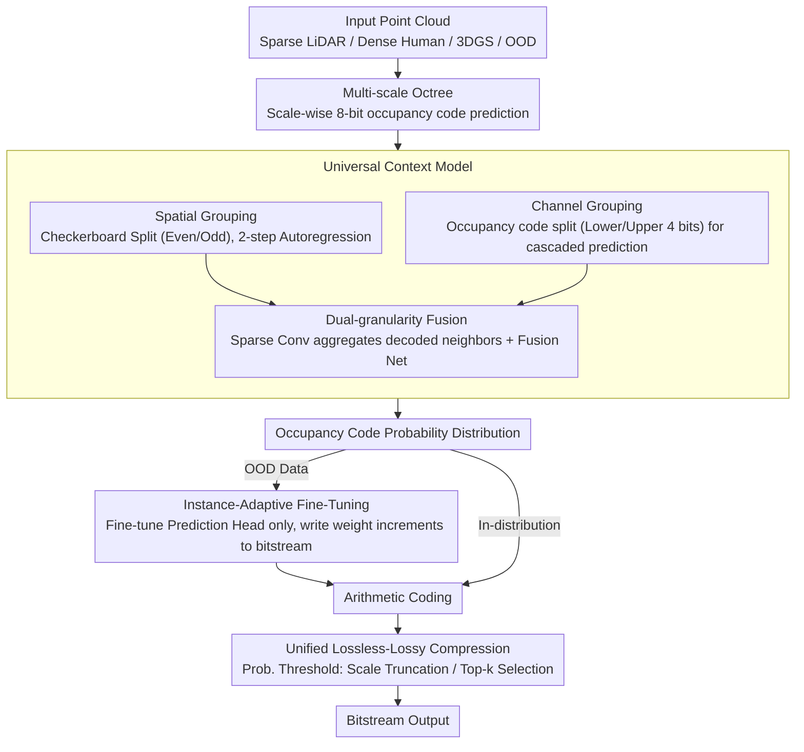

# AnyPcc: Compressing Any Point Cloud with a Single Universal Model

**Conference**: CVPR 2026  
**arXiv**: [2510.20331](https://arxiv.org/abs/2510.20331)  
**Code**: [anypcc.github.io](https://anypcc.github.io)  
**Area**: 3D Vision  
**Keywords**: point cloud compression, universal context model, instance-adaptive fine-tuning, occupancy code, lossless/lossy compression

## TL;DR

AnyPcc is proposed to achieve SOTA point cloud geometry compression across 15 diverse datasets using a single model. By employing a Universal Context Model (integrating spatial and channel-wise dual-granularity priors) and an Instance-Adaptive Fine-Tuning (IAFT) strategy, it achieves ~12% bitrate gain over G-PCC v23.

## Background & Motivation

**Urgent need for point cloud compression**: With the widespread use of 3D applications like autonomous driving and VR, point clouds have become a standard 3D data format. Efficient geometry compression is crucial for reducing storage and transmission costs.

**Poor generalization of existing methods**: Learning-based methods perform well on standard benchmarks but suffer significant performance drops in real-world scenarios, particularly when facing varying densities (sparse LiDAR vs. dense reconstruction) and out-of-distribution (OOD) data.

**Density sensitivity in context models**: Existing spatial-prior methods (e.g., Unicorn) are unreliable in sparse scenarios, while channel-wise methods (e.g., RENO) are robust to sparse data but ignore coarse-grained structural information. Both approaches have specific weaknesses.

**OOD data as a core bottleneck**: Even models claiming universality, such as Unicorn-U, collapse on novel point cloud types like medical scans, 3D Gaussian Splats, or Dust3R/VGGT reconstructions due to a lack of efficient OOD adaptation mechanisms.

**Implicit compression is too slow**: Implicit Neural Representation (INR) methods (training a network from scratch for each instance) offer strong generalization but involve unacceptable encoding times, making them impractical for deployment.

**Lack of a unified framework**: Existing methods target either dense objects or sparse LiDAR; no single model exists that handles all point cloud types while supporting both lossless and lossy compression.

## Method

### Overall Architecture

AnyPcc addresses whether a **single** model can compress everything from sparse LiDAR to dense human bodies and unseen 3D Gaussian Splats. It organizes the point cloud into a multi-scale octree, transforming geometry compression into a scale-by-scale probability prediction task. From the coarsest to the finest scale, the occupancy of each voxel is described by an 8-bit occupancy code. The model predicts the probability distribution of these codes, allowing an arithmetic coder to compress the bitstream toward the entropy lower bound.

The pipeline comprises three core components: the **Universal Context Model (UCM)**, which outputs occupancy code probabilities across scales using density-insensitive context; **Instance-Adaptive Fine-Tuning (IAFT)**, which temporarily fine-tunes a few parameters during encoding for OOD adaptation; and a probability threshold mechanism that enables lossy compression using the same lossless model. During encoding, UCM predicts probabilities for arithmetic coding; for OOD data, IAFT performs fine-tuning and embeds weight increments into the bitstream. The decoder mirrors this process to reconstruct the geometry.

### Key Designs

**1. Universal Context Model: Handling sparse and dense point clouds simultaneously**

Existing methods are specialized: models relying on **spatial priors** (neighboring voxels), like Unicorn, are accurate for dense objects but collapse when points are sparse. Conversely, models relying on **channel-wise priors** (predicting bits within the occupancy code), like RENO, are robust for sparse data but lose coarse structural info. UCM utilizes both priors at every scale, allowing them to complement each other.

The process follows two paths. **Spatial Grouping** splits the occupancy codes of the current scale into two groups using a 3D checkerboard pattern (even/odd coordinate sums), forming a two-step autoregression: the first group is encoded/decoded first, and its decoded neighbors are used to predict the second group. **Channel Grouping** splits each 8-bit occupancy code along the bit dimension into two 4-bit sub-symbols for cascaded prediction (predicting lower bits first, then upper bits conditioned on the lower). This extracts context without relying on spatial neighbors. These paths merge when predicting the second spatial group, using sparse convolutions to aggregate features from the decoded first group.

The authors provide two theoretical supports. Theorem 1 proves that bit-wise autoregression and spatial sub-voxel autoregression are information-theoretically equivalent, meaning channel grouping is not just a "trick" but an alternative spatial modeling. Theorem 2 proves that sparse convolution in the occupancy code space has a receptive field equivalent to a kernel twice as wide in the finer voxel space—providing a larger effective field of view with less computation, which is vital for sparse point clouds.

**2. Instance-Adaptive Fine-Tuning: Transforming a "Universal Model" into a "Specific Model" in seconds**

Even a universal UCM struggles with completely unseen point clouds (e.g., medical scans, 3DGS). IAFT strikes a balance between slow INR and fixed pre-trained models by fine-tuning a minimal subset of UCM parameters during the encoding of a single instance. These weight increments are included in the bitstream, allowing the decoder to replicate the "instance-specific model."

Only the Prediction Head's linear layers ($\Theta_{\text{tune}}$) are adjusted, while the backbone ($\Theta_{\text{frozen}}$) remains locked. During encoding, a single forward pass caches the backbone features, and subsequent iterations optimize only $\Theta_{\text{tune}}$ on these features, allowing convergence in seconds (~200 iterations). Optimized weights are quantized and encoded via DeepCABAC. For 3DGS data, weight transmission costs only 0.319 bpp while saving 1.883 bpp in geometry coding, yielding a net gain of 1.564 bpp.

**3. Unified Lossless-Lossy Compression: Multi-scenario coverage via probability thresholds**

The lossless framework supports lossy compression by applying thresholds to probability predictions. For sparse LiDAR, it truncates the finest $n$ scales. For dense point clouds, the encoder transmits the target point count $k$, and the decoder reconstructs geometry at the $k$ positions with the highest predicted probabilities. Both modes share the same weights without retraining.

## Loss & Training

- **Pre-training Phase**: The UCM is trained on large-scale mixed datasets (KITTI, Ford, 8iVFB, MVUB, ScanNet, GausPcc-1K, Thuman, etc.) using the Negative Log-Likelihood (NLL) of occupancy codes as the loss.
- **IAFT Phase**: Instance-level fine-tuning loss $= \text{NLL} + \lambda_{L1} \cdot \|\Theta_{\text{tune}}\|_1$, where L1 regularization encourages weight sparsity to minimize transmission overhead.
- **Versions**: Ours (categories trained separately) and Ours-U (single unified model for all test sets).

## Key Experimental Results

**Table 1: Lossless Compression Performance (bpp↓)**

| Dataset | Diff. | OOD | RENO | SparsePCGC | OctAttention | TopNet | GPCC v23 | **Ours** | **Ours-U** |
| :--- | :--- | :--- | :--- | :--- | :--- | :--- | :--- | :--- | :--- |
| 8iVFB | E | ✗ | 0.70 | 0.57 | 0.68 | 0.59 | 0.76 | **0.54** | 0.57 |
| KITTI | E | ✗ | 7.06 | 6.80 | 7.21 | 6.85 | 8.19 | **0.618** | 6.45 |
| GS | M | ✗ | 13.89 | 15.82 | 11.31 | 10.95 | 14.46 | **11.65** | 11.74 |
| VGGT | M | ✓ | 8.24 | 7.84 | 8.22 | 7.83 | 7.33 | 7.30 | **7.06** |
| CS | H | ✓ | 3.94 | 4.94 | 3.40 | 3.21 | 3.23 | 3.18 | **3.08** |
| **CR-Gain vs GPCC** | | | 2.96% | 2.07% | 1.32% | -4.04% | 0% | **-11.93%** | -10.75% |

**Table 2: Ablation Study for UCM Components**

| Config | Spatial Conv (SC) | Spatial Grp (SG) | Channel Grp (CG) | CR-Gain | Params (M) |
| :--- | :---: | :---: | :---: | :---: | :---: |
| Baseline | ✗ | ✗ | ✗ | 0.00% | 5.15 |
| Only SG | ✗ | ✓ | ✗ | -6.56% | 5.68 |
| Only CG | ✗ | ✗ | ✓ | +0.13% | 5.15 |
| **Ours (All)** | ✓ | ✓ | ✓ | **-9.88%** | 9.77 |

Key Finding: CG alone (as in RENO) is nearly ineffective (+0.13%); it must collaborate with SC/SG to unlock compression potential.

**Table 3: IAFT Bitrate Breakdown for GS Dataset**

| Metric | UCM only | UCM + IAFT |
| :--- | :--- | :--- |
| Entropy Coding bpp | 13.307 | 11.424 |
| Weight Transmission bpp | 0 | 0.319 |
| **Total bpp** | 13.307 | **11.743** |

## Highlights & Insights

1. **Unity of Theory and Practice**: UCM is built on rigorous proofs of channel-spatial equivalence and receptive field advantages.
2. **Elegant Fusion of Explicit-Implicit Compression**: IAFT grafts INR’s instance adaptation onto pre-trained models, requiring seconds rather than minutes for encoding.
3. **Universality of a Single Model**: Ours-U handles 15 diverse datasets (LiDAR, human, 3DGS, noise) with one set of weights, often outperforming specialized models on OOD data.
4. **Comprehensive Evaluation**: A benchmark of 15 datasets was constructed, covering standard and extreme scenarios (noise/dropout/deformation).
5. **Excellent Efficiency**: Decoding time is competitive with the fastest baseline, RENO (0.46s vs 0.23s), while encoding time is controllable via IAFT iterations.

## Limitations & Future Work

1. **Encoding Overhead**: Enabling IAFT increases encoding time from 0.44s to ~12s (800 iterations), which may limit real-time live streaming applications.
2. **Parameter Size**: The full model has 68.39M parameters. While Ours-U is 9.77M, it lacks a distinct advantage over RENO (9.03M), and IAFT requires backpropagation at the encoder.
3. **Simple Lossy Strategy**: The lossy approach for dense point clouds lacks Rate-Distortion Optimization (RDO), which may target sub-optimal R-D trade-offs.
4. **Training Data Dependency**: UCM generalization still depends on diversified training data; its performance on entirely novel types (e.g., molecular structures) is unverified.

## Related Work & Insights

- **Unicorn/Unicorn-U**: Closest competitors attempting architecture unification but still relying on non-uniform attention-convolution mixtures, resulting in poor OOD generalization.
- **RENO**: Pioneer in channel-wise occupancy code prediction; however, ablations show channel grouping must synergize with spatial priors to be effective.
- **INR Compression**: IAFT is a "lightweight" INR variant, fine-tuning only the head rather than the entire network, suggesting parameter-efficient fine-tuning is promising for compression.
- **DeepCABAC**: Essential for efficient transmission of network parameters, this context-adaptive binary arithmetic coder is key for model-in-the-loop scenarios.

## Rating

- **Novelty**: ⭐⭐⭐⭐ — Dual-granularity context fusion and IAFT explicit-implicit fusion are domain firsts.
- **Experimental Thoroughness**: ⭐⭐⭐⭐⭐ — 15 datasets, 6 baselines, full ablation, and lossless/lossy analysis.
- **Writing Quality**: ⭐⭐⭐⭐ — Clear structure, rigorous theoretical derivation, and well-motivated.
- **Value**: ⭐⭐⭐⭐ — A universal compression model is a necessity for deployment; IAFT strategies are extendable to other 3D tasks.

<!-- RELATED:START -->

## Related Papers

- [\[CVPR 2026\] Depth Any Panoramas: A Foundation Model for Panoramic Depth Estimation](depth_any_panoramas_a_foundation_model_for_panoramic_depth_estimation.md)
- [\[CVPR 2026\] HumanNOVA: Photorealistic, Universal and Rapid 3D Human Avatar Modeling from a Single Image](humannova_photorealistic_universal_and_rapid_3d_human_avatar_modeling_from_a_sin.md)
- [\[CVPR 2026\] Deformation-based In-Context Learning for Point Cloud Understanding](deformation-based_in-context_learning_for_point_cloud_understanding.md)
- [\[CVPR 2026\] Any Resolution Any Geometry: From Multi-View To Multi-Patch](any_resolution_any_geometry_from_multi-view_to_multi-patch.md)
- [\[CVPR 2026\] Adapting Point Cloud Analysis via Multimodal Bayesian Distribution Learning](adapting_point_cloud_analysis_via_multimodal_bayesian_distribution_learning.md)

<!-- RELATED:END -->
