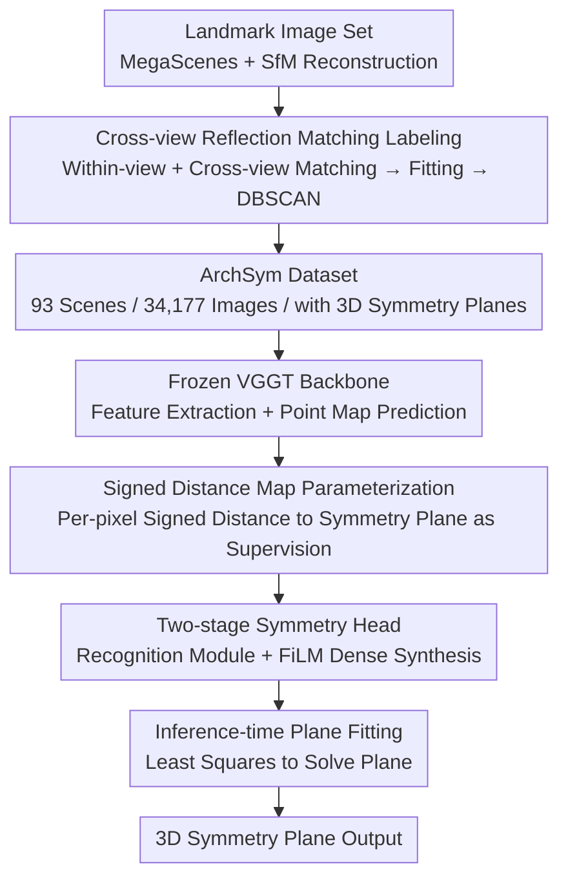

# ArchSym: Detecting 3D-Grounded Architectural Symmetries in the Wild

**Conference**: CVPR 2026  
**Paper**: [CVF Open Access](https://openaccess.thecvf.com/content/CVPR2026/html/Chen_ArchSym_Detecting_3D-Grounded_Architectural_Symmetries_in_the_Wild_CVPR_2026_paper.html)  
**Code**: None  
**Area**: 3D Vision  
**Keywords**: Symmetry Detection, Single-view 3D, Reflective Symmetry Plane, SfM Auto-labeling, VGGT  

## TL;DR
Addressing the gap in detecting 3D reflective symmetry planes in real-world "in-the-wild" scenes, this paper first automatically labels a large-scale landmark symmetry dataset, ArchSym, from SfM reconstructions via cross-view reflection matching. It then trains a single-view detector parameterizing symmetry planes as "signed distance maps relative to predicted geometry," accurately localizing metric-scale symmetry planes from a single RGB image and significantly outperforming existing SOTA.

## Background & Motivation

**Background**: Symmetry is a powerful geometric prior in computer vision—it helps 3D reconstruction complete occluded parts, provides canonical orientations for pose estimation, and resolves monocular ambiguities. Recently, learning-based methods (NeRD/NeRD++, Reflect3D) have been able to regress symmetry planes from a single RGB image, generalizing much better than traditional heuristic geometric methods.

**Limitations of Prior Work**: These methods are trained and evaluated almost exclusively on object-centric or synthetic data (ShapeNet, Objaverse)—clean, pre-segmented, and without backgrounds. Performance degrades sharply when moved to real-world "in-the-wild" scenes (complex environments, varying lighting, occlusions). More critically, monocular input suffers from inherent **scale ambiguity**; localizing a symmetry plane in 3D is an ill-posed problem. Consequently, many methods only predict the **orientation (normal)** of the symmetry plane and abandon positioning the plane's offset in space.

**Key Challenge**: The root cause is the lack of 3D symmetry annotation data for real scenes. Symmetry labels for real landmarks are extremely difficult to obtain—pure geometric methods (ICP, point cloud symmetry detection) often fail on noisy and incomplete point clouds produced by SfM and discard the visual information of the original images; manual annotation is non-scalable.

**Goal**: Decomposition into two sub-problems: (1) How to **scalably** and automatically label 3D symmetry planes for real landmarks; (2) How to enable a single-view detector to ground symmetry planes in 3D **with scale**, rather than providing only a normal vector.

**Key Insight**: The authors leverage a phenomenon in SfM often considered a "nuisance"—the **doppelganger (ghost matching)**: image matchers frequently produce erroneous yet geometrically consistent matches between visually similar but physically distinct structures. This "bug" is precisely the signal for discovering symmetry. Additionally, the authors note that the new generation of 3D foundation models, such as VGGT, predicts scene geometry (point maps) and naturally provides a scale-consistent coordinate system.

**Core Idea**: Use cross-view matching between "an image vs. the horizontal reflection of itself/similar images" to extract symmetries as doppelgangers for labeling; سپس parameterize the symmetry plane as a "signed distance map relative to the point map predicted by VGGT," using model-consistent geometry to resolve scale ambiguity.

## Method

### Overall Architecture
The method consists of two pipelines: an **offline data labeling pipeline** that automatically produces the ArchSym dataset from SfM reconstructions, and a **single-view symmetry detector** trained on this data. The detector uses a frozen VGGT as the backbone to extract features and point maps. The symmetry head predicts each potential symmetry plane as a dense signed distance map (SDF), from which explicit plane parameters are solved during inference. The key to the entire pipeline is that the supervision signal (SDF) is defined relative to the model's **own predicted geometry**, making it inherently scale-consistent and self-consistent with the scene geometry.

### Key Designs

**1. Cross-view Reflection Matching Labeling: Turning the SfM doppelganger nuisance into a symmetry signal**

To train a real-world detector, real-world labels are required, and pure geometric methods are unreliable on incomplete point clouds. The authors extract symmetry by densely matching each image with its "horizontally flipped version." For image $I_i$, they match it with its own reflection $I'_i$ (**within-view matching**, which extracts only the most prominent symmetries like main facades) and also sample reflections $\mathcal{J}_i$ of visually similar images using ASMK similarity (**cross-view matching**, which recovers symmetries not fully visible in a single view, such as the front-back symmetry of an arch). After obtaining 2D correspondences, pixels are back-projected into 3D point pairs $\mathcal{P}_i, \mathcal{P}_j$ using SfM depths and camera parameters. Candidate planes are fitted by minimizing the residual between one set of points and the reflected version of the other:

$$(\mathbf{n}^*, d^*) = \arg\min_{\|\mathbf{n}\|=1,\, d} \sum_k \big\| \mathbf{p}^k_i - \mathcal{R}_{\mathbf{n},d}(\mathbf{p}^k_j) \big\|^2$$

where $\mathcal{R}_{\mathbf{n},d}$ is the reflection operator with normal $\mathbf{n}$ and offset $d$. Each image pair provides a noisy candidate plane. The authors cluster thousands of candidate planes per scene using DBSCAN, taking the cluster centers as high-confidence labels, followed by manual filtering of false/local symmetries and addition of missing global symmetries. Compared to pure geometric methods (e.g., LANGEVIN), this pipeline retains visual information and is robust to incomplete point clouds, stably extracting semantically correct 2-way/4-way symmetries.

**2. Signed Distance Map Parameterization: Using the model's own predicted geometry to resolve scale ambiguity**

The biggest challenge in single-view detection is scale ambiguity—directly regressing the offset $d$ in $(\mathbf{n}, d)$ is ill-posed. Instead of direct regression, the authors treat symmetry detection as a **dense prediction task**: for each pixel, predict the **signed distance** from its corresponding 3D point to the symmetry plane. Specifically, given the point map $\hat{\mathcal{P}}=\{\hat{\mathbf{p}}^k\}$ predicted by the frozen backbone and the ground truth (GT) point map $\mathcal{P}$, a similarity transform $T$ is first computed to align the GT geometry to the predicted geometry (along with the GT symmetry plane). For the aligned plane $\pi=(\mathbf{n}, d)$, the signed distance map used for supervision is:

$$s^k = \mathbf{n}^\top \hat{\mathbf{p}}^k + d$$

Crucially, this supervision is computed relative to the **fixed point map predicted by the model itself** (rather than GT geometry), so the signed distance map remains constant and scale-consistent throughout training, and predictions are naturally self-consistent with the scene geometry. During inference, no GT is needed; explicit plane parameters are recovered via constrained least squares from the predicted high-confidence 3D points $\hat{\mathcal{P}}'$ and their signed distances $\hat{s}'$:

$$(\hat{\mathbf{n}}, \hat{d}) = \arg\min_{\|\mathbf{n}\|=1,\, d} \sum_{\mathbf{p},\, s} \big( (\mathbf{n}^\top \mathbf{p} + d) - s \big)^2$$

This is more stable than a naive baseline of "running two-stage geometric symmetry detection on VGGT point maps," as VGGT only predicts visible geometry, and point clouds are often incomplete or contain irrelevant structures. Implicitly reasoning about symmetry on frozen features and then grounding it via the signed distance map avoids these pitfalls.

**3. Two-stage Symmetry Head + Bipartite Matching: Detecting and aligning multiple symmetry planes in one image**

An image may contain multiple symmetry planes, requiring both global reasoning for "which planes exist" and pixel-level accuracy for "where each plane is located." The symmetry head uses a two-stage design. **Recognition Module**: A set of $M$ learnable instance queries attends to the final layer features $\mathbf{F}^{\text{final}}$ of the frozen VGGT via a lightweight transformer decoder; after refinement, each query encodes a potential symmetry plane. **Dense Synthesis Module**: A DPT-style dense prediction head synthesizes the signed distance map per instance. Before the four feature fusion blocks, instance information is injected via FiLM layers (with adaLN) using scale/shift parameters regressed from instance features:

$$\mathbf{g}^{l}_{i,\text{cond}} = (1 + \boldsymbol{\gamma}^l_i)\cdot \mathrm{adaLN}(\mathbf{g}^l_i) + \boldsymbol{\beta}^l_i,\qquad \mathbf{g}^{l+1}_i = \mathrm{Fusion}(\mathbf{g}^{l}_{i,\text{cond}}, \mathbf{F}^l)$$

The final convolutional head outputs a signed distance map $\hat{s}_i$ and a confidence map $c_i$ for each instance. Training utilizes DETR-style **bipartite matching**: pairwise costs are computed between all GT and predicted planes, and the Hungarian algorithm finds the optimal match. The cost is the confidence-weighted L1 distance plus a confidence regularization term $\mathrm{cost}_{ij}=\sum_k c^k_i\cdot |\hat{s}^k_i - s^k_j| - \alpha\log c^k_i$. The final loss is the average cost of matched pairs. A classification head predicts logits to classify matched planes as positive and others as negative, filtering valid planes by a logit threshold during inference.

## Key Experimental Results

### Main Results
The 93 ArchSym scenes are split by **scene** (not by image) into 74 for training and 19 for testing to avoid data leakage and assess generalization to unseen landmarks. Comparisons include the SOTA single-view detector REFLECT3D (R3D, which only predicts normals and was fine-tuned on ArchSym for a fair comparison) and a simple baseline DIRECT (DIR, which regresses plane parameters directly from frozen VGGT features). Geo denotes geodesic/angular error (↓, degrees), F@x° is the F-score under angular thresholds (↑), and $E_{\text{dense}}$ is the dense symmetry error (↓).

| Method | Geo↓ | F@1°↑ | F@5°↑ | F@15°↑ | E_dense↓ |
|------|------|-------|-------|--------|----------|
| REFLECT3D (R3D) | 10.46 | 0.07 | 0.34 | 0.55 | — (no offset predicted) |
| DIRECT (DIR) | 5.06 | 0.16 | 0.64 | 0.81 | 0.18 |
| **OURS** | **3.71** | **0.25** | **0.70** | **0.84** | **0.13** |

OURS is optimal in both normal prediction (Geo, F@x°) and full plane prediction ($E_{\text{dense}}$): Geo is reduced from R3D's 10.46 to 3.71, and F@1° increases from 0.07 to 0.25.

### Ablation Study
While the paper lacks a traditional module-by-module ablation table, the DIRECT baseline serves as an ablation for "Signed Distance Map Parameterization" (Design 2)—it replaces SDF prediction with direct regression of plane parameters while keeping the backbone the same. The following table summarizes the impact:

| Configuration | Geo↓ | E_dense↓ | Description |
|------|------|----------|------|
| OURS (SDF Parameterization) | 3.71 | 0.13 | Full model; accurate orientation and aligned with geometry |
| DIRECT (Direct Regression) | 5.06 | 0.18 | No SDF → Orientation is acceptable but plane often misaligned with scene geometry |
| REFLECT3D (Object-centric) | 10.46 | — | Normal only; misses visible symmetries and produces redundant detections |

### Key Findings
- **SDF Parameterization is the main performance driver**: DIRECT, utilizing VGGT features, is already more accurate in normals than R3D (Geo 5.06 vs 10.46), but the directly regressed planes are often misaligned with the scene geometry ($E_{\text{dense}}$ 0.18); switching to SDF relative to own geometry yields significantly better localization (0.13).
- **Data domain is the primary cause of R3D's failure**: Even when fine-tuned on ArchSym, R3D only recognizes orientations for the most prominent symmetries, misses partially visible symmetries, and produces redundant detections, showing that object-centric priors do not transfer well to in-the-wild scenes.
- **Labeling pipeline is robust to incomplete point clouds**: Qualitative comparisons show that the pure geometric method LANGEVIN fails to identify planes when one side of the point cloud is missing (e.g., Isa Khan's Tomb, Frauenkirche) and produces architecturally impossible "horizontal symmetry planes" on cubic outlines like the Arc de Triomphe. The proposed pipeline leverages image matching to stably extract 2-way/4-way symmetries; for 8-way symmetries (Isa Khan's Tomb), it matches 5 planes, with the remaining 3 supplemented by post-processing existing intersection lines.

## Highlights & Insights
- **Turning a "System Bug" into a "Labeling Signal"**: Doppelganger matching in SfM, usually treated as noise to be fixed by tools like Doppelganger++, is repurposed here as a symmetry discoverer—this "problem as a signal" perspective is highly transferable to other tasks where "ambiguity implies structure."
- **Supervision Anchored on Model's Own Geometry**: Defining the SDF relative to VGGT's predicted point map (rather than GT geometry) ensures self-consistent predictions and consistent scale, providing an elegant way to bypass monocular scale ambiguity. This "relative dense supervision" approach could be extended to other ill-posed regression tasks like single-view normals, planes, or depth.
- **DETR-style Set Prediction for Symmetry Planes**: Using instance queries, bipartite matching, and FiLM conditional injection solves the multi-instance problem of "multiple symmetry planes per image," cleanly repurposing mature detection paradigms for geometric prior extraction.
- **Plug-and-play Completion**: Detected symmetry planes are used to mirror VGGT's incomplete point clouds, "hallucinating" occluded back-side geometry and demonstrating the practical value of symmetry as a downstream geometric prior.

## Limitations & Future Work
- The labeling pipeline relies on **accurate SfM reconstruction**; the reconstruction quality directly determines the quality of extracted symmetries.
- Currently supports only **reflective symmetry**; the authors note that matching non-flipped other views could extend this to rotational symmetry, though this was not prioritized as pure rotational symmetry is rare in architecture and can often be derived from combinations of reflective ones.
- Detects only **global symmetry** (entire landmark or full facade) and does not detect local symmetries (e.g., individual windows), which is an interesting direction for future work.
- Detector performance is tightly coupled with the geometry predicted by the VGGT head: in cases of extreme geometric ambiguity (severe occlusion, blur), the SDF method may yield biased planes, whereas direct regression might provide a plausible-looking orientation, though its meaningful localization in 3D would remain questionable ⚠️.

## Related Work & Insights
- **vs REFLECT3D [19]**: Uses foundation models to regress plane normals, trained on object-centric data; provides only orientation without localization and degrades significantly in-the-wild. This work provides full 3D planes, is trained on real ArchSym landmarks, and significantly outperforms R3D even after fine-tuning.
- **vs NeRD/NeRD++ [21, 48]**: Uses iterative reflection of image features in 3D to find symmetry planes. Ours does not perform explicit iterative reflection but encodes the symmetry plane into a dense SDF for implicit reasoning by the network, followed by a single-pass solution.
- **vs LANGEVIN [13] (Geometric Labeling)**: Finds symmetry using Riemannian Langevin dynamics on dense COLMAP point clouds; purely geometric, sensitive to incomplete point clouds, and prone to architecturally unreasonable planes. The proposed pipeline retains visual information and uses cross-view reflection matching for semantically correct labels.
- **vs DIRECT (Ours Baseline)**: Uses VGGT features but regresses plane parameters directly. While normals are usable, the planes are often misaligned with geometry—validating the necessity of the "SDF relative to self-predicted geometry" parameterization.

## Rating
- Novelty: ⭐⭐⭐⭐⭐ First in-the-wild single-view 3D-grounded reflective symmetry detection framework; repurposes doppelgangers as labeling signals.
- Experimental Thoroughness: ⭐⭐⭐⭐ Clear main table comparisons, rich qualitative results, and downstream completion applications, though lacks a module-by-module ablation table.
- Writing Quality: ⭐⭐⭐⭐⭐ Logical progression from motivation to data to model; explains scale-consistency of SDF well.
- Value: ⭐⭐⭐⭐⭐ The ArchSym dataset and detector provide reusable symmetry priors for in-the-wild 3D reconstruction and pose estimation.

<!-- RELATED:START -->

## Related Papers

- [\[CVPR 2026\] Homaloidal parametrization for detecting critical two-view configurations](homaloidal_parametrization_for_detecting_critical_two-view_configurations.md)
- [\[CVPR 2026\] Scene Grounding In the Wild](scene_grounding_in_the_wild.md)
- [\[CVPR 2026\] Emergent Outlier View Rejection in Visual Geometry Grounded Transformers](emergent_outlier_view_rejection_in_visual_geometry_grounded_transformers.md)
- [\[CVPR 2026\] GGPT: Geometry-Grounded Point Transformer](ggpt_geometry_grounded_point_transformer.md)
- [\[CVPR 2026\] PointWorld: Scaling 3D World Models for In-The-Wild Robotic Manipulation](pointworld_scaling_3d_world_models_for_in-the-wild_robotic_manipulation.md)

<!-- RELATED:END -->
