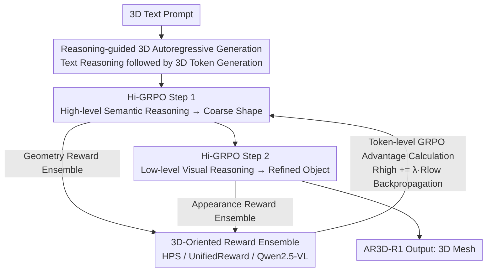

# Are We Ready for RL in Text-to-3D Generation? A Progressive Investigation

**Conference**: CVPR 2026  
**Paper**: [CVF Open Access](https://openaccess.thecvf.com/content/CVPR2026/html/Tang_Are_We_Ready_for_RL_in_Text-to-3D_Generation_A_Progressive_CVPR_2026_paper.html)  
**Code**: https://github.com/Ivan-Tang3D/3DGen-R1  
**Area**: 3D Vision / RLHF Alignment  
**Keywords**: Text-to-3D Generation, Reinforcement Learning, GRPO, Reward Model, Autoregressive Generation  

## TL;DR
This paper systematically introduces reinforcement learning (RL) into text-to-3D autoregressive generation for the first time. By decomposing the problem into four dimensions—reward design, RL algorithms, evaluation benchmarks, and RL paradigms—it proposes a hierarchical coarse-to-fine framework, Hi-GRPO. The resulting RL-enhanced model, AR3D-R1, outperforms Trellis on Toys4K and the new MME-3DR benchmark.

## Background & Motivation

**Background**: RL (especially Group Relative Policy Optimization like GRPO) has proven effective in LLMs, multimodal understanding, and 2D autoregressive image generation by aligning with human preferences via reward models and strengthening stepwise generation. However, 3D autoregressive models (e.g., ShapeLLM-Omni, which discretizes 3D objects into token sequences using VQVAE) currently remain limited to pre-training and fine-tuning phases.

**Limitations of Prior Work**: 2D RL recipes cannot be directly applied to 3D. 3D assets couple geometry and texture in higher spatial dimensions, requiring global geometric consistency and local texture refinement. This makes RL training extremely sensitive to reward design and algorithm selection: incorrect reward signals or token/sequence granularity can lead to training collapse or suboptimal "half-finished" products with correct shapes but no textures. Furthermore, 3D objects lacks canonical views, making it difficult for a single reward model to simultaneously evaluate realism, semantic alignment, and structural integrity.

**Key Challenge**: 3D generation is naturally hierarchical—starting with a global geometric skeleton followed by local texture details (consistent with human perception of 3D). However, standard GRPO treats the entire generation as a flat token sequence optimization. Reward signals fail to distinguish between the "geometry stage" and the "texture stage," causing these dual objectives to interfere with each other.

**Goal**: To answer "Are we ready for RL in text-to-3D?", the study decomposes this into four sub-problems: (1) Which reward models are effective? (2) Which GRPO variant suits 3D? (3) Do existing benchmarks evaluate 3D reasoning? (4) Can a more suitable hierarchical RL paradigm be designed for 3D?

**Key Insight**: Leveraging the dual capability of ShapeLLM-Omni for text and 3D token generation, the model first generates text-based reasoning (to clarify user intent, disambiguate, and plan spatial layout), then uses this reasoning to guide token-level 3D generation. This migrates the "reasoning-guided generation" concept from 2D to 3D for systematic ablation.

**Core Idea**: Replace flat GRPO with a hierarchical "global geometry → local texture" RL (Hi-GRPO). Each stage is equipped with a dedicated reward ensemble, and final quality is backpropagated to supervise global planning.

## Method

### Overall Architecture
The paper is essentially a "progressive investigation" conducting experiments along four axes: reward models (Sec.3), RL algorithms (Sec.4), evaluation benchmarks (Sec.5), and RL paradigms (Sec.6). These findings converge into the Hi-GRPO paradigm and the AR3D-R1 model. The base model is ShapeLLM-Omni (Qwen2.5-VL + 3D VQVAE), which discretizes 3D objects into token sequences and supports autoregressive prediction of both text and 3D tokens.

The generation-optimization pipeline is as follows: Given a 3D text prompt, the model first performs **high-level semantic reasoning** (planning global structure, determining spatial layout of parts) to guide the generation of a **coarse 3D shape**. This is followed by **low-level visual reasoning** conditioned on the prompt and semantic reasoning (refining textures, part counts, symmetry) to generate the **refined 3D object**. For each prompt, $G=8$ groups are sampled in one iteration, and each step uses its own reward ensemble to calculate group relative advantages, with the second-step reward backpropagated to the first.

### Key Designs

**1. Reasoning-guided 3D Autoregressive Generation: Planning before generation to allow RL optimization space**

The bottleneck in 3D is the lack of "intent planning" when generating tokens directly, which leads to geometric confusion for complex prompts. Instead of outputting 3D tokens directly, the model "imagines" the object first, producing $G$ text descriptions (reasoning), and then generates a 3D object conditioned on each description. Semantic reasoning handles object sub-classes, spatial layouts of key parts, and concretizing vague terms. Ablations (Table 3) show that while RL without reasoning improves CLIP Score from 22.7 to 23.4 under HPS V2.1 reward, adding text reasoning further boosts it to 24.0. Reasoning creates a larger headroom for RL by exposing "what to generate" as an intermediate step shapeable by rewards.

**2. 3D-Oriented Reward Ensemble: Overcoming systematic bias with expert division for multi-view consistency**

Since 3D lacks canonical views, a single reward model cannot cover all dimensions. The authors render each 3D object into 6 views and use three types of complementary expert models for scoring: (1) **Human Preference**: HPS V2.1 takes the maximum score across views for overall visual quality. (2) **Prompt Alignment + Aesthetics**: UnifiedReward sums scores for alignment, logic, and style for each view, or a general LMM (Qwen2.5-VL) provides a single reasoning score across all views. (3) **3D Consistency**: While no specialized 3D consistency reward model exists, Qwen2.5-VL demonstrates strong cross-view understanding, scoring 0–1 across shape, appearance, and parts. Key finding: Human preference is the core signal; other dimensions provide stable gains only when overlaid on it. Specialized reward models are more robust in single dimensions, while general LMMs generalize better for multi-view 3D consistency (improving CLIP by 0.6).

**3. Token-level GRPO Optimization: Token-level averaging benefits 3D generation more than sequence-level**

GRPO calculates advantages for a group of $G$ responses using group-relative normalization:

$$A_i = \frac{R_i - \mathrm{mean}(\{R_i\}_{i=1}^{G})}{\mathrm{std}(\{R_i\}_{i=1}^{G})}$$

The performance of three variants was compared. **DAPO** introduces decoupled clipping, dynamic sampling, token-level loss aggregation, and removes KL regularization; **GSPO** moves importance sampling and clipping to the sequence level. Conclusions were clear: 3D autoregressive models prefer token-level policies. Token-level averaging better captures global structural differences during generation. Specifically (Table 2), dynamic sampling improves vanilla GRPO by 0.6 and stabilizes training; however, completely removing KL penalty leads to a 0.4 drop (policy updates require constraint), whereas mild decoupled clipping for low-probability token exploration yields positive returns. This conclusion determined the use of token-level DAPO-style aggregation for Hi-GRPO.

**4. Hi-GRPO: Decomposing "Global Geometry → Local Texture" into two-step hierarchical RL**

Standard GRPO treats 3D generation as flat optimization, where geometry and texture rewards interfere. Observations showed models converge on global geometry early (coarse outlines at step 200) and refine textures later (details like seats or lights at step 600). Hi-GRPO decomposes each iteration into: **Step 1**, guided by 3D prompts and high-level instructions, generates $|s_i|$ semantic tokens and $M$ 3D tokens for coarse shapes; **Step 2**, conditioned on prompts and semantic reasoning, generates visual reasoning and refined object tokens. Two key modifications: (1) Backpropagating second-step rewards: $R_{high} = R_{high} + \lambda \cdot R_{low}$, supervising global planning with final quality via weight $\lambda$. (2) Independent advantage and policy loss calculations for each step, with total loss:

$$L = L_{high} + L_{low}$$

Each step uses a dedicated reward ensemble (Step 1 focuses on global alignment; Step 2 focuses on local refinement). This cross-step division also effectively prevents reward hacking. AR3D-R1 inference demonstrates this progressive transition from coarse to fine.

### Loss & Training
Base model: ShapeLLM-Omni. Training prompts: 8,400 curated short descriptions. Test set: 800 random samples from Toys4K. Iteration $G=8$. Rewards are normalized across 6 rendered views per object. Data scaling (1.5×/2×/3×) provided consistent gains (+0.4/+0.2/+0.4). Doubling training iterations improved performance by 0.9, but tripling led to degradation in generalization due to preference over-optimization.

## Key Experimental Results

### Main Results
Comparison with text-to-3D models on MME-3DR and Toys4K (Table 4, KD ×100, lower is better):

| Method | MME-3DR CLIP↑ | MME-3DR KD$_{incep}$↓ | Toys4K CLIP↑ | Toys4K KD$_{incep}$↓ |
|------|------|------|------|------|
| LGM | 16.3 | 1.507 | 20.6 | 1.192 |
| SAR3D | 16.7 | 1.374 | 20.0 | 0.650 |
| Trellis (Prev. SOTA) | 23.4 | 0.302 | 26.8 | 0.175 |
| ShapeLLM-Omni (Base) | 19.8 | 0.451 | 22.7 | 0.249 |
| **AR3D-R1 (Ours)** | **28.5** | **0.194** | **29.3** | **0.156** |

AR3D-R1 improves the base ShapeLLM-Omni's CLIP on Toys4K from 22.7 to 29.3, outperforming Trellis across both benchmarks.

### Ablation Study
Reward ensembles (Table 1, GRPO + G=8) and RL algorithms (Table 2):

| Configuration | CLIP↑ | KD$_{incep}$↓ | Description |
|------|------|------|------|
| Base (No RL) | 22.7 | 0.249 | ShapeLLM-Omni |
| HPS Only | 24.0 | 0.241 | Human preference is core |
| HPS + Unified | 24.6 | 0.235 | Alignment/Aesthetics +0.6 |
| HPS + Unified + LMM$_{3D}$ | 25.2 | 0.228 | Optimal with 3D consistency |
| + Dynamic Sampling (DAPO) | 25.8 | 0.219 | Stabilizes training +0.6 |
| + Token-level Aggregation | 26.3 | 0.214 | Token-level > Sequence-level |
| + Decoupled Clipping (Full) | 26.5 | 0.210 | Encourages exploration |
| + Removing KL Penalty | 25.9 | 0.213 | Drop of 0.4; needs constraints |

### Key Findings
- **Human preference reward is the foundation**: Among single rewards, HPS V2.1 provides the strongest gain. Other dimensions yield limited individual benefits but offer stable improvements when added to preference signals.
- **Token-level > Sequence-level**: Token-level averaging provides significantly higher gains than sequence-level importance sampling (GSPO), as it better captures global structural variance. Dynamic sampling stabilizes training, but KL cannot be fully removed.
- **Existing benchmarks overestimate models**: Models perform well on simple prompts but fail on five reasoning-intensive scenarios: spatial geometry, mechanical affordance, biological organisms, rare world knowledge, and stylization. MME-3DR exposes these gaps; RL improves the base model by 5–6 points overall, especially in stylization.
- **Scaling hits a ceiling**: Data scaling is effective, and doubling iterations provides +0.9, but tripling leads to degradation (over-optimization of preference features).

## Highlights & Insights
- **Turning "Hierarchy" into a Training Paradigm**: The authors observed that RL training naturally follows a coarse-to-fine trajectory and explicitly designed the Hi-GRPO two-step process with reward backpropagation. This "evidence-based design" can be transferred to any generation task with inherent hierarchy.
- **Filling Reward Gaps with General LMMs**: Since no specialized 3D consistency reward model exists, the authors found that Qwen2.5-VL's cross-view understanding generalizes better on multi-view targets than specialized models, providing a pragmatic path for new modalities lacking reward models.
- **Reward Division to Prevent Hacking**: Assigning different rewards to different stages (Step 1 for geometry, Step 2 for appearance) naturally restricts the space for reward hacking by a single signal.
- **Dual Value of MME-3DR**: It assesses both generation quality and implicit reasoning ability across five balanced categories, making it a better discriminator than random Toys4K samples.

## Limitations & Future Work
- Experiments are tied to a single autoregressive base (ShapeLLM-Omni); transferability to other 3D representations (mesh tokenization, native 3D diffusion) is unverified.
- Reward ensembles depend heavily on 2D/general models (HPS, UnifiedReward, Qwen2.5-VL), which may introduce systematic biases for 3D. Multi-view rendering of 6 views may not fully ensure 3D consistency.
- Policy optimization is sensitive; scaling beyond double iterations leads to degradation, and the sensitivity of $\lambda$ (backpropagation weight) is not fully detailed in the main text.
- Future Work: Introducing 3D-native consistency rewards (e.g., multi-view geometric reconstruction error) or extending hierarchy to finer steps: "geometry → topology → texture → material."

## Related Work & Insights
- **vs. Image Generation with CoT / 2D GRPO**: While these works focus on 2D image reasoning-guided generation, this paper migrates the concept to coupled 3D geometry/texture, noting that 3D is more sensitive to rewards/algorithms and requires hierarchical optimization.
- **vs. ShapeLLM-Omni (Base)**: While the base model utilizes pre-training and fine-tuning, this work introduces RL, lifting Toys4K CLIP from 22.7 to 29.3.
- **vs. Trellis (Prev. SOTA)**: Trellis is a strong non-autoregressive baseline. AR3D-R1 surpasses it on both MME-3DR and Toys4K, indicating that implicit reasoning and RL alignment are key differentiators.
- **vs. DAPO / GSPO**: By testing these LLM-based GRPO variants on 3D, the paper concludes 3D prefers token-level updates, providing empirical evidence for choosing algorithms in 3D RL.

## Rating
- Novelty: ⭐⭐⭐⭐⭐ First systematic introduction of RL into text-to-3D autoregressive generation; Hi-GRPO's hierarchy is a genuine innovation.
- Experimental Thoroughness: ⭐⭐⭐⭐⭐ Comprehensive ablations across rewards, algorithms, scaling, and benchmarks, including a new evaluation set.
- Writing Quality: ⭐⭐⭐⭐ Clear investigative structure with strong observations, though some mathematical details are reliant on diagrams.
- Value: ⭐⭐⭐⭐⭐ Provides the first systematic recipe and reproducible baseline for RL in 3D generation; high domain impact.

<!-- RELATED:START -->

## Related Papers

- [\[CVPR 2026\] Multimodal Semantic Bias Mitigation for Diverse Text-To-3D Generation](multimodal_semantic_bias_mitigation_for_diverse_text-to-3d_generation.md)
- [\[CVPR 2026\] Text–Image Conditioned 3D Generation](text-image_conditioned_3d_generation.md)
- [\[CVPR 2026\] Text-Driven 3D Hand Motion Generation from Sign Language Data](text-driven_3d_hand_motion_generation_from_sign_language_data.md)
- [\[CVPR 2026\] ProgressiveAvatars: Progressive Animatable 3D Gaussian Avatars](progressiveavatars_progressive_animatable_3d_gaussian_avatars.md)
- [\[CVPR 2026\] PhysHead: Simulation-Ready Gaussian Head Avatars](physhead_simulation-ready_gaussian_head_avatars.md)

<!-- RELATED:END -->
