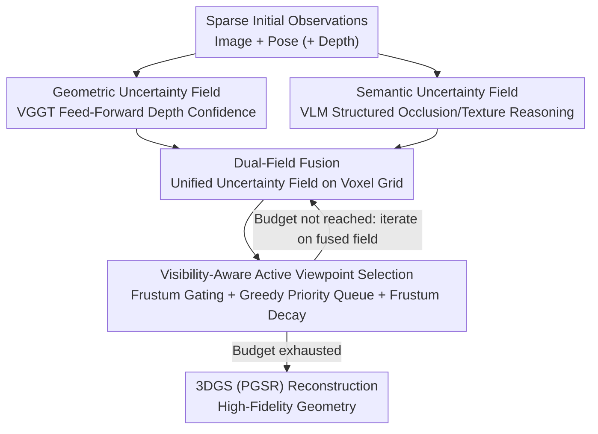

# AREA3D: Active Reconstruction Agent with Unified Feed-Forward 3D Perception and Vision-Language Guidance

**Conference**: CVPR 2026  
**Paper**: [CVF Open Access](https://openaccess.thecvf.com/content/CVPR2026/html/Xu_AREA3D_Active_Reconstruction_Agent_with_Unified_Feed-Forward_3D_Perception_and_CVPR_2026_paper.html)  
**Code**: TBD  
**Area**: 3D Vision / Active Reconstruction / Embodied Perception  
**Keywords**: Active Reconstruction, Feed-Forward 3D Models, Vision-Language Models, Uncertainty Field, Next-Best-View  

## TL;DR
AREA3D is an active 3D reconstruction agent. It decouples the decision of "where to look next" into two complementary signals—geometric confidence provided by a feed-forward 3D model (indicating areas already clearly perceived) and semantic reasoning provided by a VLM (identifying potentially occluded or unobserved regions). These signals are fused on a voxel grid to form a unified "where-to-look" uncertainty field. Subsequently, a greedy strategy with visibility constraints is employed to select the most valuable viewpoints under a tight viewpoint budget, enabling high-fidelity geometric reconstruction from sparse observations.

## Background & Motivation

**Background**: Active 3D reconstruction allows agents to autonomously determine which viewpoints to observe, thereby actively rather than passively reconstructing accurate and complete scene geometry from pre-acquired data. Situated at the intersection of active perception, 3D vision, and robotics, its core subproblem is Next-Best-View (NBV) selection.

**Limitations of Prior Work**: Traditional methods rely on hand-crafted geometric heuristics—such as voxel occupancy, surface coverage, viewpoint overlap, and frontier exploration—to select viewpoints. However, these metrics lack direct awareness of "which areas are poorly reconstructed": they tend to overestimate regions that are **already covered but actually have poor reconstruction quality**, while failing to identify occlusions, holes missed by limited viewpoints, and unobserved surfaces. Consequently, this leads to an abundance of redundant observations along with incomplete geometry. Recent works have turned to high-fidelity neural representations like NeRF or 3D Gaussian Splatting to model uncertainty or information gain (e.g., FisherRF computes expected information gain using the Fisher Information Matrix). However, these approaches are **coupled with online optimization**: they rely on gradient updates to evaluate information gain, which severely degrades when the field fails to converge under sparse observations, and incurs prohibitively high computational costs under dense observations.

**Key Challenge**: Existing methods are forced to repeatedly trade off between reconstruction quality and efficiency—either using computationally cheap but blind geometric heuristics, or utilizing expensive neural field optimization that is slow and unstable under sparse views. What is missing is an uncertainty source that **possesses data-driven priors without requiring online optimization**.

**Goal**: Under a strict viewpoint budget $T$, select a viewpoint set $\mathcal{S}$ that optimizes the final reconstruction quality, i.e., $\mathcal{S}^\star \in \arg\max_{|\mathcal{S}|\le T-|\mathcal{O}_0|} \mathcal{Q}(\hat{\mathcal{G}}(\mathcal{S}), \mathcal{G})$, while being compatible with both tabletop object scenes and room-scale scenes.

**Key Insight**: The authors observe that two types of signals are naturally complementary—feed-forward 3D models (trained on large-scale datasets) can directly output geometric confidence of "which areas have been reliably perceived" in a single forward pass without relying on online optimization; meanwhile, VLMs can reason about "what might be missing," identifying semantic regions that are hard to capture via geometric signals, such as occlusions, thin structures, and specular or textureless surfaces. Combining the two yields a unified guidance sensitive to visibility.

**Core Idea**: Replace the expensive online-optimization-based uncertainty modeling with a **decoupled dual-field** framework of "feed-forward geometric confidence field + VLM semantic uncertainty field." These are fused into a single "where-to-look" field, guiding the agent to step-by-step close the coverage gaps within a few viewpoints.

## Method

### Overall Architecture
AREA3D is a "Dual-Field" active reconstruction system. The input consists of sparse initial observations $\mathcal{O}_0$ (each containing an image $I_v$, a pose $p_v$, and optional depth $D_v$) and a viewpoint budget $T$; the output is a step-by-step selection of the next most informative viewpoints, leading to a final scene reconstruction via 3D Gaussian Splatting (specifically using PGSR).

The system links three complementary components: the **geometric stream** utilizes a feed-forward 3D model (VGGT) to directly output pixel-wise depth confidence from images, which is back-projected onto a voxel grid to construct a geometric uncertainty field; the **semantic stream** employs a VLM to perform structured analysis on the images, generating a semantic uncertainty field; these two streams are **fused** on a shared voxel grid to formulate a unified 3D uncertainty field; finally, an **active viewpoint selection strategy** iteratively chooses viewpoints within the budget using a greedy approach with a priority queue on this fused field, combined with pre-computed visibility masks. The overall pipeline is: "Parallel dual-stream field construction $\rightarrow$ Fusion $\rightarrow$ Budget-constrained greedy viewpoint selection on the fused field $\rightarrow$ Reconstruction".

### Key Designs

**1. Decoupled Dual-Fields: Separating 'where to look' into complementary geometric confidence and semantic reasoning signals, both bypassing online optimization**

This design directly targets the key challenge—uncertainty in existing methods either stems from blind geometric heuristics or expensive online NeRF/3DGS optimization. AREA3D thoroughly decouples viewpoint uncertainty modeling from the "reconstructor itself": the geometric stream relies on a **pre-trained feed-forward 3D model** to directly output confidence maps, while the semantic stream utilizes a **pre-trained VLM** for inference. Both require only a single forward pass and completely avoid per-scene gradient updates. The geometric field answers "what has already been clearly observed", and the semantic field answers "what might still be missing"; they are orthogonal and highly complementary. The paper uses Table 1 to list the shortcomings of four types of uncertainty proxies (geometric heuristics, NeRF rendering variance, 3DGS, and VLM pure semantics), showing that no single modality suffices: geometric heuristics ignore all sensory uncertainties; NeRF variance requires backpropagating volume rendering and converges slowly under sparse views; 3DGS suffers severe degradation under sparse inputs and is coupled with online optimization; pure VLM semantics lack fine-grained geometry and produce non-metric inference. Merging the "geometric" strengths of the former with the "semantic" strengths of VLMs is the cornerstone of this framework.

**2. Geometric Uncertainty Field: Utilizing pixel-wise depth confidence from a feed-forward 3D model as a natural proxy for aleatoric uncertainty**

To address the pain points of "expensive online optimization and instability under sparse views," the authors employ VGGT as a transformer-based feed-forward geometry lifter. It maps RGB tokens to dense pixel-wise predictions in a single forward pass, concurrently outputting **pixel-wise depth confidence** $c_i(\mathbf{x})$, which the authors interpret as prediction accuracy. Crucially, this confidence is not arbitrarily defined—the VGGT encoder is trained using a **heteroscedastic objective**, with a simplified form as:

$$\mathcal{L}_{\text{depth}} = \sum_{\mathbf{x}}\big(c_i(\mathbf{x})\,\ell_i(\mathbf{x}) - \alpha\log c_i(\mathbf{x})\big),$$

where $\ell_i(\mathbf{x})$ represents the depth residual. This objective learns high confidence $c_i$ in reliable regions and low confidence in ambiguous regions. Consequently, the pre-trained confidence maps naturally serve as a proxy for **aleatoric (input-dependent) uncertainty** without requiring any online optimization. After monotonically normalizing the confidence to $[0,1]$, pixels $\mathbf{x}$ are back-projected to 3D using the camera intrinsic matrix $K$ and pose $T_i \in SE(3)$:

$$\mathbf{X}_i(\mathbf{x}) = T_i\big(\hat D_i(\mathbf{x})\,K^{-1}\tilde{\mathbf{x}}\big),$$

and the multi-frame view-wise uncertainty scores are aggregated onto a voxel grid to form the geometric uncertainty field that drives viewpoint selection. Compared to waiting for NeRF/3DGS fields to converge, this approach remains robust and fast even under highly sparse observations.

**3. Semantic Uncertainty Field: Employing structured prompts to guide the VLM in pointing out hard-to-reconstruct regions (e.g., occlusions, thin structures, specular/textureless surfaces) that are geometrically invisible**

Pure geometric confidence tends to miss regions that are **semantically important but hard to detect via raw geometric signals**. The authors introduce a VLM as a semantic prior to compensate for this limitation. To ensure the VLM output can be deterministically mapped back to image coordinates, they design a **structured prompt**: the image is divided into a fixed coarse grid, and the VLM is instructed to output only a small set of "region tuples," each containing a category (one of OCCLUSION / GEOMETRIC / LIGHTING / BOUNDARY / TEXTURE) and a priority score. This constrained format successfully suppresses the stochastic nature of large model generation. During parsing, each predicted region is converted into a soft spatial mask $M_k(u) \in [0,1]$ with Gaussian edge feathering and mild dilation (to boost recall), which is then weighted and aggregated based on category and priority:

$$W_i(u) = \sum_{k=1}^{K}\alpha_{\text{type}_k}\,\beta_{\text{prio}_k}\,M_k(u),$$

where $\alpha, \beta$ are fixed coefficients for categories and priorities, and $W_i(u)$ is normalized per image to $[0,1]$. Finally, the VLM semantic weight is multiplied with the feature-level uncertainty $\sigma_i(u)$ of the visual backbone to modulate and obtain the semantic uncertainty:

$$U_i^{\text{sem}}(u) = \text{Norm}\big(\sigma_i(u)\,[1+\lambda W_i(u)]\big),$$

where $\lambda$ controls the modulation strength. This preserves the feature uncertainty of the backbone while magnifying the regions highlighted by the VLM's semantic reasoning to "focus-worthy" levels. This semantic field is similarly projected into 3D and fused with the geometric confidence. Additionally, to prevent the reconstruction from being trapped around the initial viewpoints, the authors add a global uncertainty weight to all voxels to encourage exploration.

**4. Visibility-Aware Active Viewpoint Selection: Using frustum gating + frustum uncertainty decay + greedy priority queue to gradually close coverage gaps within budget**

With the fused dual-field scores, viewpoint selection is formulated as **maximizing information gain**: maximizing the expected reduction of fused uncertainty within the candidate poses' cone of vision. This design relies on three key mechanisms working in synergy. First is the **Visibility Gate**: visibility is a pose-conditioned operator shared by both geometric and semantic fields. It first filters out out-of-frustum voxels using a deterministic frustum test, then precomputes and caches a probabilistic FOV mask for each seed over a coarse yaw/pitch grid using Monte Carlo ray sampling (terminating on first hit). During selection, the cache is reused directly without re-casting rays, ensuring that utility is allocated only to "potentially observable" content. Second is **frustum uncertainty decay**: whenever a viewpoint is committed, the fused uncertainty within its corresponding frustum mask is multiplicatively decayed by a constant factor, converting "already observed" to "explained and no longer attractive to subsequent selections." This guides the strategy towards new surfaces, effectively coupling selection with evidence accumulation. Third is the **greedy approach with a priority queue**: the workspace is first voxelized, where valid voxel centers serve as candidate camera seeds. Seeds are placed into a max-priority queue ordered by their mask-weighted utility bounds (with a distance prior). In each iteration, the top seed is popped, a small set of candidate orientations and distances is instantiated around it, and evaluated rapidly using the cached masks. Once the optimal pose is selected, its frustum is decayed, nearby seeds are re-keyed and re-queued (with lightweight NMS), until the budget is exhausted (see Algorithm 1 in the original paper). This cohesive design ensures viewpoint selection remains efficient and robust even under sparse observations, naturally balancing exploration and exploitation.

### Loss & Training
AREA3D itself **does not train a new policy network**—which is an extension of its core sell of "bypassing online optimization": geometric confidence is derived from the pre-trained VGGT (trained via the heteroscedastic depth objective mentioned above), and semantics are extracted from the pre-trained VLM. The entire viewpoint selection process is a geometric/search-based procedure at inference time rather than a learned policy. Downstream reconstruction is performed using off-the-shelf 3DGS (specifically PGSR).

## Key Experimental Results

    Experiments are conducted in simulation environments: Habitat + Replica for scene-scale, and CoppeliaSim + OmniObject3D for object-scale. The viewpoint budgets are set to $|\mathcal{O}_0|=4, T=25$ for object-scale, and $|\mathcal{O}_0|=15, T=40$ for scene-scale. Reconstruction quality is evaluated after rendering with 3DGS (PGSR) via PSNR / SSIM / LPIPS.

### Main Results

**Scene-Scale (Replica, Table 2)**: AREA3D outperforms the information-theoretic method FisherRF and random/VLM baselines almost across the board in four rooms.

| Scene | Metric | Random | VLM-based | FisherRF | Ours w/o VLM | **Ours** |
|------|------|--------|-----------|----------|--------------|----------|
| room0 | PSNR↑ | 28.17 | 27.21 | 29.11 | 28.53 | **29.23** |
| room0 | LPIPS↓ | 0.152 | 0.193 | 0.151 | 0.123 | **0.110** |
| office0 | PSNR↑ | 32.35 | 24.92 | 27.13 | 31.75 | **32.98** |
| office4 | PSNR↑ | 26.19 | 23.90 | 27.79 | 30.06 | **31.79** |
| office4 | SSIM↑ | 0.829 | 0.802 | 0.827 | 0.847 | **0.858** |

It can be observed that on office0/office4, FisherRF is actually outperformed by Random (a typical degradation of neural fields failing to converge under sparse viewpoints), whereas AREA3D consistently ranks first. The advantages of AREA3D on structural/perceptual metrics like SSIM/LPIPS are particularly pronounced (e.g., room0 LPIPS of 0.110 vs. FisherRF's 0.151).

**Object-Scale (OmniObject3D, Table 3)**: The advantages of AREA3D are even more prominent in more complex multi-object scenes.

| Configuration | Metric | Random | Uniform | VLM-based | Air-Embodied | Ours w/o VLM | **Ours** |
|------|------|--------|---------|-----------|--------------|--------------|----------|
| Single-object | PSNR↑ | 31.37 | 32.15 | 26.29 | 30.35 | 29.74 | **31.59** |
| 5-objects | PSNR↑ | 29.66 | 30.69 | 21.80 | 30.35 | 31.43 | **31.86** |
| 7-objects 1 | PSNR↑ | 29.61 | 29.86 | 22.44 | 28.35 | 32.39 | **33.44** |
| 7-objects 2 | PSNR↑ | 32.24 | 32.25 | 24.93 | 29.85 | 31.48 | **32.69** |

As the number of objects increases (7-objects), the margin of improvement of AREA3D over various baselines expands (33.44 vs. the second-best Random 29.61 on 7-objects 1), validating the capacity of "feed-forward geometric perception + semantic guidance" synergy to capture complex geometries. Notably, the **pure VLM-based baseline performs the worst in all configurations** (only 21.80 on 5-objects), illustrating that planning based solely on semantics without metric geometry is unreliable.

### Ablation Study
Table 4 shuts down the two major components (feed-forward perception field, VLM guidance field) one by one (by setting their corresponding weights to zero).

| Scale | Feed-Forward | VLM | PSNR↑ | SSIM↑ | LPIPS↓ |
|------|------|------|-------|-------|--------|
| Object-scale | ✗ | ✓ | 29.02 | 0.844 | 0.202 |
| Object-scale | ✓ | ✗ | 31.56 | **0.896** | **0.091** |
| Object-scale | ✓ | ✓ | **32.09** | 0.886 | 0.102 |
| Scene-scale | ✗ | ✓ | 29.10 | 0.839 | 0.115 |
| Scene-scale | ✓ | ✗ | 31.26 | 0.884 | 0.097 |
| Scene-scale | ✓ | ✓ | **32.40** | **0.897** | **0.089** |

The feed-forward geometric field is the absolute primary driver—removing it and leaving only the VLM drops the PSNR to around 29 (29.02 at object-scale / 29.10 at scene-scale), with LPIPS degrading significantly; adding feed-forward back immediately restores it to over 31. The VLM further boosts the PSNR at both scales (31.56 $\rightarrow$ 32.09 at object-scale, and 31.26 $\rightarrow$ 32.40 at scene-scale). ⚠️ However, the "dual-field" SSIM/LPIPS (0.886 / 0.102) at object-scale is slightly inferior to "feed-forward only" (0.896 / 0.091), indicating that semantic guidance at object-scale is not a pure gain for structural/perceptual metrics, and all three metrics are optimized simultaneously only at scene-scale—subject to the original text.

### Key Findings
- **The feed-forward geometric field is the foundation of performance, while the VLM is the icing on the cake**: Removing the feed-forward mechanism and leaving only the VLM leads to a comprehensive degradation close to the random baseline; feed-forward alone yields strong results, and the VLM further pushes the PSNR higher with semantic cues.
- **Information-theoretic methods collapse under sparse views**: FisherRF is outperformed by Random on office0/office4, exposing the vulnerability of online neural field optimization under sparse and unconverged conditions. In contrast, AREA3D's optimization-free dual-field consistently holds the top spot.
- **Greater gains in complex scenes**: As the number of objects increases from single to seven, the lead of AREA3D over the baselines expands, verifying that "geometric perception + semantic guidance" is more effective for complex geometries.
- **Excellent efficiency and scalability (Table 5)**: Increasing the viewpoint budget $T$ from 5 to 40 leaves the total execution time virtually unchanged (134.9s $\rightarrow$ 139.2s), proving excellent scalability with respect to the number of viewpoints. The computation time is predominantly affected by voxel resolution: refining voxel size from 0.5 to 0.2 increases the execution time from 138s to 207s (finer spatial discretization is more expensive).

## Highlights & Insights
- **"Decoupled uncertainty modeling" is exceptionally well-targeted**: Extracting viewpoint uncertainty modeling from the reconstructor itself and delegating it to two **off-the-shelf pre-trained models** (feed-forward 3D + VLM) to output results in a single forward pass bypasses the core pain point that NeRF/3DGS require online optimization to evaluate information gain. This is the most valuable paradigm shift to learn from.
- **Heteroscedastic confidence reused as an aleatoric uncertainty proxy**: The pixel-wise confidence learned during VGGT training to modulate depth residuals is directly employed as a free signal of "what has been clearly observed." With virtually zero extra cost, this is a clever design that makes creative use of an existing model's byproduct.
- **Structured prompts ground VLM semantics to pixels**: Employing a prompt template with a fixed grid, restricted category tuples, and priorities tames the stochastic nature of LLM generation, ensuring deterministic mapping back to image coordinates. This engineering practice of "making VLM outputs parsable" can be readily transferred to any task requiring spatial hinting from VLMs.
- **Visibility caching + frustum decay make greedy viewpoint selection fast and non-redundant**: Precomputing and caching FOV masks and multiplicatively decaying the uncertainty within the frustum upon submission naturally transforms "already seen" into "no longer attractive." This mechanism can be directly exported to other NBV / active perception problems.

## Limitations & Future Work
- **Dependency on two large pre-trained models**: Geometry relies on VGGT and semantics rely on VLM, which bounds the system's overall capability by the prior limit and domain adaptability of these two backbones. If VGGT's confidence is inaccurate on out-of-domain objects/scenes, the geometric field will misguide the viewpoint selection.
- **Validation limited to simulation**: All experiments are conducted in CoppeliaSim / Habitat simulations without real-robot or real-world capture results. The sim-to-real gap, such as pose noise, sensor noise, and the robustness of VLM predictions on real-world images, remains untried.
- **VLM is not a pure gain at object-scale**: Ablation studies show that adding VLM at the object-scale marginally decreases SSIM/LPIPS, indicating that raw weights for fusing semantic and geometric guidance ($\lambda$, category/priority coefficients $\alpha, \beta$) might need to be dynamically adjusted based on scene types instead of the fixed values used in the paper.
- **Many hyperparameters are manually fixed**: The category/priority coefficients for semantic weights, modulation strength $\lambda$, and frustum decay factors are all fixed constants, lacking systematic sensitivity analysis.

## Related Work & Insights
- **vs. FisherRF (Information-Theoretic / Neural Fields)**: FisherRF utilizes the Fisher Information Matrix of 3DGS parameters to estimate expected information gain for trajectory planning, which is highly principled and self-supervised. However, it is **tightly coupled with high-density differentiable representations**, suffering heavy computational burdens and severe degradation when the field fails to converge under sparse views. AREA3D replaces this with optimization-free confidence from a feed-forward model, showing robustness under sparse observations (where FisherRF was outperformed by Random in several scene-scale cases, while AREA3D remained superior).
- **vs. AIR-Embodied (VLM + 3DGS Active Reconstruction)**: AIR-Embodied employs a VLM to reason about occlusions/semantic regions to guide active reconstruction. When reproducing it, its object manipulation module is disabled to isolate the planning policy. While both leverage VLMs for high-level semantics, AREA3D additionally introduces a feed-forward geometric confidence field and explicitly fuses it with the semantic field, achieving a clear margin of victory on object-level 7-objects (33.44 vs. 28.35).
- **vs. Pure VLM-based Planning Baseline**: Baselines utilizing pure VLM reasoning and prompting LLMs to issue non-metric movement commands perform the worst across all settings, highlighting that "pure semantics without metric geometry is unreliable"—providing empirical justification for the authors' choice to treat the geometric field as the primary driver and the VLM as supplementary.
- **vs. Traditional Geometric Heuristics (Voxel Occupancy / Coverage / Frontier)**: These methods are blind to "how well something is reconstructed," easily oversampling already covered but poor-quality regions and missing occluded gaps. AREA3D's dual-field uncertainty directly models "where reconstruction is unreliable or missing," avoiding redundant observations from the source.

## Rating
- Novelty: ⭐⭐⭐⭐ Decoupling "feed-forward geometric confidence + VLM semantics" into dual fields to perform NBV without online optimization presents a clear and practical paradigm shift.
- Experimental Thoroughness: ⭐⭐⭐⭐ Spanning both object and scene scales, including ablation and scalability analyses, though remaining completely in simulation and lacking real-world robot validation.
- Writing Quality: ⭐⭐⭐⭐ The methodology is clearly elucidated, Table 1 effectively contrasts the shortcomings of alternative proxies; however, some hyperparameter settings and formulation details are slightly brief.
- Value: ⭐⭐⭐⭐ Active reconstruction from sparse views is a critical requirement for embodied perception; this optimization-free alternative holds substantial appeal for real-time planning.

<!-- RELATED:START -->

## Related Papers

- [\[CVPR 2026\] Any4D: Unified Feed-Forward Metric 4D Reconstruction](any4d_unified_feed-forward_metric_4d_reconstruction.md)
- [\[CVPR 2026\] ActivePolicy: Active Gaussian Reconstruction and Optimization Strategy Based on Global-Local Information Gain](activepolicy_active_gaussian_reconstruction_and_optimization_strategy_based_on_g.md)
- [\[CVPR 2026\] LocateAnything3D: Vision-Language 3D Detection with Chain-of-Sight](locateanything3d_vision-language_3d_detection_with_chain-of-sight.md)
- [\[CVPR 2026\] PanoVGGT: Feed-Forward 3D Reconstruction from Panoramic Imagery](panovggt_feed-forward_3d_reconstruction_from_panoramic_imagery.md)
- [\[CVPR 2026\] MonoVLM: Monocular 3D Visual Grounding with Vision Language Models](monovlm_monocular_3d_visual_grounding_with_vision_language_models.md)

<!-- RELATED:END -->
