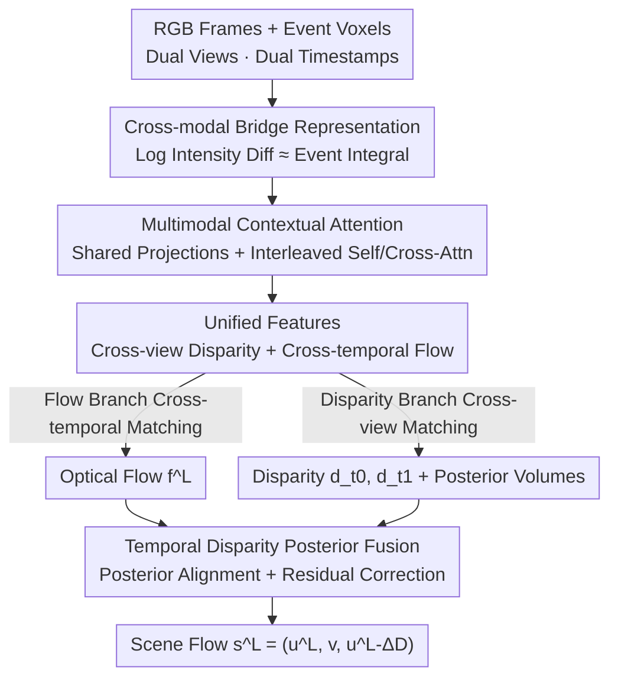

# ARES: Unifying Asymmetric RGB-Event Stereo for Probabilistic Scene Flow Estimation

**Conference**: CVPR 2026  
**Paper**: [CVF Open Access](https://openaccess.thecvf.com/content/CVPR2026/html/Lee_ARES_Unifying_Asymmetric_RGB-Event_Stereo_for_Probabilistic_Scene_Flow_Estimation_CVPR_2026_paper.html)  
**Code**: https://github.com/leejielong/ARES  
**Area**: 3D Vision  
**Keywords**: Scene Flow, RGB-Event Stereo, Multi-modal Fusion, Disparity Posterior, Probabilistic Modeling  

## TL;DR
Utilizing an asymmetric stereo setup consisting of an "Event camera + RGB camera," the proposed method first integrates temporal clues from asynchronous events with spatial structures from RGB into a unified representation via Multimodal Contextual Attention for simultaneous optical flow and disparity estimation. Then, Temporal Disparity Posterior Fusion is employed to probabilistically model the evolution of disparity over time, recovering geometrically consistent and temporally stable dense scene flow. This approach achieves SOTA scene flow accuracy under the RGB-event stereo configuration.

## Background & Motivation

**Background**: Dense scene flow (per-pixel 3D motion) naturally couples "geometric structure" with "temporal dynamics," which is equivalent to accurately estimating both optical flow (2D motion) and disparity (depth). Mainstream approaches typically use either synchronized RGB stereo or event stereo.

**Limitations of Prior Work**: These two types of sensors occupy opposite ends of the sensing spectrum, each with fatal weaknesses. RGB stereo provides rich spatial texture and accurate disparity but suffers from frame rate and exposure limits, leading to motion blur and temporal aliasing under high-speed motion, which degrades optical flow. Event cameras offer microsecond-level latency and high dynamic range, capturing precise temporal motion during fast movement or intense lighting changes; however, events are triggered sparsely at moving edges of brightness changes, lacking global texture and absolute intensity, making dense geometry/disparity recovery difficult. Consequently, RGB stereo excels at depth while event stereo excels at motion, and neither alone can faithfully reconstruct the complete 3D motion field.

**Key Challenge**: Scene flow depends on both accurate disparity and accurate optical flow, but "strong spatial anchoring" and "high temporal resolution" are mutually exclusive within a single sensor type—this is a sensor-level trade-off that cannot be bypassed by unimodal algorithms.

**Goal**: In an asymmetric stereo setup, simultaneously output the left-view optical flow $\mathbf{f}^L$, the left-view disparities $d^L_{t_0}, d^L_{t_1}$ at two timestamps, and the left reference scene flow $\mathbf{s}^L$, ensuring all results are geometrically consistent and temporally stable.

**Key Insight**: Instead of trying to outperform RGB stereo in static depth or event stereo in instantaneous motion, the authors intentionally employ an "asymmetric pairing"—using one event camera as a temporal channel and one RGB camera as a spatial anchor. This complementarity sacrifices unimodal dominance for geometric-temporal consistency in scene flow (additionally, event-RGB pairing is low-cost and easy to calibrate for synchronization).

**Core Idea**: Use "Cross-modal Bridging + Interleaved Attention" to fuse asynchronous events and synchronous RGB into a unified correspondence space for joint flow and disparity estimation. This is followed by a probabilistic framework for "disparity posterior evolution over time" to estimate disparity changes (motion along the depth axis), combining them into scene flow.

## Method

ARES takes two views (left/right) at two timestamps ($t_0/t_1$) consisting of RGB frames $I^v_t$ and event voxel grids $E^v_t$ ($v\in\{L,R\}$) as input, and outputs the left-view optical flow, disparity, and scene flow. The pipeline consists of two major components: MCA fuses heterogeneous modalities into a unified spatio-temporal representation for flow/disparity matching, while TDPF probabilistically models the temporal evolution of disparity to obtain metrically consistent 3D motion.

### Overall Architecture

First, scene flow is decomposed into optical flow and disparity change, which serves as the objective for all subsequent modules. The authors represent the left-view scene flow as $\mathbf{s}^L(x,y)=\big(u^L,\,v^L,\,u^R\big)$, where the right-view horizontal component $u^R$ is linked to the left-view motion through disparity change: the disparity at $t_1$ is back-warped to $t_0$ using optical flow to get $\widetilde{d}^L_{t_1}=\mathcal{W}^{\mathrm{b}}(d^L_{t_1},u^L,v^L)$, and the disparity change is defined as $\Delta d = d^L_{t_0}-\widetilde{d}^L_{t_1}$, leading to $u^R = u^L-\Delta d$. This step decomposes "3D motion" into two learnable quantities: "2D optical flow" and "disparity change," explaining why both must be accurately estimated.

The data flow is as follows: Three modal encoders extract RGB / Event / Bridge features → MCA uses interleaved self/cross-attention to fuse them into view-independent unified features $\{F^L_{t_0},F^R_{t_0},F^L_{t_1},F^R_{t_1}\}$ → These features are fed simultaneously to the flow branch (cross-time matching) and disparity branch (cross-view matching), each constructing cost volumes and iteratively refining results → TDPF aligns and fuses disparity predictions and their posterior distributions across time to output the disparity change $\Delta\hat{D}$ → This is combined with optical flow to form the scene flow $\mathbf{s}^L$.

### Key Designs

**1. Cross-modal Bridge Representation: Finding a common metric for asynchronous events and synchronous RGB**

Directly performing cross-modal fusion between event streams and RGB frames is problematic as one is asynchronously continuous while the other is sparse and discrete, and their physical quantities differ. The authors use the brightness constancy assumption to pull both into a common space of "brightness change over time." According to the event imaging model, intensity at adjacent frames satisfies $I(\tau_{i+1})=I(\tau_i)\exp\big(c\int_{\tau_i}^{\tau_{i+1}} e(t)\,dt\big)$. Taking the logarithm gives an additive relationship: $\Delta L_i = \log I(\tau_{i+1})-\log I(\tau_i)=c\int_{\tau_i}^{\tau_{i+1}} e(t)\,dt$. Thus, the "log intensity difference of adjacent RGB frames" is theoretically equal to the "integral of events within the same time window." Both describe the same physical process at different sampling granularities. A shared bridge modality is defined as $\mathcal{B}_i=\log I(\tau_{i+1})-\log I(\tau_i)\approx c\int e(t)\,dt$. The bridge image pair $(B^L_{\text{evt}}, B^R_{\text{rgb}})$ acts as a cross-view anchor, aligning modalities with distinct perceptual characteristics into the same space—a physical prerequisite for subsequent attention fusion.

**2. Multimodal Contextual Attention (MCA): View-independent interleaved fusion of spatial and temporal clues**

While bridge representations are aligned, temporal aggregation and differencing lose fine-grained spatio-temporal details. Furthermore, since RGB and events are observed independently in the left and right cameras, direct cross-modal fusion usually requires strict view correspondence. MCA addresses both. It first uses three specialized encoders to extract complementary features: the RGB encoder $\Phi_{\text{RGB}}$ uses a ConvNeXt-DINOv3 backbone with a lightweight residual CNN adapter for high-level semantics; the event encoder $\Phi_{\text{EV}}$ uses a recurrent CNN + feature pyramid for multi-scale temporal motion features; and the bridge encoder $\Phi_{\text{BR}}$ uses a lightweight CNN for stable structural cues. Crucially, the bridge features $F^v_B$ are projected into a unified latent space for $Q^v, K^v, V^v$ using "cross-view shared" linear mappings. Shared projection weights $(W_Q, W_K, W_V)$ allow queries from either view to extract information from the RGB/event context of the opposite view, making the fusion view-independent and free of camera bias.

Each MCA layer performs interleaved spatial and temporal reasoning: $F^v_1=\text{SelfAttn}(F^v_B)$ for internal alignment → $F^v_2=\text{CrossAttn}(Q{=}F^v_1, K{=}V{=}F_{\text{RGB}}^v)$ injects RGB spatial structure → $F^v_3=\text{SelfAttn}(F^v_2)$ exchanges intra-view information → $F^v_4=\text{CrossAttn}(Q{=}F^v_3, K{=}V{=}F_{\text{EV}}^v)$ injects event motion dynamics. This "interleaved" rather than "serial RGB-then-event" design allows both contexts to refine the same evolving query alternately. Combined with intermediate self-attention, it prevents one modality from dominating, resulting in balanced spatial-temporal integration. The final $\{F^L_{t_0},F^R_{t_0},F^L_{t_1},F^R_{t_1}\}$ serves as a unified representation: the flow branch uses it for cross-temporal matching, emphasizing temporal coherence, while the disparity branch uses it for cross-view matching, emphasizing geometric accuracy. These tasks regularize each other—flow constrains the temporal evolution of geometry, and disparity sharpens the spatial structures used for flow inference.

**3. Temporal Disparity Posterior Fusion (TDPF): Probabilistic modeling of disparity evolution for metrically consistent depth motion**

While MCA provides spatio-temporally aligned features, it does not explicitly model "how disparity changes over time." To recover complete 3D scene flow, the disparity change $\Delta\hat{D}=D_{t_1}-D_{t_0}$ (motion along the depth axis) must be estimated. Unlike optical flow, it cannot be determined solely from image space correspondence; it depends on both temporal disparity change and stereo geometry. TDPF fuses "cross-temporal disparity posteriors." Each disparity cost volume $C^D_t\in\mathbb{R}^{H\times W\times W}$ after softmax represents the posterior distribution of each pixel over candidate disparities. TDPF first back-warps the disparity and posterior from $t_1$ to $t_0$ using optical flow: $\widetilde{D}_{t_1\to0}=\mathcal{W}^{\mathrm{b}}(D_{t_1},\hat{\mathbf{f}}^L)$ and $\widetilde{C}^D_{t_1\to0}=\mathcal{W}^{\mathrm{b}}(C^D_{t_1},\hat{\mathbf{f}}^L)$, ensuring alignment before fusion. Since cost volume resolution varies with image size, posteriors are interpolated along the disparity axis into fixed $K$ bins to achieve resolution-independent posteriors. A compact tensor $\mathcal{Z}=[\widetilde{D}_{t_1\to0},D_{t_0},\widetilde{D}_{t_1\to0}-D_{t_0},\widetilde{C}^D_{t_1\to0},\widetilde{C}^D_{t_0},F^L_{t_0},F^L_{t_1}]$ is constructed, allowing the network to jointly reason about stereo geometry, temporal alignment, and posterior uncertainty. A compact 2D convolutional network $\Phi_{\text{TDPF}}$ predicts a residual correction $\Delta\hat{D}_{\text{res}}=\Phi_{\text{TDPF}}(\mathcal{Z})$, such that $\Delta\hat{D}=(\widetilde{D}_{t_1\to0}-D_{t_0})+\Delta\hat{D}_{\text{res}}$. Explicitly fusing cross-temporal posteriors enables the model to capture uncertainty in ambiguous regions and enforce inter-frame temporal consistency. Finally, $u^R=u^L-\Delta\hat{D}$ ensures geometric consistency between views, bridging 2D correspondence estimation to metrically consistent 3D motion reconstruction.

### Loss & Training

Since scene flow annotations are extremely sparse, training employs a combination of "sparse supervision + dense self-consistency": $\mathcal{L}=\lambda_f\mathcal{L}_f+\lambda_d\mathcal{L}_d+\lambda_p\mathcal{L}_p+\lambda_w\mathcal{L}_w$. $\mathcal{L}_f$ is a masked $\ell_1$ flow loss on valid pixels; $\mathcal{L}_d$ is the $\ell_1$ disparity supervision; $\mathcal{L}_p$ is photometric consistency, using predicted flow to forward-warp $I^L_1$ to reconstruct $\widetilde{I}^L_0$, combining SSIM and $\ell_1$: $\mathcal{L}_p=\alpha\frac{1-\text{SSIM}(I^L_0,\widetilde{I}^L_0)}{2}+(1-\alpha)\|I^L_0-\widetilde{I}^L_0\|_1$ ($\alpha=0.85$), regularizing flow in textureless or unlabeled areas. $\mathcal{L}_w$ is a temporal disparity-warping loss, where $\hat{D}_{t_0}+\Delta\hat{D}$ is forward-warped via softmax splatting to get $\widetilde{D}_{t_0\to1}$, which is then compared with the ground truth disparity at $t_1$. This serves as a proxy for explicit scene flow supervision and enforces temporal consistency.

## Key Experimental Results

### Main Results

Evaluations were conducted on the DSEC and MVSEC event-RGB stereo datasets. The primary metric is End-Point Error (EPE), along with >1px / >5px outlier rates. Baselines include the event-stereo method EMatch, the dense correspondence method RAFT-3D, the zero-shot asymmetric event-RGB method ZEST (disparity only), and ARES-Base (bridge representation only, without MCA/TDPF). All baselines were retrained on the same training split.

Results on DSEC (High speed + intense lighting changes):

| Method | Disparity EPE↓ | Flow EPE↓ | Scene Flow EPE↓ | SF >5px↓ |
|------|-----------|-----------|-------------|--------------|
| ZEST | 0.683 | – | – | – |
| ARES-Base | 0.693 | 0.712 | 6.812 | 0.772 |
| EMatch | 0.565 | **0.452** | 6.225 | 0.671 |
| RAFT-3D | **0.486** | 0.533 | 5.131 | 0.544 |
| **Ours** | 0.502 | 0.485 | **4.608** | **0.300** |

Results on MVSEC (Outdoor, low light, high noise):

| Method | Disparity EPE↓ | Flow EPE↓ | Scene Flow EPE↓ | SF >1px↓ |
|------|-----------|-----------|-------------|--------------|
| ZEST | 0.183 | – | – | – |
| ARES-Base | 0.159 | 1.221 | 1.191 | 0.339 |
| EMatch | 0.131 | **0.774** | 1.251 | 0.353 |
| RAFT-3D | 0.117 | 0.913 | 0.939 | 0.291 |
| **Ours** | **0.110** | 0.815 | **0.752** | **0.240** |

Conclusions across datasets: Unimodal methods have specific strengths—event-based EMatch performs best in optical flow (high temporal resolution), while RGB-based RAFT-3D leads in disparity. ARES consistently ranks second in flow, matches the strongest RGB methods in disparity, but achieves the **lowest Scene Flow EPE** and lowest outlier rates. The authors emphasize that even if individual flow/disparity metrics show slight compromises, the gains in scene flow from joint geometric-temporal consistency are crucial. (Note: MVSEC errors are generally lower because its 10cm baseline compared to DSEC's 60cm results in smaller disparity magnitudes, making the geometry task numerically easier.)

### Ablation Study

Component-wise ablation on DSEC (EPE):

| Configuration | Disparity EPE↓ | Flow EPE↓ | Scene Flow EPE↓ | Description |
|------|-----------|-----------|-------------|------|
| Full ARES | 0.502 | 0.485 | 4.608 | Full model |
| w/o MCA | 0.884 | 0.694 | 5.532 | Removing MCA causes a drop across all metrics |
| w/o TDPF | 0.507 | 0.491 | 6.340 | Removing TDPF significantly degrades Scene Flow |
| w/o SSL losses | 0.555 | 0.525 | 5.118 | Removing self-supervised losses slightly worsens results |
| ARES (No DINOv3) | 0.515 | 0.496 | 4.642 | Replacing DINOv3 backbone results in minimal drop |
| ARES-CA | 0.709 | 0.713 | 5.349 | Using only cross-attn instead of MCA |
| ARES RGB | 0.487 | 0.539 | 5.064 | RGB unimodal only |
| ARES Event | 0.565 | 0.458 | 4.973 | Event unimodal only |

### Key Findings
- **MCA is critical for fusion quality**: Removing it causes disparity to spike from 0.502 to 0.884 and flow from 0.485 to 0.694. ARES-CA also degrades, proving the necessity of shared projections, bridge representations, and interleaved cross-attention.
- **TDPF manages scene flow temporal consistency**: Removing it leaves disparity and flow almost unchanged (0.507/0.491), but Scene Flow EPE jumps from 4.608 to 6.340—confirming that explicit modeling of disparity evolution is the source of metrically consistent 3D motion.
- **Gains stem from design, not just the backbone**: Removing DINOv3 only drops performance to 4.642, showing that performance relies on the formulation of ARES rather than just a strong vision backbone.
- **Asymmetric fusion is indispensable**: Unimodal RGB yields better disparity (0.487) and unimodal events yield better flow (0.458), but both produce significantly worse scene flow than the full model, validating the core hypothesis that RGB handles geometry while events handle motion.

## Highlights & Insights
- **Equating event integrals with RGB frame differences**: The cross-modal bridge representation is not just engineering concatenation but is derived from the physics of event imaging ($\Delta L_i \approx c \int e(t)\,dt$), providing a common metric for asynchronous and synchronous sensing.
- **Probabilistic scene flow via "disparity posteriors"**: Instead of regressing a deterministic disparity change, TDPF warps the entire softmax posterior across time, aligning it to fixed bins for fusion, allowing uncertainty in ambiguous regions to inform the reasoning process.
- **"Asymmetry" as a design philosophy**: The authors explicitly sacrifice individual metric dominance to optimize joint geometric-temporal consistency. This "compromise for consistency" is proven most effective for coupled tasks like scene flow.
- **Shared cross-view projection breaks the view correspondence constraint**: Projecting queries/keys/values of both views into a shared space makes fusion view-agnostic, which is valuable for any asymmetric or loosely aligned stereo setup.

## Limitations & Future Work
- Dependence on sparse DSEC ground truth limits supervision density and motion diversity, with potential over-fitting in textureless/low-light areas.
- The bridge formula assumes near-synchronous perception; it is sensitive to temporal misalignment or calibration drift between modalities—a real-world risk for event-RGB deployments. ⚠️
- While TDPF models disparity evolution, it does not enforce physical rigidity or long-range consistency; future work could incorporate geometric priors or motion segmentation.
- Observation: Scene flow lack direct supervision, relying on temporal warping as a proxy; failures in textureless/low-light zones may stem from this. Additionally, comparison is limited to 4 baselines on custom hold-out splits rather than official splits.

## Related Work & Insights
- **vs EMatch (Event Stereo)**: EMatch also jointly estimates flow and disparity using multi-scale refinement; its high temporal resolution makes for superior optical flow. However, lacking dense geometry, its scene flow is inferior to ARES, which supplements geometry using RGB and multi-modal attention.
- **vs RAFT-3D (RGB Scene Flow)**: RAFT-3D predicts per-pixel SE(3) motion and relies on dense depth supervision; ARES avoids this dependence by using probabilistic disparity evolution under sparse supervision, remaining more robust in high-speed or high-dynamic-range scenarios.
- **vs ZEST (Zero-shot Asymmetric Event-RGB)**: ZEST uses pre-trained image models for zero-shot disparity but only addresses static depth. ARES extends asymmetric stereo to the dynamic domain.
- **vs BEVFusion / Perceiver IO (Multi-modal Attention)**: These assume symmetric or synchronous inputs; MCA adapts interleaved cross-attention with shared projections specifically for asymmetric event-RGB perception.

## Rating
- Novelty: ⭐⭐⭐⭐ Extending "asymmetric event-RGB stereo" to dynamic scene flow with physically grounded bridging and posterior fusion.
- Experimental Thoroughness: ⭐⭐⭐ Good evaluation on two datasets and complete ablation, though comparison with more baselines and official splits would be better.
- Writing Quality: ⭐⭐⭐⭐ Clear motivation, well-organized modules, and clear explanation of scene flow decomposition.
- Value: ⭐⭐⭐⭐ Provides a feasible path for low-cost asymmetric multi-modal stereo sensing with high relevance for high-speed 3D perception.

<!-- RELATED:START -->

## Related Papers

- [\[CVPR 2026\] Bidirectional Cross-Modal Prompting for Event-Frame Asymmetric Stereo](bidirectional_cross-modal_prompting_for_event-frame_asymmetric_stereo.md)
- [\[CVPR 2026\] AIMDepth: Asymmetric Image-Event Mamba for Monocular Depth Estimation](aimdepth_asymmetric_image-event_mamba_for_monocular_depth_estimation.md)
- [\[CVPR 2026\] LiteSense: Lifting Lightweight ToF with RGB for High-Resolution Metric Depth Estimation](litesense_lifting_lightweight_tof_with_rgb_for_high-resolution_metric_depth_esti.md)
- [\[CVPR 2026\] EventHub: Data Factory for Generalizable Event-Based Stereo Networks without Active Sensors](eventhub_data_factory_for_generalizable_event-based_stereo_networks_without_acti.md)
- [\[CVPR 2026\] FunFact: Building Probabilistic Functional 3D Scene Graphs via Factor-Graph Reasoning](funfact_building_probabilistic_functional_3d_scene_graphs_via_factor-graph_reaso.md)

<!-- RELATED:END -->
