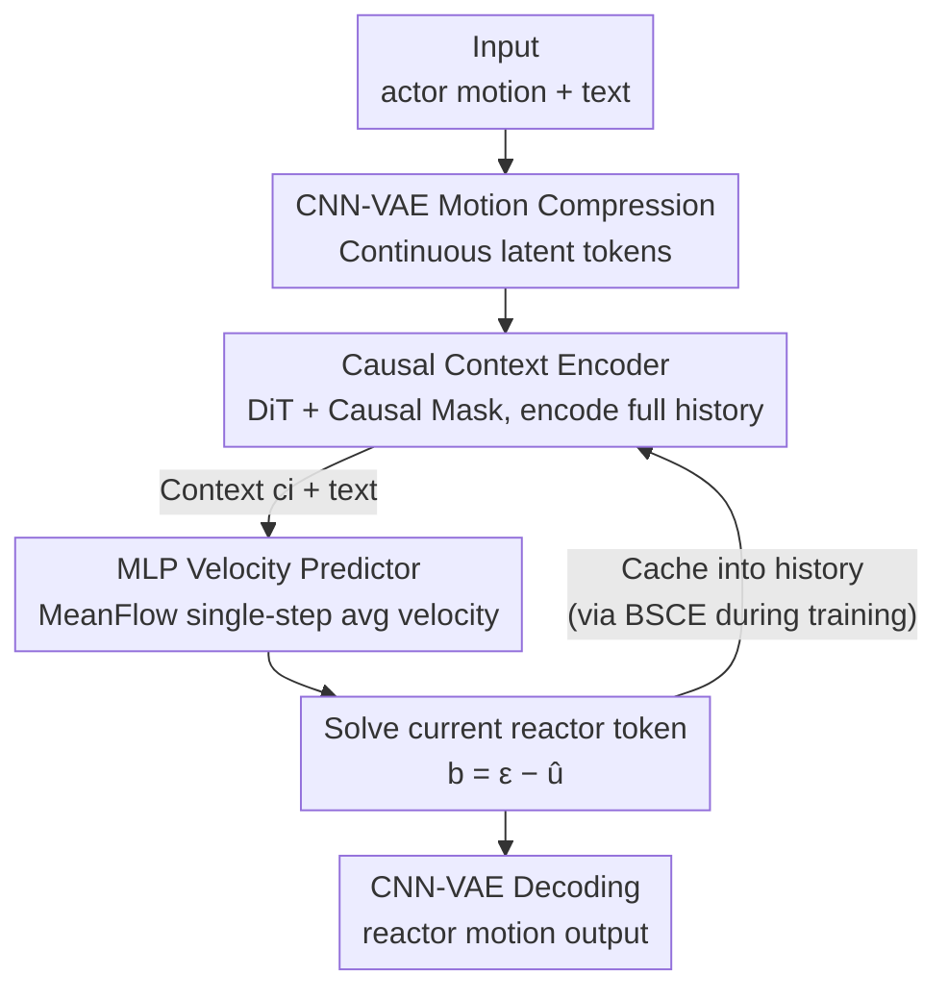

# ARMFlow: AutoRegressive MeanFlow for Online 3D Human Reaction Generation

**Conference**: CVPR 2026  
**Paper**: [CVF Open Access](https://openaccess.thecvf.com/content/CVPR2026/html/Geng_ARMFlow_AutoRegressive_MeanFlow_for_Online_3D_Human_Reaction_Generation_CVPR_2026_paper.html)  
**Code**: https://github.com/ZenGengChin/armflow_official  
**Area**: 3D Vision / Human Understanding / Motion Generation  
**Keywords**: 3D human reaction generation, MeanFlow, autoregressive generation, single-step inference, real-time motion synthesis

## TL;DR
This work introduces the "single-step generation" MeanFlow paradigm to the human motion domain for the first time. By utilizing an autoregressive structure consisting of a "causal context encoder + lightweight MLP velocity predictor" combined with Bootstrapped Causal Encoding (BSCE) to suppress error accumulation, online 3D human reaction generation is achieved within a single inference step. The method reduces FID by approximately 30% compared to existing online methods while maintaining the fastest speed.

## Background & Motivation
**Background**: 3D human reaction generation (action–reaction) aims to synthesize a "reactor's" motion in real-time based on an "actor's" motion, typical in scenarios like human-computer interaction and AR/VR. Unlike text-to-motion or person-person interaction generation, the conditions here are continuously evolving and unpredictable, requiring **real-time** responses without second-level delays.

**Limitations of Prior Work**: Existing autoregressive solutions for online generation (e.g., CAMDM, HumanX) face two major drawbacks. First is the **fixed-length context window**: CAMDM only considers the previous 10 frames of history, discarding information beyond this window, which leads to severe semantic drift in long sequences and an inability to generate from zero (t=0, no history). Second is **slow multi-step denoising**: being based on diffusion models, they typically requires $\geq 10$ steps even with DDIM acceleration, incurring high computational costs at fine-grained temporal resolutions. Other models like R2R, while using full history encoding, require 50 inference steps, compromising efficiency.

**Key Challenge**: Achieving high-fidelity, real-time performance, and long-range context simultaneously is difficult in existing frameworks—longer context windows improve accuracy but reduce speed, while more denoising steps enhance realism but hinder real-time performance. Furthermore, autoregressive inference naturally suffers from **error accumulation**: models trained only on clean ground-truth history must process their own noisy generated history during inference, leading to progressive divergence.

**Goal**: (1) Satisfy real-time constraints using single-step inference; (2) Encode full history rather than a fixed window to maintain global semantics; (3) Enable the model to handle "imperfect self-generated history" during training to suppress error accumulation.

**Key Insight**: The authors leverage the recently proposed MeanFlow paradigm—instead of learning the instantaneous velocity field at each moment, it directly learns the **average velocity** over the entire trajectory. Consequently, a single-step integration allows jumping from noise to data. Applying this to autoregressive motion generation solves both the "slow" and "multi-step" issues.

**Core Idea**: Replace multi-step diffusion denoising with a single-step average velocity field from MeanFlow. Substitute fixed windows with a causal full-history encoder. Use model-generated history (rather than ground-truth) as a condition during training to allow the model to adapt to error accumulation in advance.

## Method

### Overall Architecture
ARMFlow addresses the problem: "Given text $\text{text}$ and an actor motion sequence $x^a\in\mathbb{R}^{T,D}$, synthesize reactor motions $x^b\in\mathbb{R}^{T,D}$ online frame-by-frame." The architecture consists of three layers: first, a 1D-CNN VAE compresses actor/reactor motions into a shared continuous latent space; next, MeanFlow generation is performed in this latent space—while the offline version (ReMFlow) uses a DiT to generate the entire segment, the online version (ARMFlow) employs a "DiT causal context encoder + MLP velocity predictor" for token-by-token autoregression; finally, BSCE is applied during training to construct context conditions using self-generated history, progressively introducing cumulative errors to enhance robustness.

Online inference follows an autoregressive loop: it starts with a learnable $\langle sos\rangle$ token as initial history. In each step, the current actor token and a Gaussian noise token are fed into the MLP to predict the single-step average velocity, solve for the current reactor token, and cache it into the history to drive the next step until the actor tokens are exhausted.

### Key Designs

**1. MeanFlow Single-step Generation: Compressing Multi-step Denoising into One Average Velocity Integration**

To address the bottleneck of slow multi-step denoising in diffusion/flow models, this work learns the **average velocity** between any two time points $r$ and $t$ instead of the instantaneous velocity field $v(z_\tau,\tau)$:

$$u(z_t,r,t)=\frac{1}{t-r}\int_r^t v(z_\tau,\tau)\,d\tau$$

This allows sampling from $r=0$ (noise) to $t=1$ (data) with just one integration step, drastically reducing inference costs. Applying the Leibniz rule to both sides yields the training objective $\mathcal{L}(\theta)=\mathbb{E}\lVert u_\theta(z_t,r,t)-\mathrm{sg}(u_{tgt})\rVert_2^2$, where the target is $u_{tgt}=v(z_t,t)-(t-r)\big(v(z_t,t)\partial_z u_\theta+\partial_t u_\theta\big)$, and $\mathrm{sg}(\cdot)$ denotes stop-gradient for stable optimization. The Jacobian-vector product (JVP) is computed via automatic differentiation. The authors also use **biased time sampling**: setting $r=t$ with a probability of 0.25 to reinforce the learning of instantaneous velocity $v(z_t,t)$, which is particularly helpful for critical high-frequency components in reaction motions. This is the first work to apply MeanFlow to human motion generation.

**2. Causal Context Encoder + MLP Velocity Predictor: Full History Autoregression Replacing Fixed Windows**

To solve the limitations of fixed windows in CAMDM/HumanX, ARMFlow adopts a decoupled structure similar to MAR: "heavy context encoding + light velocity prediction." The encoder is a DiT backbone that concatenates actor and reactor history tokens $(a_i,b_i)$ along the last dimension. A learnable $\langle sos\rangle$ ensures inference starts at $t=0$, text is injected via Adaptive Layer Normalization (AdaLN), and a **causal mask** is applied to enforce looking only at the past. This allows encoding from zero, retaining the full history, and maintaining global temporal semantics. The encoded context $c_i$ and the upsampled time pair $(r,t)$ serve as conditions for a lightweight 5-layer MLP velocity predictor modulated by AdaLN. The current reactor sample $b_i^{r,t}$ interpolated from the velocity field enters the MLP to output the average velocity $\hat{u}^{r,t}$. For Classifier-Free Guidance (CFG), null tokens are paired with null history to maintain consistency.

**3. BSCE (Bootstrapped Causal Encoding): Training with Self-Generated History to Pre-empt Error Accumulation**

To address the exposure bias where models are trained on ground truth but must infer using their own noisy history, HumanX uses a history-rollout strategy. However, rollout requires gradually subtracting ground truth to stabilize training (slowing convergence), self-enhancement is insufficient as generated history approaches ground truth, and only reactor history is swapped. BSCE replaces **both** actor and reactor histories with model-generated samples from the **beginning** of training. In each iteration, a sample is drawn, a context buffer $Z=\{\langle sos\rangle\}$ is initialized, and an autoregressive run of $K$ steps is performed. In each step, the context is encoded, $(r,t)$ and noise are sampled, the velocity is predicted, and a token is solved and appended to $Z$. Losses are accumulated and used to update parameters. The value of $K$ is gradually increased according to a schedule. As training progresses, the generated history naturally approaches the real trajectory, acting as an adaptive curriculum of "decreasing context noise"; the increasing $K$ actively amplifies cumulative errors to enhance robustness. MeanFlow makes BSCE highly efficient, as single-step inference allows generating augmented history samples at almost zero cost compared to multi-step diffusion rollouts.

### Loss & Training
- **CNN-VAE**: Continuous latent tokens + KL regularization $\mathcal{L}_{VAE}=\mathbb{E}_{q(z|x)}[\log p(x|z)]-\mathrm{KL}(q(z|x)\Vert p(z))$, with Inverse Kinematics (IK) loss for joint positions and velocity loss for smoothness. Continuous representation is used because reactor motions are highly dynamic and lack standardization; discrete codebooks would lose precision.
- **MeanFlow Objective**: Equations (2) and (3) with logit-normal time sampling and 0.25 probability for $r=t$.
- **CFG**: Classifier-free guidance during training. $\omega=1.8/2.0$ for ReMFlow (InterHuman/InterX) and $\omega=1.8/1.2$ for ARMFlow.
- Hyperparameters: DiT 512-dim, 7-layer, 8-head with skip connections; 5-layer MLP; batch size 64; AdamW optimizer with learning rate $1\times10^{-4}$. ARMFlow performs synthesis at a 4-frame granularity for real-time performance.

## Key Experimental Results

Datasets: InterHuman (7,779 interaction sequences, AMASS 22 joints) and InterX (11,388 sequences, SMPL-X 55 joints), both with 3 text descriptions. Metrics: FID (fidelity), R-Precision@1/2/3 and MM Dist (text-motion alignment), Diversity, and MModality.

### Main Results (Online Generation Comparison)

| Dataset | Model | FID ↓ | R-Prec@3 ↑ | MM Dist ↓ |
|--------|------|-------|-----------|-----------|
| InterHuman | CAMDM | 4.000 | 0.587 | 3.828 |
| InterHuman | ReGenNet | 4.176 | 0.600 | 3.817 |
| InterHuman | R2R (Runner-up) | 2.795 | 0.674 | 3.793 |
| InterHuman | **ARMFlow** | **2.178** | **0.699** | **3.783** |
| InterX | ReGenNet | 0.071 | 0.690 | 3.843 |
| InterX | R2R | 0.063 | 0.704 | 3.745 |
| InterX | **ARMFlow** | **0.042** | **0.711** | **3.728** |

In the online setting, ARMFlow reduces FID on InterHuman by ~28% compared to the runner-up R2R (2.795 $\rightarrow$ 2.178), with R-Prec@3 almost matching the ground truth (0.699 vs. 0.701). It also achieves SOTA on InterX. Notably, ARMFlow's online FID is slightly lower than its offline version, suggesting that online autoregression does not necessarily lead to performance degradation. In terms of speed, ARMFlow performs **one** inference per real-time step, whereas ReGenNet takes 35–78 ms, CAMDM 45 ms, and R2R requires 50 steps.

The offline version, ReMFlow, also achieves SOTA on both datasets: InterHuman FID 2.433 (outperforming InterMask 3.453 and ReGenNet* 2.930) and InterX FID 0.058, requiring only a single forward pass.

### Ablation Study

| Configuration | FID ↓ (InterHuman) | FID ↓ (InterX) | Description |
|------|--------------------|----------------|------|
| ARMFlow-GTE (GT History) | 5.136 | 0.548 | Trained only on GT history; fails at inference |
| ARMFlow-Rollout (HumanX strategy) | 4.161 | 0.192 | Gradual rollout; still significantly worse |
| **ARMFlow (BSCE)** | **2.178** | **0.042** | Bootstrapped dual history |
| Replacing with DDIM-10 | 3.528 | 0.093 | Same architecture, diffusion objective |
| Replacing with DDIM-50 | 3.449 | 0.064 | Multi-step diffusion still inferior |
| Replacing with Rectified Flow-10 | 2.449 | 0.059 | Flow matching also inferior to MeanFlow |

### Key Findings
- **BSCE is crucial for resisting error accumulation**: Compared to GTE (FID 5.136) and HumanX's rollout (4.161), BSCE compresses InterHuman FID to 2.178 and InterX FID to 0.042. This confirms that training the model on both self-generated actor and reactor histories is more effective than replacing only reactor history or gradually reducing ground truth.
- **MeanFlow outperforms Diffusion/Flow Matching**: With a fixed architecture, MeanFlow achieves the best FID and semantic alignment across both datasets in both online/offline settings. Single-step generation also makes BSCE history augmentation nearly free, accelerating training.
- **Discrete vs. Continuous Representation**: InterMask's shared VQ-VAE over-compresses motion features, leading to worse reconstruction and significantly higher FID, justifying the use of continuous latent tokens.
- **ReGenNet on Short Sequences**: On the shorter InterX sequences, ReGenNet's short-term attention is relatively effective but still underperforms ARMFlow.

## Highlights & Insights
- **MeanFlow for Autoregressive Motion**: Coupling "single-step average velocity" with autoregressive generation is the most clever aspect of the paper—single-step inference not only saves time but also makes the "generated history augmentation" in BSCE nearly zero-cost.
- **BSCE "Dual History + Incremental Steps" Curriculum**: Treating "generated history approaching ground truth" as a natural denoising curriculum while using incremental autoregressive steps to inject robustness against cumulative errors is a strong design that could be transferred to other exposure bias problems in sequence generation.
- **Decoupling Heavy Encoder and Light Predictor**: Using DiT to encode full history and a 5-layer MLP for velocity allocates computation efficiently between "context understanding" and "fast prediction," serving as a practical engineering paradigm for real-time long-range tasks.

## Limitations & Future Work
- The current implementation lacks **elastic delay handling** for autoregressive windows, which may lead to slight asynchrony in multi-agent interactions. MeanFlow also does not support diffusion-style post-hoc classifier guidance for optimization-based refinement.
- The CFG strength $\omega$ varies significantly between the two datasets (1.8 vs. 1.2), suggesting sensitivity to conditional strength. Ablations primarily focus on FID/R-Prec; quantitative curves for temporal stability/long-sequence drift are missing. End-to-end latency is only qualitatively shown in Fig. 1.
- Future work: Incorporate elastic delay/asynchrony into training objectives; explore lightweight guidance mechanisms compatible with MeanFlow.

## Related Work & Insights
- **vs. CAMDM / HumanX**: These use fixed-length context windows and multi-step diffusion denoising, limiting visibility and real-time performance. ARMFlow uses a causal full-history encoder + single-step MeanFlow, achieving global semantics and real-time speed with superior FID.
- **vs. ReGenNet**: It uses a transformer-decoder diffusion where each step is initialized from Gaussian noise conditioned only on the previous actor frame, leading to temporal inconsistency. ARMFlow explicitly utilizes the reactor's own history in an autoregressive manner, ensuring stability in long sequences.
- **vs. R2R**: While it also uses full-history encoding, R2R requires 50 inference steps. ARMFlow's single-step inference reduces FID by ~28% compared to R2R.
- **vs. MAR (Image Autoregression)**: Borrowed the "context encoder + light MLP" structure, but MAR uses MAE-style random masking which is unsuitable for real-time tasks requiring temporal consistency. This work replaces it with a causal mask + BSCE.

## Rating
- Novelty: ⭐⭐⭐⭐⭐ First to apply MeanFlow to human motion and naturally couple single-step inference with anti-error-accumulation training via BSCE.
- Experimental Thoroughness: ⭐⭐⭐⭐ Extensive online/offline and objective/strategy ablations, though rigorous wall-clock latency tables are missing.
- Writing Quality: ⭐⭐⭐⭐ Clear logic from challenges to contributions; complete formulas and algorithms provided.
- Value: ⭐⭐⭐⭐⭐ Real-time high-fidelity reaction generation has direct value for HRI/AR/VR; the framework is generalizable to other autoregressive motion tasks.

<!-- RELATED:START -->

## Related Papers

- [\[CVPR 2026\] Repurposing 3D Generative Model for Autoregressive Layout Generation](repurposing_3d_generative_model_for_autoregressive_layout_generation.md)
- [\[CVPR 2026\] AutoRegressive Generation with B-rep Holistic Token Sequence Representation](autoregressive_generation_with_b-rep_holistic_token_sequence_representation.md)
- [\[CVPR 2026\] MeshRipple: Structured Autoregressive Generation of Artist-Meshes](meshripple_structured_autoregressive_generation_of_artist-meshes.md)
- [\[CVPR 2026\] OnlineHMR: Video-based Online World-Grounded Human Mesh Recovery](onlinehmr_video-based_online_world-grounded_human_mesh_recovery.md)
- [\[CVPR 2026\] Human Geometry Distribution for 3D Animation Generation](human_geometry_distribution_for_3d_animation_generation.md)

<!-- RELATED:END -->
