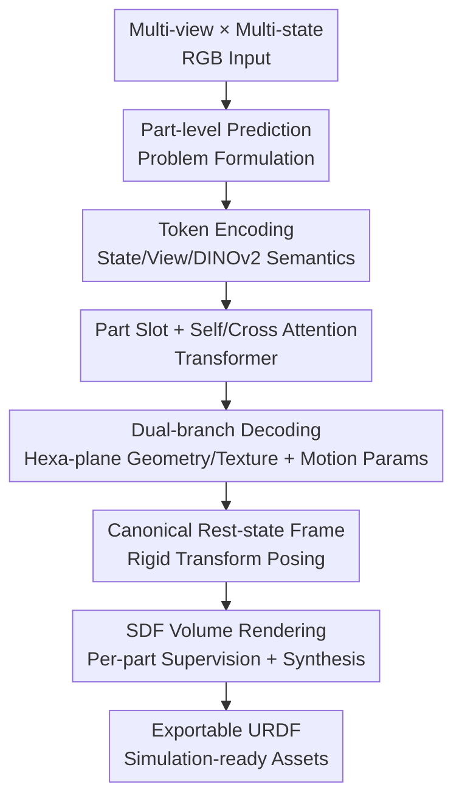

# ART: Articulated Reconstruction Transformer

**Conference**: CVPR 2026  
**Paper**: [CVF Open Access](https://openaccess.thecvf.com/content/CVPR2026/html/Li_ART_Articulated_Reconstruction_Transformer_CVPR_2026_paper.html)  
**Code**: [Project Page](https://kyleleey.github.io/ART/) (Open source code not yet available)  
**Area**: 3D Vision  
**Keywords**: Articulated Object Reconstruction, Feed-forward Transformer, Part-level Prediction, Kinematic Structure, Simulation Assets

## TL;DR
ART reformulates "articulated object reconstruction" as a **part-level feed-forward prediction** problem. Using a set of learnable part slots, it decodes geometry, texture, and explicit motion parameters (axis/pivot/motion type) for each rigid part from sparse multi-view, multi-state RGB images in a single pass. This category-agnostic approach eliminates per-object optimization and significantly outperforms both feed-forward and optimization-based baselines in part-level and global geometric metrics.

## Background & Motivation
**Background**: Creating digital twins of articulated objects (daily items with movable parts like chest of drawers, microwaves, and cabinets) is critical for VR/AR, robotics, and embodied AI. Reconstructing these from images requires the simultaneous recovery of **geometry + texture + underlying kinematic structure** (which parts move, around which axis, and whether they translate or rotate).

**Limitations of Prior Work**: Existing methods fall into two categories, neither of which suits the practical yet challenging "sparse input" setting. ① **Per-object optimization** (e.g., PARIS, DTA, ArtGS using inverse rendering/3DGS) offers high precision but requires approximately 100 dense views and depends on **fragile cross-state correspondence**. Each instance requires long optimization times and is sensitive to occlusion and initialization. ② **Feed-forward methods** (e.g., URDFormer, SINGAPO) provide fast inference, but their training data is limited to small sets like PartNet-Mobility, covering few categories and generalizing poorly to unseen objects.

**Key Challenge**: Achieving both speed (feed-forward) and category-agnostic generalization under sparse inputs. Feed-forward methods are limited by data scale, while optimization methods are hindered by dense view requirements and cross-state matching—making it difficult to balance speed, generalization, and robustness to sparsity.

**Goal**: To reconstruct complete articulated objects (geometry + texture + motion parameters) from **sparse multi-state RGB** inputs in a feed-forward, category-agnostic manner, producing outputs directly exportable to simulation formats like URDF.

**Key Insight / Core Idea**: The authors observe that **articulated objects are essentially assemblies of rigid parts, where motion defines their kinematic relationships**. Thus, reconstruction is reframed from "optimizing a global field per-pixel" to "**predicting part-by-part**." Drawing on the success of large-scale static reconstruction models (LRM), a Transformer routes image tokens to a set of learnable part slots, each decoding a unified representation for a specific part.

## Method

### Overall Architecture
ART is a category-agnostic feed-forward model. Inputs are a set of multi-view ($V$) × multi-state ($T$) images $I=\{I_{v,t}\}$ with known camera intrinsics and extrinsics. The object is normalized within a bounding sphere of radius $r$. The output consists of a unified representation for $P$ parts (including a static base). For each part $p$, the model predicts $X_p=\{\mathcal{T}_p,\mathcal{A}_p\}$, where $\mathcal{T}_p$ represents hexa-plane parameters for geometry/texture, and $\mathcal{A}_p=(B_p,C_p,D_p,O_p,S_p)$ are motion parameters.

The pipeline processes multi-view, multi-state image patches into tokens, appends three types of auxiliary information (state/view/semantics), and feeds them into a Transformer to interact with learnable part slots. After multiple attention layers, the slots pass through two MLP heads: one for decoding hexa-plane geometry and texture, and another for decoding motion structure vectors. SDF volume rendering is then used to place each part in its corresponding state according to predicted motion parameters for supervised image synthesis. All parts are predicted in a **shared canonical rest-state frame**. For a given motion configuration $q$, a rigid transformation $T_p(q;C_p,D_p,O_p)$ moves the part to its target pose.

### Key Designs

**1. Part-level Feed-forward Prediction + Part Slot: Decomposing reconstruction into "one slot per part"**

This is the core of ART, specifically addressing the issues of fragile correspondence in optimization and category-specific limitations in feed-forward methods. The network utilizes $P_0$ learnable part slot tokens; the first slot is fixed to the static base, while others model movable parts. During inference, the first $P$ slots are used based on the known part count (which can be estimated by off-the-shelf VLMs). Each slot aggregates information from image tokens via attention to decode a unified part representation. Reconstruction thus becomes a "set of parallel part predictions," naturally producing physically interpretable, URDF-compatible structured outputs rather than a global volume that requires subsequent decomposition.

**2. Canonical Rest-state: Eliminating identity ambiguity with a predefined rest state**

Parameterizing motion relative to the "first observed frame" introduces severe ambiguity: different sequences of the same object may start in different poses (e.g., one starting closed, another starting open). This leads to inconsistent part bounding boxes and geometric ground truths across sequences, effectively treating the same object as multiple different identities. ART employs a **predefined rest state** for each object instance (e.g., all drawers closed) as the canonical frame. All parts are predicted in this frame, ensuring consistent ground truth across sequences, which leads to more stable training and significantly faster convergence. Removing the rest-state causes PSNR to drop from 27.495 to 23.587 in ablation studies.

**3. Interleaved Self-Attention and Cross-Attention Transformer: Precise routing of visual information**

Multi-state, multi-part inputs generate significantly more tokens than single-object settings. ART uses two complementary layers: **Self-attention layers** concatenate image and part tokens for global attention, facilitating global context sharing across views/states/parts and maintaining inter-part consistency. **Cross-attention layers** use image tokens as queries and part tokens as keys/values to explicitly route visual information to the compact set of slots, reducing inter-part interference. Unlike most LRMs that use only self-attention, the authors replace approximately 75% of layers with cross-attention for two reasons: (1) token efficiency—cross-attention has a smaller effective window, saving computation; (2) convergence and precision—interleaved cross-attention encourages image and part tokens to specialize, accelerating convergence and improving final quality. Additionally, a **predefined part order** is enforced during data construction to prevent "slot collapse" (multiple slots predicting the same part).

**4. Per-part SDF Volume Rendering Supervision + Static Pre-training + Coarse-to-fine Curriculum**

Rendering utilizes SDF volume rendering to learn geometry and appearance simultaneously. A key detail is that **all rendering losses are calculated on per-part renderings rather than the final composite image**. Supervising only the composite image harms learning in occluded regions and distorts geometry/texture near part boundaries. The rendering head uses $L_2$ losses for RGB/mask plus LPIPS perceptual loss. Motion parameters are supervised via cross-entropy for motion type $C_p$ and MSE for $B_p, D_p, O_p, S_p$. Given the scarcity of articulated data, the authors introduce **static pre-training**: using 130,000 static 3D assets with part decompositions, the model learns strong priors for geometry, texture, and part decomposition. A **coarse-to-fine curriculum** is applied during fine-tuning, linearly increasing the SDF inverse standard deviation to sharpen surfaces and annealing rendering resolution from $128 \times 128$ to $256 \times 256$.

### Loss & Training
Total Loss = Rendering Objective + Direct Motion Parameter Supervision. Rendering: Per-part RGB/mask $L_2$ + RGB LPIPS. Motion: $L_{CE}$ for motion type, MSE for others. Training Phases: Static Pre-training (rendering loss + bounding box MSE) → Articulated Fine-tuning (coarse-to-fine curriculum: surface sharpening + resolution annealing $128 \to 256$). Two versions are trained: Multi-view ($V=4$) for comparison against optimization methods, and Monocular ($V=1$) for comparison against feed-forward methods, with $T=2$ (start & end states).

## Key Experimental Results

### Main Results

Comparison with **feed-forward baselines** on the StorageFurniture test set (631 objects, monocular, lower is better):

| Method | dgIoU ↓ | dcDist ↓ | CD ↓ |
|------|---------|----------|------|
| URDFormer | 1.0710 | 0.1622 | 0.0536 |
| SINGAPO | 0.8306 | 0.0947 | 0.0059 |
| **ART (Ours)** | **0.4717** | **0.0538** | **0.0019** |

Comparison with **optimization baselines** on the PartNet-Mobility test set (sparse 4-view × 2-state input):

| Method | PSNR ↑ | LPIPS ↓ | CD ↓ | F-Score ↑ |
|------|--------|---------|------|-----------|
| PARIS | 22.851 | 0.183 | 0.023 | 0.486 |
| DTA* (requires Depth) | 21.587 | 0.165 | **0.008** | **0.821** |
| ArtGS | 22.352 | 0.176 | 0.016 | 0.520 |
| **ART (Ours)** | **27.059** | **0.049** | 0.009 | 0.762 |

ART leads significantly in image-level metrics (PSNR/LPIPS). While DTA's geometric metrics are competitive due to its use of depth input, its low PSNR and high LPIPS reveal poor appearance recovery. Under sparse inputs, optimization methods fail to establish the dense cross-state correspondences they rely on, with ArtGS producing noisy geometry, whereas ART provides coherent high-fidelity meshes via learned priors.

### Ablation Study
On the PartNet-Mobility hold-out set (>130 sequences), with "w/o pre-train" (multi-view trained from scratch) as a reference:

| Configuration | PSNR ↑ | dgIoU ↓ | dcDist ↓ | Description |
|------|--------|---------|----------|------|
| ART (Full) | 28.678 | 0.629 | 0.062 | Full model |
| w/o pre-train | 27.495 | 0.665 | 0.082 | No static pre-training, metrics degrade |
| monocular view | 25.961 | 0.731 | 0.086 | Increased ambiguity in monocular mode |
| w/o rest-state | 23.587 | 0.878 | 0.113 | Initial frame reference causes identity issues |
| w/o part rendering loss | 24.465 | 0.681 | 0.075 | Only composite supervision fails on occlusion |
| w/o defined part order | 22.588 | 1.118 | 0.208 | Most significant drop; causes slot collapse |

### Key Findings
- **Part order** is the most critical factor: its removal causes the largest performance drop, confirming that without an enforced order, the network struggles with simultaneous reconstruction and matching, leading to slot collapse in objects with many similar parts.
- **Rest-state and per-part rendering losses** are essential: the former resolves cross-sequence identity ambiguity, while the latter handles occluded regions and boundary geometry.
- **Static pre-training** on large-scale 3D data provides priors that improve all metrics, indicating that part decomposition knowledge can transfer from static assets to articulated reconstruction.
- Multi-view significantly outperforms monocular input, aligning with the intuition that multi-view is needed to resolve ambiguity. The model recovers correct structures even on real images (with approximate poses and no background masks).

## Highlights & Insights
- **"Articulated Object = Assembly of Rigid Parts" formulation** is the pivot of the paper: reframing "global geometry + kinematics" as parallel part slots enables both feed-forward speed and category-agnostic generalization, yielding simulation-ready structured assets.
- **The insight regarding the canonical rest-state is clever**: while appearing to be a simple change of reference frame, it resolves the data-level ambiguity where different sequences of the same object are viewed as different identities—a trick applicable to any multi-sequence/multi-state learning task.
- **75% Cross-attention replacement** is a pragmatic engineering choice: in token-heavy multi-state/multi-part scenarios, cross-attention saves computation and forces specialization between image and part tokens.
- **Per-part rather than composite supervision** is a reusable trick for handling occlusions in any reconstruction task where an assembly consists of mutually occluding components.

## Limitations & Future Work
- The authors acknowledge that the **number of parts is assumed to be known** and the model depends on **pre-calibrated camera poses**. Future work includes pose-free self-calibration and integrating part-count estimation into the model.
- Limitations observed: The rest-state requires manual definition during data construction (e.g., "all drawers closed"), which may be difficult to define for more open categories. Training relies heavily on large-scale synthetic/procured part-level annotated assets, posing a high barrier to reproduction.
- Fixing $T=2$ (start & end) limit the coverage of complex, multi-degree-of-freedom motion sequences. The uniform resizing to 128 also caps the final geometric precision.

## Related Work & Insights
- **vs SINGAPO / URDFormer (Feed-forward)**: These predict kinematic graphs and then retrieve/assemble parts, often limited to specific categories. ART is purely feed-forward, directly predicting geometry/texture + explicit motion, utilizing more diverse data for category-agnostic performance.
- **vs PARIS / DTA / ArtGS (Optimization)**: These rely on dense multi-view inverse rendering and fragile cross-state matching, collapsing under sparse input. ART uses learned priors to provide coherent results with just 4 views and 2 states without test-time optimization.
- **vs LRM-based Static Reconstruction**: ART inherits the Transformer + differentiable rendering paradigm but extends the single-object output to part-level structured output with motion parameter prediction.

## Rating
- Novelty: ⭐⭐⭐⭐⭐ Reformulates articulated reconstruction as part-level feed-forward prediction with part slots and canonical rest-states; a clear paradigm shift for sparse-input generalization.
- Experimental Thoroughness: ⭐⭐⭐⭐ Covers both feed-forward/optimization baselines and multiple metrics with extensive ablations, though real-world evaluation remains mostly qualitative with small test sets.
- Writing Quality: ⭐⭐⭐⭐⭐ Clear logical flow from motivation to architecture to ablation; explains the "why" behind key designs.
- Value: ⭐⭐⭐⭐⭐ Directly produces simulation-ready formats, offering significant practical value for robotics and embodied AI asset generation.

<!-- RELATED:START -->

## Related Papers

- [\[CVPR 2026\] Mirror Illusion Art](mirror_illusion_art.md)
- [\[CVPR 2026\] Artiverse: A Diverse and Physically Grounded Dataset for Articulated Objects](artiverse_a_diverse_and_physically_grounded_dataset_for_articulated_objects.md)
- [\[CVPR 2026\] LitePT: Lighter Yet Stronger Point Transformer](litept_lighter_yet_stronger_point_transformer.md)
- [\[CVPR 2026\] Fast Spatial Tracking with Visual Geometry Transformer](fast_spatial_tracking_with_visual_geometry_transformer.md)
- [\[CVPR 2026\] FreeArtGS: Articulated Gaussian Splatting Under Free-Moving Scenario](freeartgs_articulated_gaussian_splatting_under_free-moving_scenario.md)

<!-- RELATED:END -->
