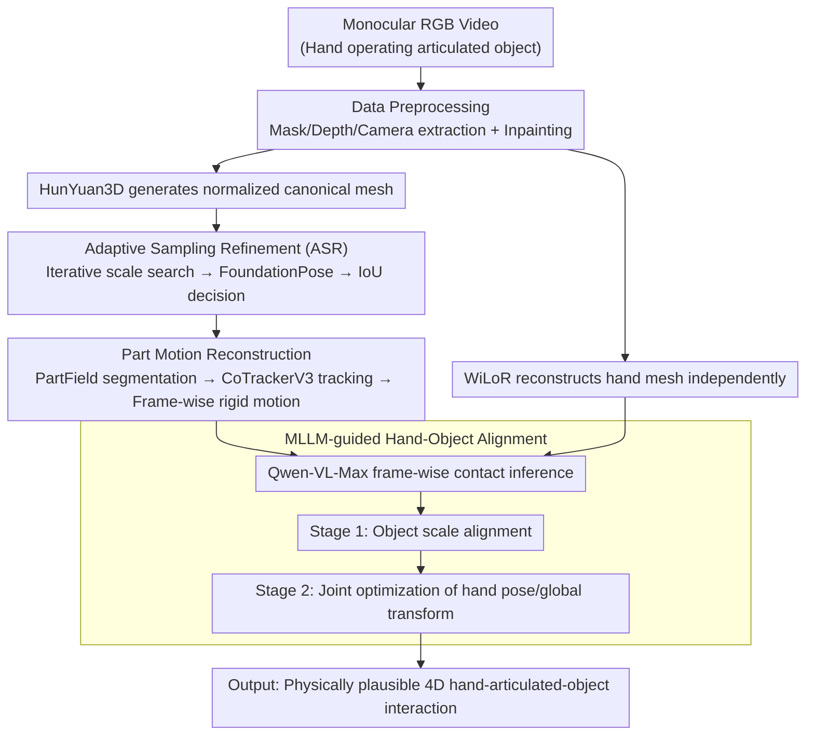

# ArtHOI: Taming Foundation Models for Monocular 4D Reconstruction of Hand-Articulated-Object Interactions

**Conference**: CVPR 2026  
**arXiv**: [2603.25791](https://arxiv.org/abs/2603.25791)  
**Code**: [https://arthoi-reconstruction.github.io](https://arthoi-reconstruction.github.io)  
**Area**: 3D Vision / Hand-Object Interaction Reconstruction  
**Keywords**: Hand-Object Interaction, Articulated Object, 4D Reconstruction, Foundation Models, MLLM

## TL;DR
ArtHOI introduces the first complete pipeline for reconstructing 4D interactions between hands and articulated objects (e.g., scissors, eyeglasses, laptops) from monocular RGB videos. By utilizing Adaptive Sampling Refinement (ASR) to optimize object metric scale and pose, alongside an MLLM-guided hand-object alignment method, it outperforms the RSRD baseline—which requires pre-scanned object geometry—across multiple datasets.

## Background & Motivation

**Background**: Hand-object interaction (HOI) reconstruction is essential for human behavior analysis, robotic manipulation, and augmented reality. Early methods relied on pre-defined object templates or category-specific knowledge, which limited generalization.

**Two Major Limitations of Prior Work**:
   - Template-free HOI methods, while improving generalization, are **almost exclusively applicable to rigid objects**.
   - 4D reconstruction methods for articulated objects typically require **pre-scanned objects** (to obtain canonical shapes) or **multi-view videos**, failing to handle natural scenes.

**Key Challenge**: Reconstructing hand-articulated-object interactions from monocular video is a highly ill-posed problem due to limited visual cues, frequent occlusions, and internal degrees of freedom (DoF) of objects.

**Key Insight**: Drawing inspiration from the human ability to "utilize accumulated knowledge and experience to perceive complex interactions," this work **leverages rich priors from multiple foundation models** (image-to-3D, pose estimation, depth estimation, tracking, MLLM, etc.) to address this ill-posed problem.

**Key Challenge**: Simple integration of multiple foundation models fails because: (1) meshes generated by image-to-3D models are in normalized coordinates and lack metric scale; (2) independently reconstructed hands and objects exhibit spatial misalignment.

## Method

### Overall Architecture

The goal of ArtHOI is to reconstruct the 4D interaction of hands and objects over time from a monocular RGB video (e.g., a hand operating scissors or eyeglasses) without relying on pre-scanned templates. Instead of training an end-to-end network from scratch, it assembles off-the-shelf foundation models (image-to-3D, pose estimation, depth, tracking, MLLM) as components and utilizes an optimization framework to align their imperfect predictions into a physically plausible result.

The pipeline consists of four stages. First, **data preprocessing**: foundational vision models extract object masks, depth maps, and camera parameters, and video inpainting is used to recover object parts occluded by hands. Next, **canonical mesh reconstruction**: HunYuan3D generates a 3D mesh in a normalized coordinate system from a single frame; since it lacks real scale, ASR (the first key design) is used to recover the metric scale and initial pose. Third, **part motion reconstruction**: the mesh is segmented into movable parts, and dense tracking is used to recover the frame-by-frame rigid motion of each part. Finally, **hand-object alignment**: the hand mesh is reconstructed independently, and an MLLM determines which hand and fingers are in contact with the object in each frame to guide a joint optimization that eliminates penetration or detachment.

### Key Designs

**1. Adaptive Sampling Refinement (ASR): Recovering the scale of normalized meshes**

Meshes output by image-to-3D models reside in a normalized coordinate system without real physical dimensions. Using them directly for pose estimation via FoundationPose leads to failure due to the discrepancy between mesh scale and depth maps. ASR treats "scale discovery" as a feedback-driven search process: an initial coarse scale is estimated via back-projected depth, followed by iterative sampling of candidate scales within an adaptive interval. For each scale, FoundationPose estimates the pose, the object is rendered into a silhouette, and the scale with the highest IoU against the real mask is selected. The "adaptive" mechanism doubles the sampling radius ($\delta \leftarrow 2\delta$) if IoU does not improve, allowing the search to jump out of local optima, while narrowing the search as it approaches the truth. This is more robust than one-time scale regression as it relies on a verifiable signal (silhouette matching) rather than blind trust in a single model.

**2. Part Motion Reconstruction: Animating articulated components**

Articulated objects are difficult because they are not single rigid bodies; components like scissor blades or eyeglass temples move relative to each other. ArtHOI segments the canonical mesh into semantic parts using PartField and tracks 2D trajectories of surface points using CoTrackerV3. These trajectories are lifted to 3D using depth to solve for frame-wise rigid motions for each part. The optimization objective is:

$$\mathcal{L}_{motion} = \mathcal{L}_{track} + \lambda_{smooth}\,\mathcal{L}_{smooth}$$

Where $\mathcal{L}_{track}$ ensures the projected motion matches CoTracker observations, and $\mathcal{L}_{smooth}$ uses discrete second-order differences of adjacent frames to penalize acceleration, ensuring temporal smoothness and reducing jitter.

**3. MLLM-guided Hand-Object Alignment: Language models as contact priors**

Hands and objects are reconstructed separately—hands via WiLoR and objects via the previous steps—resulting in inconsistent coordinate systems and scales, which often causes fingers to penetrate or float away from the object. To correct this, the system needs to know which fingers are in contact at which frames, which is difficult to derive from geometry alone. ArtHOI offloads this inference to an MLLM, using structured prompts to query Qwen-VL-Max. To mitigate typical MLLM errors, the system first identifies the perspective (egocentric vs. exocentric) and provides adjacent RGB frames with colorized depth maps for context. Alignment occurs in two stages: Stage 1 adjusts only the object scale $s_c^o$ using the hand's metric prior; Stage 2 fixes the scale and jointly optimizes hand pose $\theta_i^h$ and global transform $\mathbf{T}_i^h$. The contact loss pulls fingertips identified by the MLLM toward the nearest object surface points:

$$\mathcal{L}_{contact} = \sum_{i \in \mathbb{C}} \sum_{\mathbf{v}_t \in \mathbb{T}_i} \min_{\mathbf{v}_o \in \mathcal{G}_i^o} \|\mathbf{v}_o - \mathbf{v}_t\|_2$$

Where $\mathbb{C}$ is the set of contact frames/fingers, $\mathbb{T}_i$ are fingertip vertices, and $\mathcal{G}_i^o$ are corresponding candidate points on the object surface.

### Loss & Training
- Pure optimization framework; no neural network training required.
- Processing a single video takes approximately 1 hour (100 frames, 960×540) on an A6000 GPU.
- ASR: 20 iterations, initial range $\delta=0.03$.
- Motion optimization: 500 iterations per frame using Adam, with learning rate decaying from 0.02 to 0.002.
- HOI Alignment: 800 optimization steps.

## Key Experimental Results

### Main Results (ArtHOI-RGBD Dataset)

| Object | Method | CD(mm)↓ | MSSD(mm)↓ | F10↑ | F5↑ |
|------|------|---------|-----------|------|-----|
| Headphone | RSRD (Pre-scanned) | 14.71 | 41.06 | 41.67 | 20.91 |
| Headphone | **Ours** | **8.12** | **30.43** | **69.68** | **42.19** |
| CD Drive | RSRD (Pre-scanned) | 282.33 | 348.59 | 10.90 | 6.92 |
| CD Drive | **Ours** | **3.33** | **9.71** | **96.01** | **78.75** |
| Stapler | RSRD (Pre-scanned) | 288.70 | 363.92 | 0.80 | 0.34 |
| Stapler | **Ours** | **4.49** | **20.15** | **91.63** | **67.94** |

### Ablation Study

| Configuration | Description |
|------|------|
| w/o ASR | FoundationPose directly estimates scale and pose; unstable due to mesh/depth inconsistency. |
| w/o MLLM Alignment | Hand-object interaction exhibits penetration or detachment. |
| Full ArtHOI | Physically plausible 4D HOI reconstruction. |

### Key Findings
- ArtHOI **requires no pre-scanned objects** yet outperforms the pre-scan-dependent RSRD on most objects (e.g., reducing CD by 80× for the CD Drive).
- It remains competitive on the RSRD dataset, significantly leading in categories such as Scissors and Sunglasses.
- MLLM contact inference is accurate enough to guide optimization, though errors like left-right hand confusion still occur.

## Highlights & Insights
- **"Harmonizing Imperfect Priors" Paradigm**: While individual foundation model predictions may be flawed, the ASR and optimization framework coordinate them effectively.
- **MLLM as a Physical Prior Provider**: Using language models to infer contact states for constraining physical optimization is an innovative application of MLLMs in 3D reconstruction.
- **Dataset Contributions**: The introduction of ArtHOI-RGBD and ArtHOI-Wild provides new benchmarks for articulated object HOI evaluation.

## Limitations & Future Work
- Efficiency needs improvement, as processing a single video takes nearly an hour.
- The pipeline depends on a cascade of foundation models; errors in early stages can propagate.
- The accuracy of part motion reconstruction is sensitive to the quality of segmentation by PartField.
- MLLM contact inference still has errors (especially under heavy occlusion); learned methods could potentially replace it.

## Related Work & Insights
- RSRD is the primary competitor but requires pre-scanning; ArtHOI removes this requirement via foundation model priors.
- Compared to EasyHOI (frame-wise reconstruction), ArtHOI significantly improves results by leveraging temporal consistency.
- The "multi-foundation model synergy" paradigm can be extended to other complex scene understanding tasks.

## Rating
- Novelty: ⭐⭐⭐⭐⭐ First to achieve monocular articulated HOI 4D reconstruction; significant methodological contribution.
- Experimental Thoroughness: ⭐⭐⭐⭐ Evaluated on three datasets, though more detailed ablation on individual module contributions is desired.
- Writing Quality: ⭐⭐⭐⭐ Clear framework, despite the high complexity of the four-stage pipeline.
- Value: ⭐⭐⭐⭐⭐ Pioneering problem definition with direct value for robotics and AR.

<!-- RELATED:START -->

## Related Papers

- [\[CVPR 2026\] Clay-to-Stone: Phase-wise 3D Gaussian Splatting for Monocular Articulated Hand-Object Manipulation Modeling](clay-to-stone_phase-wise_3d_gaussian_splatting_for_monocular_articulated_hand-ob.md)
- [\[ICML 2026\] PhysHanDI: Physics-Based Reconstruction of Hand-Deformable Object Interactions](../../ICML2026/3d_vision/physhandi_physics-based_reconstruction_of_hand-deformable_object_interactions.md)
- [\[CVPR 2026\] ForeHOI: Feed-forward 3D Object Reconstruction from Daily Hand-Object Interaction Videos](forehoi_feed-forward_3d_object_reconstruction_from_daily_hand-object_interaction.md)
- [\[CVPR 2026\] ART: Articulated Reconstruction Transformer](art_articulated_reconstruction_transformer.md)
- [\[CVPR 2026\] LAM: Language Articulated Object Modelers](lam_language_articulated_object_modelers.md)

<!-- RELATED:END -->
