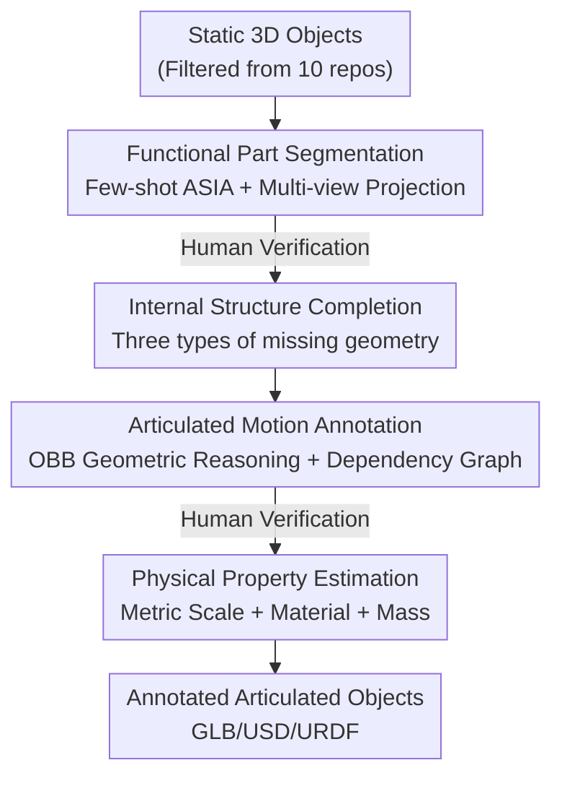

# Artiverse: A Diverse and Physically Grounded Dataset for Articulated Objects

**Conference**: CVPR 2026  
**Paper**: [CVF Open Access](https://openaccess.thecvf.com/content/CVPR2026/html/Iliash_Artiverse_A_Diverse_and_Physically_Grounded_Dataset_for_Articulated_Objects_CVPR_2026_paper.html)  
**Code**: Project Page https://3dlg-hcvc.github.io/artiverse/ (Data/Code to be released)  
**Area**: 3D Vision  
**Keywords**: Articulated objects, 3D dataset, Semi-automatic annotation, Physical properties, Kinematic modeling

## TL;DR
Artiverse employs a semi-automatic annotation pipeline—integrating few-shot segmentation, geometric reasoning, and multi-stage human verification—to filter 5,402 high-quality articulated objects (88 categories, 24,607 parts) from 10 static 3D repositories. It provides part-level annotations for functional semantics, articulated joints (including multi-DoF), and physical properties (material, mass, metric scale), reducing manual annotation time by over 30% while demonstrating significant value in part motion analysis, articulated object generation, and physical simulation tasks.

## Background & Motivation

**Background**: Researching "interactive functional 3D objects" (e.g., opening drawers, rotating doors, turning faucets) requires datasets that simultaneously capture three dimensions: functional part decomposition, kinematic relationships, and physical grounding (metric scale, mass, material, and realistic geometry/texture).

**Limitations of Prior Work**: Existing 3D resources are incomplete. Large-scale repositories like ShapeNet and Objaverse are geometrically diverse but primarily static. Articulated datasets such as PartNet-Mobility and AKB-48 provide part mobility but suffer from low joint complexity (mostly single-DoF), limited part structures/categories, simplified textures, and missing internal geometry. Physical properties are rarely annotated—only recently did ArtVIP provide physical digital twins for 206 objects, and PhysX-3D added physical properties to PartNet, though primarily for rigid bodies.

**Key Challenge**: It is difficult to achieve high scores in both "scale" and "functional completeness." Purely manual annotation (e.g., PartNet-Mobility) yields high quality but is hard to scale, requiring expertise in 3D geometry and kinematics to identify functional boundaries and define valid joints. Conversely, pure 2D VLM-based annotation (e.g., PhysX-3D) is cost-effective but lacks 3D geometric precision, making it unreliable for tasks like mesh-based part segmentation or joint axis determination.

**Goal**: To create a "large and comprehensive" articulated object dataset while addressing both annotation cost and the requirement for specialized expertise.

**Key Insight**: Instead of relying solely on manual labor or VLMs, this work designs a **human-in-the-loop semi-automatic pipeline**. Few-shot segmentation models and geometric heuristics generate initial proposals (segmentation, kinematic parameters, physical properties). Annotators then verify and correct results during critical segmentation and motion stages. By using automated results as "drafts" and humans as "editors," the dataset achieves high quality while scaling to thousands of objects.

## Method

### Overall Architecture
The output of Artiverse is a dataset, but its core technical contribution is a **semi-automatic annotation pipeline**. Each selected object undergoes preprocessing and then passes through four stages: ① Functional part segmentation, ② (Optional) Internal structure completion, ③ Articulated motion annotation, and ④ Physical property estimation. Human check-points are inserted at the end of the segmentation and motion stages to pass clean data downstream. A final global verification ensures the objects are ready for simulators. The design philosophy is "automatic proposals, human verification."

To ensure semantic consistency, the authors pre-define **category templates** for each object type (listing potential part labels, motion types, and dependencies). These templates are written by experts and guide both automated reasoning and manual verification.

### Key Designs

**1. Functional Part Segmentation: Projecting "Functional Boundaries" onto 3D Meshes**

The difficulty in part segmentation lies in functional boundaries being determined by behavior rather than visual similarity (e.g., a panel is a drawer front or a fixed backboard based on whether it moves). General-purpose 3D segmentors often fail to capture these nuances. The authors utilize ASIA, a SOTA few-shot model. By manually labeling a few representative shapes and rendering multi-view masks as training data, ASIA generates "function-aware" semantic masks.

The 2D segmentation is projected back to 3D in two steps: first, an **over-segmentation** is pre-calculated based on mesh topology; each segment then receives a "label vote" based on pixel coverage. Internal surfaces are labeled using distance propagation based on physical proximity. After semantic convergence, a **union-find** algorithm splits each semantic group into disjoint part instances based on local geometric continuity. Annotators then correct instances and labels in a 3D UI.

**2. Internal Structure Completion: Restoring "Hidden" Geometry**

Most static assets lack internal geometry, which is often where functionality resides (e.g., a fridge needs shelves). The authors handle three types of missing geometry: ① **Partially modeled components**—drawers with only front panels are extended along movement constraints; ② **Completely missing components**—items like dishwasher racks or microwave turntables are **referenced from similar objects** of the same category; ③ **Missing affordance structures**—storage furniture is often an empty shell, so dividers or racks are added procedurally based on the category template.

**3. Articulated Motion Annotation: Geometric Rules + Template-based Dependencies**

Initial proposals are generated using geometric rules: an **Oriented Bounding Box (OBB)** is calculated for each part, and contact points are sampled. Combined with collision analysis, the system infers **joint types, axes, and limits**. Kinematic dependencies (e.g., "press button to open door") are inferred from spatial connectivity and template options. During human verification, annotators use a web interface to visualize and adjust joints, allowing for **motion copying between similar parts** for efficiency.

**4. Physical Property Estimation: LLM Priors + Geometric Volume Calculation**

To support simulation, the authors annotate metric scales, materials, and mass. **Metric scales** are taken from source data or estimated by an LLM within reasonable ranges. **Part-level mass** is estimated as "approximate volume × density sampled from material ranges." An LLM assigns default materials to part labels. Volume estimation distinguishes between solid and hollow components: solid parts are calculated via tetrahedralization, while hollow parts are approximated by creating a shell via inward normal offsetting.

### Example: A Blender through the Pipeline
Using a handheld blender as an example: ① Segmentation separates the head, base, blade, switch, and trigger; ② Completion checks for missing internals; ③ Motion annotation assigns a `continuous` joint to the blade (axis `[0,0,1]`) and a `revolute` joint to the trigger, establishing a switch→blade functional dependency; ④ Physical properties assign "plastic" (density 1.20 g/cm³) to the jar, calculating a mass of 0.74 kg. The final export includes GLB/USD/URDF for immediate simulation.

## Key Experimental Results

### Data Statistics and Annotation Efficiency
Artiverse contains 5,402 articulated objects from 10 repositories, covering 20 super-classes, 61 main classes, and 88 sub-classes. It significantly exceeds prior datasets in scale and complexity:

| Dataset | #Objects | #Cats | Total Functional Parts | Total Articulated Parts | Total Joints | 2-DoF Joints |
|--------|-------|-------|------------|------------|---------|-----------|
| PartNet-Mobility | 2,346 | 46 | 14,100 | 11,753 | 11,753 | 0 |
| ArtVIP | 205 | 29 | 1,784 | 705 | 705 | 0 |
| **Artiverse** | **5,402** | **88** | **38,608** | **24,607** | **24,120** | **480** |

Regarding efficiency, the pipeline saves **32.0% of manual time in segmentation and 33.5% in motion annotation** compared to fully manual processes. Average human correction time dropped to 1.5 mins for segmentation and 1.3 mins for motion, with **50.12% of parts requiring no manual adjustment**.

### Downstream Task 1: Part Motion Analysis (Cross-dataset Generalization)
Using FPNGroupMot (from S2O) for cross-evaluation between Artiverse and PM (P/R/F1 are segmentation metrics; +M/+MA/+MAO represent F1 for motion type/axis/origin):

| Train Set | Test Set | P | R | F1 | +M | +MA | +MAO |
|--------|--------|------|------|------|------|------|------|
| PM | PM | 81.8 | 46.0 | 54.2 | 22.1 | 17.0 | 14.3 |
| Artiverse | PM | 82.2 | 47.9 | 55.8 | 22.4 | 15.9 | 8.7 |
| PM | Artiverse | 72.8 | 31.7 | 40.6 | 7.2 | 2.5 | 1.2 |
| Artiverse | Artiverse | 77.0 | 43.0 | 50.7 | 22.4 | 16.6 | 10.8 |

### Downstream Task 2: Image-Conditioned Articulated Object Generation
Comparing Articulate-Anything (AA, pure VLM) and SINGAPO (SG, retrained on Artiverse). Higher RS/AS-dgIoU and AOR are better; lower dcDist/AOR reflect reconstruction/collision quality:

| Test Set | Method | RS-dgIoU | AS-dgIoU | AOR↑ |
|--------|------|----------|----------|------|
| PM | SG | 0.756 | 0.768 | 0.022 |
| PM | AA | 1.172 | 1.179 | 0.024 |
| Artiverse | SG | 0.810 | 0.822 | 0.009 |
| Artiverse | AA | 1.250 | 1.258 | 0.042 |

### Key Findings
- **Training on Artiverse improves generalization**: Models trained on Artiverse show improved performance on the PM test set for both segmentation and motion metrics (e.g., F1 54.2→55.8).
- **Artiverse serves as a more challenging benchmark**: All methods show a significant drop on the Artiverse test set (+MAO drop from 14.3 to single digits), highlighting that complex geometry and motion dependencies are bottlenecks for current models.
- **VLM priors are insufficient for fine articulation**: Articulate-Anything consistently underperforms compared to structure-aware models like SINGAPO, indicating that without direct supervision, VLMs struggle with fine-grained articulation details.
- **Simulation-ready**: Assets are released in URDF/USD formats and can be directly loaded into the Genesis physics engine for policy training.

## Highlights & Insights
- **Practical Human-in-the-Loop Division**: The division of labor—automatic proposals for 80% of the work and human verification for the remainder—balances scale and quality. The fact that 50% of parts require zero human intervention validates the pipeline efficiency.
- **Robust 2D-to-3D Propagation**: The combination of few-shot segmentation, topological over-segmentation, and union-find provides a clear engineering path for functional part annotation on meshes.
- **LLM as Common-Sense Prior**: Using LLMs for scale and material density ranges rather than direct geometric labeling avoids VLM spatial inaccuracy while providing necessary physical "knowledge."
- **Multi-DoF and Dependency Complexity**: The inclusion of 480 2-DoF and coupled joints distinguishes this dataset from predecessors that rely almost exclusively on simple 1-DoF joints.

## Limitations & Future Work
- Current models still struggle with the complex articulations in Artiverse; unified reasoning for articulation behavior is needed.
- Reproducibility depends on the future release of the full asset library and annotation interface.
- The pipeline's quality ceiling is capped by the few-shot model (ASIA) and geometric heuristics. Template creation for new families still requires expert labor.
- Physical properties like density and mass are sampled from priors and geometric approximations, which may introduce errors for thin-walled or complex-shaped objects in high-precision mechanical simulations.

## Related Work & Insights
- **vs PartNet-Mobility**: PM is the most common dataset but lacks multi-DoF joints and physical properties. Artiverse doubles the categories (88 vs 46) and provides better texture and physical grounding.
- **vs ArtVIP**: ArtVIP provides high-quality digital twins but is limited in scale (205 vs 5,402).
- **vs PhysX-3D**: While PhysX-3D uses VLMs for rigid body properties, Artiverse demonstrates that 3D structural information is essential for accurate part segmentation and joint axis estimation.

## Rating
- Novelty: ⭐⭐⭐⭐ While not a new model, the "few-shot + geometric reasoning + human-in-the-loop" integration is a first for large-scale physically grounded articulation.
- Experimental Thoroughness: ⭐⭐⭐⭐ Comprehensive evaluation across four domains, including cross-dataset generalization.
- Writing Quality: ⭐⭐⭐⭐ Clear explanation of the four-stage pipeline and engineering details like tetrahedralization.
- Value: ⭐⭐⭐⭐⭐ Provides a massive, realistic resource for articulation understanding, generation, and embodied AI.

<!-- RELATED:START -->

## Related Papers

- [\[CVPR 2026\] ART: Articulated Reconstruction Transformer](art_articulated_reconstruction_transformer.md)
- [\[CVPR 2026\] GenMatter: Perceiving Physical Objects with Generative Matter Models](genmatter_perceiving_physical_objects_with_generative_matter_models.md)
- [\[CVPR 2026\] AssemblyBench: Physics-Aware Assembly of Complex Industrial Objects](assemblybench_physics-aware_assembly_of_complex_industrial_objects.md)
- [\[CVPR 2026\] FreeArtGS: Articulated Gaussian Splatting Under Free-Moving Scenario](freeartgs_articulated_gaussian_splatting_under_free-moving_scenario.md)
- [\[CVPR 2026\] AeroDGS: Physically Consistent Dynamic Gaussian Splatting for Single-Sequence Aerial 4D Reconstruction](aerodgs_physically_consistent_dynamic_gaussian_splatting_for_single-sequence_aer.md)

<!-- RELATED:END -->
