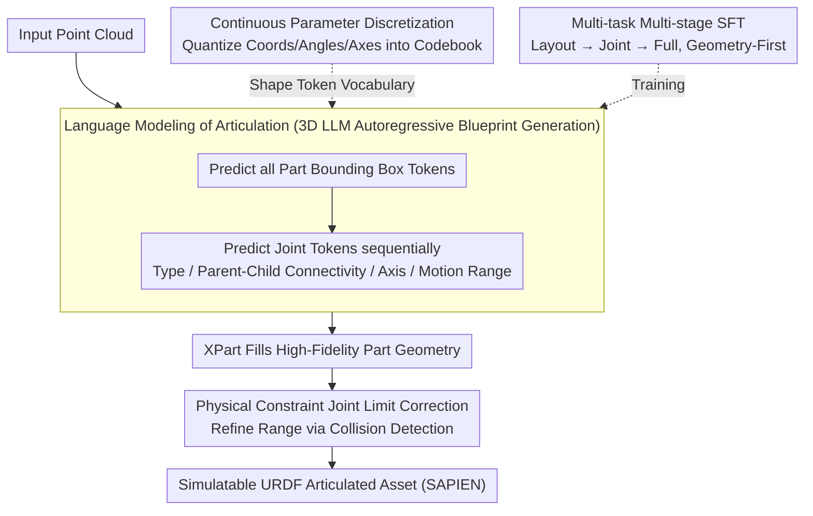

# ArtLLM: Generating Articulated Assets via 3D LLM

**Conference**: CVPR 2026  
**arXiv**: [2603.01142](https://arxiv.org/abs/2603.01142)  
**Code**: [https://authoritywang.github.io/artllm](https://authoritywang.github.io/artllm)  
**Area**: 3D Vision / Articulated Object Generation  
**Keywords**: Articulated Object, 3D LLM, URDF, Autoregressive, Part-Aware Generation

## TL;DR
ArtLLM models articulated object generation as a language generation problem. It uses a 3D multi-modal LLM to autoregressively predict part layouts and kinematic joint parameters (quantized as tokens) from point clouds. Combined with XPart for high-fidelity part geometry synthesis, it significantly outperforms existing methods on the PartNet-Mobility dataset (mIoU 0.69, inference in only 19 seconds).

## Background & Motivation

**Background**: Interactive digital environments (games, robotics, simulation) rely on articulated 3D objects, whose functionality derives from part geometry and kinematic structures. Existing methods face fundamental limitations.

**Limitations of Prior Work**:
   - **Optimization-based Reconstruction** (PARIS, VideoArtGS, ArtGS): Requires slow per-object joint fitting and typically handles only simple objects with single joints.
   - **Retrieval-based Assembly** (SINGAPO, CAGE, URDFormer): Assembles objects from fixed part libraries, leading to high geometric redundancy and poor generalization.

**Gap in 3D Generation**: General 3D generation models (Trellis, Hunyuan3D) can generate high-quality geometry, and part-level generation (XPart, OmniPart) has made progress. However, these models **lack understanding of kinematic structures**—generated parts do not know how to move, causing a disconnect between geometry and motion.

**Key Insight**: A **unified solution for understanding geometry and articulation** is needed. LLMs are naturally suited for processing variable-length structured sequences. By leveraging the sequence modeling and reasoning capabilities of 3D LLMs, one can autoregressively predict articulation blueprints.

**Core Idea**: Discretize URDF articulation structures into token sequences. Train a 3D LLM to autoregressively generate a unified blueprint of "part layout + kinematic joints" from point clouds, which then drives a part generation model to synthesize geometry.

## Method

### Overall Architecture
ArtLLM addresses the following: given a static point cloud, how to simultaneously "segment it into movable parts" and "label how each part moves," finally restoring it as an articulated asset compatible with simulators. The approach translates this geometric task entirely into a sequence generation problem. First, a 3D multi-modal LLM processes the point cloud and autoregressively generates a sequence of tokens describing the bounding boxes of each part and their kinematic joints; this serves as the "kinematic blueprint." The bounding boxes are then passed to XPart to fill in high-fidelity part meshes. Finally, a physical post-processing step uses collision detection to tighten the motion range of each joint, preventing self-penetration. These three steps transform a point cloud into a simulatable URDF asset in SAPIEN.

### Key Designs

**1. Language Modeling of Articulated Structures: Transforming URDF Blueprints into Generatable "Sentences"**

The difficulty of articulated objects lies in them being both geometric (part appearance) and structural (connectivity and motion). ArtLLM observes that URDF is a structured, variable-length description that fits the sequence modeling strengths of LLMs. Each part is parameterized as an Axis-Aligned Bounding Box $\text{BBox}(x_{min}, y_{min}, z_{min}, x_{max}, y_{max}, z_{max})$, and each joint is expanded into type, parent-child connectivity, axis direction, axis position, and motion range, covering Revolute, Continuous, Prismatic, and Screw joints. The generation follows a fixed order: all part bounding boxes are predicted first, followed by joint definitions. This "skeleton-first, joint-later" approach ensures that motion reasoning is built upon a determined part layout.

**2. Continuous Parameter Discretization: Enabling LLMs to Report Precise Coordinates**

While the blueprint is a sequence, bounding box coordinates and rotation angles are continuous values. LLMs perform classification over discrete vocabularies; direct regression of continuous values is numerically unstable. ArtLLM quantizes physical quantities into different-granularity bins based on their ranges: BBox coordinates in $[-1,1]$ use 128 bins, joint origins use 128 bins, rotation angles in $[-2\pi, 2\pi]$ use 48 bins, and translation distances use 64 bins. For joint axis directions, a 128-entry codebook is constructed by uniformly sampling axis-aligned directions on XY/YZ/XZ planes and supplementing others via FPS on a Fibonacci sphere. This hierarchical codebook provides dense coverage for common axis-aligned directions in real objects without losing the flexibility for oblique joints. Removing discretization drops IoU from 0.473 to 0.352, marking it the most influential design choice.

**3. Multi-task Multi-stage SFT: Decoupling Geometric Understanding and Motion Reasoning**

Learning "Point Cloud → Full Blueprint" end-to-end is difficult for small models. ArtLLM splits training into three tasks—part layout prediction, joint prediction (given layout), and end-to-end full prediction—across two stages. Stage 1 focuses on part layout prediction, initializing the point cloud encoder with P3SAM pre-trained weights to establish part-level geometric understanding. Stage 2 involves joint SFT across all three tasks (mixed 3:2:5) to learn motion reasoning on top of geometry. This geometry-first arrangement provides a reliable foundation for motion reasoning.

**4. Physical Constraint Joint Limit Correction: Restoring Motion Common Sense via Collision Detection**

LLMs predict in a single step and may output motion ranges that are physically impossible (e.g., parts rotating into each other). A post-processing step is introduced: for revolute joints, sub-parts are articulated through the predicted range, calculating collision volumes with other static parts at each angle. When the derivative of the collision volume spikes, it indicates the onset of penetration. Hierarchical search locates this precise angle to set as the refined joint limit. This ensures sub-parts do not self-collide. As an offline post-process, it does not slow down inference.

### Loss & Training
- Standard Cross-Entropy loss for SFT.
- Multi-task data mixture ratio of 3:2:5.
- Cosine learning rate schedule, max 1e-5, warmup 0.03.
- Data augmentation: 75% probability of random scaling ($s \in [0.8, 1.05]$) and rotation (90°/180°/270°).
- Stage 1: 8×H20 GPUs, 50 epochs (~8h); Stage 2: 8×H20 GPUs, 30 epochs (~15h).
- 3D Encoder: Point Transformer v3; LLM Backbone: Qwen3 0.6B.

## Key Experimental Results

### Main Results (PartNet-Mobility, 7 categories, 77 objects)

| Method | mIoU↑ | CD↓ | Type Acc↑ | Joint-Axis-Err↓ | Joint-Pivot-Err↓ | Range-IoU↑ | Graph Acc↑ | Time(s) |
|------|-------|-----|-----------|-----------------|-------------------|------------|------------|---------|
| URDFormer | 0.123 | 0.249 | 0.607 | 0.738 | 0.610 | 0.703 | 0.079 | 183 |
| SINGAPO | 0.433 | 0.044 | 0.765 | 0.245 | 0.257 | 0.526 | 0.456 | 84 |
| ArtAny | 0.338 | 0.072 | 0.846 | 0.453 | 0.536 | **0.865** | 0.614 | 522 |
| **Ours** | **0.688** | **0.028** | **0.908** | **0.127** | **0.080** | 0.740 | **0.774** | **19** |

### Ablation Study

| Configuration | IoU | Type Acc | Axis Err | Pivot Err | Range IoU | Graph Acc |
|------|-----|----------|----------|-----------|-----------|-----------|
| Full | **0.473** | **0.898** | **0.141** | **0.135** | **0.582** | **0.780** |
| A: W/O Discretization | 0.352 | 0.823 | 0.277 | 0.235 | 0.575 | 0.775 |
| B: W/O Multi-task | 0.464 | 0.825 | 0.289 | 0.131 | 0.510 | 0.737 |
| C: W/O Data Aug | 0.412 | 0.894 | 0.142 | 0.138 | 0.577 | 0.754 |
| D: W/O Multi-stage | 0.463 | 0.890 | 0.143 | 0.175 | 0.511 | 0.780 |

### Key Findings
- ArtLLM is an order of magnitude faster in inference (19s vs 84-522s), making it suitable for large-scale simulation.
- Discretization (A) has the most significant impact on coordinates and axis-related attributes (IoU 0.352 vs 0.473).
- Multi-task learning (B) improves all metrics except axis direction, showing that co-training tasks of different difficulty levels is complementary.
- Physical constraint correction effectively eliminates self-collisions without impacting inference speed.
- Real2Sim application: Reconstructed articulated assets successfully replicate real robotic manipulation behaviors in SAPIEN.

## Highlights & Insights
- **Articulation = Language**: Naturally maps URDF kinematic structures to token sequences, fully exploiting the sequence modeling advantages of LLMs.
- **Meticulous Discretization**: Hierarchical codebooks for joint axes and specific quantization for different physical quantities reflect a deep understanding of the problem structure.
- **Multi-task Multi-stage Training**: Simple yet effective decoupling of geometric understanding and kinematic reasoning.
- **End-to-End Practicality**: Offers a complete pipeline from image/text to simulatable articulated assets.

## Limitations & Future Work
- Training data is limited to 43 categories; generalization to complex categories like vehicles or robots remains insufficient.
- Physical attributes (mass, friction, etc.) are not yet modeled.
- Joint limit correction is a post-processing step; ideally, collision awareness should be integrated into the generation process.
- Dependency on XPart for part generation means geometry may be truncated if BBox prediction is inaccurate.

## Related Work & Insights
- SINGAPO and URDFormer are direct competitors relying on fixed part libraries; ArtLLM removes this constraint through generation.
- Shares architectural similarities with SpatialLM (3D LLM Encoder-Projector).
- The discretization + autoregression approach can be generalized to other structured 3D prediction tasks such as scene graph generation or assembly planning.

## Rating
- Novelty: ⭐⭐⭐⭐⭐ First to use 3D LLM for end-to-end multi-joint articulated asset generation; a paradigm innovation.
- Experimental Thoroughness: ⭐⭐⭐⭐ Sufficient quantitative comparisons and comprehensive ablations, including Real2Sim validation.
- Writing Quality: ⭐⭐⭐⭐ Clear structure and detailed description of discretization designs.
- Value: ⭐⭐⭐⭐⭐ Significant and direct application value for robot learning and simulation.

<!-- RELATED:START -->

## Related Papers

- [\[CVPR 2026\] PhysX-Anything: Simulation-Ready Physical 3D Assets from Single Image](physx-anything_simulation-ready_physical_3d_assets_from_single_image.md)
- [\[CVPR 2026\] LAM: Language Articulated Object Modelers](lam_language_articulated_object_modelers.md)
- [\[CVPR 2026\] ART: Articulated Reconstruction Transformer](art_articulated_reconstruction_transformer.md)
- [\[CVPR 2026\] Real2Edit2Real: Generating Robotic Demonstrations via a 3D Control Interface](real2edit2real_generating_robotic_demonstrations_via_a_3d_control_interface.md)
- [\[CVPR 2026\] 3D-VCD: Hallucination Mitigation in 3D-LLM Embodied Agents through Visual Contrastive Decoding](3d-vcd_hallucination_mitigation_in_3d-llm_embodied_agents_through_visual_contras.md)

<!-- RELATED:END -->
