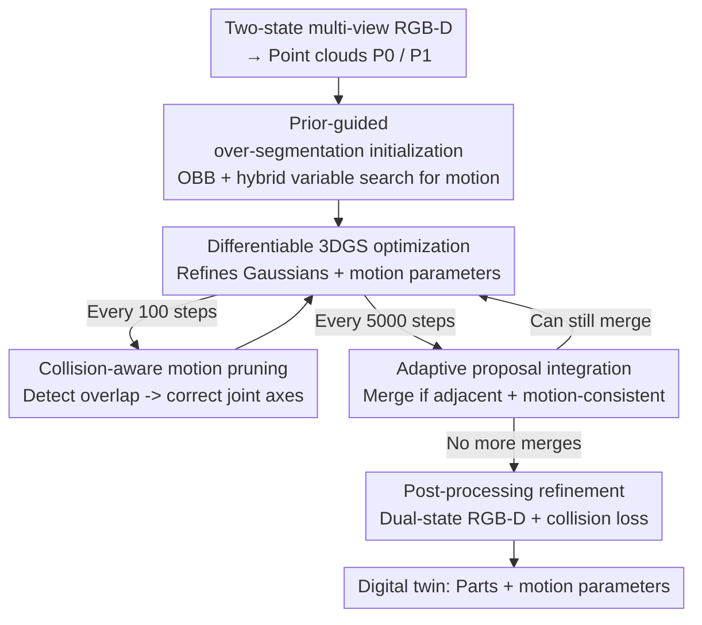

# ArtPro: Self-Supervised Articulated Object Reconstruction with Adaptive Integration of Mobility Proposals

**Conference**: CVPR 2026  
**Paper**: [CVF Open Access](https://openaccess.thecvf.com/content/CVPR2026/html/Li_ArtPro_Self-Supervised_Articulated_Object_Reconstruction_with_Adaptive_Integration_of_Mobility_CVPR_2026_paper.html)  
**Code**: None  
**Area**: 3D Vision  
**Keywords**: Articulated Object Reconstruction, 3D Gaussian Splatting, Digital Twins, Motion Estimation, Self-Supervised Optimization

## TL;DR
ArtPro replaces the fragile "one-time part segmentation guessing" with an "over-segmentation $\rightarrow$ adaptive merging during optimization" propose-verify-merge pipeline. Within a self-supervised 3DGS reconstruction framework, it merges adjacent parts based on motion consistency and corrects motion parameters via collision-aware pruning, stably reconstructing digital twins with integrated geometry, appearance, and kinematic structures for complex multi-part articulated objects.

## Background & Motivation
**Background**: Reconstructing articulated objects (such as cabinets, scissors, and laptops) into high-fidelity "digital twins"—retaining not only part geometry and appearance but also kinematic parameters such as joint axes, pivots, and joint angles—is a cornerstone of robotic manipulation and interactive simulation. Current mainstream approaches follow two paths: (1) Feed-forward reconstruction, which directly predicts articulated structures from images or text using data priors from diffusion models or VLMs. This is fast but only yields coarse abstractions like bounding boxes or primitive shapes, failing on out-of-distribution categories. (2) Per-instance optimization, which directly fits models to a single object using NeRF or 3D Gaussian Splatting (3DGS), offering high fidelity.

**Limitations of Prior Work**: Per-instance optimization (represented by works like ArtGS) suffers from a fatal flaw—**extreme sensitivity to the initial segmentation of movable parts**. An incorrect initial segmentation derived from heuristic clustering can still yield low rendering loss, causing the optimization to converge stably to an incorrect kinematic structure (local minimum). The more parts there are and the closer they are, the deeper this trap becomes.

**Key Challenge**: Segmentation and motion are coupled: parts are required to estimate motion, yet motion consistency is needed to determine if the segmentation is correct. Treating segmentation as a "fixed starting point prior to optimization" locks this chicken-and-egg problem in the first step with a wrong answer, which cannot be corrected by rendering loss optimization afterwards.

**Goal**: ① Provide a robust initialization for complex multi-part settings without relying on precise initial segmentation; ② allow segmentation to be continuously corrected during the optimization process; ③ prevent local minima caused by mutual interference in adjacent parts' motion estimation.

**Key Insight**: Instead of betting on the correctness of a single initial segmentation, it is better to **deliberately over-segment first** (splitting a single part into multiple segments is acceptable) and then merge pieces belonging to the same part during optimization based on motion consistency. Segmentation changes from a "fixed starting point" to a "dynamic process."

**Core Idea**: Replace the "guessing segmentation at once" paradigm with a "propose-verify-merge" pipeline using "over-segmentation + adaptive merging," continuously refining part partition and motion alongside reconstruction during 3DGS optimization.

## Method

### Overall Architecture
The input to ArtPro is multi-view RGB-D images of an articulated object in two motion states (start `t=0` and end `t=1`). The output consists of segmented static/movable parts and their motion parameters (translation for prismatic joints, 6DoF rotation + pivot for revolute joints), which can drive continuous motion simulation. The pipeline consists of three steps: (1) Over-segmenting joint point clouds from both states and initializing motion hypotheses to obtain "rather more than less" mobility proposals; (2) entering an adaptive optimization loop to iteratively refine Gaussians under differentiable 3DGS rendering, periodically performing "motion pruning" to correct errors and "proposal integration" to merge homologous parts until no further merging can occur; (3) executing a final post-processing refinement to stabilize appearance, geometry, and motion.

Parts are represented by 3DGS with an associated "part assignment probability field." For a Gaussian centered at $x_i$, define its probability of belonging to the static part as $P_s(x_i)$ and to the $m$-th movable part as $P_m(x_i)$. The conditional assignment probability is:

$$\hat{P}_m(x_i) = \big(1 - P_s(x_i)\big)\frac{P_m(x_i)}{\sum_{k=1}^{M} P_k(x_i)}, \quad G_m = \{\, g_i \in G \mid \hat{P}_m(x_i) > \epsilon \,\}$$

where $\epsilon=0.01$. Each part carries its own rigid body transformation, applying the motion of the $m$-th part to its Gaussians: $\hat{x}_i = R_m(x_i - c_m) + c_m + t_m$, $\hat{q}_i = R_m \otimes q_i$ (where $R_m$ is rotation, $c_m$ is pivot, and $t_m$ is translation). Rendering opacity is modulated by assignment probabilities (movable $\hat{\alpha}_i = \hat{P}_m(x_i)\alpha_i$, static $\hat{\alpha}_i = P_s(x_i)\alpha_i$), enabling self-supervised joint optimization of part division and motion using multi-view RGB-D.

### Key Designs

**1. Prior-guided over-segmentation initialization: replacing fragile one-time segmentation with "rather more than less"**

Since the failure point of per-instance optimization lies in incorrect initial segmentation causing local minima, ArtPro avoids pursuing a perfect initial partition and instead **over-segments** the object into more mobility proposals than the true number of parts. Specifically, reconstructing point clouds $\{P_0, P_1\}$ from the two-state depth maps, the movable point set $\hat{P}_0$ is identified by selecting points whose nearest-neighbor distance to $P_1$ exceeds a threshold $\tau$. Farthest point sampling (FPS) is applied on $\hat{P}_0$ to select $n$ seeds, and a pre-trained segmentation model's point-wise features are used to grow $n$ over-segmented patches around these seeds. Patches with >80% overlap are merged, resulting in $M$ mobility proposals (note that $M$ does not need to equal the ground-truth number of parts). The motion of each proposal is determined based on the heuristic that "joint axes are typically perpendicular to part surfaces or aligned along edges." Combining the three principal axes $\{X_m, Y_m, Z_m\}$ of each part's oriented bounding box (OBB), a **hybrid variable optimization** is solved to determine the discrete axis choice, rotation angle $\phi$, and translation distance $d$ simultaneously:

$$\arg\min_{\hat{a},\phi,d}\ \mathrm{CD}\big(R_m(\hat{a},\phi)(\hat{P}_m - c) + c + d\cdot\hat{a} \to P_1\big)$$

The single-directional Chamfer Distance (CD) is used to align the transformed movable parts to the target point cloud $P_1$ (subject to constraints $d\in[-0.5,0.5]$ m and $\phi\in[-80^\circ,80^\circ]$). Once resolved, the motion parameters are initialized to an "intermediate state" ($R_m\leftarrow R_m(\hat{a},\phi/2)$, $t_m\leftarrow (d/2)\hat{a}$), representing half the transformation magnitude to ease the initial shock of optimization. This step provides a robust initialization even when the segmentation is inaccurate.

**2. Adaptive proposal integration: merging decided by "swapping motion parameters to test rendering stability"**

Over-segmentation leaves multiple fragments belonging to the same component, which must be merged back during optimization. ArtPro performs proposal integration every 5000 steps. Under this scheme, two proposals are merged if they satisfy both **spatial adjacency** and **motion consistency**. Spatial adjacency is determined by performing k-nearest neighbors ($k=8$) on the union of all movable Gaussian centers: if any point in $G_i$ has neighbors in $G_j$, they are considered adjacent. Motion consistency is defined on the rendered depth maps—the score for a set of motion parameters $T$ is the L1 depth rendering error summed over all training views of the end state:

$$S(T) = \sum_{D_v} \big| D_v(T(G)) - D_v \big|$$

For an adjacent pair $(G_i, G_j)$, their individual current motion scores are computed. Then, the motion of $i$ is **swapped** with the motion of $j$ ($T^{(j\to i)}$), and the score is re-evaluated. If the score change is below a threshold $\tau_{merge}=10^{-3}$, it indicates that using the partner's motion yields similarly correct rendering, signifying equivalent motion. Thus, they belong to the same part and are merged (when a part has multiple mergeable neighbors, the one with the smallest score variation is selected). This verification "by swapping motion parameters online and evaluating rendering stability" is far more robust to optimization fluctuations than directly comparing joint axis values. During merging, the OBB and probability fields are reset using the union of Gaussian centers, and $G_j$'s motion is adopted.

**3. Collision-aware motion pruning: correcting joint axes using "interpenetration" signals between adjacent parts**

Estimating motion for adjacent parts can easily lead to mutual interference, dragging the optimization into local minima. ArtPro checks for **collisions** every 100 steps: for parts $i,j$, the OBB overlap volumes $v^0_{i,j}, v^1_{i,j}$ are calculated at both start and end states. If the overlap increases after transformation ($\Delta v_{i,j} = v^1_{i,j} - v^0_{i,j} > \tau_v$, $\tau_v=10^{-4}$), a collision is detected, as physical motions should not cause interpenetration. The collision axis $a_{col}$ is chosen as the OBB principal axis with the largest projection of the relative translation vector. Adjustments are then made based on joint type: for prismatic joints, the translation component along the collision axis is projected out: $t_m \leftarrow t_m - (t_m\cdot a_{col})a_{col}$. For revolute joints, proposals with negligible rotations ($<5^\circ$) are suppressed, resetting their axes to match the nearest OBB edge and halving the rotation angle to prevent interference. Additionally, after 4,000 steps, a **hard joint-type constraint** is enforced (fixing $t_m=0$ for revolute joints and $R_m=I$ for prismatic joints). This active pruning mechanism treats interpenetration as an observable signal of invalid motion, continuously pulling skewed parameters back to a physically plausible range.

### Loss & Training
The objective function during the Gaussian refinement stage is:

$$L = L_I + \lambda_{cd}L_{cd} + \lambda_{pc}L_{pc} + \lambda_{ls}L_{ls} + \lambda_{reg}L_{reg}$$

where $L_I$ is the end-state RGB-D image loss, and $L_{cd}$ is the single-directional Chamfer Distance loss (both ensuring fidelity and supporting spatial relations for merging). $L_{pc}$ is the part contrastive loss that suppresses non-maximal assignment probabilities, forcing each Gaussian to a single dominant part. $L_{ls}$ keeps the static probability field smooth across adjacent Gaussians, and $L_{reg}$ regularizes part probabilities to Gaussian distributions for compactness. During post-processing refinement, a dual-state RGB-D loss along with a collision loss $L_{col}$ is utilized: $L = L_I(G) + L_I(T(G)) + \lambda_c L_{col}$, ensuring no interpenetration between movable and static parts. More details on the loss terms are presented in the supplementary material.

## Key Experimental Results

### Main Results
On a self-built dataset (containing 8 multi-part objects with 3–11 parts from PartNet-Mobility) and the ArtGS-Multi dataset, the method is compared against PARIS, ArticulatedGS, DTA, and ArtGS. All metrics are lower-the-better: mesh reconstruction is evaluated by overall/static/movable Chamfer Distance (CD-w / CD-s / CD-m); kinematics are evaluated by Axis Angle error (Axis Ang.), Axis Position error (Axis Pos.), and Part Motion error (Part Motion).

Self-built dataset (All column, 'F' indicates joint type or part count prediction failure):

| Metric | DTA | ArtGS | ArtPro(Ours) |
|------|-----|-------|--------------|
| Axis Ang. | 22.42 | 8.70 (F) | **0.07** |
| Axis Pos. | 4.96 | 0.32 (F) | **0.00** |
| Part Motion | 13.07 | 9.50 (F) | **0.04** |
| CD-s | 3.59 | 2.64 | **0.84** |
| CD-m | 38.17 (F) | 345.31 | **3.86** |
| CD-w | 1.11 | 2.02 | **0.65** |

ArtGS-Multi dataset (All column):

| Metric | DTA | ArtGS | ArtPro(Ours) |
|------|-----|-------|--------------|
| Axis Ang. | 26.61 | 0.28 | **0.05** |
| Axis Pos. | 3.37 | 0.01 | **0.00** |
| Part Motion | 23.43 | 0.18 | **0.05** |
| CD-s | 1.94 | 0.89 | **0.30** |
| CD-m | 283.49 | 2.14 | **0.89** |
| CD-w | 0.83 | 0.90 | **0.29** |

The most striking metric is CD-m (movable part reconstruction): ArtGS spikes to 345.31 on the self-built dataset, and even reaches 1316 on a single object (Storage-40417), showing that once segmentation/motion is misestimated, the geometry of movable parts collapses completely. ArtPro reduces this to 3.86 with no Fail (F) marks (no incorrect joint type or part count predictions). While 3DGS methods perform similarly on simple two-part objects, the gap widens significantly on **multi-part, adjacent-part** scenarios. Validation on real-world objects was also performed by capturing 200 RGB images (100 per state), using Depth-Anything-V2 for depth estimation and SAM2 for mask extraction to obtain dual-state RGBD inputs, achieving stable reconstruction.

### Ablation Study
Adding each component in turn (over CD-m is the merged movable CD that is comparable across any part count):

| Configuration | OverSeg | MoI | Merge | Prune | CD-s | CD-m | CD-w |
|------|:--:|:--:|:--:|:--:|------|------|------|
| #1 Vanilla (DBSCAN + GT part count) | | | | | 1.46 | 9.27 | 0.93 |
| #2 + Motion Init (GT part count) | | ✓ | | | 1.04 | 6.97 | 0.67 |
| #3 + Over-segmentation init (w/o part count) | ✓ | ✓ | | | 0.87 | 5.01 | 0.71 |
| #4 + Adaptive integration | ✓ | ✓ | ✓ | | 0.85 | 4.57 | 0.67 |
| Full + Collision pruning | ✓ | ✓ | ✓ | ✓ | **0.84** | **3.63** | **0.65** |

### Key Findings
- **Motion Initialization (MoI) alone cuts CD-m from 9.27 to 6.97**: Compared to naive DBSCAN + identity transformation, motion initialization based on OBB + hybrid variable search provides a reliable starting point for optimization, yielding the largest single-point improvement.
- **Over-segmentation (OverSeg) frees the method from the strong assumption of "knowing the ground-truth part count"**: Moving from #2 to #3, the CD-m still drops to 5.01 without knowing the ground-truth part count, proving that the "rather more than less + optimize-to-merge" scheme can autonomously discover the part count.
- **Collision pruning (Prune) specifically targets adjacent parts**: #4 to Full further reduces CD-m from 4.57 to 3.63. Visualizations in the paper indicate that for tightly adjacent parts like the three middle drawers of a cabinet, motion is misestimated without collision constraints—making pruning the vital safeguard for stabilizing multiple adjacent parts.
- Even if two sub-parts that belong to the same logical part are physically disconnected (e.g., the slider and blade of Blade-103706 are not merged), adaptive integration can still estimate correct motion for both individually, indicating that the merge criterion evaluates motion equivalence rather than strong physical connectivity.

## Highlights & Insights
- **Reframing segmentation from a "starting point" to a "dynamic process"**: The propose-verify-merge scheme bypasses the fragility of guessing the segmentation in one go. Its core lies in acknowledging that initial segmentations are fundamentally imperfect and designing a self-correcting optimization loop to address this—fundamentally rewriting the paradigm of per-instance articulated reconstruction.
- **"Swapping motion parameters to test rendering stability" is a clever merge criterion**: Instead of directly comparing noisy and hard-to-threshold joint axis/angle values, checking if rendering remains stable after swapping $i$'s motion with $j$'s motion equivalently asks "do they move identically?"—reversing downstream differentiable rendering consistency to infer upstream segmentation, making it robust to fluctuations without requiring extra annotations.
- **Using "interpenetration" as an error signal**: Collision-aware pruning treats physical anomalies (growing OBB overlap) as an observable proxy for motion errors. This "physical violation $\rightarrow$ triggered correction" paradigm can easily be transferred to any joint optimization with rigid constraints (e.g., hand-object interaction, multi-body assembly).
- **Fully self-supervised and independent of ground-truth part count**: Unlike methods that require part-level annotations or pre-trained feed-forward models, ArtPro operates on only two-state multi-view RGB-D inputs, dramatically lowering practical barriers.

## Limitations & Future Work
- The authors acknowledge that the method **primarily relies on motion cues between the two states**: if two parts move completely symmetrically or with negligible motion, the motion consistency criterion may fail, making it difficult to distinguish them.
- Reconstruction quality (particularly part boundaries) **is sensitive to the input sensor depth accuracy**; in real-world scenes, performance relies on the quality of Depth-Anything-V2 for depth and SAM2 for mask estimation.
- Utilizing only two discrete states lacks multi-state/continuous trajectory info, limiting the capacity to disambiguate complex multi-DoF joint structures; the authors plan to introduce stronger semantic priors, geometric constraints, and multi-state tracking.
- *Self-observation*: The hyperparameter thresholds—such as triggering pruning/integration every 100/5000 steps and applying hard joint constraints at 4K steps—are empirical. Their robustness across varying physical scales and joint complexities is not fully discussed. Furthermore, metrics like CD-m vary drastically across objects (from single digits to thousands); the average over the "All" column can be dominated by extreme cases, making individual object breakdowns more reliable.

## Related Work & Insights
- **vs ArtGS**: While both use 3DGS-based per-instance articulated reconstruction, ArtGS applies clustering for a one-time initial segmentation. Incorrect divisions are locked in, frequently leading to joint type/part count failures (indicated by "F" in the tables) and exploding CD-m metrics on multi-part/adjacent objects. ArtPro treats segmentation as a self-correcting process via over-segmentation + adaptive online merging + collision pruning, ensuring much higher stability on complex objects.
- **vs DTA**: DTA degrades severely in recognizing movable parts and predicting axes as the number of parts increases, leading to significantly misaligned motion axes. ArtPro, being independent of the exact initial part count, remains stable across objects with 3–11 parts.
- **vs Feed-forward/VLM methods**: Feed-forward approaches leveraging diffusion/VLM priors are fast but yield only coarse abstractions and fail outside the training domain. ArtPro adopts a per-instance optimization route to secure high fidelity and out-of-distribution generalization, at the cost of per-object optimization time.

## Rating
- **Novelty**: ⭐⭐⭐⭐⭐ Reframing "one-time segmentation" into a "propose-verify-merge" paradigm using over-segmentation and adaptive optimization is highly novel; the motion-swap verification and collision pruning are very clever.
- **Experimental Thoroughness**: ⭐⭐⭐⭐ Covers synthetic/real and two-part/multi-part objects with clear ablation studies. However, direct quantitative comparison tables with feed-forward baseline methods and detailed efficiency/inference-time analyses are lacking.
- **Writing Quality**: ⭐⭐⭐⭐ Logical flow from motivation, through methodology, to experiments is smooth and well-illustrated, though some loss details are delegated to the supplementary material.
- **Value**: ⭐⭐⭐⭐⭐ Directly targets the pain point of initialization sensitivity in per-instance articulated reconstruction, holding immediate value for creating digital twins in robotic manipulation and simulation.

<!-- RELATED:START -->

## Related Papers

- [\[CVPR 2026\] From None to All: Self-Supervised 3D Reconstruction via Novel View Synthesis](from_none_to_all_self-supervised_3d_reconstruction_via_novel_view_synthesis.md)
- [\[CVPR 2026\] E-RayZer: Self-supervised 3D Reconstruction as Spatial Visual Pre-training](e-rayzer_self-supervised_3d_reconstruction_as_spatial_visual_pre-training.md)
- [\[CVPR 2026\] SCAPO: Self-Supervised Category-Level Articulated Pose Estimation from a Single 3D Observation](scapo_self-supervised_category-level_articulated_pose_estimation_from_a_single_3.md)
- [\[CVPR 2026\] ART: Articulated Reconstruction Transformer](art_articulated_reconstruction_transformer.md)
- [\[CVPR 2026\] LAM: Language Articulated Object Modelers](lam_language_articulated_object_modelers.md)

<!-- RELATED:END -->
