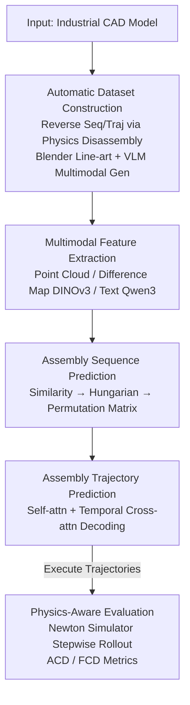

# AssemblyBench: Physics-Aware Assembly of Complex Industrial Objects

**Conference**: CVPR 2026  
**arXiv**: [2605.12845](https://arxiv.org/abs/2605.12845)  
**Code**: https://merl.com/research/highlights/assemblybench (Project Page)  
**Area**: 3D Vision / Assembly Understanding / Multimodal  
**Keywords**: Industrial Assembly, 6-DoF Trajectory Prediction, Multimodal Instruction, Physics Simulation Evaluation, Point Cloud

## TL;DR
To address the limitations of existing assembly datasets focusing only on "final poses and IKEA furniture," this paper presents AssemblyBench, a synthetic dataset featuring 2,789 complex industrial objects with step-by-step multimodal instructions and 6-DoF assembly trajectories. It introduces AssemblyDyno, a Transformer-based model that jointly predicts the assembly sequence and part trajectories in a single forward pass. It is the first to evaluate "physical feasibility" by executing predicted trajectories in a physics simulator—under identical settings, AssemblyDyno achieves a ~33% assembly success rate in the simulator, whereas the previous SOTA achieves only ~3%.

## Background & Motivation
**Background**: "Assembling a global object from parts" is a task of mutual interest in computer vision and robotics. Current SOTA methods almost exclusively focus on IKEA-style furniture because of the availability of step-by-step non-verbal diagrammatic instructions and the fact that furniture parts are designed to be easily distinguishable and connectable. Consequently, these datasets serve as a convenient starting point for studying assembly reasoning.

**Limitations of Prior Work**: Furniture does not cover the full complexity of real-world assembly. Appliances (air conditioners, ceiling fans, washing machines), industrial equipment (motors, gearboxes, hydraulic pumps), and even toys have complex geometries often requiring fine maneuvers like "insertion + screwing." Most existing datasets (ManualPA, IKEA-Manual, etc.) only provide **final part poses** and lack **motion trajectories** during the assembly process; a few non-furniture datasets lack standardized part/trajectory representations, step-by-step instructions, and unified evaluation protocols.

**Key Challenge**: The difficulty of assembly lies in "how to move parts into place"—a trajectory that appears to align with the final pose might actually cause parts to get stuck midway or collide with other parts during execution. However, most mainstream evaluations only compare **final point cloud alignment**, remaining oblivious to physical feasibility. Thus, "matching point clouds" $\neq$ "successful assembly."

**Goal**: (1) Create a dataset covering industrial objects with complete trajectories and multimodal instructions; (2) Propose a model to jointly predict assembly sequences and 6-DoF trajectories; (3) Establish an evaluation protocol to verify the physical feasibility of trajectories.

**Key Insight**: Industrial CAD models widely exist in mechanical design. The authors leverage the "assembly-by-disassembly" physical engine technique to automatically reverse-engineer sequences and trajectories from CAD models, then use Blender + VLMs to generate IKEA-style multimodal instructions—the entire annotation pipeline generalizes to any industrial object given only a CAD model.

**Core Idea**: Use "physics-based reverse disassembly + VLM instruction generation" to automatically produce industrial assembly data with ground-truth trajectories, and use "executing predicted trajectories in a physics simulator" as an evaluation loop to force the model to learn implicit physical constraints.

## Method

### Overall Architecture
The work consists of three components: **Dataset Construction** (automatic generation of instructions and trajectories from CAD), the **AssemblyDyno Model** (joint sequence and trajectory prediction), and **Physics-Aware Evaluation** (verifying feasibility via simulator execution).

Task Formalization: Given a set of unordered $N$ part point clouds $\{P_i\}_{i=1}^N$ and an $N$-step instruction manual $(\mathcal{I}_1,\cdots,\mathcal{I}_N)$ (each step adds one part, including a line-art diagram and text), the model must (i) predict the assembly sequence $(\hat\pi_1,\cdots,\hat\pi_N)$ by grounding parts to instructions; (ii) predict a 6-DoF pose trajectory $(\hat R_i^k,\hat t_i^k)\in SE(3)$ of $T$ frames for each step. $N$ varies by object (2–20, mean 6.7), and $T$ is fixed at 12.

### Key Designs

**1. AssemblyBench Construction Pipeline: Reversing CAD into Instructions with GT Trajectories**

A major pain point is the lack of labeled real assembly trajectories—manual annotation of 6-DoF frame-by-frame trajectories is extremely costly. This paper solves this via "assembly-by-disassembly": importing CAD objects into a physics engine, using depth-first search to apply axial forces, and detaching one part at a time until separated. This yields a **disassembly sequence and 6-DoF disassembly trajectories**; reversing both provides the **ground-truth assembly sequence and trajectories** (discretized into $T$ steps for Blender animation). Instructions are generated in two steps: first rendering line-art diagrams and segmentation maps for each step in an IKEA-style isometric view; then using a VLM (GPT-4.1) to look at all part diagrams to establish **globally consistent naming** (e.g., "fastener", "wire frame"), and finally generating textual instructions based on "highlighted target part + color-coded assembly" diagrams. Multi-view rendering and visual prompting are used to ensure naming consistency across steps despite occlusions or duplicate parts (e.g., identical screws). This results in 2,789 multimodal instructions covering furniture, appliances, and mechanical components, generalizes to **any CAD input**.

**2. AssemblyDyno Multimodal Feature Extraction: "Difference Maps" for Targeted Focus**

Assembly manuals are incremental—step $j$ and $j+1$ diagrams are largely identical, differing only by one new part. Encoding the entire image directly makes it difficult for networks to distinguish which part is being assembled. The authors compute difference maps $|\mathcal{I}_j^{img}-\mathcal{I}_{j+1}^{img}|$, which highlight the new part relative to the pre-assembled structure. These are patched and encoded via DINOv3 to get $f^{img}\in\mathbb{R}^{N\times K\times D}$. Part point clouds are encoded via a light PointNet variant $f^{\mathcal{P}}\in\mathbb{R}^{N\times D}$, and text via a frozen Qwen-3 embedding $f^{txt}\in\mathbb{R}^{N\times D}$. Fusion involves tiling text embeddings and concatenating them with image features. The "difference" design is key—it converts the difficult "find the new part" task into an explicit signal.

**3. Joint Forward Prediction of Sequence and 6-DoF Trajectories**

Classic motion planning (RRT/PRM) is slow and requires precise environment modeling. AssemblyDyno uses pure feedforward supervised learning for a single-pass prediction. Sequence prediction follows Manual-PA: calculating a similarity matrix between part and instruction features and using Hungarian matching to obtain a permutation matrix $M\in\{0,1\}^{N\times N}$. For trajectory prediction, $M$ with positional encodings is added to part features for self-attention interaction, followed by temporal cross-attention (injecting instruction features with positional encoding) to output trajectory latents $\mathbb{R}^{N\times T\times D}$. A pose head decodes these into $T$-frame sequences (quaternions for rotation). Predicting all steps in a **single forward pass** is more efficient and robust than step-by-step planning; sequence and trajectory modules are trained separately, with trajectory training always using GT sequences.

**4. Physics-Aware Evaluation: Rollouts in Simulator with ACD/FCD**

Evaluating only final point cloud alignment ignores fatal mid-trajectory errors. This work uses the Newton physics simulator to execute predicted trajectories step-by-step: pre-assembling previous parts at their predicted final poses, placing the current part at its first-frame predicted pose, and using the **velocity sequence of the predicted trajectory as control signals** for rollout. Given frame duration $\Delta t$, velocities $v_1, v_2, \cdots$ are applied for $\Delta t$ each. Parts may collide and change velocity (gravity is ignored for simplicity). After execution, the simulated pose trajectory is compared with the ground truth. To handle rotational symmetry, the authors use point-cloud-based Chamfer metrics instead of raw pose error, defining: **ACD (Average Chamfer Distance)**—the average Chamfer distance across all frames; and **FCD (Final Chamfer Distance)**—the Chamfer distance of the final frame. This validates sequence, trajectory, and feasibility simultaneously.

### Loss & Training
The sequence model uses InfoNCE contrastive loss $\mathcal{L}_{order}$ to align instruction features $f_i^{\mathcal{I}}$ and part features $f_{\sigma(i)}^{\mathcal{P}}$. The trajectory model uses a weighted sum $\mathcal{L}=\lambda_P\mathcal{L}_P+\lambda_T\mathcal{L}_T+\lambda_R\mathcal{L}_R+\lambda_{S_T}\mathcal{L}_{S_T}+\lambda_{S_R}\mathcal{L}_{S_R}$:

$$\mathcal{L}_P=\mathrm{CD}\Big(\bigcup_{i=1}^N(\hat R_i^{(T)}P_i+\hat t_i^{(T)}),\ \bigcup_{i=1}^N(R_i^{(T)}P_i+t_i^{(T)})\Big)$$

Where $\mathcal{L}_P$ is the bilateral Chamfer distance of the final assembly; $\mathcal{L}_T$ is per-frame translation $\ell_2$; $\mathcal{L}_R$ is rotational Chamfer distance (to account for symmetry); $\mathcal{L}_{S_T}, \mathcal{L}_{S_R}$ are temporal smoothness penalties (finite differences). Notably, the simulator is **not in the loop** during training; physical constraints are learned implicitly via supervision.

## Key Experimental Results

### Main Results
Evaluated on the AssemblyBench test split under two settings: Standard (predicted sequence) and GT Order (isolating sequence error). Lower SCD/ACD/FCD and higher KD/PA/SR are better.

| Setting | Model | KD↑ | SCD(10⁻³)↓ | Final Pose PA(%)↑ | SR(%)↑ | Sim PA(%)↑ | Sim SR(%)↑ |
|------|------|-----|-----------|-----|--------|-----|--------|
| Standard | **AssemblyDyno** | **0.819** | 3.91 | **71.21** | 34.64 | **42.76** | 13.57 |
| Standard | ManualPA (ICCV'25) | 0.788 | 4.24 | 70.04 | 33.57 | 23.24 | 1.79 |
| GT Order | **AssemblyDyno** | – | **3.87** | **79.69** | **44.29** | **70.15** | **33.57** |
| GT Order | ManualPA (ICCV'25) | – | 4.15 | 77.40 | 39.28 | 31.33 | 2.14 |

Key observation: **Success Rate (SR) in simulator**—with GT order, AssemblyDyno (33.57%) significantly outperforms ManualPA (2.14%). In the Standard setting, it is 13.57% vs 1.79%. While both have similar final pose PA (~71% vs ~70%), the baseline fails almost entirely in the simulator, confirming that point cloud alignment does not guarantee assembly feasibility.

### Ablation Study
Standard Setting (excerpt):

| Configuration | Final PA(%)↑ | SR(%)↑ | Sim PA(%)↑ | Sim SR(%)↑ | Description |
|------|-----|--------|-----|--------|------|
| Full (AssemblyDyno) | 71.21 | 34.64 | 42.76 | 13.57 | Complete model |
| w/o text | 70.28 | 35.00 | 41.77 | 15.00 | Remove text encoder |
| w/o trajectory | 67.63 | 30.00 | 22.09 | 1.43 | Heuristic instead of trajectory module |

Under GT Order, the importance of the trajectory module is even clearer: without it, Sim SR drops from 33.57% to 3.57%.

### Key Findings
- **Trajectory module is critical**: Replacing the trajectory module with a heuristic (extrapolating from final pose) causes Sim SR to collapse, proving physical feasibility and pose alignment are decoupled tasks.
- **Sequence prediction is the standard bottleneck**: Errors in sequencing propagate downstream; while diagrams provide strong constraints, text provides limited marginal gain during sequencing.
- **Real-to-sim transfer**: Despite being trained without a simulator in the loop, the model achieves the highest Sim PA/SR, showing it implicitly learns physical constraints from GT trajectories.
- **Simulators offer stricter evaluation**: Simulation errors are higher than prediction errors and diverge in later stages, exposing hidden failure modes like collisions and jams.

## Highlights & Insights
- **"Assembly-by-disassembly" as a data pivot**: High-cost assembly trajectories are converted into soluble physics-based disassembly tasks. This provides an automated, low-cost paradigm for industrial data.
- **Difference maps for focus**: Subtraction of sequential diagrams focuses the model on the step-specific part, a simple but effective technique for incremental multimodal tasks.
- **Physics simulator as an evaluation loop**: Moving beyond point cloud alignment, this work introduces "simulator execution" as a rigorous standard for assembly/manipulation tasks.
- **Symmetry-robust loss**: Using Chamfer distance for rotation loss bypasses the "multiple correct solutions" problem inherent in symmetrical parts.

## Limitations & Future Work
- **Sequence prediction is a weak point**: Propagation of sequence errors limits the overall success rate in standard settings.
- **Neglecting gravity**: The simulation simplifies reality by ignoring gravity and friction, leaving a gap between simulator and real-world execution.
- **Synthetic data**: AssemblyBench is synthetic; there is a sim-to-real gap between these diagrams/text and real industrial manuals/sensor noise.
- **Offline Physics**: Physical constraints are learned implicitly; incorporating simulator feedback (e.g., differentiable physics or RL) during training could improve feasibility.
- **Fixed frames ($T=12$)**: Higher resolution trajectories may be needed for complex maneuvers like deep insertions or intricate screwing.

## Related Work & Insights
- **vs ManualPA [42] / IKEA Datasets**: Previous works focus on furniture and only predict final poses. AssemblyBench extends to industrial objects and adds full trajectories and physical feasibility evaluation.
- **vs Assemble-Them-All (ATA) [31,32]**: While based on ATA's CAD models, this work adds multimodal instructions, standardized part/trajectory sets, and unified evaluation protocols.
- **vs Classical Planning (RRT/PRM) [14,9]**: Traditional methods are computationally expensive. AssemblyDyno uses supervised planning for faster, more robust single-pass prediction.
- **vs VLM Instruction Generation [20]**: Unlike general manuals, assembly involves complex 3D interactions. The VLM pipeline here uses multi-view and difference highlighting to ensure naming consistency.

## Rating
- Novelty: ⭐⭐⭐⭐⭐ "Reverse disassembly for data + simulator for evaluation" addresses a real pain point in assembly research.
- Experimental Thoroughness: ⭐⭐⭐⭐ Dual settings (Standard/GT) and extensive ablations; Sim SR results are highly convincing, though lacks real-world robot verification.
- Writing Quality: ⭐⭐⭐⭐ Clear task formalization and pipeline explanation.
- Value: ⭐⭐⭐⭐⭐ Provides infrastructure (data + model + protocol) for the high-value direction of industrial assembly automation.

<!-- RELATED:START -->

## Related Papers

- [\[CVPR 2026\] PAD-Hand: Physics-Aware Diffusion for Hand Motion Recovery](pad-hand_physics-aware_diffusion_for_hand_motion_recovery.md)
- [\[CVPR 2026\] BrickNet: Graph-Backed Generative Brick Assembly](bricknet_graph-backed_generative_brick_assembly.md)
- [\[CVPR 2026\] MeshMosaic: Scaling Artist Mesh Generation via Local-to-Global Assembly](meshmosaic_scaling_artist_mesh_generation_via_local-to-global_assembly.md)
- [\[CVPR 2026\] Part$^{2}$GS: Part-aware Modeling of Articulated Objects using 3D Gaussian Splatting](part2gs_part-aware_modeling_of_articulated_objects_using_3d_gaussian_splatting.md)
- [\[CVPR 2026\] PhysGaia: A Physics-Aware Benchmark with Multi-Body Interactions for Dynamic Novel View Synthesis](physgaia_a_physics-aware_benchmark_with_multi-body_interactions_for_dynamic_nove.md)

<!-- RELATED:END -->
