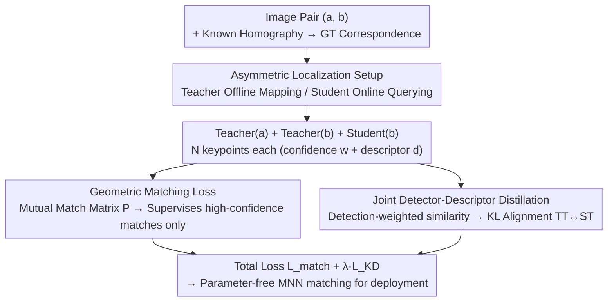

# AsymLoc: Towards Asymmetric Feature Matching for Efficient Visual Localization

**Conference**: CVPR 2026  
**Paper**: [CVF Open Access](https://openaccess.thecvf.com/content/CVPR2026/html/Omama_AsymLoc_Towards_Asymmetric_Feature_Matching_for_Efficient_Visual_Localization_CVPR_2026_paper.html)  
**Code**: None (No repository disclosed)  
**Area**: 3D Vision  
**Keywords**: Visual Localization, Asymmetric Feature Matching, Knowledge Distillation, Edge Devices, 6-DoF Pose  

## TL;DR
AsymLoc proposes "Asymmetric Visual Localization"—using a large Teacher to process the map database offline and an extremely small Student for online query images. By employing a geometric matching loss and joint detector-descriptor distillation, Student features are aligned with Teacher features, enabling direct parameter-free mutual nearest neighbor matching while retaining ~95% of the Teacher’s localization accuracy despite a ten-fold reduction in model size.

## Background & Motivation

**Background**: The standard pipeline for image-based visual localization involves "Visual Place Recognition (VPR) for coarse retrieval of map candidates → local feature matching for 6-DoF pose." This matching step typically uses the **same** feature extractor (e.g., SuperPoint, SiLK) for both query and database images, followed by mutual nearest neighbor matching. Higher accuracy is often achieved by adding learned matchers like SuperGlue or LightGlue.

**Limitations of Prior Work**: Edge devices (e.g., smart glasses, drones, single-board computers) have extremely limited compute due to battery and thermal constraints. Learned matchers are prohibitively expensive—LightGlue has over 10× more parameters than extractors like SuperPoint (+13M parameters, ~93ms/pair). Simply switching to smaller feature models leads to a significant drop in accuracy. Neither path satisfies "real-time + high precision + low power."

**Key Challenge**: Localization accuracy depends on large-model feature quality, yet edge deployment demands small models—an inherent accuracy-efficiency trade-off. However, the authors note an overlooked asymmetry: **Database images can be pre-processed offline**, where there are no compute constraints; only the query side needs power efficiency.

**Goal**: To make the online query model small enough for edge deployment while maintaining localization accuracy close to large models, ensuring the matching step remains "parameter-free and fast" without introducing heavy learned matchers.

**Key Insight**: Since the database is offline and the query is online, two different models should be used—a large Teacher for offline mapping and a small Student for online querying. The challenge is: how to directly match features from two heterogeneous models? While asymmetric settings have been studied in image retrieval (global descriptors), asymmetric scenarios for **local detector-descriptor matching** have not been explored.

**Core Idea**: Use distillation to make the Student's detector and descriptor outputs **directly compatible** with a frozen Teacher, reducing the matching step to simple mutual nearest neighbor matching. Alignment is not done in the descriptor space alone, but in a **joint detector-descriptor space** where detection confidence modulates descriptor similarity.

## Method

### Overall Architecture
AsymLoc is the first localization framework composed of two independent models: a frozen large Teacher $T$ for offline map feature extraction and a small Student $S$ for online query feature extraction. During deployment, a **parameter-free mutual nearest neighbor matching** is used between the two to estimate pose. The training goal is singular: make features from the Student processing an image "interchangeable" with those from the Teacher processing the same image. Specifically, the asymmetric matching $T_{S(I_q)\to T(I_d)}$ should approximate the symmetric reference $T_{T(I_q)\to T(I_d)}$.

Training uses single COCO images with random homographies to generate image pairs $(a,b)$ with ground truth correspondence $M_{ab}$. For each pair: the Teacher processes $a$, while **both** Student and Teacher process $b$. Each network outputs $N$ keypoints, each with a detection confidence $w\in(0,1)$ and a descriptor $d\in\mathbb{R}^D$. Outputs from Teacher-$a$ and Student-$b$ form a **mutual matching matrix** to calculate geometric matching loss. Simultaneously, two detection-weighted similarity matrices (Teacher-$a$ × Student-$b$ and Teacher-$a$ × Teacher-$b$) are constructed to align their distributions using distillation loss. The authors found that naive distillation—feeding the same image to both networks and maximizing output similarity—performs poorly, necessitating the proposed joint geometric and probabilistic supervision.

### Key Designs

**1. Asymmetric Visual Localization Setup: Splitting "Database Offline, Query Online" into Two Models**

To address the conflict between large-model accuracy and edge-model efficiency, the authors decouple the pipeline into heterogeneous halves. The offline side uses a high-performance Teacher (e.g., SiLK 1M / SuperPoint 1.3M) to pre-extract and store map features. The online side uses an extremely small Student (0.04M–0.13M) for real-time querying. This reduces online inference costs (GFLOPs down by 7–13×) while matching against high-quality map features. The critical constraint is that Teacher and Student features must be **natively compatible** to avoid heavy matchers like LightGlue, relying instead on the training phase to align the two models.

**2. Geometric Matching Loss: Using Detector-Aware Mutual Matching Matrix, Supervised by Teacher Confidence**

Aligning descriptors is insufficient; localization requires matching spatial correspondences. Instead of direct descriptor regression, supervision occurs at the "probabilistic matching" level. First, the similarity matrix between Teacher-$a$ and Student-$b$ descriptors is calculated as $S^{TS}_{ij}=\langle d^T_i(a), d^S_j(b)\rangle/\omega$ (where $\omega$ is temperature). This is weighted by the detection confidence of both sides and combined with bi-directional softmax (row/column) to yield the **mutual matching matrix**:

$$P^{TS}_{ij}=w^T_i(a)\,w^S_j(b)\,\sigma_r(S^{TS})_{ij}\,\sigma_c(S^{TS})_{ij}$$

where $\sigma_r$ and $\sigma_c$ represent row and column softmax operations. Reliable keypoints (high $w$) naturally dominate the distribution. The geometric matching loss is the negative log-likelihood on ground truth correspondences $M_{ab}$, **calculated only for points where the Teacher’s detection confidence exceeds a threshold $\theta_d$**:

$$L_{match}=-\!\!\sum_{(i,j)\in M_{ab},\,w^T_i(a)>\theta_d}\!\!\log P^{TS}_{ij}\;-\!\!\sum_{(i,j)\in M_{ab},\,w^T_i(b)>\theta_d}\!\!\log P^{ST}_{ij}$$

This bi-directional approach ensures supervision comes from high-quality correspondences while avoiding low-confidence noise. 

**3. Joint Detector-Descriptor Distillation: Aligning Distributions in the Joint Capacity**

This is the core innovation. Previous distillation methods either aligned descriptors only or aligned detection and description **independently**, ignoring how detection reliability modulates descriptor similarity. AsymLoc couples these in a single probabilistic space: the raw similarity matrix is weighted by detection confidence using power-temperature scaling to construct two detection-weighted similarity matrices—Student-Teacher pair $\bar{S}^{ST}_{ij}=(w^S_i/\omega_s)\,S^{ST}_{ij}\,(w^T_j/\omega_t)$ and Teacher-Teacher pair $\bar{S}^{TT}_{ij}=(w^T_i/\omega_t)\,S^{TT}_{ij}\,(w^T_j/\omega_t)$. Taking $\bar{S}^{TT}$ as the target and $\bar{S}^{ST}$ as the student, alignment is performed via bi-directional KL divergence:

$$L^{ST}_{KD}=\mathrm{KL}\!\big(\sigma_r(\bar{S}^{TT})\,\|\,\sigma_r(\bar{S}^{ST})\big)+\mathrm{KL}\!\big(\sigma_c(\bar{S}^{TT})\,\|\,\sigma_c(\bar{S}^{ST})\big)$$

The total distillation loss is $L_{KD}=L^{ST}_{KD}+L^{TS}_{KD}$. This forces the Student to replicate the Teacher's joint distribution in both "Query → Map" and "Map → Query" directions.

### Loss & Training
The total objective is $L_{AsymLoc}=L_{match}+\lambda_{KD}\,L_{KD}$. The Teacher is frozen during training. The setup uses COCO with random homographies, Adam optimizer, 50 epochs, and an initial learning rate of $1\times10^{-3}$. Hyperparameters include $\theta_d=0.65$ and $\lambda_{KD}=2$, with augmentations for brightness, rotation, scale, and Gaussian noise. While the experiments use SiLK and SuperPoint as Teachers, the Student models range from 0.04M to 0.13M parameters.

## Key Experimental Results

Evaluations were conducted on HPatches (homography), ScanNet (indoor relative pose), IMC2022 (outdoor mean localization accuracy - MLA), and Aachen Day-Night (HLoc pipeline).

### Main Results (SiLK Teacher, Representative Figures)

| Config | Online/Offline Params | GFLOPs | HPatches Homography @ε=1 | ScanNet AUC @10° | IMC2022 MLA | Aachen Night (5m, 10°) |
| :--- | :--- | :--- | :--- | :--- | :--- | :--- |
| Standard (0.13M Symmetric) | 0.13M/0.13M | 6.6 | 0.56 | 29.7 | 0.45 | 80.0 |
| Naive Distill (Asym) | 0.13M/1M | 6.6 | 0.57 | 30.5 | 0.45 | 81.4 |
| CSD | 0.13M/1M | 6.6 | 0.57 | 32.1 | 0.48 | 82.4 |
| D3Still (Retrieval SOTA) | 0.13M/1M | 6.6 | 0.57 | 32.9 | 0.47 | 82.4 |
| **AsymLoc (Ours 0.13M)** | 0.13M/1M | 6.6 | **0.60** | **32.9** | **0.51** | **84.4** |
| **AsymLoc (Ours 0.04M)** | 0.04M/1M | 1.97 | 0.56 | 30.1 | 0.47 | 81.2 |
| SiLK Teacher (Upper Bound) | 1M/1M | 47.3 | 0.62 | 34.1 | 0.56 | 86.8 |

Key takeaway: The 0.13M AsymLoc outperforms the same-sized symmetric Standard model by 4% on HPatches and is only 2% below the full SiLK (47.3 GFLOPs), despite being 8× smaller and 7× more efficient in FLOPs. Even the 0.04M Student outperforms the 0.13M Standard model.

### Ablation Study (HPatches / ScanNet)

| $L_{match}$ | $L_{KD}$ | HPatches HEA (ε=1) | ScanNet AUC @10° |
| :---: | :---: | :---: | :---: |
| ✓ | | 0.53 | 21.6 |
| | ✓ | 0.57 | 30.0 |
| ✓ | ✓ | **0.59** | **31.5** |

### Key Findings
- **$L_{KD}$ is the primary driver; $L_{match}$ alone can be harmful**: Using $L_{match}$ without distillation results in lower accuracy than the Standard model because it lacks negative sample signals for detection. They work synergistically.
- **Distilling "similarity structure" is more critical than raw values**: Naive feature distillation provides negligible gains. Methods like CSD that focus on structure yield significant jumps.
- **Flattened Efficiency-Accuracy Pareto Curve**: Asymmetric training ensures accuracy drops much slower as GFLOPs decrease, meaning parameter efficiency increases faster for smaller models compared to symmetric training.

## Highlights & Insights
- **Exploiting Compute Asymmetry**: By recognizing that map processing is offline, AsymLoc delegates accuracy to a large model and efficiency only to the online side, a simple yet effective engineering insight.
- **Joint Space Alignment**: Aligning the "detection-modulated matching interaction distribution" instead of separate detector/descriptor heads is the primary reason it outperforms retrieval baselines.
- **Zero Deployment Cost**: All enhancements occur during training; deployment remains parameter-free MNN matching with online FLOPs identical to the base small model.

## Limitations & Future Work
- Training data is limited to COCO and synthetic homographies; generalization to extreme viewpoints or dynamic scenes relies on downstream benchmark results.
- Distillation requires a specific Teacher; a Student must be retrained for each new Teacher architecture.
- Sensitivity analysis for hyperparameters (temperatures and thresholds) is primarily in the appendix.
- The repository is not yet public, requiring manual implementation of distillation logic.

## Related Work & Insights
- **vs. Learned Matchers (SuperGlue/LightGlue)**: These use GNNs/Transformers for global reasoning across images but have high overhead. AsymLoc shifts the complexity to training-time distillation.
- **vs. Dense Matching (LoFTR/RoMa)**: Dense methods cannot pre-store map descriptors and have massive parameter counts; AsymLoc is designed for edge-storage efficiency.
- **vs. Asymmetric Retrieval (AML/CSD/D3Still)**: These align global descriptors; AsymLoc is the first to bring asymmetric distillation to **local** pipelines.

## Rating
- Novelty: ⭐⭐⭐⭐⭐ First to introduce asymmetric distillation to local detector-descriptor pipelines.
- Experimental Thoroughness: ⭐⭐⭐⭐ Extensive across benchmarks and model sizes, though some robustness tests are in the appendix.
- Writing Quality: ⭐⭐⭐⭐ Clear motivation, though minor inconsistencies exist in percentage figures.
- Value: ⭐⭐⭐⭐⭐ High value for edge deployment due to zero-cost accuracy gains.

<!-- RELATED:START -->

## Related Papers

- [\[CVPR 2026\] ULF-Loc: Unbiased Landmark Feature for Robust Visual Localization with 3D Gaussian Splatting](ulf-loc_unbiased_landmark_feature_for_robust_visual_localization_with_3d_gaussia.md)
- [\[CVPR 2026\] Simple but Effective Triplet-Based Compression Strategies for Compact Visual Localization](simple_but_effective_triplet-based_compression_strategies_for_compact_visual_loc.md)
- [\[CVPR 2026\] CoLoR: The Devil is in Scene Coordinate Regression for Large-Scale Visual Localization](color_the_devil_is_in_scene_coordinate_regression_for_large-scale_visual_localiz.md)
- [\[CVPR 2026\] Towards Visual Query Localization in the 3D World](towards_visual_query_localization_in_the_3d_world.md)
- [\[CVPR 2026\] Lite Any Stereo: Efficient Zero-Shot Stereo Matching](lite_any_stereo_efficient_zero-shot_stereo_matching.md)

<!-- RELATED:END -->
