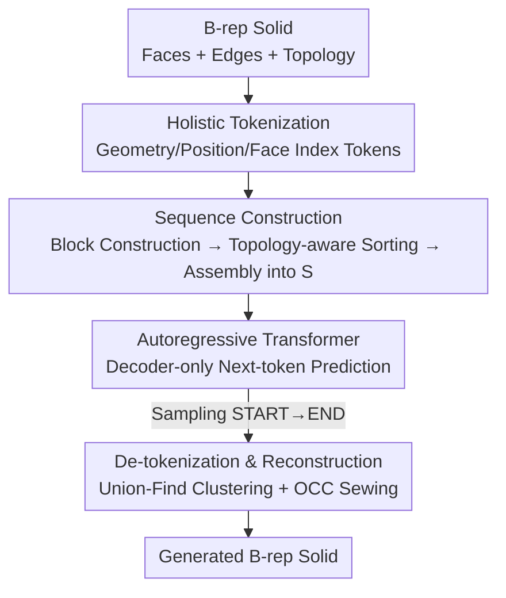

# AutoRegressive Generation with B-rep Holistic Token Sequence Representation

**Conference**: CVPR 2026  
**Paper**: [CVF Open Access](https://openaccess.thecvf.com/content/CVPR2026/html/Li_AutoRegressive_Generation_with_B-rep_Holistic_Token_Sequence_Representation_CVPR_2026_paper.html)  
**Code**: https://github.com/123qiang06/BrepARG  
**Area**: 3D Vision / CAD Generation  
**Keywords**: B-rep Generation, CAD, Autoregressive Generation, Token Serialization, VQ-VAE  

## TL;DR
BrepARG encodes the geometry and topology of CAD Boundary Representation (B-rep) into a **unified token sequence** for the first time. This enables next-token autoregressive generation using a decoder-only Transformer. It achieves SOTA results on DeepCAD/ABC, with training completed in 1.2 days and inference for a single model taking approximately 1.5 seconds on a single 4090.

## Background & Motivation

**Background**: B-rep is the fundamental paradigm for representing solid models in industrial CAD. It describes a solid using parameterized faces, edges, and vertices along with their topological adjacency relationships. Recent B-rep generation methods (e.g., BrepGen, DTGBrepGen, HolisticBrep) mostly model these using **graph structures** and decouple geometric and topological learning into separate pipelines.

**Limitations of Prior Work**: This "graph + phased" paradigm has two major drawbacks. First, geometry and topology are learned in different networks or stages (e.g., DTGBrepGen uses two sets of networks to model structure and primitives separately), leading to **fragmented** representations and requiring extra components for assembly, which increases complexity. Second, graph structures are not naturally sequential, making it impossible to **leverage** decoder-only Transformer architectures, which require sequential input and have proven powerful and scalable in LLMs. Another class of methods (e.g., BrepDiff, Hola) only generates face geometry, relying on post-processing for topological reconstruction.

**Key Challenge**: B-rep is a tight coupling of "continuous, heterogeneous parameterized geometry" and "discrete topological connections"—faces are $32\times32$ surface samples, edges are 32-point curve samples (continuous values), while topology consists of purely discrete relationships like "which edge connects which two faces." Packing these two fundamentally different properties into a **single token sequence** for simultaneous generation by an autoregressive model remains an unsolved challenge.

**Goal & Key Insight**: The authors observe that topology is essentially "connectivity." If connectivity can be expressed as tokens, both geometry and topology can reside in the same sequence. Consequently, BrepARG encodes the entire B-rep into a holistic token sequence, **redefining B-rep generation as a pure sequence modeling task**.

**Core Idea**: Use three types of discrete symbols—"geometry tokens, position tokens, and face index tokens"—to uniformly represent geometry and topology. These are then assembled into a causal sequence via topology-aware ordering, allowing a decoder-only Transformer to simultaneously generate shape and connectivity through next-token prediction.

## Method

### Overall Architecture
The input to BrepARG is a B-rep solid, and the output is a newly generated B-rep. The pipeline consists of four steps: first, **holistically tokenize** the B-rep into three types of discrete tokens; second, construct a unified sequence $S$ through a hierarchical process of "block construction, sorting, and assembly"; third, train a decoder-only Transformer to perform next-token prediction on this sequence; fourth, during inference, perform autoregressive sampling from START to END, followed by **de-tokenization** to reconstruct the sequence into a complete B-rep solid. The key is that continuous geometry and discrete topology are unified in a single token stream, allowing the autoregressive model to generate them **simultaneously**.

### Key Designs

**1. Holistic Tokenization: Compressing Heterogeneous Geometry and Discrete Topology into Three Token Types**

This step addresses the core contradiction between continuous geometry and discrete topology. **Geometry tokens**: Each face is sampled at $32\times32$ points to obtain $F\in\mathbb{R}^{32\times32\times3}$, and each edge is sampled at 32 points along the U-axis to obtain $E\in\mathbb{R}^{32\times3}$ (edges are broadcast to $32\times32\times3$ for processing by the same 2D CNN). Faces and edges share a VQ-VAE, where features are downsampled 16x to a $2\times2$ latent map (4 latent vectors). Codebook indices of the nearest neighbors form the geometry tokens. **Position tokens**: The bounding box of each primitive is defined by 6 continuous scalars $b=[x_{min},y_{min},z_{min},x_{max},y_{max},z_{max}]\in[-1,1]^6$. Since using a single codeword for the whole box causes VQ-VAE degradation, the authors use **coordinate-wise uniform scalar quantization**. Each normalized coordinate $\tilde b_j \in [0,1]$ is mapped to a discrete index:

$$k_j = \text{round}\big((L-1)\tilde b_j\big)\in\{0,\dots,L-1\}$$

where $L=2048$. Inverse quantization follows $b_j = \frac{2k_j}{L-1}-1$. **Face index tokens (Topology)**: Topology is connectivity. All closed faces are cut along seams so each edge bounds exactly two faces. Each face is assigned a unique index, and each edge is tagged with the indices of its two connected faces, **explicitly** encoding adjacency.

**2. Sequence Construction: Topology-aware Sorting & Unified Non-overlapping Vocabulary**

**Block Construction**: A face block consists of 6 position, 4 geometry, and 1 face index token: $f_i = [(t^p_1,\dots,t^p_6),(t^g_1,\dots,t^g_4),t^{idx}]$. An edge block starts with 2 face index tokens (neighbor faces), followed by 6 position and 4 geometry tokens: $e_j = [t^{idx}_1,t^{idx}_2,(t^p_1,\dots,t^p_6),(t^g_1,\dots,t^g_4)]$. **Topology-aware Sorting**: Faces are ordered using DFS (starting from the highest degree face) to ensure topological neighbors are close in the sequence ($S_f$). Edges are sorted by the maximum index of their adjacent faces (MAX-IDX-A) to keep edges near their corresponding faces, shortening the attention span ($S_e$). All face indices are **re-indexed** by adding a random integer mod $n_{max}$ to improve generalization. **Assembly**: $S = [\text{START},\,S_f,\,\text{SEP},\,S_e,\,\text{END}]$. To avoid index collisions, offsets are used to map indices into a continuous integer space: $o_{geo}=n_{max}$, $o_{pos}=n_{max}+N_{geo}$, $o_{spec}=n_{max}+N_{geo}+L$.

**3. Autoregressive Generation: Decoder-only Transformer with Causal Masking**

The model employs a decoder-only Transformer (8 layers, 8 heads, 256 embedding dim, 1024 FFN). It performs next-token prediction under teacher forcing to maximize the joint probability:

$$\prod_{S\in D}\prod_{i=1}^{T(S)} p_\theta\big(t_i \mid e(t_{<i});\theta\big)$$

During inference, nucleus (top-$p$) sampling is used. Geometry and topology are generated together in a **single data stream**, eliminating multi-stage pipelines.

**4. De-tokenization & Reconstruction: Union-Find Vertex Clustering + OpenCascade Sewing**

To reconstruct the B-rep solid, geometry tokens are decoded via VQ-VAE, and position tokens are de-quantized. For vertices (not explicitly in the sequence), edge endpoints are treated as candidates. **Greedy clustering based on Union-Find** is used to merge candidate points within face boundaries based on geometric proximity and local topology. Finally, each vertex is placed at the centroid of its group. The OpenCascade `sew` function is then used to finalize the solid.

### Loss & Training
The VQ-VAE uses reconstruction loss $L_{rec}=\|x-\hat x\|_2^2$ with a codebook restart strategy (CVQ-VAE). The autoregressive stage uses MLE. Total training time is approximately 1.2 days (VQ-VAE: 12h on 4xH20; Transformer: 17h for 500 epochs).

## Key Experimental Results

### Main Results
Evaluated on DeepCAD and ABC datasets. Comparison of unconditional generation metrics:

| Dataset | Metric (↑/↓) | Prev. SOTA | BrepARG (Ours) | Description |
|---------|--------------|------------|----------------|-------------|
| DeepCAD | COV ↑        | 74.52      | **75.45**      | Highest Coverage |
| DeepCAD | MMD ↓ (×10²) | 0.93       | **0.89**       | Lowest Matching Dist |
| DeepCAD | Valid ↑      | 79.80      | **87.60**      | ~8pt gain in Validity |
| ABC     | COV ↑        | 66.07      | **70.10**      | Significant Diversity |
| ABC     | Valid ↑      | 57.59      | **67.54**      | +10pt in Validity |

Efficiency Comparison:

| Method | Training Time | Inference (per model) |
|--------|---------------|-----------------------|
| BrepGen | 7.5 days | 8.4 s |
| DTGBrepGen | 3.0 days | 3.6 s |
| **Ours** | **1.2 days** | **1.5 s** |

### Ablation Study
The "topology-aware sorting" is critical for validity (Table 4/5):

| Configuration | COV ↑ | MMD ↓ | Valid ↑ | Description |
|---------------|-------|-------|---------|-------------|
| Face Order: RAND | 71.10 | 0.947 | 67.92 | Random sorting performs worst |
| Face Order: **DFS** | **75.45** | **0.887** | **87.60** | **Topology-aware (Ours)** |
| Edge Order: RAND | 74.24 | 0.913 | 85.43 | — |
| Edge Order: **MAX-IDX-A** | **75.45** | **0.887** | **87.60** | **Tight attention (Ours)** |

### Key Findings
- **Topology-aware sorting is the primary driver of Validity**: Face ordering improves validity from 67.92% (random) to 87.60% (DFS), proving that proximity in the sequence helps the model learn coherent structures.
- **Position tokens require deterministic scalar quantization**: Quantizing the full bounding box via VQ leads to precision issues; coordinate-wise quantization is more stable.
- **Significant efficiency gains**: 6x faster training and 5.6x faster inference than BrepGen.

## Highlights & Insights
- **Clever Topological Tokenization**: Representing topology as "face index tokens" (shared labels) allows heterogeneous data to coexist in one sequence—a critical step for using autoregressive architectures.
- **Unified Vocabulary Offset Design**: Mapping different symbol types into non-overlapping segments is a clean engineering solution for multi-source discrete symbol processing.
- **Reconstruction via Clustering**: The Union-Find vertex clustering bridges the gap between token sequences and valid CAD entities.

## Limitations & Future Work
- **Precision Loss**: VQ-VAE quantization of geometry and the complexity of long-range autoregressive modeling can occasionally hurt stability.
- **Complexity Constraints**: Models with >50 faces or >30 edges per face were filtered out; performance on complex industrial-scale B-reps is unverified.
- **Vertex Robustness**: Reconstruction depends on geometric precision; very close endpoints or topological ambiguities can lead to errors.

## Related Work & Insights
- **vs. BrepGen / DTGBrepGen (Graph-based)**: Those use decoupled pipelines and graphs. Ours uses a unified sequence and a single Transformer, resulting in higher validity and faster speeds.
- **vs. BrepDiff / Hola (Face-only)**: They generate faces and reconstruct topology later. Ours generates both end-to-end.
- **vs. AutoBrep / BrepGPT (Serialization)**: While similar in intent, BrepARG differs in its DFS-based topology-aware sorting and shared VQ-VAE geometry representation.

## Rating
- Novelty: ⭐⭐⭐⭐⭐ 
- Experimental Thoroughness: ⭐⭐⭐⭐ 
- Writing Quality: ⭐⭐⭐⭐ 
- Value: ⭐⭐⭐⭐⭐ 

<!-- RELATED:START -->

## Related Papers

- [\[CVPR 2026\] BrepVGAE: Variational Graph Autoencoder with Unified Latent Representation for B-rep](brepvgae_variational_graph_autoencoder_with_unified_latent_representation_for_b-.md)
- [\[CVPR 2026\] Progressive Neural Architecture Generation](progressive_neural_architecture_generation.md)
- [\[CVPR 2026\] Dynamics: Language-Based Representation for Inferring Rigid-Body Dynamics From Videos](dynamics_language-based_representation_for_inferring_rigid-body_dynamics_from_vi.md)
- [\[CVPR 2026\] Adapting In-context Generation for Enhanced Composed Image Retrieval](adapting_in-context_generation_for_enhanced_composed_image_retrieval.md)
- [\[CVPR 2026\] Bidirectional Query-Driven Generation of Parametric CAD Sketch](bidirectional_query-driven_generation_of_parametric_cad_sketch.md)

<!-- RELATED:END -->
