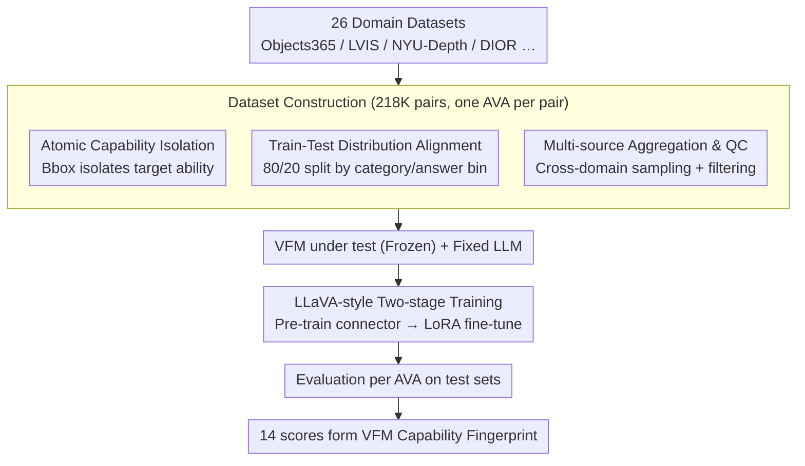

# AVA-Bench: Atomic Visual Ability Benchmark for Vision Foundation Models

**Conference**: CVPR 2026  
**arXiv**: [2506.09082](https://arxiv.org/abs/2506.09082)  
**Code**: [Project Homepage](https://zheda-mai.github.io/AVA-Bench/)  
**Area**: 3D Vision  
**Keywords**: VFM Evaluation, Atomic Visual Ability, benchmark, VFM, Multimodal Evaluation

## TL;DR

Proposes AVA-Bench, the first systematic evaluation benchmark that decouples Vision Foundation Model (VFM) capabilities into 14 Atomic Visual Abilities (AVA). Through train-test distribution alignment and isolated single-capability testing, it precisely identifies VFM strengths and weaknesses, finding that 0.5B small models maintain ranking consistency comparable to 7B models.

## Background & Motivation

### 1. Background
Vision Foundation Models (VFMs) such as DINOv2, CLIP, SAM, and SigLIP, pretrained on large-scale data, have become universal feature extraction backbones for various downstream vision tasks. The mainstream method to evaluate VFMs is to combine them with Large Language Models (LLMs) and test on VQA benchmarks.

### 2. Limitations of Prior Work
Existing evaluation protocols have two critical blind spots:
- **Data Distribution Mismatch**: Inconsistency between instruction tuning data and VQA test data distributions means errors may stem from data bias rather than VFM visual defects.
- **Multi-capability Coupling**: VQA questions usually depend on multiple visual abilities simultaneously, making it impossible to determine if a failure is due to overall weakness or the lack of a single key ability.

### 3. Key Challenge
An evaluation method is required to isolate individual visual abilities for precise diagnosis while ensuring consistency in train-test distribution to transform VFM selection from "empirical guesswork" into "engineering decision-making."

### 4. Goal
- Construct an evaluation benchmark that precisely locates VFM performance across various foundational visual abilities.
- Eliminate evaluation errors caused by data mismatch and multi-capability coupling.
- Provide an actionable basis for VFM selection in downstream tasks.

### 5. Key Insight
Inspired by compositional text-to-image benchmarks and VQA problem analysis, complex visual reasoning is decomposed into 14 "Atomic Visual Abilities" (AVA). Each ability is tested and trained independently, using auxiliary means like bounding boxes to isolate the target ability.

### 6. Core Idea

**Atomic Visual Ability (AVA) Decoupled Evaluation**: Defines 14 indivisible foundational visual abilities. Standardized train/test sets with consistent distributions are constructed for each capability. VFMs are fine-tuned and evaluated one by one using a LLaVA-style pipeline to generate a "capability fingerprint" for the VFM.

## Method

### Overall Architecture

AVA-Bench aims to answer a question often obscured by existing VQA evaluations: when a VFM fails a question, is it because it "cannot see the object," "cannot count accurately," or "cannot judge depth"? The approach decomposes the broad concept of "general visual ability" into 14 independent **Atomic Visual Abilities** (AVA)—localization, counting, spatial reasoning, orientation recognition, absolute/relative depth estimation, color, texture, object recognition, action recognition, emotion recognition, OCR, scene recognition, and fine-grained recognition. Each ability is "tested" individually.

The pipeline involves: filtering approximately 218K image-question pairs from 26 diverse datasets, where each pair targets a single AVA. The VFM under test is connected to a fixed LLM and undergoes a two-stage LLaVA-style process (pre-training connector, then LoRA fine-tuning) for each AVA. Finally, the 14 scores are aggregated into the VFM's "capability fingerprint." Innovation is concentrated in the dataset construction phase (the three tasks in the `Dataset Construction` box below), while subsequent training and evaluation follow existing LLaVA protocols.

### Key Designs

**1. Atomic Capability Isolation: Using bounding boxes to "strip" irrelevant abilities**

Traditional VQA tasks often conflate multiple abilities. For example, to answer "is the cup to the left or right of the book," a model must first **localize** both items and then perform **spatial reasoning**. AVA-Bench provides Ground Truth (GT) bounding boxes for target objects. For spatial reasoning, providing boxes means the model only needs to judge left/right. For absolute depth, given a box, the model only estimates distance. This isolation ensures failures are cleanly attributed to a specific ability. Ablation shows that with bounding boxes, spatial reasoning scores for all VFMs are nearly perfect; once boxes are removed, performance diverges and correlates highly with localization ability.

**2. Train-Test Distribution Alignment: Controlling "data bias" as a confounding variable**

A hidden pitfall in VFM evaluation is the distribution mismatch between instruction tuning data and test data. AVA-Bench performs a strict 80/20 split for each AVA, maintaining identical distributions across **every object category and every answer bin**. Thus, performance differences are cleanly attributed to VFM perception rather than "unseen data distributions."

**3. Multi-source Aggregation and Quality Control: Preventing bias from single datasets**

Samples for each AVA are drawn from multiple domains (indoor scenes, remote sensing, wildlife, etc.) to prevent single-dataset bias. Sampling balances answer distributions and controls volume. Additional filtering rules ensure reliability: minimum bbox area (avoiding tiny, unidentifiable objects), single-instance constraints (only one target category per image to avoid ambiguity), and answer bin balancing for counting tasks.

### Loss & Training

Each AVA undergoes independent LLaVA-style training: stage one freezes the VFM and LLM to pre-train the connector; stage two keeps the VFM frozen while fine-tuning the connector and LLM via LoRA (which also prevents overfitting on small datasets). Each capability uses 6K–10K training samples. A significant finding for evaluation efficiency is that replacing a 7B LLM (Vicuna-1.5) with a 0.5B model (Qwen2) maintains highly consistent VFM rankings while reducing GPU costs to approximately 1/8.

## Key Experimental Results

### Main Results

**Table 1: Average ranking of VFMs across 14 AVAs**

| VFM | Pre-training | Avg Ranking | Strongest AVA | Weakest AVA |
|-----|-----------|---------|---------|---------|
| SigLIP-1/2 | Language Supervised (Sigmoid) | Optimal | Leading in many | - |
| AIMv2 | Multimodal Autoregressive | Runner-up | Leading in many | - |
| InternVL-2.5 | Language Supervised | Mid-High | - | - |
| CLIP | Language Supervised (Contrastive) | Medium | - | - |
| RADIO | Multi-teacher Distillation | Medium | Stable overall | - |
| DINOv2 | Self-supervised Contrastive | Mid-Low | Orientation, Loc. | OCR |
| SAM | Segmentation Supervised | Low | Color | Multiple |
| MiDaS | Depth Supervised | Low | Depth-related | Multiple |

**Table 2: Ranking consistency of 0.5B vs 7B LLM evaluators**

| Configuration | LLM Scale | GPU Resources | VFM Ranking Consistency |
|----------|---------|---------|--------------|
| Vicuna-1.5 7B | 7B | Baseline (1×) | Benchmark Ranking |
| Qwen2 0.5B | 0.5B | ~0.125× (8x saving) | Highly consistent with 7B |

### Ablation Study

**Impact of Bounding Boxes on Spatial Reasoning**:
- Providing GT bounding boxes: All VFMs perform near-perfectly and consistently on spatial reasoning.
- Without bounding boxes: Performance diverges significantly, correlating highly with localization ability (MiDaS and SAM drop sharply).
- Conclusion: Failures in composite tasks are often due to deficiencies in specific key AVAs rather than general visual inadequacy.

**Localization Ability by Object Size**:
- Large objects (0.3-0.5 normalized area): Minimal difference between VFMs.
- Small objects: Performance gaps widen drastically, with MiDaS and SAM trailing significantly.
- Conclusion: Aggregated metrics may mask fine-grained performance differences.

### Key Findings

1. **Language supervision is key to general visual ability**: SigLIP-1/2 and AIMv2 consistently rank highest, highlighting the core role of language supervision in enhancing general visual capabilities.
2. **SSL matches language supervision in vision-centric tasks**: DINOv2 is comparable or superior to language-supervised models in vision-centric AVAs like localization, absolute depth, and orientation.
3. **OCR strongly depends on language alignment**: Non-language-aligned VFMs perform significantly worse in OCR tasks.
4. **Low/Mid-level AVAs generally perform well**: All VFMs excel in texture, relative depth, and object recognition, indicating VQA failures usually stem from specific AVA gaps.
5. **Every VFM has at least one specialty**: Even overall lower-ranked models show strengths (e.g., SAM in color, DINOv2 in orientation).

## Highlights & Insights

- **Evaluation Paradigm Innovation**: Systematically shifts VFM evaluation from "overall VQA scores" to "atomic capability fingerprints," enabling precise diagnosis.
- **Practical Engineering Value**: Capability fingerprints directly guide VFM selection for specific downstream tasks, turning "empirical guesswork" into "engineering decisions."
- **Efficiency Breakthrough**: Demonstrated that 0.5B LLMs can replace 7B models for VFM ranking, significantly lowering evaluation costs.
- **Partial Validation of Platonic Representation Hypothesis**: VFMs with different training methods converge on low/mid-level AVAs, though high-level AVAs remain differentiated.
- **Challenge for Non-language-aligned VFMs**: The connector alignment process can lose critical visual information (e.g., DINOv2 linear probe accuracy dropped from 66.3% to 25.67% during alignment).

## Limitations & Future Work

1. **AVA Coverage**: 14 AVAs may not exhaust all visual abilities; 3D geometry, lighting, and material recognition are currently missing.
2. **Lack of Capability Composition Evaluation**: Only single AVAs are tested; interactive effects and degradation patterns in multi-AVA tasks remain unexplored.
3. **Pipeline Constraints**: The LLaVA-style pipeline might inherentlly disadvantage non-language-aligned VFMs due to information loss during alignment.
4. **Static Image Limitation**: All AVAs are based on static images, lacking evaluation for video understanding or temporal reasoning.
5. **Dataset Scale**: Some AVA training sets are only 6K–8K samples, which might not fully unlock the potential of some VFMs.

## Related Work & Insights

- **MLLM Evaluation** (MMBench, SEED-Bench): Focuses on end-to-end MLLM performance but cannot distinguish between VFM and LLM contributions. AVA-Bench isolates the VFM by fixing the LLM.
- **VFM Comparative Studies** (Vision Encoder Probing): Evaluates VFMs via linear probing but is often limited to single tasks. AVA-Bench provides a 14-dimensional profile.
- **Compositional T2I Evaluation** (T2I-CompBench, DALL-Eval): Defined visual primitives at the generative end, inspiring the AVA decomposition approach.
- **Insight**: The capability decoupling concept can be extended to other fields, such as decomposing "atomic reasoning abilities" for LLM evaluation.

## Rating

⭐⭐⭐⭐ A systematic and experimentally solid benchmark paper. The 14 AVAs are well-defined, and the discovery of 0.5B models as efficient evaluators is highly practical. It lacks capability composition and dynamic vision coverage.

<!-- RELATED:START -->

## Related Papers

- [\[CVPR 2026\] PAI-Bench: A Comprehensive Benchmark for Physical AI](pai-bench_a_comprehensive_benchmark_for_physical_ai.md)
- [\[CVPR 2026\] CrossHOI-Bench: A Unified Benchmark for HOI Evaluation across Vision-Language Models and HOI-Specific Methods](crosshoi-bench_a_unified_benchmark_for_hoi_evaluation_across_vision-language_mod.md)
- [\[CVPR 2026\] ENC-Bench: A Benchmark for Evaluating MLLMs in Electronic Navigational Chart Understanding](enc-bench_a_benchmark_for_evaluating_multimodal_large_language_models_in_electro.md)
- [\[CVPR 2026\] Scaling Spatial Intelligence with Multimodal Foundation Models](scaling_spatial_intelligence_with_multimodal_foundation_models.md)
- [\[AAAI 2026\] VP-Bench: A Comprehensive Benchmark for Visual Prompting in Multimodal Large Language Models](../../AAAI2026/multimodal_vlm/vp-bench_a_comprehensive_benchmark_for_visual_prompting_in_m.md)

<!-- RELATED:END -->
