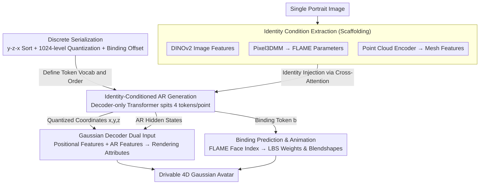

# AvatarPointillist: AutoRegressive 4D Gaussian Avatarization

**Conference**: CVPR 2026  
**arXiv**: [2604.04787](https://arxiv.org/abs/2604.04787)  
**Code**: [https://kumapowerliu.github.io/AvatarPointillist](https://kumapowerliu.github.io/AvatarPointillist)  
**Area**: 3D Vision / Digital Human Generation  
**Keywords**: 4D Avatar, Autoregressive, 3D Gaussian Splatting, Point Cloud Generation, One-shot

## TL;DR
AvatarPointillist proposes an autoregressive (AR) generation framework to construct 4D Gaussian avatars. It utilizes a decoder-only Transformer to generate 3DGS point clouds point-by-point (including binding information) and employs a Gaussian Decoder to predict rendering attributes. This approach breaks the limitations of fixed template topologies and enables adaptive point density adjustments, outperforming baselines like LAM and GAGAvatar on the NeRSemble dataset.

## Background & Motivation

**Background**: Generating drivable 3D avatars from a single portrait image is crucial for applications such as VR, telepresence, and filmmaking. Existing methods are divided into 2D animation (GAN/Diffusion) and 3D (NeRF/3DGS) paradigms.

**Fundamental flaws of 2D methods**: They lack 3D structural awareness, leading to geometric distortions under extreme poses and an inability to render from arbitrary viewpoints.

**Key Challenge of 3DGS methods**:
   - **GAGAvatar**: Lifts 2D features to 3D, bypassing complete point cloud representation, and requires auxiliary 2D networks for refinement.
   - **LAM**: Uses fixed FLAME vertices as template point clouds, where every individual uses the same number of Gaussians—**this restricts the model's ability to adaptively adjust point density** to capture identity-specific features (e.g., beards, unique hairstyles).
   - **Nature of the problem**: Fixed topologies lose the core advantage of 3DGS—adaptive point distribution control based on geometric complexity.

**Core Problem**: Is it possible to design a generative model that **directly learns the 3DGS point cloud distribution** without relying on a fixed template? This would allow the model to autonomously decide where and how many points to place.

**Core Idea**: Reformulate 3DGS avatar generation as an **autoregressive sequence generation task**, predicting 3D coordinates and binding indices point-by-point to embrace the adaptive dynamic characteristics of 3DGS.

## Method

### Overall Architecture
The paper addresses "generating drivable 4D Gaussian avatars from a single portrait." The core hypothesis is that rather than fitting a fixed FLAME template like LAM, a generative model should determine the point cloud structure itself. The pipeline is divided into two stages. The first stage is an **autoregressive point cloud generator** based on a decoder-only Transformer: it takes identity features from a portrait and outputs quantized point cloud tokens sequentially. Each point is described by four tokens—three quantized coordinates $(T_n^x, T_n^y, T_n^z)$ and one binding token $T_n^b$ (indicating which FLAME mesh face the Gaussian is attached to). The second stage is the **Gaussian Decoder**: it dequantizes the coordinates back to continuous space and takes the hidden states from the AR Transformer. These are combined and fed into a Transformer to predict the actual rendering attributes for each Gaussian (color, opacity, scale, rotation, displacement offset). In essence, the AR model determines "where, how many, and which bone," while the Gaussian Decoder determines "what the point looks like."

### Key Designs

**1. Organizing Point Clouds into Learnable Discrete Sequences: Turning Avatar Generation into "Writing a Sentence"**

To enable an autoregressive model to generate point clouds, continuous 3DGS must be converted into discrete token sequences. The authors fit 3DGS to each identity in NeRSemble using GaussianAvatars, binding each Gaussian to a FLAME mesh face, and then calculate a global canonical Gaussian point cloud. Crucially, the sequence must be **deterministically reproducible**: the same point cloud must yield the same sequence, otherwise, the model cannot learn a stable generation order. Thus, points are sorted by y-z-x. Coordinates are quantized into 1024 discrete levels (a trade-off between precision and sequence length), and binding information is offset to avoid coordinate value ranges—$T_n^b = b_n + 1024$, where $b_n \in [0, 10143]$. This places coordinates and face indices into non-conflicting segments of the same vocabulary. Each point is unfolded into 4 tokens, forming a long sequence $(T_1^x, T_1^y, T_1^z, T_1^b, \dots, T_N^x, T_N^y, T_N^z, T_N^b)$ padded with Start/End/Padding markers. This step is the foundation of the paradigm: by treating point clouds as a "sentence," adaptive point density naturally emerges from the generation process rather than being locked by a template.

**2. Identity-Conditioned Autoregressive Generation: Feeding "What the Person Looks Like" into Every Step**

The generator is a decoder-only Transformer with stacked cross-attention, self-attention, and FFN layers, trained using the standard next-token prediction objective: $p(T) = \prod_{n=1}^{4N} p(T_n \mid T_{<n})$. The difficulty lies in injecting "identity"—the same generation process must produce different point clouds for different people. The authors use DINOv2 to extract image features, Pixel3DMM for FLAME parameters, and a point cloud encoder for mesh features. These are concatenated and fed into every step of the generation via cross-attention, ensuring the model uses the face shape prior when deciding "where to place the next point." To handle the computational cost of sequences containing tens of thousands of tokens, a sliding window of size 12,000 is used during training to truncate backpropagation.

**3. Dual Inputs for the Gaussian Decoder: Coordinates Locate the Point, AR Hidden States Define the Point**

This is a core innovation of the paper. A naive approach would be to regress Gaussian attributes solely from generated coordinates, but the authors found coordinates alone to be insufficient. Thus, the Gaussian Decoder receives two inputs: **positional features** $P_n$ (obtained by positionally encoding dequantized coordinates and passing them through an MLP) and **AR features** $F_n^p$ (the final hidden state from the AR Transformer for that point). The hidden features of the 4 tokens describing the same point are aggregated via an MLP. The AR hidden state contains accumulated semantic context—information regarding why a point was placed there and whether it belongs to hair or skin—which cannot be derived from an isolated coordinate. Ablations confirm this: using only positional or only AR features significantly degrades rendering quality (LPIPS drops to 0.19 and 0.22, respectively).

**4. Binding Prediction for Inherently Animateable Point Clouds: Knowing the Bone Attachment During Generation**

Avatars must be drivable, requiring knowledge of how Gaussians move with expressions and poses. AvatarPointillist integrates this into the generation phase—the binding token $T_n^b$ specifies the corresponding FLAME face index. Without additional post-processing, LBS weights $\hat{\mathbf{w}}_i$ and expression blendshapes $\hat{\mathbf{S}}_i$ are obtained via barycentric coordinate interpolation. The standard FLAME deformation process is then followed: given pose parameters $\boldsymbol{\theta}$ and expression parameters $\boldsymbol{\psi}$, the point cloud animates. Animateability is a inherent byproduct of the autoregressive paradigm.

### Loss & Training
- **AR Model**: Standard cross-entropy loss, AdamW lr=1e-4, 16×H20 GPUs, 50K steps, batch size 4.
- **Gaussian Decoder** (trained after freezing AR model):
  $$\mathcal{L}_{total} = \lambda_{L1}\mathcal{L}_{L1} + \lambda_{SSIM}\mathcal{L}_{SSIM} + \lambda_{LPIPS}\mathcal{L}_{LPIPS} + \lambda_{Reg}\mathcal{L}_{Reg}$$
  - $\lambda_{L1}=1, \lambda_{SSIM}=0.5, \lambda_{LPIPS}=0.1, \lambda_{Reg}=0.1$
  - 8×H20 GPUs, 12,500 steps.

## Key Experimental Results

### Main Results (NeRSemble Dataset)

| Method | LPIPS↓ | FID↓ | AKD↓ | APD↓ | Cross-FID↓ | Cross-CLIP↑ |
|------|--------|------|------|------|------------|-------------|
| Portrait4Dv2 | 0.20 | 123.02 | 5.32 | 34.53 | 191.13 | 0.63 |
| AvatarArtist | 0.21 | 118.94 | 6.87 | 39.58 | 175.69 | 0.61 |
| LAM | 0.24 | 136.01 | 4.37 | 61.83 | 238.54 | 0.54 |
| GAGAvatar | 0.18 | 111.76 | 3.93 | 27.94 | 181.22 | 0.71 |
| **Ours** | **0.15** | **95.18** | **2.38** | **22.86** | **160.74** | **0.75** |

### Ablation Study

| Configuration | LPIPS↓ | FID↓ | AKD↓ | APD↓ | Description |
|------|--------|------|------|------|------|
| FLAME Position | 0.23 | 120.34 | 4.82 | 41.22 | Fixed FLAME template (like LAM) |
| AR Feature only | 0.22 | 110.93 | 5.89 | 32.96 | Only AR hidden features |
| AR Position only | 0.19 | 103.80 | 5.81 | 41.49 | Only positional encoding |
| **Full (Ours)** | **0.15** | **95.18** | **2.38** | **22.86** | Dual input (Pos + AR Feature) |

### Key Findings
- AR point cloud generation vs. fixed FLAME template: FID dropped from 120.34 to 95.18, proving the advantage of adaptive point distribution.
- The Gaussian Decoder's simultaneous use of positional and AR features is critical—lacking either results in significant degradation.
- The FLAME Position baseline fails to capture identity-specific geometry (e.g., ponytails, thick beards), with qualitative results showing a clear gap.
- Visualizing auto-regressively generated point clouds reveals an adaptive density distribution—points are denser in geometrically complex regions like hair and beards.

## Highlights & Insights
- **Reconstructing 3DGS point cloud generation as autoregressive token prediction** is a paradigm shift, giving the model the freedom to decide point placement and quantity.
- The design of **passing AR hidden features to the Gaussian Decoder** is sophisticated—semantic context accumulated during generation significantly improves rendering quality.
- Binding prediction ensures the generated point clouds are inherently animateable without extra post-processing.
- The name "Pointillist" is apt—each Gaussian point acts like a stroke from a painter, adaptively combining to form the full image.

## Limitations & Future Work
- Autoregressive generation sequences are very long (tens of thousands of tokens), making inference slower compared to one-shot methods.
- Training data is limited to NeRSemble (419 identities); generalization to larger and more diverse populations remains to be verified.
- Dependence on GaussianAvatars fitting for training data means quality is influenced by fitting quality.
- Discretization errors from 1024-level quantization may cause artifacts in extremely fine regions, such as around the eyes.

## Related Work & Insights
- LAM is the most direct comparison—fixed template vs. autoregressive generation.
- MeshGPT's modeling of mesh generation as an AR task was a direct inspiration.
- The quantization + AR paradigm can be extended to full-body avatars and scene-level 3DGS generation.

## Rating
- Novelty: ⭐⭐⭐⭐⭐ First application of AR sequence generation to 3DGS avatars.
- Experimental Thoroughness: ⭐⭐⭐⭐ Comprehensive comparisons and detailed ablations, though evaluated on only one dataset.
- Writing Quality: ⭐⭐⭐⭐ Clear motivation and detailed methodology.
- Value: ⭐⭐⭐⭐⭐ Provides a new direction for 3DGS avatar generation; the advantages of adaptive point distribution are universally significant.

<!-- RELATED:START -->

## Related Papers

- [\[CVPR 2026\] 4C4D: 4 Camera 4D Gaussian Splatting](4c4d_4_camera_4d_gaussian_splatting.md)
- [\[CVPR 2026\] LongStream: Long-Sequence Streaming Autoregressive Visual Geometry](longstream_long-sequence_streaming_autoregressive_visual_geometry.md)
- [\[CVPR 2026\] Mark4D: Temporally-Consistent Watermarking for 4D Gaussian Splatting](mark4d_temporally-consistent_watermarking_for_4d_gaussian_splatting.md)
- [\[CVPR 2026\] GP-4DGS: Probabilistic 4D Gaussian Splatting from Monocular Video via Variational Gaussian Processes](gp-4dgs_probabilistic_4d_gaussian_splatting_from_monocular_video_via_variational.md)
- [\[CVPR 2026\] RayNova: Scale-Temporal Autoregressive World Modeling in Ray Space](raynova_scale-temporal_autoregressive_world_modeling_in_ray_space.md)

<!-- RELATED:END -->
