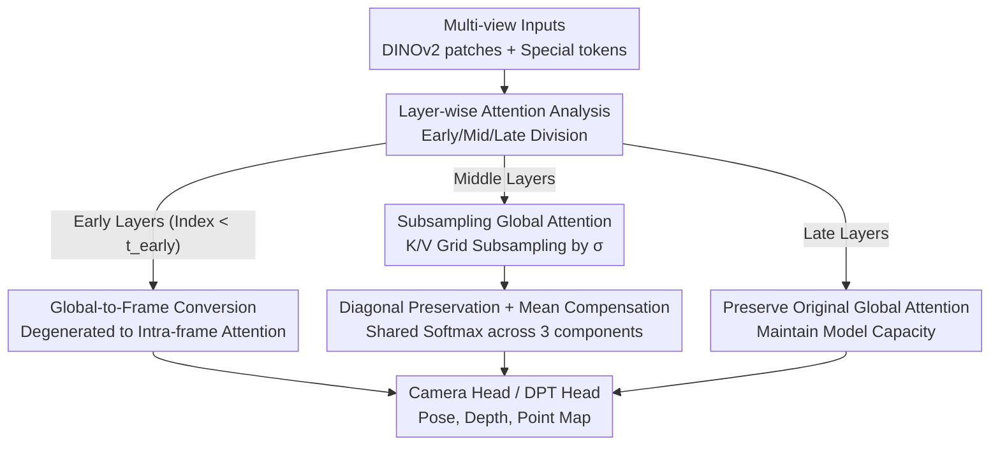

# AVGGT: Rethinking Global Attention for Accelerating VGGT

**Conference**: CVPR 2026  
**Paper**: [CVF Open Access](https://openaccess.thecvf.com/content/CVPR2026/html/Sun_AVGGT_Rethinking_Global_Attention_for_Accelerating_VGGT_CVPR_2026_paper.html)  
**Code**: None (Repository not disclosed)  
**Area**: 3D Vision / Model Compression  
**Keywords**: VGGT acceleration, Global Attention, K/V subsampling, multi-view 3D reconstruction, training-free  

## TL;DR
Through a layer-wise dissection of the actual role of global attention in VGGT/π³ (early layers being ineffective, middle layers performing cross-view alignment, and final layers doing fine-tuning), a training-free two-step acceleration scheme is proposed. It replaces early global layers with intra-frame attention and applies grid subsampling to K/V for the remaining global layers, achieving an 8–10× inference speedup for 800-frame inputs with almost no loss in accuracy.

## Background & Motivation
**Background**: Feed-forward multi-view 3D reconstruction models, represented by VGGT and π³, use a unified Transformer to simultaneously output camera poses, depth, point maps, and point tracking. Their core is **alternating global self-attention + intra-frame self-attention**: global attention allows all patch tokens across all views to be visible to each other, thereby establishing cross-view consistency. VGGT's ablations proved that global self-attention is superior to cross-attention, a design inherited by subsequent works like π³ and MapAnything.

**Limitations of Prior Work**: Global self-attention has a complexity of $O((NL)^2)$ for $N$ frames with $L$ tokens per frame, which explodes as the number of frames increases—at 800 frames, a single VGGT inference take approximately 400 seconds and 35 PFLOPs. Existing acceleration methods (FastVGGT using token merging, FasterVGGT using SpargeAttention block sparsity) simply **import a sparse attention suite** from other fields and apply it directly. They lack a systematic analysis of the VGGT forward process and fail to exploit the "alignment-centric" nature of global attention, often failing or causing OOM in extremely dense view scenarios.

**Key Challenge**: There is a default assumption that "every layer and every token pair in global attention is important," leading research to focus only on general sparsification. However, what exactly is global attention doing? Are all layers and tokens indispensable? No systematic answer existed, which is the root cause of blind acceleration.

**Goal**: Split into two questions. **(Q1)** Why is alternating attention effective, and what roles do individual global layers play? **(Q2)** Since global attention is so expensive, can its overhead be slashed without sacrificing accuracy?

**Key Insight**: The authors perform **layer-wise attention visualization** on the global layers of VGGT/π³ (taking the top-50 query→key pairs). They found a clear division of labor: **Early layers** show very uniform attention where strong matches often only link tokens with the same y-coordinates (dominated by positional encoding; these "hub keys" drift if the image is rotated 180°, indicating they do not encode view-invariant 3D structures). **Middle layers** suddenly show sparse attention with sharp peaks, with the highest activations almost exclusively falling on two categories—the patch itself and patches at the same spatial position in different views, which truly builds cross-view correspondence. **Late layers** regress to the uniform, weak-peak form of early layers, suggesting the point clouds are basically aligned and only undergoing fine-tuning.

**Core Idea**: Interpret global attention as **point cloud alignment**—aligning two point clouds only requires a small number of anchor points, making dense token-by-token matching redundant. Based on this, a training-free two-step acceleration is proposed: transform early global layers directly into intra-frame attention, and for middle global layers, retain all Queries while performing aggressive grid subsampling on K/V.

## Method

### Overall Architecture
The VGGT aggregator consists of 48 Transformer blocks, with global and intra-frame attention appearing alternately (global layers are indexed 0 to 23 by depth). This method modifies no weights and requires no training, altering only the global layer algorithms during inference. Based on the "layer role division," the 24 global layers are partitioned into **Early / Mid / Late** segments. For early segments (index $<t_{\text{early}}$), the entire layer is converted to intra-frame attention (Global-to-Frame, G2F). For middle segments, global attention is retained but with K/V grid subsampling (Subsampling Global Attention, SGA). Late segments are kept as-is to preserve model capacity. VGGT uses $t_{\text{early}}=9$ (transforming indices 0–8), while π³ uses $t_{\text{early}}=10$.

### Key Designs

**1. Global-to-Frame Conversion: Degenerating Ineffective Early Global Layers into Intra-frame Attention**

Early global layers do not participate in cross-view correspondence (as features lack sufficient 3D information at this stage) but still incur the $O((NL)^2)$ global complexity, which is wasteful. The proposed approach is extremely lightweight: before entering a global block, VGGT reshapes tensors from an intra-frame layout $(BN, L, C)$ to $(B, NL, C)$ to perform joint attention. To convert a global block to intra-frame, one simply **skips this reshaping** and maintains the $(BN, L, C)$ per-frame layout, performing attention independently per frame while keeping all parameters and special tokens unchanged. This step reduces the complexity of affected blocks from $O((NL)^2)$ to $O(NL^2)$—removing the squared frame count term.

The decision to completely remove cross-view interaction in these layers is supported by VGGT(G2F) ablations: even without view communication in early layers, AUC@5 only drops from 63.18 to 62.83, which is nearly negligible. This directly validates that "early layers are not essential for establishing multi-view consistency."

**2. Subsampling Global Attention (SGA): Treating Global Attention as Point Cloud Alignment by Subsampling K/V**

Middle global layers indeed perform alignment, but "aligning two point clouds only requires a few anchors"—thus, it is unnecessary for all dense tokens to serve as Keys/Values. This method treats each patch token as a pseudo-point on a 2D grid and performs **grid subsampling**. A total subsampling factor $\sigma = s_h s_w$ is introduced, where only the first patch token in each $s_h \times s_w$ window is retained as K/V, while **all Queries and special tokens are fully preserved**. The paper-provided mappings are $\sigma{=}2\Rightarrow(1,2)$, $\sigma{=}4\Rightarrow(2,2)$, $\sigma{=}6\Rightarrow(2,3)$, $\sigma{=}9\Rightarrow(3,3)$. Standard attention is defined as:

$$\text{Attn}(Q, K, V) = \text{softmax}\!\left(\frac{QK^\top}{\sqrt{d}}\right)V,$$

SGA replaces $K, V$ from the full set with a subsampled subset $S$. In VGGT, the first frame is used as a reference view and is not compressed, whereas π³ uses uniform compression across all frames. Consequently, global attention computation is **accelerated by approximately $\sigma$ times**.

Why compress only K/V and not Query? Because Queries determine which tokens receive cross-view updates. Reducing Queries would cause the set of updated tokens to collapse, destroying token diversity and dragging down dense 3D prediction performance. The authors also compared random grid sampling and SIFT keypoint sampling, finding that fixed grid sampling performed best in both accuracy and speed.

**3. Diagonal Preservation + Mean Compensation: Recovering Self-correlation and Global Response of Discarded Tokens**

Basic subsampling loses two types of information: the self-attention term for each token (maintaining local feature consistency) and the aggregate contribution of discarded columns. Inspired by the Section 3 observation that "high activations are either diagonal or cross-view matches," the enhanced version splits attention into **three disjoint components**: (i) the preserved subset $S$; (ii) the diagonal self-term (each token looking at itself); (iii) a **single mean Key/Value pair** approximating the aggregate response of all discarded patches. These three **share a single softmax normalization**, ensuring weights are jointly normalized without redundancy. This mean component adds only $O(N)$ extra overhead and does not impact the overall speedup; ablations show it performs identically to the base version on sparse inputs (10 frames) and slightly better on dense inputs (300 frames).

> ⚠️ The exact normalized form of the three-component shared softmax is not detailed via formulas in the main text (details are in supplementary materials); it is recounted here based on the verbal description in the paper.

### Loss & Training
**Completely Training-free**: All changes occur during inference. No weights are modified, no fine-tuning is required, and no new parameters are introduced. $t_{\text{early}}$ and $\sigma$ are hyperparameters adjustable at inference time to control the early transition boundary and global subsampling intensity.

## Key Experimental Results

Instantiated as AVGGT and Aπ³ on VGGT and π³ respectively, with numbers in parentheses indicating the subsampling factor (e.g., AVGGT(2) is 2× subsampling). All experiments were run on A100 (80GiB) + FlashAttention-2. Baselines include FastVGGT and FasterVGGT (with 25/75 configurations).

### Main Results: Speedup and Accuracy
The advantage is most evident in extremely dense settings (7-Scenes expanded to 800 frames), where FasterVGGT triggers OOM:

| Method (800 frames) | AUC@5 ↑ | AUC@30 ↑ | Time(s) ↓ | Rel. to Baseline |
|---------------------|---------|----------|-----------|------------------|
| π³ (baseline)       | 27.43   | 80.57    | 298.5     | 1×               |
| Aπ³(9)              | 26.58   | 79.41    | 30.3      | **≈10× Speedup** |
| VGGT (baseline)     | 23.55   | 74.16    | 397.1     | 1×               |
| AVGGT(9)            | 24.90   | 77.38    | 50.0      | **≈8× Speedup, higher accuracy** |
| FasterVGGT 25/75    | OOM     | OOM      | OOM       | Failed           |

Speedup across different context lengths: 100 frames ≈2×, 300 frames ≈4–5×, 800 frames ≈8–10×. In sparse settings (RealEstate10K 10 frames, TUM-dynamics 90 frames, DTU point maps), accuracy remains basically consistent with the original model:

| Setting             | Method   | Key Metric         | Time(s) ↓ |
|---------------------|----------|--------------------|-----------|
| RealEstate10K(10f)  | VGGT     | AUC@5 63.18        | 0.307     |
|                     | AVGGT(2) | AUC@5 61.96        | 0.298     |
|                     | FasterVGGT 75 | AUC@5 38.79 (Crash) | 0.307     |
| TUM-dynamics(90f)   | VGGT     | ATE 0.012          | 7.924     |
|                     | AVGGT(4) | ATE 0.012          | 3.761     |

FastVGGT/FasterVGGT are even slower than the original model on short sequences (10 frames) due to extra computational overhead, whereas this method maintains a small, stable speedup even on short sequences.

### Ablation Study (VGGT, RealEstate10K Pose)

| Config        | AUC@5 ↑ | AUC@15 ↑ | AUC@30 ↑ | Notes                                      |
|---------------|---------|----------|----------|--------------------------------------------|
| VGGT          | 63.18   | 81.10    | 88.13    | Baseline                                   |
| VGGT(G2F)     | 62.83   | 80.88    | 87.98    | Early G2F conversion → almost lossless     |
| VGGT(G2M)     | 61.79   | 80.06    | 87.43    | Early K/V replaced by mean token → comparable |
| AVGGT(2)⁻     | 59.64   | 79.31    | 87.16    | Late layers (20-23) also G2F → noticeable drop |
| AVGGT(2)      | 61.96   | 80.44    | 87.76    | Full Method                                |
| AVGGT(9)      | 53.26   | 75.47    | 84.72    | Sparse setting with 9× → excessive drop    |

### Key Findings
- **Early global layers are indeed useless**: Both G2F (no cross-view exchange) and G2M (K/V compressed to a single mean token) perform almost identically to the original model, proving that early layers do not perform meaningful selective attention.
- **Late layers cannot be removed**: AVGGT(2)⁻, which converts late layers (20–23) to intra-frame, drops significantly compared to AVGGT(2), indicating that while late layers focus on fine-tuning, they still provide non-negligible contributions.
- **The contrast between sparse/dense validates "Global Attention = Alignment"**: In sparse settings, increasing $\sigma$ inevitably leads to accuracy drops (fewer alignment anchors), whereas in dense settings, $\sigma{=}9$ can outperform the baseline due to view redundancy. This dependency of accuracy on density confirms that the function of global layers is to establish cross-view alignment.

## Highlights & Insights
- **"Analysis-driven acceleration" instead of "Importing sparse operators"**: By first clarifying the role of each global segment through layer-wise Top-k attention visualization and 180° rotation probes, the subsequent removal/compression is precisely targeted. This is more interpretable than token merging or block sparsity and is the fundamental reason it does not fail in extremely dense scenarios.
- **Point cloud alignment perspective justifies aggressive subsampling**: Treating patch tokens as pseudo-points and global attention as point cloud alignment explains why a small number of K/V anchors suffice. This analogy is transferable to any model using global attention for geometric correspondence.
- **Asymmetric design (compressing K/V but not Query)**: Retaining all Queries ensures that "who can receive cross-view updates" is preserved, preventing the collapse of dense predictions—a common pitfall when accelerating 3D dense tasks.
- **Mean compensation with shared softmax**: Addressing the global response of discarded columns with $O(N)$ cost leads to performance gains in dense scenarios, representing a low-cost, high-reward trick.

## Limitations & Future Work
- The code repository is not public, making reproduction difficult. Several key conclusions (layer-wise analysis for π³, random/SIFT sampling comparisons, exact three-component formulas) are relegated to supplementary materials.
- $t_{\text{early}}$ and $\sigma$ must be manually tuned per dataset/density (9 for VGGT, 10 for π³); an adaptive selection mechanism is missing. In sparse settings, Excessive $\sigma$ (e.g., 9×) causes significant accuracy drops, meaning strength selection remains empirical.
- Grid subsampling ("taking the first token per window") might lose critical anchors in scenes with uneven texture or structure distribution. Although proven superior to random/SIFT, the robustness of fixed grids against extreme viewpoint changes is not fully discussed. ⚠️ *Author's speculation; not explicitly experimented on.*
- The method is tied to the VGGT-style "alternating global/intra-frame" architecture; its applicability to purely global or other attention layouts remains unverified.

## Related Work & Insights
- **vs. FastVGGT**: FastVGGT observes high token similarity and uses token merging to shorten sequences. This method does not merge tokens but subsamples K/V from a geometric alignment perspective. FastVGGT becomes slower on short sequences due to overhead and loses accuracy on point map tasks, while this method accelerates stably across varying sequence lengths.
- **vs. FasterVGGT**: FasterVGGT also analyzes VGGT (finding sparse attention and identifying middle layers as more important) but implements acceleration via SpargeAttention block sparsity, which is only weakly related to its observations. This method is **entirely derived from its analysis** (remove early, compress mid, keep late) and does not OOM at 800 frames, where FasterVGGT fails.
- **vs. VGGT-Long**: VGGT-Long processes long sequences in chunks with additional alignment; this method handles the entire sequence at once, reducing costs through algorithmic sparsification without chunking overhead.

## Rating
- Novelty: ⭐⭐⭐⭐ Analysis-driven training-free acceleration; the point cloud alignment perspective is highly explanatory, though the individual technique (K/V subsampling) is not entirely new.
- Experimental Thoroughness: ⭐⭐⭐⭐ Covers sparse/dense/extremely dense settings, pose + point map tasks, and two backbones with complete ablations; some details are however in supplementary materials.
- Writing Quality: ⭐⭐⭐⭐ Clear logical loop from analysis to method to experiment; visualizations are convincing.
- Value: ⭐⭐⭐⭐ Makes VGGT-type models practical for scenes with hundreds of frames (8–10× speedup without failure), offering direct significance for the deployment of 3D foundation models.

<!-- RELATED:START -->

## Related Papers

- [\[CVPR 2026\] Accelerating Diffusion via Hybrid Data-Pipeline Parallelism Based on Conditional Guidance Scheduling](accelerating_diffusion_via_hybrid_data-pipeline_parallelism_based_on_conditional.md)
- [\[CVPR 2026\] Global Underwater Geolocation from Time-Lapse Polarization Imagery](global_underwater_geolocation_from_time-lapse_polarization_imagery.md)
- [\[CVPR 2026\] OntoAug: Rethinking Generative Data Augmentation via Ontology Guidance](ontoaug_rethinking_generative_data_augmentation_via_ontology_guidance.md)
- [\[CVPR 2026\] Beyond Global Similarity: Multi-Conditional Retrieval for Fine-Grained Cross-Modal Understanding](beyond_global_similarity_multi-conditional_retrieval_for_fine-grained_cross-moda.md)
- [\[CVPR 2026\] MUFASA: A Multi-Layer Framework for Slot Attention](mufasa_a_multi-layer_framework_for_slot_attention.md)

<!-- RELATED:END -->
