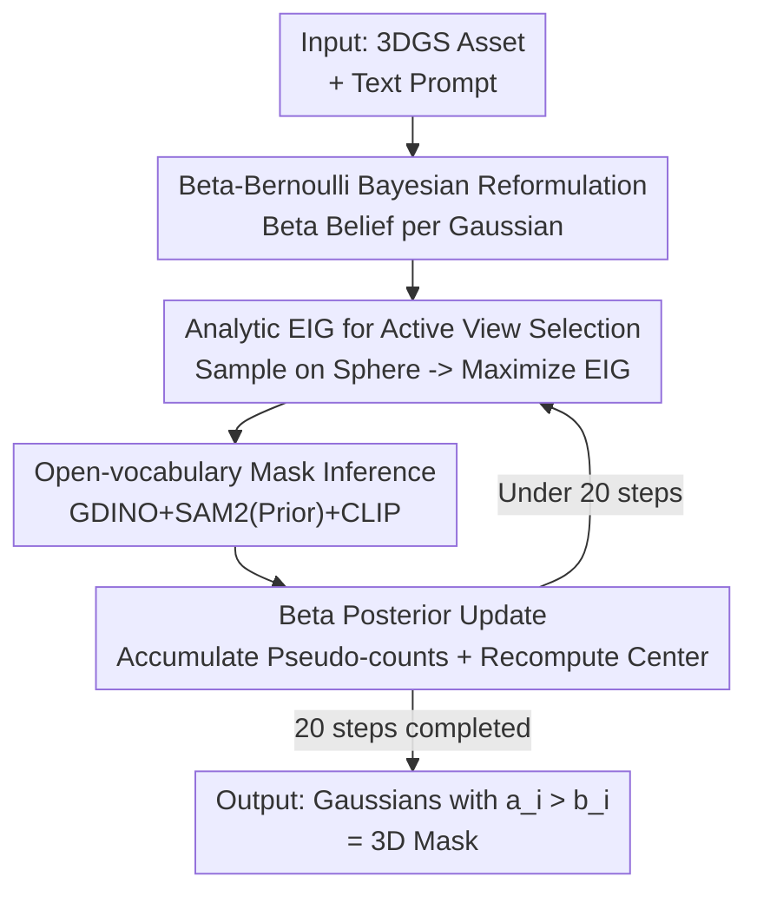

# B³-Seg: Camera-Free, Training-Free 3DGS Segmentation via Analytic EIG and Beta-Bernoulli Bayesian Updates

**Conference**: CVPR 2026  
**Paper**: [CVF Open Access](https://openaccess.thecvf.com/content/CVPR2026/html/Kamata_B3-Seg_Camera-Free_Training-Free_3DGS_Segmentation_via_Analytic_EIG_and_Beta-Bernoulli_CVPR_2026_paper.html)  
**Code**: Not public (No repository link provided in paper)  
**Area**: 3D Vision / Semantic Segmentation  
**Keywords**: 3DGS Segmentation, Bayesian Update, Active View Selection, Expected Information Gain, Open-vocabulary  

## TL;DR
B³-Seg reformulates the task of "segmenting target objects on an off-the-shelf 3DGS asset" into a sequence of Beta-Bernoulli Bayesian updates. By utilizing an analytic form of Expected Information Gain (EIG) to actively select the most informative next camera view, the method achieves camera-free, training-free, open-vocabulary results in seconds. Its accuracy approaches that of supervised methods that require tens of minutes.

## Background & Motivation

**Background**: In film and game production, it is increasingly common for teams to share reconstructed 3DGS assets (a collection of 3D Gaussians) for interactive editing, such as selecting, deleting, or replacing specific objects. This necessitates 3DGS semantic segmentation. Current mainstream open-vocabulary 3DGS segmentation methods (LERF, Gaussian Grouping, OpenGaussian, ObjectGS, etc.) offer high precision.

**Limitations of Prior Work**: Nearly all high-precision methods assume the availability of **pre-defined camera views / reconstructed images, ground truth semantic masks, or per-scene re-optimization**. LERF takes 45 minutes, while ObjectGS takes approximately 50 minutes with 30,000 optimization steps. Even "second-level" methods like FlashSplat and COB-GS still assume the existence of reconstruction views and semantic masks, lacking theoretical guarantees. In practice, users often only have a standalone 3DGS file without camera trajectories or annotations and require low latency.

**Key Challenge**: Accuracy depends on "large-scale views + annotations + long optimization," while interactive editing demands "camera-free, training-free, and results within seconds"—two goals in direct conflict. Existing methods are either slow and accurate or fast but reliant on external conditions.

**Goal**: Achieve accurate 3D mask generation within seconds under the triple constraints of being camera-free (no trajectories provided), training-free (no re-training), and open-vocabulary (text-specified objects).

**Key Insight**: The authors observed that the hard-decision rule in FlashSplat—which compares visible responses inside and outside the mask—is essentially a Bayesian Maximum A Posteriori (MAP) decision under a symmetric Beta prior. Since segmentation is inherently the estimation of the probability that each Gaussian belongs to a target, it should be modeled within a probabilistic framework. Such a framework naturally answers "which view is the most informative to look at next."

**Core Idea**: B³-Seg reformulates 3DGS segmentation as view-by-view Beta-Bernoulli Bayesian posterior updates. It uses **analytic EIG** (estimating information gain for each candidate view without actually running segmentation) to greedily select views. This ensures efficient convergence within a fixed 20-view budget, with a theoretical guarantee of $(1-1/e)$ approximation optimality.

## Method

### Overall Architecture

The input to B³-Seg is an existing 3DGS scene $G=\{g_i\}$ (where each Gaussian has a mean $\mu_i$, covariance, opacity $\omega_i$, and color $c_i$) and a user text prompt (e.g., "stuffed bear"). The output is a subset of Gaussians representing the 3D mask. The pipeline is a closed loop of "Active View Selection → Observation → Belief Update," iterating for a fixed $T=20$ steps.

Specifically, a Beta prior $\text{Beta}(a_{\text{init}},b_{\text{init}})$ is assigned to each Gaussian. An initial mask is obtained from a single canonical view (the first camera pose in the dataset, not considered extra supervision), and the object center $c_{\text{obj}}$ and radius $r_{\text{obj}}$ are estimated. In each subsequent round: $N_{\text{cand}}=20$ candidate cameras are sampled uniformly on a sphere centered at $c_{\text{obj}}$. For each candidate, the **analytic EIG** is calculated after a single render to select the view $v^*$ with maximum gain. An open-vocabulary segmentation module is run on $v^*$ to get a 2D mask, which is converted into success/failure pseudo-counts for each Gaussian to perform a Beta posterior update. The updated foreground Gaussians are then used to recompute $c_{\text{obj}}$ and $r_{\text{obj}}$. After 20 steps, Gaussians satisfying $a_i > b_i$ form the final 3D mask.

### Key Designs

**1. Beta-Bernoulli Bayesian Reformulation: Replacing Hard Decisions with Cumulative Beliefs**

Methods like FlashSplat treat Gaussian $g_i$ membership as a one-time linear programming or hard decision, which fails to accumulate evidence incrementally or quantify uncertainty. The authors model the membership variable $y_i \in \{0, 1\}$ using a Beta-Bernoulli conjugate model: $y_i \mid p_i \sim \text{Bernoulli}(p_i)$ and $p_i \sim \text{Beta}(a_i, b_i)$. Given a rendered image $I(v)$ and mask $M(v)$ at view $v$, the "visible responsibility" $\omega_i T_i$ (where transmittance $T_i = \prod_{j<i}(1-\omega_j)$) for each pixel is accumulated as success/failure pseudo-counts based on whether the pixel falls inside or outside the mask:

$$e_{i,1}(v)=\sum_{(j,k)\in I(v)}\omega_i T_i\,\mathbb{1}[M_{j,k}(v)=1],\quad e_{i,0}(v)=\sum_{(j,k)\in I(v)}\omega_i T_i\,\mathbb{1}[M_{j,k}(v)=0]$$

Due to conjugacy, the posterior update is a simple addition: $\text{Beta}(a_i, b_i) \to \text{Beta}(a_i+e_{i,1}, b_i+e_{i,0})$. After multiple views, $p_i \sim \text{Beta}(a_{\text{init}}+\sum_v e_{i,1},\,b_{\text{init}}+\sum_v e_{i,0})$. Crucially, if $a_{\text{init}} = b_{\text{init}}$, the MAP decision $y_i = \arg\max_n \sum_v e_{i,n}(v)$ is **exactly equivalent to the decision rule in FlashSplat**. This aligns the proposed framework as a generalization of proven hard-decision methods while adding measurability of uncertainty.

**2. Analytic EIG Active View Selection: Estimating Information Value Without Segmentation**

With the probabilistic framework, view selection is driven by Information Gain (IG), defined as the drop in total entropy: $IG(v) = \sum_i \{H(\text{Beta}(a_i, b_i)) - H(\text{Beta}(a_i+e_{i,1}, b_i+e_{i,0}))\}$. However, calculating $IG(v)$ requires the true mask $M(v)$, which would necessitate running an expensive SAM2 model for every candidate view.

The authors circumvent this using **Expected Information Gain (EIG)**. Each candidate view is rendered once to get the total visible responsibility $\varepsilon_i = \sum_{(j,k) \in I(v)} \omega_i T_i$. The current Beta mean $m_i = a_i / (a_i + b_i)$ is used as the probability that the Gaussian falls within the mask. The pseudo-counts are approximated as $\tilde{e}_{i,1} = m_i \varepsilon_i$ and $\tilde{e}_{i,0} = (1-m_i) \varepsilon_i$, leading to:

$$\text{EIG}(v) = \sum_i \{H(\text{Beta}(a_i, b_i)) - H(\text{Beta}(a_i+\tilde{e}_{i,1},\,b_i+\tilde{e}_{i,0}))\},\quad v^* = \arg\max_v \text{EIG}(v)$$

This allows candidate evaluation via lightweight rendering and entropy calculations, skipping $N_{\text{cand}}$ expensive SAM2 inferences (which account for major runtime). The authors verified that EIG is highly correlated with true IG ($r = 0.964$).

**3. Open-Vocabulary Mask Inference: Three-Stage Pipeline with Posterior Guidance**

The selected view $v^*$ requires a reliable 2D mask. To prevent drifting to distractors in cluttered scenes, the authors use a three-stage module: (1) **Grounding DINO** generates candidate boxes $\{B_k\}$ based on text; (2) **SAM2** generates masks for each box, using a soft prior map $R_{\text{soft}}(v^*) = \sum_i m_i \omega_i T_i$ (transformed via logit $R = \log \frac{R_{\text{soft}}}{1-R_{\text{soft}}}$) to guide SAM2 towards previously identified regions; (3) **CLIP Reranking**: Candidate masks are cropped and scored against user text using CLIP to select the final mask.

**4. Theoretical Guarantee: $(1-1/e)$ Approximation for Greedy Selection**

The authors prove that EIG satisfies two properties: **Adaptive Monotonicity** (Beta entropy is non-increasing when $\alpha_i = a_i + b_i \ge 2$) and **Adaptive Submodularity** (marginal gain decreases as more views are observed). Per the adaptive submodular optimization theorem (Golovin & Krause), the greedy strategy of selecting $\arg\max_v \text{EIG}(v \mid S)$ achieves a total information gain satisfying $\mathbb{E}[\text{EIG}(S_k^{\text{greedy}})] \ge (1-1/e) \max_\pi \mathbb{E}[\text{EIG}(S_k^\pi)]$, providing a theoretical lower bound of approximately $63\%$ of the optimal strategy.

### Loss & Training

This method is training-free and has no learnable parameters. Hyperparameters are fixed at $T=20$ iterations, $N_{\text{cand}}=20$ candidates, and $a_{\text{init}}=b_{\text{init}}=1$. The candidate sphere radius is set to $r_{\text{sphere}} = 1.5 \, r_{\text{obj}} / \tan(\text{fov}/2)$. All processes are completed end-to-end in seconds on a single RTX A6000.

## Key Experimental Results

Evaluations were conducted on LERF-Mask and 3D-OVS. Baselines include high-precision supervised methods and two variants of the sampling-based FlashSplat: Uniform-Sphere (random selection on a sphere) and Recon-Cam (random selection from reconstructed cameras).

### Main Results

LERF-Mask (mIoU/mBIoU, higher is better; Time is end-to-end latency):

| Method | figurines | ramen | teatime | mean | View/Label | Time |
|--------|-----------|-------|---------|------|------------|------|
| Gaussian Grouping | 69.7/67.9 | 77.0/68.8 | 71.7/66.1 | 72.8/67.6 | GT | 37 min |
| ObjectGS | 88.2/89.0 | 88.0/79.9 | 88.9/88.6 | 88.4/85.8 | GT | ~50 min |
| FlashSplat (Uniform-Sphere) | 60.2/57.5 | 68.4/61.5 | 80.4/76.3 | 69.6/65.1 | Sample | 10.2 s |
| FlashSplat (Recon-Cam) | 71.6/69.1 | 71.4/66.3 | 86.6/83.9 | 76.5/73.1 | Sample | 10.1 s |
| **B³-Seg (Ours)** | **88.3/85.4** | 75.3/69.7 | 89.8/88.0 | **84.5/81.0** | Sample | 12.1 s |

B³-Seg outperforms other sampling-based methods by a significant margin and approaches the accuracy of supervised SOTA (ObjectGS) while being significantly faster.

3D-OVS (mIoU%):

| Method | Bed | Bench | Sofa | Lawn | Constraint |
|--------|-----|-------|-------|------|------------|
| ObjectGS | 98.0 | 96.4 | 97.2 | 95.4 | Needs Views/GT |
| FlashSplat (Uniform-Sphere) | 91.7 | 86.9 | 90.2 | 91.9 | Camera-free |
| FlashSplat (Recon-Cam) | 94.3 | 90.3 | 85.7 | 96.3 | Camera-free |
| **B³-Seg (Ours)** | **97.1** | **92.2** | **94.1** | **96.8** | Camera-free |

### Ablation Study

Validating CLIP reranking and SAM2 prior on LERF-Mask:

| CLIP Rerank | SAM2 Prior Map | mIoU | mBIoU | Δ vs Base |
|-------------|----------------|------|-------|-----------|
| ✗ | ✗ | 74.9 | 70.2 | – |
| ✓ | ✗ | 81.5 | 76.6 | +6.6/+6.4 |
| ✓ | ✓ | 84.5 | 81.0 | +9.6/+10.8 |

The combination provides a substantial gain of +9.6 mIoU. CLIP filters out inconsistent detections while the SAM2 prior stabilizes masks across views.

### Key Findings
- **Reliability of EIG**: The high correlation ($r=0.964$) between analytic EIG and true IG demonstrates that the analytic proxy is a reliable ranking metric.
- **Parameter Saturation**: mIoU saturates quickly; increasing $N_{\text{cand}}$ or $T$ beyond 20 yields diminishing returns.
- **Robustness**: Shifting the initial object center $c_{\text{obj}}$ by 100% of the radius $r_{\text{obj}}$ results in only a 3.8% mIoU drop, showing that active sampling compensates for poor initialization.

## Highlights & Insights
- **Probabilistic Generalization**: By proving that existing hard-decision heuristics are special MAP cases of a Beta-Bernoulli model, the authors created a theoretically grounded framework that naturally supports uncertainty and incremental evidence.
- **Efficiency via Analytic Approximation**: Approximating pseudo-counts using the posterior mean $m_i$ resolves the "chicken-and-egg" problem of needing a mask to compute information gain, enabling real-time view evaluation.
- **Theoretical Grounding**: Utilizing submodular optimization theorems elevates the method from a heuristic-based engineering solution to a principled approximation algorithm with a $(1-1/e)$ guarantee.

## Limitations & Future Work
- The experiments primarily focused on object-centric scenes. Scaling to large-scale indoor or outdoor scans may require broader exploration strategies (e.g., RRT sampling).
- The current model only handles binary foreground/background segmentation. Extending this to a Dirichlet-Categorical model for multi-class segmentation is theoretically possible but remains for future work.
- Mask inference relies heavily on external models (GDINO/SAM2/CLIP). If open-vocabulary localization fails due to rare classes or ambiguous prompts, the Bayesian accumulation will be misled.

## Related Work & Insights
- **vs FlashSplat / COB-GS**: B³-Seg is also a fast sampling-based method but operates without camera trajectories or masks and provides theoretical guarantees.
- **vs Gaussian Grouping / ObjectGS**: These methods provide high precision but require per-scene optimization (~50 min). B³-Seg reduces this to 12 seconds with minimal accuracy loss.
- **Transferability**: The "Beta pseudo-count + Analytic EIG" paradigm is broadly applicable to any 3D active perception task where rendering is cheap but labeling is expensive.

## Rating
- **Novelty**: ⭐⭐⭐⭐⭐ (Elegant reformulation of segmentation as Bayesian updates with analytic active sampling).
- **Experimental Thoroughness**: ⭐⭐⭐⭐ (Solid evaluation on two datasets, but lacks verification on large-scale complex scenes).
- **Writing Quality**: ⭐⭐⭐⭐⭐ (Clear logic, strong theoretical support, and intuitive illustrations).
- **Value**: ⭐⭐⭐⭐⭐ (Provides a practical, fast, and theoretically sound solution for the real-world 3DGS editing bottleneck).

<!-- RELATED:START -->

## Related Papers

- [\[CVPR 2026\] INSID3: Training-Free In-Context Segmentation with DINOv3](insid3_training-free_in-context_segmentation_with_dinov3.md)
- [\[CVPR 2026\] The Power of Prior: Training-Free Open-Vocabulary Semantic Segmentation with LLaVA](the_power_of_prior_training-free_open-vocabulary_semantic_segmentation_with_llav.md)
- [\[CVPR 2026\] Making Training-Free Diffusion Segmentors Scale with the Generative Power](making_training-free_diffusion_segmentors_scale_with_the_generative_power.md)
- [\[CVPR 2026\] PEARL: Geometry Aligns Semantics for Training-Free Open-Vocabulary Semantic Segmentation](pearl_geometry_aligns_semantics_for_training-free_open-vocabulary_semantic_segme.md)
- [\[CVPR 2026\] Direct Segmentation without Logits Optimization for Training-Free Open-Vocabulary Semantic Segmentation](direct_segmentation_without_logits_optimization_for_training-free_open-vocabular.md)

<!-- RELATED:END -->
