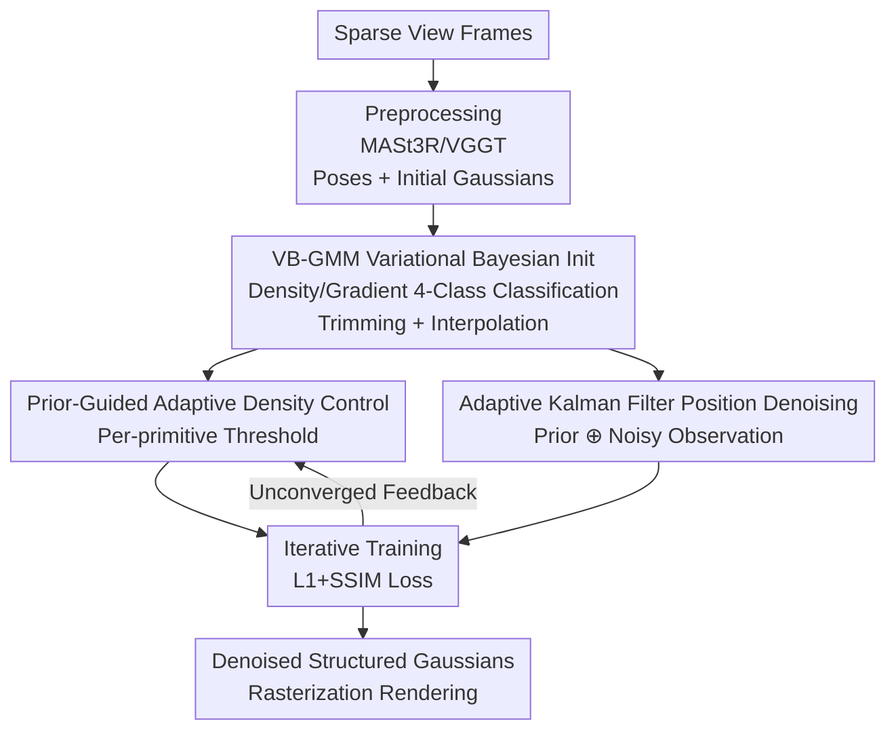

# BA-GS: Bayesian Adaptive Gaussian Splatting for SFM-Free 3D Reconstruction

**Conference**: CVPR 2026  
**Paper**: [CVF Open Access](https://openaccess.thecvf.com/content/CVPR2026/html/Ma_BA-GS_Bayesian_Adaptive_Gaussian_Splatting_for_SFM-Free_3D_Reconstruction_CVPR_2026_paper.html)  
**Code**: TBD  
**Area**: 3D Vision  
**Keywords**: 3D Gaussian Splatting, SfM-free, sparse-view reconstruction, Bayesian uncertainty, Kalman filter

## TL;DR
For SfM-free 3D Gaussian Splatting under sparse views, BA-GS explicitly models the uncertainty of Gaussian primitives using a two-level Bayesian framework. For global initialization, a Variational Bayesian Gaussian Mixture Model (VB-GMM) classifies primitives into four categories based on density and gradient for trimming and interpolation. For local refinement, an adaptive Kalman filter treats each gradient update step as a noisy observation to fuse with the prior. BA-GS comprehensively outperforms baselines like InstantSplat in terms of PSNR, SSIM, and LPIPS on Tanks and Temples, MVImgNet, and LLFF, while using fewer primitives and achieving faster rendering.

## Background & Motivation

**Background**: 3D Gaussian Splatting (3DGS) has become the mainstream for novel view synthesis and scene reconstruction, thanks to its explicit representation and training speeds significantly faster than NeRF. However, both 3DGS and NeRF heavily rely on accurate camera poses and well-initialized 3D structures, which are typically provided by Structure-from-Motion (SfM) tools like COLMAP.

**Limitations of Prior Work**: In sparse-view or inaccurate-pose settings, the scene priors provided by SfM are incomplete or even erroneous, leading to blurry or distorted reconstruction results. To overcome the dependency on external SfM, prior works like InstantSplat and CF-3DGS turn to pre-trained image matching/reconstruction networks (such as DUSt3R, MASt3R, and VGGT) to directly generate dense primitives and infer camera poses. However, these methods often produce redundant or noisy primitives under sparse, textureless views, as they still rely on **deterministic optimization** without explicitly modeling uncertainty.

**Key Challenge**: The lack of image constraints from sparse input views causes geometric ambiguity—a single point may correspond to multiple plausible locations, introducing noise around the true geometry. This ambiguity is fundamentally the inherent uncertainty of the reconstruction process: it manifests in both the initial primitive distribution and the iterative position updates, and it **accumulates**, ultimately degrading reconstruction fidelity. Existing methods either use uncertainty only for post-processing (pruning, active sampling) or perform Bayesian inference in implicit representations, failing to explicitly model uncertainty at both the initialization and optimization stages of 3DGS.

**Goal**: To propagate uncertainty from initialization through to rendering optimization, decomposed into two sub-problems: (1) how to provide a more structured and trustworthy distribution for the initial primitives; (2) how to suppress noise and stabilize geometry during backpropagation position updates.

**Key Insight**: The authors observe that reconstructed primitives are not arbitrarily distributed—their density and gradient characteristics exhibit spatial patterns consistent with scene geometry and semantic structures. Meanwhile, each position update during rendering can be viewed as a **noisy observation** of the latent true primitive state. The former is well-suited for probability generative models to depict latent distributions, while the latter naturally fits the recursive estimation of Kalman filtering. The paper further employs the Central Limit Theorem to demonstrate that approximating prediction and observation noise as zero-mean Gaussian is reasonable (minimizing L2/SSIM residual is equivalent to maximum likelihood estimation under Gaussian noise).

**Core Idea**: Replace deterministic optimization with a two-level complementary Bayesian framework: a global layer that uses variational Bayes to characterize the latent distribution of primitives for a cleaner initialization, and a local layer that utilizes adaptive Kalman filtering for uncertainty-aware position denoising to make sparse-view reconstruction more robust.

## Method

### Overall Architecture
BA-GS follows the classical Gaussian Splatting pipeline but inserts a Bayesian optimization phase in the middle. The entire pipeline consists of three steps: **(1) Preprocessing**—inferring camera poses and generating initial 3D Gaussians from sparse view frames using a pre-trained MASt3R (or VGGT); **(2) Global Initialization**—fitting a VB-GMM to the initial primitives, combining multi-view aggregated density and gradient priors to classify the primitives into four categories in the "density-gradient" space, and then performing trimming (removing outliers) and interpolation (filling sparse edges) to obtain a more structured starting distribution; **(3) Local Refinement and Training (Iteration)**—during training, on one hand, a prior-guided Adaptive Density Control (ADC) adjusts the densification threshold based on the local complexity of each primitive; on the other hand, an adaptive Kalman filter treats each gradient update as a noisy observation to recursively fuse with the position prior, dynamically adjusting the covariance according to local uncertainty. This iterates to convergence, resulting in a denoised, structured Gaussian representation which is then rendered via 3DGS rasterization and supervised with L1+SSIM loss.

The three contributing components—VB-GMM global initialization, prior-guided adaptive density control, and adaptive Kalman filtering position denoising—correspond to "modeling global distribution at initialization" and "modeling local uncertainty at optimization", respectively, complementarily bridging probability distribution modeling with uncertainty-aware optimization.

### Key Designs

**1. VB-GMM Variational Bayesian Initialization: Providing a Structured, Trimmable Latent Distribution for Initial Primitives**

To address the pain points of redundant and noisy primitives in SfM-free initialization, the authors treat the entire set of Gaussians as a high-dimensional probability density modeling problem rather than independent points. Unlike deterministic clustering such as k-means, which hard-assigns each sample to a single cluster with fixed parameters, Variational Bayes estimates the **posterior distribution** of mixture components and parameters. This is crucial under sparse views since the projection of a single primitive could be explained by multiple plausible local surfaces, and hard clustering would discard this ambiguity. Specifically, each primitive uses its local density $d_i$ and gradient $g_i$ as observations to construct the observation matrix $X \in \mathbb{R}^{N\times 2}$, assuming it is generated by a Gaussian Mixture:

$$p(X \mid \pi, \mu, \Sigma) = \prod_{i=1}^{N} \sum_{k=1}^{K} \pi_k\, \mathcal{N}(x_i \mid \mu_k, \Sigma_k)$$

where $\pi_k$ is the mixing weight of the $k$-th component, satisfying $\sum_k \pi_k = 1$. Since the exact posterior is intractable, a variational distribution $q(Z,\pi,\mu,\Sigma)\approx p(Z,\pi,\mu,\Sigma\mid X)$ is introduced to approximate the true posterior (where $Z$ represents the latent cluster assignment of each primitive), which is optimized by maximizing the Evidence Lower Bound (ELBO):

$$L(q) = \mathbb{E}_q[\log p(X, Z, \pi, \mu, \Sigma)] - \mathbb{E}_q[\log q(Z, \pi, \mu, \Sigma)]$$

Upon convergence, each primitive receives a posterior probability belonging to each class. When the posterior confidence for a certain region exceeds a threshold $\tau$, it is assigned to that region. Primitives are classified into four categories in the "density-gradient" space—Class A: Reliable Details, Class B: Flat Surfaces, Class C: Sparse Edges, and Class D: Outliers—and are processed accordingly. Trimming is applied to the outlier class, and interpolating is applied to the sparse edge class, yielding a cleaner and better-covering initial distribution before training. The density prior is obtained by constructing a KD-Tree on the initial point cloud from MASt3R and counting the number of points in a fixed-radius neighborhood. The gradient prior is computed by projecting each point onto the valid image regions of each view, linearly fusing color and depth gradients after a depth consistency check, and then aggregating and normalizing them to $[0, 1]$ across views.

**2. Prior-Guided Adaptive Density Control: Adapting the Densification Threshold with Local Geometric Complexity**

The adaptive density control (ADC) in vanilla 3DGS uses a globally fixed threshold to decide where to clone or split primitives. This "one-size-fits-all" approach leads to over-densification in simple regions and insufficient detail in complex regions. This work alters the threshold to be **per-primitive**, conditioned on the local prior. For the $i$-th primitive, the adaptive densification threshold is defined as:

$$\tau_i = \tau_0 \cdot \psi(\alpha_g g_i + \alpha_d d_i)$$

where $\tau_0$ is the base threshold, $\psi(\cdot)$ is a bounded, monotonically increasing mapping function, $g_i$ and $d_i$ are the normalized gradient and density priors, and $\alpha_g, \alpha_d$ control their respective influences (implemented as $\psi(x)=1+\lambda(2x-1)$). Consequently, high-gradient/high-density regions get more sensitive thresholds and are more inclined to densify details, whereas flat regions remain sparse. Newly generated primitives inherit the gradient and density priors of their parent primitives to maintain consistency in feature representation within local regions. Sharing the same set of density/gradient priors as the Kalman filter, this mechanism serves as a bridge translating "global distribution modeling" into localized point distribution control during training.

**3. Adaptive Kalman Filtering Position Denoising: Treating Each Gradient Update Step as a Noisy Observation to Fuse**

3DGS optimizes primitive positions using gradient descent. However, under sparse views and inconsistent photometric gradients, this process **accumulates position noise**, causing geometric instability and appearance inconsistency. The authors treat each primitive's position $x_i=[x,y,z]^T$ as a latent state and each optimization iteration as a Kalman update step, modeled by state and observation equations:

$$x_{i,t} = F_t x_{i,t-1} + w_t, \qquad z_{i,t} = H_t x_{i,t} + v_t$$

where $F_t$ is the state transition matrix, $w_t$ is the process noise (zero-mean Gaussian, with covariance $Q_t$ propagated from the previous iteration), $H_t$ is the observation matrix describing the 3D-to-2D projection, and $v_t$ is the observation noise reflecting photometric evidence. The filter recursively fuses the prior (the predicted position propagated) and the noisy observation (the current gradient update) according to their respective confidences to obtain the posterior state. The key to being "adaptive" lies in letting the observation noise covariance $R_t$ also vary with the local prior:

$$R_t = R_0 \cdot \phi(\alpha_g g_i + \alpha_d d_i)$$

$R_0$ is the base noise covariance, and $\phi(\cdot)$ is a bounded, monotonically **decreasing** mapping (implemented as $\phi(x)=1-\lambda(2x-1)$). The intuition is: gradient magnitude reflects the complexity and reliability of the image structure, so high-gradient regions (with reliable visual cues and stable geometry) are assigned a smaller $R_t$ to place more trust in observation, whereas flat or ambiguous regions are given a larger $R_t$ to place more trust in the prior. Compared to using manually tuned loss weights and heuristic thresholds, this method explicitly incorporates prediction/observation uncertainty into the covariance matrix and adaptively fuses them via Bayesian updates, making it more suitable for noisy and structurally complex sparse-view 3DGS. Although filtering is applied per-primitive, the recursive form and efficient implementation of the adaptive covariance keep the extra computational overhead highly manageable.

### Loss & Training
Rendering supervision follows the standard L1 + SSIM photometric loss of 3DGS. The density/gradient priors for the Kalman filter and ADC are shared during training. Implementation-wise, pre-trained VGGT and MASt3R are used as initialization modules. The mapping functions are set to $\psi(x)=1+\lambda(2x-1)$ and $\phi(x)=1-\lambda(2x-1)$. The base threshold is $\tau_0 = 2\times10^{-4}$, $\alpha_g=\alpha_d=0.5$, and the base noise covariance for the Kalman filter is $R_0=10^{-2}$ ($\beta_g=\beta_d=0.5$ ⚠️ subject to the original text, where notations slightly differ from $\alpha$). Due to the dynamic densification introduced by ADC, the authors accordingly increased the number of iteration steps to ensure convergence. All experiments were conducted on a single RTX 4080 GPU (CUDA 11.8).

## Key Experimental Results

Datasets: Tanks and Temples, MVImgNet, and LLFF; 3/6/12/18 views are uniformly sampled per scene for training, and 12 of the remaining views are randomly selected for testing. Metrics include the standard novel view synthesis metrics PSNR↑, SSIM↑, LPIPS↓, as well as rendering time↓. Comparisons include SfM-based (NeRFmm) and SfM-free (InstantSplat, MASt3R+DropGaussian, MASt3R+FS-GS) baselines, tested under both MASt3R and VGGT front-end initializations.

### Main Results (Tanks and Temples, Selected 12/18 Views)

| Method | PSNR↑ (12v) | SSIM↑ (12v) | LPIPS↓ (12v) | PSNR↑ (18v) | LPIPS↓ (18v) | Rendering Time↓ (12v) |
|------|------|------|------|------|------|------|
| NeRFmm | 19.97 | 0.468 | 0.602 | 19.69 | 0.573 | 276 |
| InstantSplat | 30.09 | 0.922 | 0.0844 | 29.10 | 0.1012 | 172 |
| MASt3R+DropGaussian | 30.19 | 0.918 | 0.0797 | 29.15 | 0.0988 | 160 |
| MASt3R+FS-GS | 28.04 | 0.860 | 0.0849 | 27.12 | 0.1064 | 201 |
| **MASt3R+BA-GS (Ours)** | **31.61** | **0.9367** | **0.0673** | **31.04** | **0.0750** | **153** |
| VGGT+InstantSplat | 27.76 | 0.885 | 0.1418 | 26.54 | 0.1617 | 181 |
| **VGGT+BA-GS (Ours)** | **29.97** | **0.917** | **0.0991** | **29.16** | **0.1091** | **119** |

Under MASt3R initialization, BA-GS improves PSNR from 30.09 to 31.61 and reduces LPIPS from 0.0844 to 0.0673 on 12 views, while also reducing rendering time from 172s to 153s (faster due to fewer primitives). This is even more prominent when using the "fast but noisy" VGGT feedforward prior: InstantSplat degrades severely due to its inability to handle position noise (12-view PSNR is only 27.76), whereas VGGT+BA-GS reaches 29.97. The paper states that VGGT+BA-GS outperforms VGGT+InstantSplat by approximately 2-3 dB on Tanks and Temples, demonstrating robust performance against noisy initialization. The conclusions on MVImgNet and LLFF are consistent, with the paper reporting that the average LPIPS improvement of VGGT+BA-GS on LLFF compared to InstantSplat can reach up to +47.91% (⚠️ this percentage refers to the original paper's table caption formulation, averaged across views, subject to the original text).

### Ablation Study (Tanks and Temples, 12 Views)

| Configuration | VB-GMM | ADC | Position Filtering | PSNR↑ | SSIM↑ | LPIPS↓ | Rendering Time↓ |
|------|:---:|:---:|:---:|------|------|------|------|
| Full (Ours) | ✓ | ✓ | ✓ | **31.61** | **0.9367** | **0.0673** | 153.88 |
| Baseline | × | × | × | 30.09 | 0.9220 | 0.0844 | 190.25 |
| No VB-GMM | × | ✓ | ✓ | 31.04 | 0.9276 | 0.0706 | 169.82 |
| No ADC | ✓ | × | ✓ | 31.02 | 0.9274 | 0.0701 | 162.94 |
| No Position Filtering | ✓ | ✓ | × | 31.19 | 0.9291 | 0.0682 | 170.00 |

### Key Findings
- **VB-GMM contributes the most**: Removing it causes PSNR to drop from 31.61 to 31.04, LPIPS to increase from 0.0673 to 0.0706, and rendering time to rise from 153.88s to 169.82s (more/slower primitives due to the absence of probability trimming). This demonstrates that probabilistic modeling of the latent primitive distribution is the key to mitigating noise in SfM-free sparse initialization.
- **Position filtering (Kalman) suppresses training-time dynamic noise**: Removing it individually causes a relatively mild drop in PSNR (31.61→31.19), but it is vital for preventing geometric degradation during iterations under sparse constraints—serving to "stabilize the optimization trajectory" rather than purely as a "one-time score booster".
- **ADC provides complementary benefits**: Removing it drops the PSNR to 31.02; its role is to adaptively balance local detail retention and global coverage based on density/gradient priors.
- **Better convergence**: The convergence curves on 12-view MVImgNet show that BA-GS reaches a higher performance ceiling and stabilizes better in later stages, whereas InstantSplat degrades and oscillates later on. The variance of BA-GS across scenes is also significantly smaller (the small fluctuations around step 500 stem from the transient effect of ADC).

## Highlights & Insights
- **Re-formulating "Gaussian Splatting optimization" as Bayesian filtering**: Using CLT + Maximum Likelihood to justify "L2/SSIM residual ≈ Gaussian noise", thereby naturally treating each gradient update step as a Kalman observation. This elegantly connects an engineered optimization process to a theoretically grounded recursive estimation framework.
- **Uncertainty governs both ends simultaneously**: Prior works either build probability models only at initialization or process uncertainty post-hoc within implicit representations. The ingenuity of BA-GS lies in the complementarity between the global (GMM-based distribution modeling) and local (Kalman-based denoising) layers, which close the loop by sharing the same set of density/gradient priors.
- **"The noisier the feedforward prior, the more valuable the method"**: The advantages are amplified when using fast but noisy initializations like VGGT. This indicates that the framework fundamentally compensates for the lack of noise robustness in deterministic optimization, serving as a general plug-and-play uncertainty-aware optimization module for various reconstruction pipelines.
- **Transferable trick**: The mapping that uses local gradient magnitude as "observation confidence" to tune the Kalman observation noise covariance (high gradient $\rightarrow$ low $R_t$) can be transferred to any scenario involving "element-wise noisy optimization + local reliability signals", such as point cloud registration and joint depth optimization.

## Limitations & Future Work
- **Boundaries of the Gaussian noise assumption**: The method is built on the assumption that "prediction/observation noise approximates Gaussian". In textureless or heavily occluded regions, this assumption may fail, and density/gradient priors might not sufficiently capture the uncertainty.
- **Extra computational overhead**: Adaptive filtering introduces additional computation during training. Although the authors emphasize that per-primitive filtering overhead is manageable and the overall rendering speed is faster due to fewer primitives, training costs still rise. The authors mention that model compression could mitigate this issue.
- **Position-only optimization**: Currently, the Kalman state only contains 3D positions $[x, y, z]$ of the primitives, leaving out attributes like color and opacity. The authors look forward to extending the Bayesian formulation to color and opacity estimation and introducing richer priors.
- **Own observation**: The sensitivity of the 4-class classification, threshold $\tau$, and hyper-parameters of the mapping functions ($\lambda, \alpha_g/\alpha_d$) is not fully detailed in the paper. The pseudo-code for trimming/interpolation is placed in the supplementary material, leaving the details of "how Class C interpolates new primitives" somewhat under-explained in the main manuscript.

## Related Work & Insights
- **vs InstantSplat / CF-3DGS**: While they similarly employ pre-trained matching networks like DUSt3R/MASt3R for SfM-free initialization, they rely on deterministic optimization without modeling uncertainty, which easily produces redundant/noisy primitives under sparse views. BA-GS adds Bayesian modeling to both initialization and optimization, yielding fewer, stabler, and more accurate primitives.
- **vs Variational Inference 3DGS ([1])**: Both adopt Bayesian concepts, but [1] primarily integrates confidence prediction into rendering for uncertainty estimation. In contrast, BA-GS combines **Bayesian clustering** (VB-GMM) with **adaptive inference** (Kalman) to jointly update uncertainty estimation and Gaussian parameters, unifying probabilistic parameter estimation and adaptive control of primitive attributes in a single framework.
- **vs 3DGS-MCMC**: The latter reformulates splatting as stochastic sampling using SGLD to replace heuristic cloning/pruning. BA-GS pursues a filtering/variational path, emphasizing "recursive fusion of priors and observations" rather than sampling.
- **vs Bayesian NeRF / Bayes' Rays / KfD-NeRF**: These perform uncertainty quantification or Kalman-guided deformation on implicit NeRFs. BA-GS ports such ideologies to the explicit, interpretable, and faster-to-train 3DGS representation, making it a better fit for large-scale/sparse scenes.

## Rating
- Novelty: ⭐⭐⭐⭐ Unifying VB-GMM global distribution modeling with adaptive Kalman local denoising into SfM-free 3DGS represents a novel combination of dual-ended uncertainty modeling.
- Experimental Thoroughness: ⭐⭐⭐⭐ Comprehensive comparison across three datasets, four view settings, and two initializations; ablation studies clearly separate the contributions of the three modules. However, sensitivity analysis of hyperparameters and classification details are slightly under-elaborated.
- Writing Quality: ⭐⭐⭐⭐ The motivation progresses logically, and the Bayesian formulation is coherent; only minor discrepancies are present in some notations ($\alpha$ vs. $\beta$).
- Value: ⭐⭐⭐⭐ Provides a plug-and-play uncertainty-aware optimization scheme that delivers significant gains, particularly when using fast but noisy feedforward priors, offering great practical value for scalable sparse-view reconstruction.

<!-- RELATED:START -->

## Related Papers

- [\[CVPR 2026\] PhysGS: Bayesian-Inferred Gaussian Splatting for Physical Property Estimation](physgs_bayesian-inferred_gaussian_splatting_for_physical_property_estimation.md)
- [\[CVPR 2026\] FilterGS: Traversal-Free Parallel Filtering and Adaptive Shrinking for Large-Scale LoD 3D Gaussian Splatting](filtergs_traversal-free_parallel_filtering_and_adaptive_shrinking_for_large-scal.md)
- [\[CVPR 2026\] E2EGS: Event-to-Edge Gaussian Splatting for Pose-Free 3D Reconstruction](e2egs_event-to-edge_gaussian_splatting_for_pose-free_3d_reconstruction.md)
- [\[CVPR 2026\] Exact-GS: Mathematically Rigorous and Accurate 3D Gaussian Splatting for 3D X-ray Reconstruction](exact-gs_mathematically_rigorous_and_accurate_3d_gaussian_splatting_for_3d_x-ray.md)
- [\[CVPR 2026\] TokenSplat: Token-aligned 3D Gaussian Splatting for Feed-forward Pose-free Reconstruction](tokensplat_token-aligned_3d_gaussian_splatting_for_feed-forward_pose-free_recons.md)

<!-- RELATED:END -->
