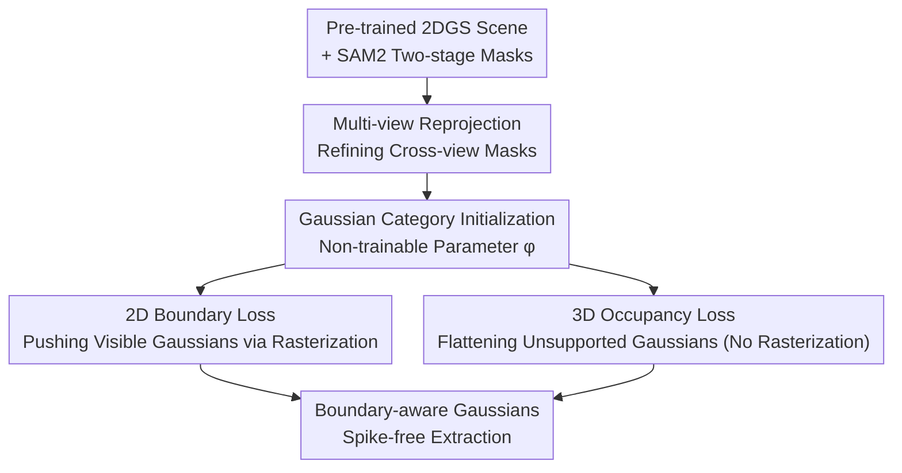

# BEA-GS: BEyond RAdiance Supervision in 3DGS for Precise Object Extraction

**Conference**: CVPR 2026  
**arXiv**: [2605.09662](https://arxiv.org/abs/2605.09662)  
**Code**: None (Unreleased)  
**Area**: 3D Vision  
**Keywords**: 3D Gaussian Splatting, Object Extraction, Semantic Segmentation, Boundary Loss, Occupancy Prior

## TL;DR
Addressing the issue of "hidden Gaussian spikes" appearing after object extraction in 3DGS scenes, BEA-GS introduces two complementary losses during 2DGS optimization: a 2D boundary loss for visible regions (propagating gradients via rasterization to push boundary-crossing Gaussians back) and a 3D occupancy loss for non-visible regions (bypassing rasterization to penalize "unsupported" Gaussian samples based on voxel priors). It achieves the cleanest object boundaries to date across 6 metrics on 4 datasets.

## Background & Motivation

**Background**: 3D Gaussian Splatting (3DGS) has become the de facto standard for photorealistic 3D scene reconstruction from multi-view images. To support "object-level editing/asset extraction," the mainstream approach involves lifting semantic labels from 2D vision foundation models like SAM or CLIP to 3DGS.

**Limitations of Prior Work**: Early methods (e.g., LangSplat, OpenGaussian) only **labeled and froze the geometry** of existing Gaussians, often resulting in a single Gaussian spanning multiple objects and poor 3D point-level understanding. Subsequent methods (COB-GS, ObjectGS, Trace3D) recognized this and began **modifying geometry** so each Gaussian belongs to a single object. However, the authors observed that even then, Gaussians often "protrude" beyond intended boundaries during extraction. These Gaussians are nearly invisible in the original scene but appear as **spike-like artifacts (Gaussian spikes)** once the object is extracted and placed in a new scene.

**Key Challenge**: All previous works rely on alpha-blending rasterization to propagate semantic gradients; **only Gaussians receiving sufficient radiance are modified**. Gaussians that are "partially visible or invisible" due to occlusion or low transmittance receive no gradients and remain stuck beneath the object surface. Unlike NeRF, 3DGS does not decouple geometry and appearance—Gaussian appearance is directly determined by its shape and size. When trained only with photometric loss, Gaussians tend to **stretch or drift** to adjacent or unseen regions to match colors rather than strictly adjusting appearance parameters.

**Goal**: (1) Ensure visible Gaussians strictly respect semantic boundaries; (2) Correct the geometry of non-visible Gaussians that lack radiance supervision but would be exposed during extraction.

**Key Insight**: Since rasterization gradients inherently fail to cover non-visible areas, a **dual-path approach** is required: use rasterization gradients for visible parts and a "no-rasterization" geometric regularization path for non-visible parts.

**Core Idea**: Use a complementary pair of losses—"2D Boundary Loss (for visible) + 3D Occupancy Loss (for non-visible)"—to optimize Northern Gaussian arrangements into a structure robust to object extraction.

## Method

### Overall Architecture

The input consists of a pre-trained **2DGS** scene (using 2D Gaussians instead of 3D ellipsoids for better surface fit) and multi-view segmentation masks extracted using a two-stage SAM2 process. The output is a set of "boundary-aware" Gaussians. The pipeline consists of three steps: refining inconsistent masks via **multi-view reprojection**, initializing a **non-trainable category parameter** $\phi$ for each Gaussian, and performing an additional 3K training steps atop the standard 30K 2DGS steps while applying **2D Boundary Loss** and **3D Occupancy Loss**. The two losses have clear roles: the boundary loss pushes visible Gaussians back via rasterization, while the occupancy loss bypasses rasterization to flatten Gaussian sample points that lack geometry support in a pre-computed voxel visibility grid.

### Key Designs

**1. Multi-view Reprojection: Refining Masks via 3D Structure**

While SAM2 two-stage retrieval mitigates tracking loss, it does not solve **boundary inconsistency across views** (e.g., an object missing a part in view A but gaining extra pixels in view B). The authors first generate a 3D point cloud using 2DGS depth and camera parameters, lifting each 2D pixel $u\in\mathbb{R}^2$ to a 3D point $x\in\mathbb{R}^3$ with an initial semantic label. These points are then **reprojected back to all views**, and each pixel is assigned the **most frequent label** among points projected onto it, resulting in a refined mask $M'=\mathrm{argmax}(M_\phi)$. This acts as a cross-view "voting-based denoising" that fills missing regions and sharpens boundaries.

**2. 2D Boundary Loss: Penalizing Only Out-of-Bounds Gaussians**

A category parameter $\phi$ is assigned to each Gaussian and initialized following FlashSplat—splatting all training images and assigning the most frequent category weighted by contribution. Crucially, **category parameters remain non-trainable**, forcing Gaussians to adapt through position, shape, or opacity. The boundary loss is defined as:

$$\mathcal{L}_{bound}(u)=\sum_{i=1}^{N}H_i(u)\,\alpha_i\hat{\mathcal{G}}_i(x)\prod_{j=1}^{i-1}\bigl(1-\alpha_j\hat{\mathcal{G}}_j(x)\bigr),\quad H_i(u)=\begin{cases}0,&\phi_i=M'(u)\\1,&\phi_i\neq M'(u)\end{cases}$$

The indicator function $H_i$ acts as a switch: if the Gaussian category matches the pixel label, there is no penalty; otherwise, it is penalized. This encourages the Gaussian to decrease opacity, change shape, or move away from the boundary. Unlike COB-GS or ObjectGS, this design **supports multi-class segmentation with a single extra channel per Gaussian** and focuses gradients only on the boundary-crossing regions.

**3. 3D Occupancy Loss: Geometric Regularization Bypassing Rasterization**

Since the boundary loss is modulated by transmittance $\prod_{j=1}^{i-1}(1-\alpha_j\hat{\mathcal{G}}_j(x))$, it only affects visible parts. To fix non-visible regions, the authors use a regularization path that does **not rely on radiance**. For each Gaussian, $Z$ points are sampled uniformly in its UV space. These points are checked against a **visibility voxel grid** $V_\phi$. The grid is built by back-projecting each image using rendered depth and merging them into category-specific point clouds $P_\phi$, which are then voxelized into $V_\phi$. The voxel size $s$ is **adaptive**: it is calculated to contain an average of $k$ points using the $k$-th nearest neighbor distance $d_k$ to estimate local density $\rho=k/(\tfrac{4}{3}\pi d_k^3)$, where $s=\sqrt[3]{k/\rho}$. The occupancy loss is:

$$\mathcal{L}_{occ}=\sum_{i=1}^{N}\sum_{r=1}^{Z}\frac{\alpha_i\hat{\mathcal{G}}_i(x'_r)\,Q_i(x'_r,V_\phi)}{N\cdot Z},\quad Q_i=\begin{cases}1,&D_{occ}(x'_r,V_\phi)=0\\0,&D_{occ}(x'_r,V_\phi)>0\end{cases}$$

Where $D_{occ}$ counts occupied voxels in a $3\times3\times3$ neighborhood. If the neighborhood is empty ($D_{occ}=0$), the point is penalized. This loss **propagates gradients directly to Gaussian parameters without rasterization**, allowing even invisible Gaussians to be suppressed.

### Loss & Training

The new losses are combined with the original 2DGS loss for end-to-end optimization:

$$\mathcal{L}=\mathcal{L}_{2DGS}+\lambda_{bound}\mathcal{L}_{bound}+\lambda_{occ}\mathcal{L}_{occ}$$

Where $\mathcal{L}_{2DGS}=\mathcal{L}_{rgb}+\lambda_{depth}\mathcal{L}_{depth}+\lambda_{norm}\mathcal{L}_{norm}$. Training involves 30K standard steps followed by 3K steps with all losses. Hyperparameters: $\lambda_{bound}=0.5$, $\lambda_{occ}=10$, $Z=20$, $k=2000$.

## Key Experimental Results

### Main Results

Evaluated on **4 datasets** across **6 metrics** (Extracted and Rendered 3D metrics), BEA-GS outperformed **12 SOTA** methods. BIoU specifically measures boundary quality.

In Extracted 3D metrics (rendering objects after isolated extraction), BEA-GS achieved top performance:

| Dataset | Metrics | BEA-GS | COB-GS | Trace3D | FlashSplat |
|--------|------|--------|--------|---------|------------|
| Mip-NeRF 360 | Acc / IoU / BIoU | **99.1 / 92.0 / 85.8** | 98.5 / 86.9 / 78.0 | 98.6 / 87.1 / 75.4 | 98.7 / 87.4 / 78.6 |
| LeRF | Acc / IoU / BIoU | **99.2 / 89.4 / 83.6** | 98.8 / 83.0 / 75.6 | 98.3 / 85.9 / 80.1 | 99.0 / 80.4 / 72.5 |
| LLFF | Acc / IoU / BIoU | **98.6 / 93.0 / 80.7** | 98.3 / 91.4 / 75.1 | 97.3 / 86.1 / 60.1 | 98.4 / 91.8 / 76.5 |

The BIoU gains confirm that the method produces the cleanest boundaries upon extraction. Furthermore, rendering quality remains stable, with negligible PSNR loss across all datasets.

### Ablation Study

R = Reprojection, B = Boundary Loss, O = Occupancy Loss (Extracted metrics):

| Config | Mip-NeRF 360 (Acc/IoU/BIoU) | LeRF (Acc/IoU/BIoU) | Note |
|------|------|------|------|
| ✗ ✗ ✗ | 98.1 / 83.9 / 72.8 | 98.3 / 66.3 / 56.6 | Vanilla: Classification only |
| R+B | 99.0 / 90.5 / 83.6 | 98.7 / 78.2 / 70.1 | Missing O: Non-visible spikes remain |
| R+O | 98.9 / 90.1 / 81.9 | 99.2 / 85.0 / 77.2 | Missing B: Fine boundary details lost |
| B+O | 99.0 / 90.9 / 84.5 | 99.2 / 86.6 / 80.3 | Missing R: Noisy masks |
| **R+B+O** | **99.1 / 92.0 / 85.8** | **99.2 / 89.4 / 83.6** | Full model |

### Key Findings
- **Complementary Losses**: Boundary loss handles fine details that voxels cannot capture, while occupancy loss penalizes non-visible areas that rasterization cannot reach.
- **Scene-Dependent Reprojection**: Gains are significant in 360° cluttered scenes (LeRF IoU $+2.8$) but marginal in front-facing scenes (LLFF).
- **Separating Overlapping Objects**: Qualitative results show that hidden Gaussians between overlapping objects (e.g., a footstool and sofa) are correctly separated.

## Highlights & Insights
- **Bypassing Rasterization is the Breakthrough**: Prior works were capped by alpha-blending gatekeeping gradients. Occupancy loss provides a direct path to optimize parameters for occluded regions.
- **Efficient Multi-class Support**: Using a single extra channel per Gaussian instead of per-class channels (ObjectGS) or per-object optimization (COB-GS) is highly efficient.
- **Adaptive Voxelization**: Dynamically adjusting voxel resolution based on point density is a robust engineering choice.

## Limitations & Future Work
- **Dependency on Initialization**: Results are bounded by the initial 2DGS geometric reconstruction.
- **No Completion of Unseen Parts**: The method cleans existing geometry but does not hallucinate occluded backsides; integration with diffusion-based generators is suggested.
- **Lack of Identity Association**: It does not link separate masks belonging to the same object (e.g., a table split by a vase).
- **Voxel Prior Reliability**: The occupancy grid depends on rendered depth accuracy.

## Related Work & Insights
- **vs. COB-GS**: Both use boundary gradients, but BEA-GS supports multiple classes natively and focuses specifically on out-of-bounds regions.
- **vs. ObjectGS**: ObjectGS uses multi-channel probability maps; BEA-GS is more memory-efficient and performs better in extraction scenarios.
- **vs. Trace3D**: Trace3D focuses on splitting Gaussians based on image-space contribution but still suffers from spikes due to radiance dominance.
- **vs. FlashSplat**: FlashSplat provides the category initialization, while BEA-GS adds the critical geometric optimization.

## Rating
- Novelty: ⭐⭐⭐⭐⭐ (Occupancy loss precisely addresses the "hidden spike" blind spot).
- Experimental Thoroughness: ⭐⭐⭐⭐⭐ (Extensive datasets, SOTA comparisons, and ablation studies).
- Writing Quality: ⭐⭐⭐⭐ (Clear motivation and problem framing).
- Value: ⭐⭐⭐⭐ (Crucial for 3DGS-based asset extraction and editing).

<!-- RELATED:START -->

## Related Papers

- [\[CVPR 2026\] OLATverse: A Large-scale Real-world Object Dataset with Precise Lighting Control](olatverse_a_large-scale_real-world_object_dataset_with_precise_lighting_control.md)
- [\[CVPR 2026\] GAI-GS: A Wireless Channel Prediction Framework Injecting Ray-Object Interaction into 3DGS via Geometric Algebra Attention](a_geometric_algebra-informed_3dgs_framework_for_wireless_channel_prediction.md)
- [\[CVPR 2026\] Beyond Reassembly: Fractured Object Recovery with Missing Parts](beyond_reassembly_fractured_object_recovery_with_missing_parts.md)
- [\[CVPR 2026\] Turbo-GS: Accelerating 3D Gaussian Fitting for High-Resolution Radiance Fields](turbo-gs_accelerating_3d_gaussian_fitting_for_high-quality_radiance_fields.md)
- [\[CVPR 2026\] CaT-GS: Efficient 3DGS Rendering for Large-Scale Scenes with Inter-frame Caching and Tile Scheduling](cat-gs_efficient_3dgs_rendering_for_large-scale_scenes_with_inter-frame_caching_.md)

<!-- RELATED:END -->
