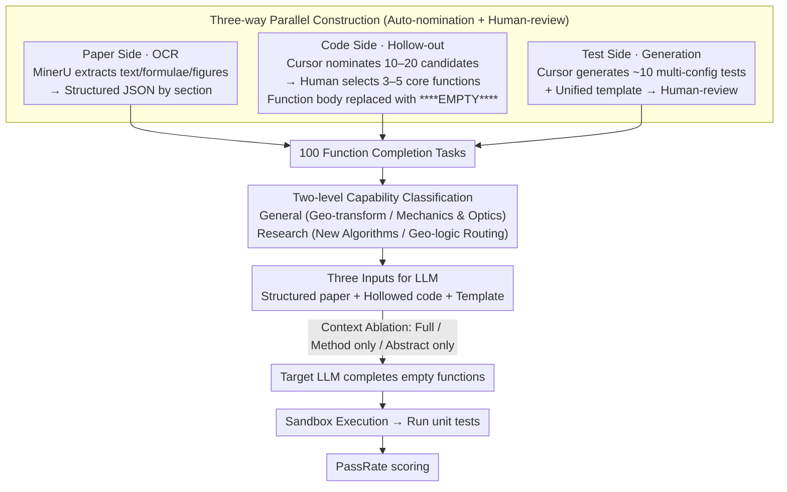

# GeoCodeBench: Benchmarking PhD-Level Coding in 3D Geometric Computer Vision

**Conference**: CVPR 2026  
**arXiv**: [2603.30038](https://arxiv.org/abs/2603.30038)  
**Code**: [https://geocodebench.github.io/](https://geocodebench.github.io/)  
**Area**: 3D Vision  
**Keywords**: 3D vision code generation, LLM evaluation, geometric algorithm implementation, PhD-level benchmark, unit testing

## TL;DR
GeoCodeBench is the first PhD-level code generation benchmark for 3D geometric computer vision. It contains 100 function completion tasks curated from 2025 top-tier papers and codebases, accompanied by automated and diverse unit tests. The strongest model, GPT-5, achieves only a 36.6% pass rate, revealing a significant gap in LLMs' ability to implement scientific-grade 3D code.

## Background & Motivation

**Background**: AI-assisted programming has reshaped software practices and research workflows, but existing models still struggle with complex 3D geometric vision code. Reliability in writing such code would fundamentally transform 3D vision research (automated prototyping, accelerated research cycles, democratized algorithm development).

**Limitations of Prior Work**: (1) Existing code benchmarks (HumanEval/MBPP/SWE-bench) do not cover 3D geometric implementations—they target general software engineering or competitive programming; (2) Scientific 3D vision code requires mathematically precise geometric operators, physical modeling, and multi-view reasoning—capabilities far beyond general-purpose coding; (3) Long-context scientific understanding from paper-to-code remains an unsolved problem.

**Key Challenge**: LLMs can generate general code but cannot reliably implement core functions for 3D geometric vision—how large is this gap? Where is the bottleneck?

**Key Insight**: Simulating actual research scenarios—providing the model with paper text and a function skeleton, requiring implementation, and evaluating via automated unit tests.

**Core Idea**: (1) Extract core functions from official repositories of 2025 top-tier papers; (2) Utilize automated tool nomination combined with human filtering to ensure quality; (3) Implement diverse boundary tests covering geometric degenerate configurations; (4) Evaluate using a two-level capability classification system.

## Method

### Overall Architecture
GeoCodeBench transforms the real research scenario of "reading a paper and implementing algorithms" into an automatically evaluable task: for each problem, the model is provided with the main text of a 3D geometric vision paper, a code file with core functions removed, and a standardized execution template. The model must complete the empty functions. The completed code is executed in a sandbox, run against unit tests, and scored by pass rate. The pipeline starts from original paper PDFs and official repositories, proceeding through paper OCR, function hollowing, and test generation to create 100 completion tasks, followed by the "input → completion → execution → scoring" evaluation loop.

### Key Designs

**1. Three-way Parallel Construction: Precisely extracting "core 3D geometric functions" from top-tier repositories**

The difficulty of a scientific coding benchmark lies not in collecting code, but in selecting functions that test geometric ability without being trivial. The paper splits construction into three parallel processes: the paper side uses MinerU for OCR to extract text, formulas, and charts into structured JSON; the code side first uses Cursor to recommend 10–20 candidates per repo, which are then **manually reviewed by 3D vision researchers** to keep 3–5 core geometric functions, replacing their bodies with `****EMPTY****`; the test side similarly uses Cursor to generate ~10 test cases covering various parameter configurations, followed by manual verification and a unified template. Human review is critical here—auto-nomination is efficient but prone to selecting trivial utility functions. All papers are from 2025 (CVPR / ICCV / ICLR) to mitigate data leakage, covering 3DGS, pose estimation, SLAM, reconstruction, physics-based modeling, NeRF, and 3D segmentation.

**2. Two-level Capability Classification: Distinguishing "geometric basics" from "research-level reasoning"**

A single pass rate doesn't reveal whether a model fails at basic geometric knowledge or higher-level research reasoning. The benchmark divides 100 tasks into two levels across four categories. The base level is General 3D Capability, testing basic geometry: Geometric Transformations (coordinate systems, projection, normals, rotations, 24%) and Mechanics/Optics Formulation (Spherical Harmonics, BRDF, equations of motion, radiometry, 31%). The upper level is Research Capability, involving research-level reasoning: New Algorithm Implementation (core ideas of papers, 34%) and Geometric Logic Routing (composing existing operators into new pipelines, 11%). This allowed pinpointing specific capability shortfalls.

**3. PassRate Metric and Context Ablation: Quantifying performance and identifying bottlenecks**

Scoring uses PassRate, defined as the average ratio of passed tests to total tests across all tasks:

$$\text{PassRate} = \frac{1}{N}\sum_{i=1}^{N}\frac{p_i}{T_i}$$

Where $p_i$ is the number of tests passed for problem $i$, $T_i$ is the total tests for that problem, and $N$ is the total number of tasks. Additionally, the benchmark includes context ablations—switching input between "Full paper / Method only / Abstract only"—to identify which text truly aids implementation.

## Key Experimental Results

### Main Results (8 Representative Models)

| Model | Company | Overall | General | Research | Geo.Trans. | Algorithm |
|------|------|---------|---------|----------|------------|-----------|
| **GPT-5** | OpenAI | **36.6%** | **42.8%** | **29.1%** | 41.7% | 29.1% |
| Claude-Sonnet-4.5 | Anthropic | 31.1% | 37.2% | 23.7% | 38.3% | 19.7% |
| Gemini-2.5-Pro | Google | 30.4% | 33.8% | 26.2% | 41.9% | 25.3% |
| Kimi-K2-Instruct | Moonshot | 30.4% | 34.6% | 25.1% | 36.7% | 23.1% |
| Doubao-Seed-1.6 | ByteDance | 26.9% | 29.7% | 23.4% | 40.9% | 22.9% |
| Qwen3-Coder-480B | Alibaba | 23.5% | 22.7% | 24.6% | 29.0% | 21.8% |
| DeepSeek-R1 | DeepSeek | 21.0% | - | - | - | - |

### Ablation Study

| Input Context | PassRate | Description |
|-----------|----------|------|
| Full Text | Baseline | Includes intro, related work, etc. |
| **Method Only** | **Statistically superior** | No irrelevant context to distract reasoning |
| Abstract Only | Significantly lower | Insufficient technical detail |

### Key Findings
- **Strongest model at 36.6%**: GPT-5 is far from reliable for PhD-level 3D code.
- **Research tasks are harder but correlated with General**: Geometric basics are necessary but not sufficient for research-level implementation.
- **Truncating to Method is better**: Suggests LLMs face severe difficulties in long-context scientific understanding—more text often means more noise rather than useful information.
- **Creative correctness**: In some cases, models passed tests using different but mathematically equivalent methods, showing true problem-solving.
- **Geometric Logic Routing (11%)**: Reflects how classic 3D vision papers are built—combining operators—requiring higher-level system design.

## Highlights & Insights
- **First 3D vision code benchmark**: Fills a gap in AI coding evaluation for scientific 3D domains. The community-driven, scalable design allows it to grow with new papers.
- **Insight on "more context is not better"**: Questions LLM long-context capabilities; Method truncation being superior suggests models are misled by introductory noise.
- **Paper-to-code paradigm**: Directly simulates the research workflow of "reading a paper → implementation," a step toward "automated 3D vision scientists."
- **Engineering contribution of unit tests**: Provides automated, boundary-covering tests that serve as valuable educational material for 3D geometry.

## Limitations & Future Work
- Scale of 100 functions is limited—needs continuous expansion.
- Limited to 2025 papers, requiring updates to avoid future data leakage.
- Unit test coverage may not be absolute—passing tests doesn't guarantee 100% correctness.
- Only evaluates function-level completion—full paper reproduction (training loops, data pipelines) is more challenging.

## Related Work & Insights
- **vs HumanEval/MBPP**: General programming benchmarks without domain knowledge; GeoCodeBench requires deep 3D geometric reasoning.
- **vs SWE-bench**: Repository-level issue solving; GeoCodeBench is function-level paper-to-code.
- **vs PaperBench**: Full paper reproduction; GeoCodeBench focuses on core function components—they are complementary.
- **vs ResearchCodeBench**: Also masks core code but doesn't focus on 3D geometry or diverse testing.

## Rating
- Novelty: ⭐⭐⭐⭐⭐ First 3D vision code benchmark, insightful classification.
- Experimental Thoroughness: ⭐⭐⭐⭐⭐ 8 models, context ablation, categorical analysis, case studies.
- Writing Quality: ⭐⭐⭐⭐⭐ Transparent and reproducible pipeline.
- Value: ⭐⭐⭐⭐⭐ Significant push for automated 3D vision research and scientific LLM evaluation.

<!-- RELATED:START -->

## Related Papers

- [\[ICLR 2026\] GIQ: Benchmarking 3D Geometric Reasoning of Vision Foundation Models with Simulated and Real Polyhedra](../../ICLR2026/3d_vision/giq_benchmarking_3d_geometric_reasoning_of_vision_foundation_models_with_simulat.md)
- [\[CVPR 2026\] PromptDepth: Efficient and Promptable Geometric 3D Vision Model for Embodied Intelligence](promptdepth_efficient_and_promptable_geometric_3d_vision_model_for_embodied_inte.md)
- [\[CVPR 2026\] SE(3)-Equivariance with Geometric and Topological Guidance for Category-Level Object Pose Estimation](se3-equivariance_with_geometric_and_topological_guidance_for_category-level_obje.md)
- [\[CVPR 2026\] Pano360: Perspective to Panoramic Vision with Geometric Consistency](pano360_perspective_to_panoramic_vision_with_geometric_consistency.md)
- [\[CVPR 2026\] Revisiting Optimal Coding for I-ToF under Practical Sensor Constraints](revisiting_optimal_coding_for_i-tof_under_practical_sensor_constraints.md)

<!-- RELATED:END -->
