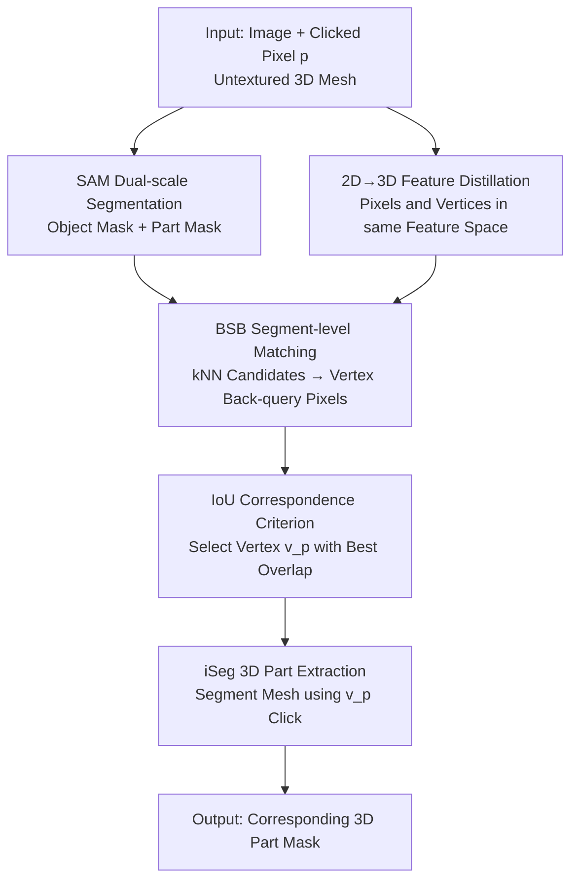

# Best Segmentation Buddies for Image-Shape Correspondence

**Conference**: CVPR 2026  
**arXiv**: [2605.18193](https://arxiv.org/abs/2605.18193)  
**Code**: https://threedle.github.io/bsb/ (Project Page)  
**Area**: 3D Vision / Segmentation / Cross-modal Correspondence  
**Keywords**: Image-shape correspondence, cross-modal matching, feature distillation, zero-shot segmentation, Best Buddies

## TL;DR
This paper proposes Best Segmentation Buddies (BSB), which relaxes the hard "pixel-vertex mutual nearest neighbor" constraint—almost impossible to satisfy between images and 3D meshes—into a "segment-level mutual nearest neighbor." This allows matching a clicked semantic part from an in-the-wild image to its corresponding part on an untextured 3D mesh in an unannotated, zero-training manner.

## Background & Motivation

**Background**: Correspondence is a core problem in vision and graphics. Traditional works mostly focus on **same-modality** tasks: image-to-image or 3D-to-3D. Recent deep features (DINO, Diffusion features) have extended this to **cross-domain but same-modality** (e.g., bird image to airplane image, human mesh to animal mesh).

**Limitations of Prior Work**: True "cross-modal and cross-domain" correspondence—2D natural images to 3D untextured meshes—is rarely addressed effectively. Few existing methods either rely on **strong supervision** (Continuous Surface Embeddings require dense annotation) or are **tied to specific templates** (SHIC performs point-to-point canonical mapping but lacks part semantics and is not robust to local deformations). Images have color and texture; meshes only have geometry. Appearance, geometry, and viewpoints differ greatly between modalities, often involving different objects (e.g., an owl vs. an airplane).

**Key Challenge**: For cross-modal comparison, pixels and vertices must be placed in the same feature space. Even when "lifting" features to 3D surfaces using the same 2D vision model, a modality gap persists—**pixels and vertices are almost never mutual nearest neighbors** (best buddies). Directly applying classic best buddies matching results in widespread mismatches.

**Goal**: To establish **segment-to-segment** correspondence between 2D image regions and 3D semantic parts without training, annotations, or pre-defined object/part types, rather than sparse keypoints or template-based dense mappings.

**Key Insight**: The authors observe a key phenomenon (Fig. 5): when an image region has a **true corresponding part** on the mesh, the back-projected segment almost perfectly overlaps with the original clicked mask. When there is **no correspondence** (e.g., a volume knob on a guitar image that lacks corresponding geometry on the mesh), the back-projected segment barely intersects. This implies "segment overlap" can serve as both a matching criterion and a switch for "correspondence existence."

**Core Idea**: Relax the hard constraint of best buddies to the **segmentation region level**. It is not required that pixel $p$ is the nearest neighbor of vertex $v_p$; instead, it is required that the nearest neighbor pixel of $v_p$ falls within the segmentation mask of $p$, and that the back-projected segment maximizes the IoU with $p$'s mask. Such pairs are deemed "Best Segmentation Buddies."

## Method

### Overall Architecture

The input is an in-the-wild image, a user-clicked pixel $p$, and an untextured 3D mesh. The output is a 3D part mask $M^{3D}_{v_p}$ on the mesh corresponding to the semantic part of $p$. The pipeline integrates two foundation models (2D segmenter SAM, 2D vision features DINOv2) and an interactive 3D segmentation model iSeg distilled from 2D. The BSB mechanism connects the "click in image" to the "vertex on mesh."

Process: First, SAM generates a coarse mask $M^{2D}_o$ (object) and a fine mask $M^{2D}_p$ (part) for the click. DINOv2 extracts per-pixel features, which are distilled into per-vertex features, enabling cosine similarity calculations between pixels and vertices. BSB then identifies the "segmentation buddy" vertex $v_p$ among candidates. Finally, iSeg uses $v_p$ as a click to segment the corresponding part in 3D.

### Key Designs

**1. 2D→3D Feature Distillation: Shared Feature Space**

The first barrier is that images are 2D while meshes are 3D. Following iSeg, a 2D vision model $\mathscr{F}^{2D}_{vis}$ (DINOv2) extracts image features $F_{vis}^{\mathcal{I}}\in\mathbb{R}^{w\times h\times d_{vis}}$ (interpolated to pixel resolution). By multi-view rendering of the mesh, an MLP $\mathscr{F}^{3D}_{vis}:\mathbb{R}^{3}\rightarrow\mathbb{R}^{d_{vis}}$ is trained to "lift" these features to each vertex $F_{vis}^{\mathcal{V}}\in\mathbb{R}^{n\times d_{vis}}$. While features are in the same semantic space, the modality gap (natural image vs. untextured render) prevents perfect alignment—necessitating the relaxation of constraints.

**2. Best Segmentation Buddies: Relaxing Mutual Nearest Neighbors**

Classic best buddies require pixel $p$ and vertex $v$ to be mutual nearest neighbors, which rarely occurs cross-modally. BSB adopts a **reverse search**: first, select $k$ candidate vertices $\mathcal{C}=\{v'\}$ with the highest cosine similarity to pixel $p$ (picking $k$ instead of 1 handles feature noise). For each candidate $v'$, find its nearest neighbor pixel $q'=\arg\max_{q\in M^{2D}_o} s_{v'q}$ within the object mask $M^{2D}_o$. $v'$ is a valid candidate only if $q'$ falls within the clicked part mask ($q'\in M^{2D}_p$). This relaxation tolerates feature shifts caused by the modality gap while remaining tight enough to filter elements without geometric equivalents.

**3. IoU Criterion: Vertex Selection and Existence Verification**

To select the best $v_p$ from valid candidates, the method uses segment overlap: for each candidate's corresponding pixel $q'$, SAM re-segments the image to get $M^{2D}_{q'}$. The IoU with the original mask $M^{2D}_p$ is calculated (Eq. 5), and the vertex corresponding to $q^*=\arg\max_{q'}\text{IoU}(M^{2D}_p,M^{2D}_{q'})$ is chosen. This IoU also acts as a natural switch: for areas with **true corresponding parts**, average IoU is $0.98$; for **texture-only areas without geometry**, it drops to $0.01$.

**4. iSeg Guided 3D Segmentation: Bootstrapping Full Parts**

Finding $v_p$ identifies a point; iSeg then produces the full 3D part. It predicts a 3D mesh mask $M^{3D}_v$ given a vertex click. Using $v_p$ as the click, $M^{3D}_{v_p}$ becomes the final 3D part corresponding to $M^{2D}_p$. This step bootstraps point-to-point matching into segment-to-segment correspondence and is naturally bidirectional.

### Mechanism

Example (Electric Guitar): Click on the **neck** pixel $p$ → SAM provides coarse (guitar) and fine (neck) masks → DINOv2 picks $k=100$ similar vertices → For each, find the nearest neighbor pixel $q'$ in the 2D object area; keep those where $q'$ is in the neck mask → Re-segment $q'$ with SAM and compute IoU; the winner with IoU $\approx 0.98$ is $v_p$ → iSeg segments the 3D neck. If clicking a **volume knob** (no geometry on mesh), back-projected IoU $\approx 0.01$, allowing the system to correctly reject the match.

## Key Experimental Results

### Main Results

Due to the lack of annotated cross-modal image-shape part datasets, the authors adapted the PartNet dataset. They rendered 265 meshes, used ControlNet to generate color images via depth, and projected 3D vertices to 2D pixels as "clicks" to evaluate if the method maps back to the ground truth 3D part. The metric is **Success Rate**.

| Method | Type | Success Rate ↑ |
|------|------|---------|
| NBB [3] | Sparse Mutual Nearest Neighbor | 0.64 / 0.66 |
| DIFT [53] | Diffusion Feature Similarity | 0.39 / 0.48 |
| **BSB (Ours)** | Segment-level Matching + 3D Direct | **0.74** |

BSB significantly outperforms baselines even when they are given more lenient "same-view" settings (NBB 0.66 / DIFT 0.48). NBB fails due to inaccurate sparse neighbors under modality gaps, while DIFT's diffusion features are sensitive to appearance differences between textured images and untextured renders.

### Ablation Study

| Configuration | Metric | Description |
|------------|---------|------|
| Regions with correspondence | Avg IoU = 0.98 | Back-query segment matches original click |
| Texture regions w/o geometry | Avg IoU = 0.01 | Segments are nearly disjoint; rejected |
| DINOv2 vs. DIFT features [53] | Both work | Not tied to a specific feature extractor |
| SAM vs. SAM2 [48] | No significant diff | Backbone choice is flexible |

### Key Findings

- **IoU = 0.98 vs. 0.01**: This comparison is the most insightful data point, proving segment-level consistency is strongly correlated with true semantic correspondence.
- Method is backbone-insensitive, indicating gains come from the **relaxed matching mechanism** itself.
- Inference takes approximately **4 seconds** per click (Nvidia A40), zero-shot and training-free.
- Robustness: One image can match different meshes with high geometric variance; a byproduct is unsupervised cross-domain **image-to-image** correspondence via a shared 3D mesh part.

## Highlights & Insights

- **"Just Right" Relaxation**: Best buddies is too rigid for cross-modal tasks; BSB finds the sweet spot at the "segmentation region level"—more informative than points and robust to local deformation.
- **Dual-use Variable**: Using IoU for both selection and existence verification is an elegant design derived from observations in Fig. 5 rather than mere engineering.
- **Zero-training Composition**: By combining SAM, DINOv2, and iSeg, the innovation lies entirely in the matching protocol, ensuring low deployment barriers and high portability.
- **Natural Bidirectionality**: Symmetric roles for image and shape support shape-to-image correspondence out of the box.

## Limitations & Future Work

- **Dependency on iSeg and Distillation**: The pipeline relies on successful 2D-to-3D feature distillation and iSeg's ability to segment from a click; it fails if mesh geometry is degenerate.
- **Refusal over Soft Matching**: The method "correctly rejects" matches where geometry is missing. This might be too conservative for scenarios requiring partial or approximate alignment.
- **Proxy Evaluation**: Lacks real-world cross-modal part annotations; metrics rely on ControlNet-generated images which differ from true natural image distributions.
- **Future Work**: Using segment-to-segment correspondence to update vision features for "correspondence awareness"; extending to video, 3D Gaussian Splatting, and NeRF.

## Related Work & Insights

- **vs. NBB [3] (Neural Best-Buddies)**: NBB finds sparse mutual neighbors in pixel space. BSB points out this rarely holds cross-modally and relaxes it to the segment level (BSB 0.74 > NBB 0.66).
- **vs. DIFT [53]**: DIFT uses diffusion features for similarity. It is sensitive to "textured image vs. untextured render" gaps. BSB's segmentation-based verification is more successful (0.74 > 0.48).
- **vs. SHIC [52] / Continuous Surface Embeddings [40]**: SHIC is template-bound; CSE requires dense supervision. BSB is annotation-free, template-free, and provides semantic part correspondence.

## Rating
- Novelty: ⭐⭐⭐⭐⭐ First zero-training method for cross-modal and cross-domain segment correspondence; "segment-level best buddies" is a clean, powerful idea.
- Experimental Thoroughness: ⭐⭐⭐⭐ Solid comparisons and IoU analysis, though hindered by the lack of ground truth real-world datasets.
- Writing Quality: ⭐⭐⭐⭐⭐ Well-structured derivation from observation to mechanism; clear diagrams.
- Value: ⭐⭐⭐⭐ Zero-shot, flexible backbones, and applications in texture transfer provide strong inspiration for cross-modal matching.

<!-- RELATED:START -->

## Related Papers

- [\[CVPR 2026\] GeoFree-CoSeg: Unsupervised Point Cloud-Image Cross-Modal Co-Segmentation Without Geometric Alignment](geofree-coseg_unsupervised_point_cloud-image_cross-modal_co-segmentation_without.md)
- [\[CVPR 2026\] Generalizable Structure-Aware Keypoint Correspondence for Category-Unified 3D Single Object Tracking](generalizable_structure-aware_keypoint_correspondence_for_category-unified_3d_si.md)
- [\[CVPR 2026\] MimiCAT: Mimic with Correspondence-Aware Cascade-Transformer for Category-Free 3D Pose Transfer](mimicat_mimic_with_correspondence-aware_cascade-transformer_for_category-free_3d.md)
- [\[CVPR 2026\] Learning 3D Shape Fidelity Metric from Real-world Distortions](learning_3d_shape_fidelity_metric_from_real-world_distortions.md)
- [\[CVPR 2026\] Generalized-CVO: Fast and Correspondence-Free Local Point Cloud Registration with Second Order Riemannian Optimization](generalized-cvo_fast_and_correspondence-free_local_point_cloud_registration_with.md)

<!-- RELATED:END -->
