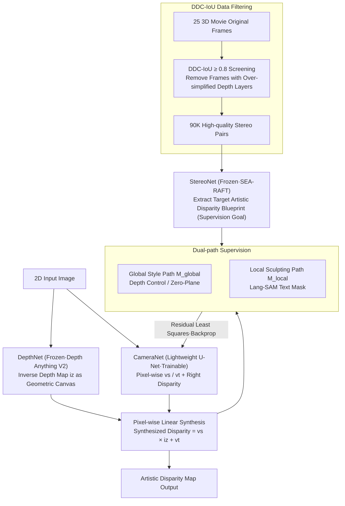

# Beyond Geometry: Artistic Disparity Synthesis for Immersive 2D-to-3D

**Conference**: CVPR 2026  
**arXiv**: [2603.05906](https://arxiv.org/abs/2603.05906)  
**Code**: None (Not yet open-sourced)  
**Area**: 3D Vision  
**Keywords**: 2D-to-3D Conversion, Artistic Disparity Synthesis, Stereoscopic Cinema, Dual-path Architecture, Depth Style

## TL;DR
A new paradigm called "Artistic Disparity Synthesis" (Art3D) is proposed, shifting the goal of 2D-to-3D conversion from geometric accuracy to artistic expression. Through a dual-path architecture that decouples global depth style and local artistic effects, the model learns directorial intent from professional 3D movie data.

## Background & Motivation
**Background**: Current 2D-to-3D conversion methods (e.g., diffusion-based StereoCrafter, Eye2Eye) have achieved geometric accuracy but lack artistic immersion—showing a significant gap compared to the viewing experience of professional 3D films like *Avatar*.

**Limitations of Prior Work**: The geometric reconstruction paradigm (MonoDepth, MiDaS, etc.) treats artistic disparity adjustments in professional 3D movies as "noise" to be suppressed, leading to the problem of "artistic poverty"—geometrically correct but narratively barren.

**Key Challenge**: Three major artistic operations in professional 3D movie post-production—Global Depth control, Zero-Plane selection, and Local Sculpting—are encoded within disparity maps, but existing methods fail to learn these artistic intentions.

**Goal**: How to generate disparity maps from 2D images that contain directorial artistic intent, rather than just physically correct disparity.

**Key Insight**: Treat the disparity map as a carrier of artistic expression, indirectly learning global depth styles and local out-of-screen effects from professional 3D movies.

**Core Idea**: A dual-path supervision mechanism is used to decouple the director's macro-intent and local "artistic strokes," learning artistic disparity styles from professional 3D films via indirect supervision.

## Method

### Overall Architecture

Art3D aims not for geometrically correct disparity, but for disparity carrying directorial intent—moving 2D-to-3D conversion from "geometric reconstruction" to "artistic disparity synthesis." It utilizes a three-network architecture: a frozen DepthNet (Depth Anything V2) provides the geometric canvas, a frozen StereoNet (SEA-RAFT) extracts the target artistic blueprint from professional 3D movies, and the only trainable component, CameraNet (a lightweight U-Net), synthesizes virtual camera parameters. The core modeling treats the artistic blueprint as a pixel-wise linear transformation of the geometric canvas:

$$\hat{d}^L = vs \cdot iz + vt$$

where $vs$ and $vt$ are pixel-wise scale and shift tensors, and $iz$ is the inverse depth map. This means artistic effects are decomposed into "scaling + shifting the geometric depth," allowing the network to learn just these two parameter maps. Supervision signals come from professional 3D movies filtered by DDC-IoU, extracted by StereoNet into a target disparity blueprint, and used to train CameraNet via dual-path supervision.

### Key Designs

**1. Dual-path Supervision: Decoupling Global Depth Style and Local Out-of-screen Effects**

Disparities in professional 3D movies mix two types of artistic operations: global depth control/zero-plane selection and local out-of-screen sculpting. Learning them together causes interference. Art3D decomposes the supervision signal $d^L$ into a global style path (mask $M_{global}$) and a local effect path (mask $M_{local}$). Local masks are generated via Lang-SAM using text prompts (e.g., "foreground character popping out"), while global masks take the valid regions from StereoNet's left-right consistency check and subtract the local regions, $M_{global} = M_{valid} \cdot (1 - M_{local})$. This split is naturally robust to errors—local regions missed by detection naturally fall into global path supervision without being lost, while sparse global masks act as data augmentation.

**2. CameraNet: The Minimal Trainable Synthesizer**

To prove that the performance stems from the framework design rather than network capacity, Art3D minimizes the trainable part: CameraNet is a lightweight encoder-decoder (3 downsamplings + 3 upsamplings) that outputs only 3 channels: $vs$, $vt$, and the right disparity map $\hat{d}^R$. It is the only component requiring training. All other perception networks are frozen, placing the entire burden of learning artistic style on these 3 channels.

**3. DDC-IoU Data Filtering: Removing Low-quality Frames with Simple Layering**

Raw 3D movie frames vary in quality; some frames have overly simple depth layering or poor structural alignment, which could pollute style learning if used directly. The authors propose the Depth-Disparity Consistency IoU metric to measure the consistency between depth maps and disparity maps. With a threshold of 0.8, 90,000 high-quality stereo pairs were filtered from 25 3D movies. Experiments show some raw frames have a DDC-IoU of 0, justifying the necessity of this filtering step.

### Loss & Training

The core loss $\mathcal{L}_{Art}$ is the sum of the least squares residuals of the dual-path masks:

$$\mathcal{L}_{Art} = \mathcal{L}_{path}(M_{global}) + \mathcal{L}_{path}(M_{local}) + \mathcal{L}_{st}$$

where $\mathcal{L}_{path}(M) = \min_{s,t} \sum_k M_k \cdot \|d^L_k - (s \cdot \hat{d}^L_k + t)\|^2$. This fits the scale/shift using least squares within each path's mask and calculates the residual. The global style regularization $\mathcal{L}_{st} = \|s-1\|^2 + \|t\|^2$ encourages the synthesized disparity to directly reflect the global supervision signal. Additional smoothness and left-right consistency losses serve as auxiliary. Training lasted 50 epochs on a single A800 with a batch size of 32 and $512 \times 512$ inputs.

## Key Experimental Results

### Main Results: Global Depth Style Evaluation

| Method | Global Depth $s$ (Mean/Std) | Zero-Plane $t$ (Mean/Std) |
|------|--------------------------|------------------------|
| Baseline (w/o $\mathcal{L}_{Art}$) | 0.030 / 0.018 | 6.98 / 2.35 |
| **Art3D (Ours)** | **0.020 / 0.009** | **6.08 / 1.80** |
| Ground Truth | 0.013~0.023 / 0.010~0.020 | 4.35~5.28 / 2.09~4.68 |

Art3D's standard deviation ($\sigma$) is significantly lower, indicating it has learned a stable and consistent artistic style rather than random geometric disparity.

### Ablation Study: Paradigm Comparison

| Method | Global Control (Zero-Plane) | Local Sculpting (Artistic) |
|------|-----------------|----------------|
| StereoCrafter | Manual (Global Shift) | None |
| Eye2Eye | Physical (Replication) | None |
| **Art3D (Ours)** | **Learning (Global Style)** | **Yes (Learning)** |

### Geometric Consistency Verification (DDC-IoU)
Art3D consistently achieves a DDC-IoU of 0.83~0.89 in the right-view coordinate system, proving that artistic style learning does not destroy the underlying geometric consistency. In contrast, raw 3D movie data varies in quality—some frames have a DDC-IoU of 0 (poor structural alignment), highlighting the necessity of data filtering.

### Key Findings
- Removing $\mathcal{L}_{path}(M_{local})$ results in the model only learning global style, failing to produce local out-of-screen effects.
- Art3D stably achieves 0.83-0.89 on the DDC-IoU metric, proving artistic style learning does not harm geometric consistency.
- Professional 3D software Owl3D shows inconsistent 3D perception across different scenes, while Art3D maintains stable out-of-screen effects.

## Highlights & Insights
- **Paradigm Innovation**: For the first time, a paradigm shift from "geometric reconstruction" to "artistic disparity synthesis" is explicitly proposed, positioning the disparity map as a carrier for cinematic storytelling.
- **Clever Indirect Supervision**: Instead of direct pixel-level GT supervision, the model is evaluated via the distribution of style parameters $(s, t)$ extracted through least squares fitting to assess artistic consistency.
- **Elegant Robustness Design**: The dual-path masks are complementary—missed local detections degrade to global supervision, and sparse global masks act as data augmentation.
- **Vivid *Avatar* Case Introduction**: Specifically explaining three layers of artistic intent using Jake/Ikran flight scenes from *Avatar* makes the motivation highly persuasive.
- **Minimalist CameraNet Design**: The only trainable component consists of 3 downsamplings + 3 upsamplings + 1 output layer, proving the framework design is the primary contributor rather than network size.

## Limitations & Future Work
- The paper describes itself as a "preliminary exploration"; the CameraNet architecture is simple (only 6 layers), limiting generation capacity.
- Data for local out-of-screen effects is limited to 201 clips/15K frames.
- Validation is restricted to 3D movie data; generalization to non-movie scenes (e.g., AR/VR content) remains unknown.
- Evaluation metrics still rely on statistical distribution comparisons, lacking user subjective studies.
- No exploration of reinforcement or integration schemes with existing diffusion generation pipelines (like StereoCrafter).
- No separate models were trained for different movie genres (animation, sci-fi, modern); a single model covers all styles.

## Related Work & Insights
- Traditional heuristic disparity remapping (non-linear remapping, saliency editing) requires stereo pairs as input and cannot generalize to monocular images.
- Geometric reconstruction paradigms (Deep3D, MonoDepth → StereoCrafter, Eye2Eye), while using diffusion models, remain geometry-driven.
- Art3D fills the gap between heuristic artistic editing and geometric reconstruction, enabling 3D style transfer across movies with monocular input.
- StereoCrafter unifies zero-plane positions during data processing, actively discarding the director's original artistic intent.
- While Eye2Eye can produce out-of-screen effects, it learns from physically correct VR180 data, replicating physical disparity rather than artistic design.
- The three-layer artistic intent defined here (Global Depth/Zero-Plane/Local Sculpting) provides a clear analytical framework for future 3D visual creation research.

## Data Construction Details
- Selected from 25 well-known 3D movies (e.g., *Hugo*, *The Amazing Spider-Man*, *The Great Gatsby*), following the data protocols of Ranftl et al.
- After DDC-IoU ≥ 0.8 filtering, 90K high-quality 1080P stereo pairs were retained (80K for training, 10K for testing).
- Local out-of-screen data was manually collected from YouTube (201 clips), and approximately 15K processed frames were added to the training set.
- Both positive and negative disparities were extracted by StereoNet, preserving complete out-of-screen/in-screen information.

## Rating ⭐
- Novelty: ⭐⭐⭐⭐⭐ — Paradigm-level innovation, first to incorporate "artistic intent" into 2D-to-3D conversion.
- Experimental Thoroughness: ⭐⭐⭐ — Valid ablations but lacking quantitative comparisons with SOTAs and subjective evaluation.
- Writing Quality: ⭐⭐⭐⭐ — Highly persuasive motivation with a vivid *Avatar* case study.
- Value: ⭐⭐⭐⭐ — Opens a new direction, though in the preliminary exploration stage; practical application requires further refinement.

<!-- RELATED:START -->

## Related Papers

- [\[CVPR 2026\] MatSpray: Fusing 2D Material World Knowledge on 3D Geometry](matspray_fusing_2d_material_world_knowledge_on_3d_geometry.md)
- [\[CVPR 2026\] Fast3Dcache: Training-free 3D Geometry Synthesis Acceleration](fast3dcache_training-free_3d_geometry_synthesis_acceleration.md)
- [\[CVPR 2026\] Beyond Reassembly: Fractured Object Recovery with Missing Parts](beyond_reassembly_fractured_object_recovery_with_missing_parts.md)
- [\[CVPR 2026\] MeshFlow: Efficient Artistic Mesh Generation via MeshVAE and Flow-based Diffusion Transformer](meshflow_efficient_artistic_mesh_generation_via_meshvae_and_flow-based_diffusion.md)
- [\[CVPR 2026\] LagerNVS: Latent Geometry for Fully Neural Real-time Novel View Synthesis](lagernvs_latent_geometry_for_fully_neural_real-time_novel_view_synthesis.md)

<!-- RELATED:END -->
