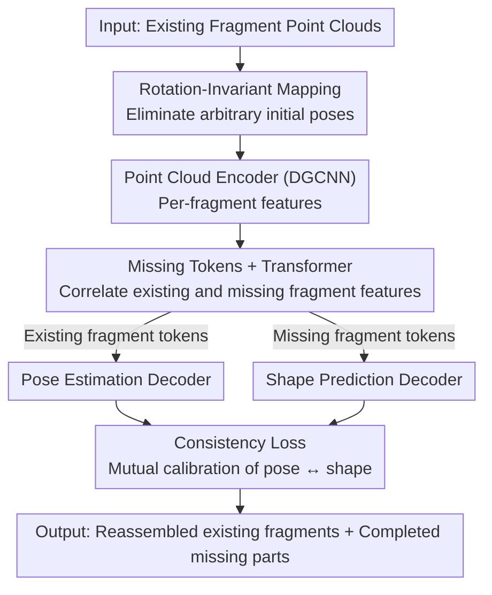

# Beyond Reassembly: Fractured Object Recovery with Missing Parts

**Conference**: CVPR 2026  
**Paper**: [CVF Open Access](https://openaccess.thecvf.com/content/CVPR2026/html/Xu_Beyond_Reassembly_Fractured_Object_Recovery_with_Missing_Parts_CVPR_2026_paper.html)  
**Code**: To be confirmed  
**Area**: 3D Vision  
**Keywords**: Shape Reassembly, Missing Part Prediction, Point Clouds, Transformer, Shape Prior

## TL;DR
Targeting real-world archaeological scenarios where fragments are missing and isolated fragments cannot be aligned due to the lack of overlapping surfaces, this paper proposes a novel **fractured object recovery** task. A Transformer-based framework is designed to **jointly solve** "estimating the poses of existing fragments" and "predicting the shapes of missing parts." Missing parts are represented as learnable mask tokens and correlated with existing fragment features. Consequently, the complete object can be reconstructed using shape priors even in the absence of overlap. This approach outperforms baselines that split "reassembly" and "completion" into a two-stage sequential pipeline in both pose estimation and part completion metrics.

## Background & Motivation

**Background**: Automatically reassembling fragments of fractured objects into their complete shapes (shape reassembly) has been actively researched for decades. Early works relied on hand-crafted geometric features (such as fracture segmentations and feature matching) for unsupervised alignment [7, 24, 44]. Recently, research has shifted to supervised learning, directly regressing the SE(3) transformation of each fragment using methods like Jigsaw (primal-dual descriptor), PuzzleFusion++, and GARF (fracture-aware pre-training + flow matching), supported by benchmarks such as Breaking Bad [50].

**Limitations of Prior Work**: Almost all existing reassembly methods **assume that the set of fragments is complete**—i.e., all parts are present, and adjacent fragments share overlapping fractured surfaces for matching. However, in real archaeological sites, fragments are frequently **missing** due to underground erosion or mixing with other artifacts. This even leads to **isolated fragments** that do not share any overlapping boundary with other surviving pieces. Such cases cannot be aligned under the "overlap matching" paradigm. The only prior work attempting to address missing components [46] performs symmetry-based completion *after* unsupervised reassembly; however, it fails to align isolated fragments and heavily relies on the completeness and symmetry of the remaining parts.

**Key Challenge**: Missing parts render the "reassembly" process highly **under-constrained**. Without key missing pieces, locating existing fragments through overlap matching becomes unreliable. Conversely, if a two-stage sequential pipeline (reassembling first and then completing) is applied, the pose errors from the first stage directly propagate to the completion stage. Thus, reassembly and completion are mutually dependent, but separating them into disjoint steps compiles errors.

**Goal**: The goal is to simultaneously solve both sub-problems in a unified framework—estimating the canonical pose $\hat{T}_i=\{\hat{R}_i,\hat{t}_i\}$ for each existing fragment $P_i$, and predicting the shape of each missing fragment $\hat{Q}_j$ (with its correct pose)—thereby representing the recovered object as $O=\bigcup_{i=1}^{N}\{P_i\otimes\hat{T}_i\}\cup\bigcup_{j=1}^{M}\{\hat{Q}_j\}$.

**Key Insight**: When restoring broken pottery, humans do not solely search for physical overlap. Instead, they reason using a **prior of what the target object should look like**. Even if two fragments do not touch, they can be placed in reasonable positions based on the conceptual knowledge of similar vessels. The authors leverage this insight, assuming that keeping the missing parts "in mind" during joint reasoning can, in turn, facilitate the alignment of existing fragments.

**Core Idea**: Treat "pose estimation" and "shape prediction" as a **dual problem for joint learning**. A Transformer is employed to correlate the features of all fragments (including the missing parts represented by mask tokens). An consistency loss is introduced to tie the two branches together, enabling reassembly and completion to mutually facilitate each other rather than compounding errors.

## Method

### Overall Architecture

The model takes a set of point clouds of existing fragments $\{P_i\}$ as input and outputs the pose of each existing fragment and the shape of each missing part, forming the recovered complete object. The pipeline operates as follows: first, a **rotation-invariant mapping** is applied to each fragment point cloud to eliminate arbitrary initial pose variations. A shared DGCNN point cloud encoder then extracts features, which are max-pooled into 128-dimensional vectors. These vectors, along with a set of **mask tokens** representing missing components, are passed into a multi-head **Transformer** $H_z$ for feature cross-correlation. This yields existing fragment tokens $\{z_{P_i}\}$ and missing part tokens $\{z_{Q_j}\}$. These tokens are routed based on their category to two decoders: a pose estimation network $D_{pose}$ regressing the poses of existing fragments, and a shape prediction network $D_{shape}$ generating the shapes of missing parts. Concurrently, the shape network uses $z_{P_i}$ to "predict the existing fragments", which is constrained by a **consistency loss** to align with the existing fragments transformed by the estimated poses, thereby coupling the pose and shape branches. During inference, when only existing fragments are provided, the model automatically determines the confidence of the mask tokens via Transformer self-attention to identify which tokens correspond to missing parts that need generation.

### Key Designs

**1. Missing Parts as Mask Tokens: Jointly Solving Reassembly and Completion via Transformer**

This is the core contribution, directly addressing the pain point that missing components cause shape assembly to be under-constrained and two-stage architectures to accumulate sequential errors. The authors borrow the masking concept from BERT/Point-BERT: during training, some fragments are randomly selected from a "complete" object, and their features are replaced with mask tokens (mask values) to simulate missing scenarios. These mask tokens, together with the pooled features $F_i^g$ (128-D) of the existing fragments, are input into a multi-head Transformer $H_z$. Self-attention allows each token to attend to all other tokens, meaning the features of the missing parts are **implicitly reasoned** from the mutual relationships of the existing fragments rather than generated from scratch. $H_z$ outputs 256-D tokens, denoted as $z_{P_i}$ for existing fragments and $z_{Q_j}$ for missing fragments. The former is fed into a 3-layer MLP pose decoder $D_{pose}$ (outputting 7-D: quaternion $\hat{q}_i \in \mathbb{R}^4$ + translation $\hat{t}_i \in \mathbb{R}^3$, where quaternions are converted to rotation matrices $\hat{R}_i$). The latter is fed into a 5-layer MLP shape decoder to generate a 1024-point point cloud for each missing component. Compared to the sequential "reassemble first, then complete" baseline, here the pose estimation is "aware" of the missing parts, and completion is "informed" of the locations of existing fragments. They provide mutual context within a single forward pass, which is key to aligning isolated fragments that lack overlapping surfaces. During inference, sequence lengths can vary, and the Transformer automatically estimates confidence for each token to determine whether it corresponds to a missing piece that needs to be generated.

**2. Rotation-Invariant Mapping: Preventing Encoder Interference from Arbitrary Initial Poses**

Fragment inputs can have arbitrary initial poses. Conventional features like Cartesian coordinates or normal vectors change drastically with rotation, forcing point cloud encoders to "learn to resist rotation," which incurs a heavy learning burden. Inspired by [16], prior to encoding, the authors augment each point $p_i$ with a set of **rotation-invariant descriptors**: taking $K=64$ nearest neighbors for each point, they compute four relative quantities $\phi_{ij}=\{\lVert d_{ij}\rVert,\ r(n_i,n_j),\ r(n_i,d_{ij}),\ r(n_j,d_{ij})\}$, representing the distance to the neighbor, the angle between their normals, and the angles of each normal with the relative vector $d_{ij}$. These metrics remain invariant under global rotations. They are concatenated with the point coordinates and vector $d_{ij}$ to form $[N, K, 10]$ local features, processed by a $[128,128,256]$ MLP and max-pooling to feed into the DGCNN. Consequently, identical geometries in different poses are mapped to **standardized representations**, freeing encoder capacity from learning pose variation and reducing alignment errors (removing this feature causes $E_{rot}$ to increase from 18.71 to 27.66).

**3. Consistency Loss: Tying Pose Estimation and Shape Prediction Together**

Beyond the unified architecture, the authors explicitly couple the two branches using a consistency loss. The design is ingenious: the shape prediction network not only generates missing parts, but also uses the tokens $z_{P_i}$ of existing fragments to "predict already existing fragments" $\hat{Q}_{P_i}$. It then constrains this prediction to match the ground-truth fragments aligned with the estimated poses $P_i\otimes\hat{T}_i$:

$$L_{consistency}=\frac{1}{N}\sum_{i=1}^{N}\mathrm{CD}\big(P_i\otimes\hat{T}_i,\ \hat{Q}_{P_i}\big).$$

where CD denotes Chamfer Distance. This loss dictates that what is generated by the shape network must align with what is positioned by the pose network. Pose estimation must not only align fragments but also allow the shape branch to reproduce them, while the shape branch is compelled to respect the poses, placing the missing parts in their correct positions. Tying these two independent outputs under a shared constraint is the most effective design according to ablation studies (removing it degrades $E_{missing}$ from 39.11 to 59.43).

### Loss & Training

The model is trained end-to-end, jointly optimizing the point cloud encoder $E_p$, the Transformer $H_z$, the pose decoder $D_{pose}$, and the shape decoder $D_{shape}$ (Poisson reconstruction is only used for post-process visualization and is excluded from training). Pose estimation uses rotation loss $L_{rot}=\frac{1}{N}\sum_i\lVert\hat{R}_i^\top R_i-I\rVert_F^2$, translation MSE $L_{trans}=\frac{1}{N}\sum_i(\hat{t}_i-t_i)^2$, and a CD-based pose loss $L_{pose}=\frac{1}{N}\sum_i\mathrm{CD}(P_i\otimes\hat{T}_i,\ P_i\otimes T_i)$. The shape branch uses $L_{shape}=\frac{1}{M}\sum_j\mathrm{CD}(\hat{Q}_j,Q_j)$. The total loss is formulated as:

$$L=L_{trans}+0.5\,L_{rot}+0.5\,L_{pose}+L_{shape}+L_{consistency}.$$

The weights are empirically chosen hyperparameters. The implementation is based on Jittor with a DGCNN backbone. Input point clouds are downsampled to 1024 points via Poisson disk sampling followed by farthest point sampling, and normalized by the longest bounding box diagonal. The batch size is set to 4, trained on a single TITAN RTX. The Adam optimizer is used, with a learning rate of 0.001 for the shape network and 0.0001 for the other modules.

## Key Experimental Results

### Main Results

The dataset is compiled based on the "everyday" subset of Breaking Bad, containing 2,547 instances across 20 categories, with fragment counts ranging from 3 to 15. For each instance, components are randomly removed (up to 20% of the total volume) to simulate missing scenarios, split 60/20/20 by instance. During test inference, only existing fragments are provided; missing fragments are used solely for evaluation. Evaluation metrics include $E_{rot}=\lVert\hat{R}_i^\top R_i-I\rVert_F$, $E_{trans}=\lVert\hat{t}_i-t_i\rVert_2$, and $E_{missing}=\mathrm{CD}(\hat{Q},Q)$ for missing parts. In the table below, $E_{rot}$, $E_{trans}$, and $E_{missing}$ are scaled by $10^3$, $10^2$, and $10^3$ respectively (lower is better for all).

| Method | $E_{rot}\downarrow$ | $E_{trans}\downarrow$ | $E_{missing}\downarrow$ |
|------|------|------|------|
| Multiview-ICP | 2981.21 | 78.22 | N/A |
| Jigsaw w/ AdaPoinTr | 43.16 | 11.68 | 104.63 |
| PF++ w/ AdaPoinTr | 33.46 | 8.88 | 66.59 |
| GARF w/ AdaPoinTr | 25.80 | 5.66 | 46.27 |
| Ours-TwoStage | 75.17 | 24.50 | 101.58 |
| **Ours** | **18.71** | **5.28** | **39.11** |

The baselines consist of a two-stage sequential combination of pose estimation followed by shape completion. Unsupervised Multi-view ICP and supervised assembly methods Jigsaw / PF++ / GARF are paired with the SOTA point cloud completion method AdaPoinTr. Multi-view ICP struggles with arbitrary initial poses since it relies on closest-point priors, and it cannot handle missing components. Even as pose estimation improves in Jigsaw/PF++/GARF, the missing parts still interfere with the alignment of remaining fragments, and directly completing the entire object limits the quality of the generated missing parts. Ours outperforms all baselines across all three metrics, validating the benefits of joint learning.

### Ablation Study

| Configuration | $E_{rot}\downarrow$ | $E_{trans}\downarrow$ | $E_{missing}\downarrow$ |
|------|------|------|------|
| w/o Rotation-Invariant Mapping | 27.66 | 6.54 | 47.29 |
| w/o Consistency Loss $L_{consis}$ | 22.83 | 6.02 | 59.43 |
| Ours-SDF (Using implicit SDFs instead of point clouds) | 45.91 | 22.18 | 87.64 |
| **Full Model** | **18.71** | **5.28** | **39.11** |

### Key Findings
- **Consistency loss contributes most to completion quality**: Excluding it deteriorates $E_{missing}$ from 39.11 to 59.43 (+52%), proving that "pose $\leftrightarrow$ shape coupling" is key to positioning the predicted missing parts correctly. Pose metrics degrade concurrently.
- **Rotation-invariant mapping mainly aids pose estimation**: Excluding it increases $E_{rot}$ from 18.71 to 27.66, demonstrating that it relieves the encoder of the burden of handling arbitrary initial orientations.
- **Point cloud representations outperform SDF implicit surfaces**: The Ours-SDF variant performs significantly worse across all three metrics ($E_{rot}$ 45.91, $E_{missing}$ 87.64); this variant also lacks consistency loss, further showing that point clouds combined with joint training are better suited for missing part recovery.
- **Joint learning outperforms the two-stage approach**: Ours-TwoStage (disentangling pose and shape estimation) yields a high $E_{missing}$ of 101.58, as it treats missing components globally and under-represents them during training. This highlights the core comparison.
- **Category-wise analysis**: Categories with simpler shape variations that are highly abundant in the dataset (such as bottles and bowls) yield better recovery performance.

## Highlights & Insights
- **Redefining "missing components" as learnable tokens rather than a post-processing patch**: Using a BERT-style masking scheme integrates missing components into the Transformer's self-attention, allowing assembly and completion to mutually inform each other in a single forward pass. This is the fundamental reason it handles isolated fragments without overlap and could inspire any "incomplete parts + joint localization/generation" task (e.g., CAD assembly, molecular fragment docking).
- **Clever "self-verification" via consistency loss**: Forcing the shape network to reconstruct existing fragments and align them with the estimated poses acts as a bridge tying two independent outputs together via a single CD loss, yielding substantial completion gains with practically zero extra annotation cost.
- **The task formulation itself is a major contribution**: Advancing the paradigm from "assembling existing pieces" to "assembling and predicting missing pieces" along with a dedicated benchmark addresses a long-ignored but pervasive archaeological problem, laying down a baseline for future endeavors.

## Limitations & Future Work
- The authors acknowledge that the generation quality of **small missing components** degrades significantly (point cloud representations struggle to capture fine-grained geometries). Denser sampling and filtering noisy data are suggested to mitigate this. A **limited category set** restricts zero-shot generalization, and expanding to diverse shape categories is required.
- *Self-observed limitation*: The training relies on ground-truth missing parts for supervision, restricting the missing ratio to $\le 20\%$. Extremely missing or highly sparse scenarios are not fully verified. Using CD as the $E_{missing}$ metric is also less sensitive to topological or fine-grained differences.
- The dataset is synthetic, based on Breaking Bad's "everyday" subset, without real-world scanning noise. The authors list "noise robustness" as future work.
- Improvement paths: Formulating stronger constraints from generated parts back to existing fragment alignment (bi-directional iteration) and integrating more expressive generative shape decoders instead of simple MLP point cloud regressors.

## Related Work & Insights
- **vs. Fragment Reassembly (Jigsaw / PF++ / GARF)**: These methods assume complete sets of fragments and regress poses using joint overlap or fracture features. Missing parts degrade their alignment. This work formally models missing parts in a Transformer, and joint completion yields higher assembly accuracy ($E_{rot}$ 18.71 vs. GARF's 25.80).
- **vs. Shape Completion (PoinTr / AdaPoinTr)**: Completion methods take a single partially-observed shape and fill in gaps. In contrast, the input here is a collection of **unaligned discrete fragments with unknown poses**. There is no cohesive partial shape to start with, requiring implicit reasoning about what is missing and where it goes.
- **vs. Symmetry-based Completion [46]**: [46] applies symmetry-based completion after unsupervised reassembly. It is limited by the completeness and symmetry of remaining parts and cannot align isolated fragments. This work leverages learned shape priors, bypassing symmetry assumptions.
- **vs. Point Cloud Registration (RANSAC / ICP & Deep Learning methods)**: Registration requires overlapping regions between point clouds. The fragments here do not guarantee overlap and require completing what is missing, rendering standard registration paradigms ineffective (as evidenced by Multi-view ICP's $E_{rot}$ of 2981.21).

## Rating
- Novelty: ⭐⭐⭐⭐⭐ Formulates the "fractured object recovery with missing parts" task and provides the first learning-based model, modeling missing pieces as learnable tokens.
- Experimental Thoroughness: ⭐⭐⭐⭐ Comprehensive experiments, ablations, SDF/two-stage comparisons, and category analysis, though tested primarily on synthetic data without real-world scanning noise.
- Writing Quality: ⭐⭐⭐⭐ Clear motivation, with Fig. 2 successfully explaining the joint pipeline. Some notations (e.g., $\hat{Q}_{P_i}$) require tracing equations to fully comprehend.
- Value: ⭐⭐⭐⭐ Directly hits a real-world pain point in archaeological conservation, delivering the task, dataset, and model as a cohesive package to inspire future investigations.

<!-- RELATED:START -->

## Related Papers

- [\[CVPR 2026\] BEA-GS: BEyond RAdiance Supervision in 3DGS for Precise Object Extraction](bea-gs_beyond_radiance_supervision_in_3dgs_for_precise_object_extraction.md)
- [\[CVPR 2026\] DINO Eats CLIP: Adapting Beyond Knowns for Open-set 3D Object Retrieval](dino_eats_clip_adapting_beyond_knowns_for_open-set_3d_object_retrieval.md)
- [\[CVPR 2026\] Material Magic Wand: Material-Aware Grouping of 3D Parts in Untextured Meshes](material_magic_wand_material-aware_grouping_of_3d_parts_in_untextured_meshes.md)
- [\[CVPR 2026\] TEXTRIX: Latent Attribute Grid for Native Texture Generation and Beyond](textrix_latent_attribute_grid_for_native_texture_generation_and_beyond.md)
- [\[CVPR 2026\] Beyond Geometry: Artistic Disparity Synthesis for Immersive 2D-to-3D](beyond_geometry_artistic_disparity_synthesis_for_immersive_2d-to-3d.md)

<!-- RELATED:END -->
