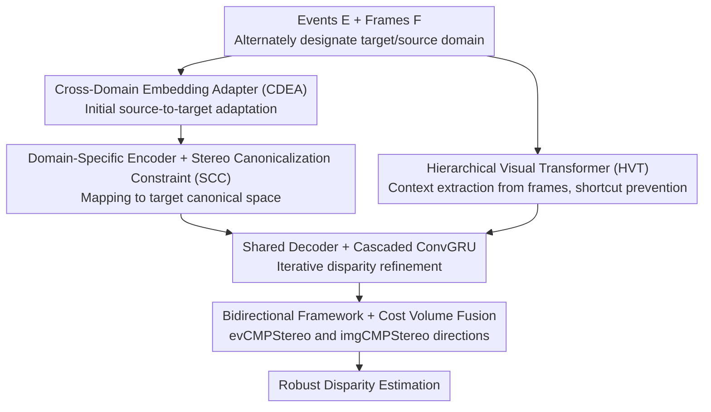

# Bi-CMPStereo: Bidirectional Cross-Modal Prompting for Event-Frame Asymmetric Stereo

**Conference**: CVPR 2026  
**arXiv**: [2604.15312](https://arxiv.org/abs/2604.15312)  
**Code**: [github.com/xnh97/Bi-CMPStereo](https://github.com/xnh97/Bi-CMPStereo)  
**Area**: 3D Vision  
**Keywords**: event camera, stereo matching, cross-modal, asymmetric stereo, depth estimation

## TL;DR

Proposes Bi-CMPStereo, a bidirectional cross-modal prompting framework that alternately sets events and frames as target domains for stereo canonicalization constraints and cross-domain embedding adaptation, while utilizing cost volumes from both directions to achieve robust event-frame asymmetric stereo matching.

## Background & Motivation

The high temporal resolution and high dynamic range of event cameras complement the rich contextual information of frame cameras, making event-frame asymmetric stereo promising under high-speed motion and extreme lighting. However, the modal gap is significant: existing methods alleviate this either through domain-level alignment (unified representation + Siamese feature extraction) or feature-level alignment (independent encoders + shared embeddings), both of which may marginalize domain-specific discriminative cues. The key challenge is learning expressive representations without marginalizing information during lossy alignment.

## Method

### Overall Architecture

The difficulty in event-frame asymmetric stereo lies in the large modality gap. Previous works used domain-level alignment (unified representation + Siamese features) or feature-level alignment (independent encoders + shared embeddings), but both tended to marginalization of discriminative cues unique to one modality. Bi-CMPStereo avoids forcing a compromised common space by alternately setting events and images as target and source domains. CMPStereo learns aligned stereo representations in the canonical space of the target domain, instantiated as two complementary configurations: evCMPStereo (event as target) and imgCMPStereo (image as target). Finally, cost volumes from both directions are fused for robust disparity. The data flow within each CMPStereo involves: CDEA performs initial source-to-target adaptation at the feature level; domain-specific encoders with SCC map both source and target into the target domain's canonical space; a shared decoder produces multi-scale stereo features for iterative refinement by cascaded ConvGRUs. Context is separately extracted from the frame image using HVT to prevent the model from taking shortcuts by focusing solely on the frame.

### Key Designs

**1. Cross-Domain Embedding Adapter (CDEA): Strengthening target domain cues weakly encoded in the source domain**

Target domain cues that are originally weakly encoded in the source domain (e.g., color information easily obtained in images but difficult to extract from events) will be further submerged during subsequent alignment if not strengthened. CDEA is a lightweight adapter that performs a preliminary source-to-target adaptation at the feature level before passing results to the domain-specific encoder for deep extraction. This "bolsters" weak signals before encoding to avoid initial information loss.

**2. Stereo Canonicalization Constraint (SCC): High-fidelity cross-modal alignment in the target canonical space**

A major risk in modality alignment is crushing source-specific cues into indiscriminate common representations. SCC serves as a regularization term that forces the network to learn discriminative target-domain features from both events and frames. It maps both source and target into the target domain's canonical space for high-fidelity alignment—ensuring both alignment and that features extracted from the source retain target-domain discriminative expressions rather than being smoothed out.

**3. Hierarchical Visual Transformer (HVT): Preventing shortcuts by bypassing events via frames**

Due to the rich context in frame images, models easily rely solely on frames and ignore events, leading to degradation in high-speed motion or extreme lighting. HVT is used to extract context features, breaking this shortcut learning and enhancing cross-scene generalization, ensuring event information truly participates in matching.

**4. Bidirectional Framework and Cost Volume Fusion: Alternating target domains for reciprocal cost volume complementarity**

Unidirectional configurations that fix one modality as the target still sacrifice discriminative cues from the other direction. Bi-CMPStereo instantiates CMPStereo as evCMPStereo (event as target) and imgCMPStereo (image as target). Each produces a set of cost volumes, and the matching confidences from both directions are fused. The two directions complement each other, preventing unique cues of either modality from being marginalized, ultimately yielding robust disparity under cascaded ConvGRU refinement.

### Loss & Training

Iterative refinement disparity loss is used, where disparities from the cost volumes of both directions are fused. The SCC constraint is applied as a regularization term during training.

## Key Experimental Results

### Main Results

Evaluated on DSEC and MVSEC benchmarks:

| Benchmark | Metric | Prev. SOTA | Bi-CMPStereo |
|-----------|--------|------------|--------------|
| DSEC      | Various| Baseline   | **Significant Outperformance** |
| MVSEC     | Various| Baseline   | **Significant Outperformance** |

Ours significantly outperforms SOTA in both accuracy and generalization.

### Ablation Study

- The bidirectional framework outperforms either unidirectional configuration.
- SCC constraint is critical for improving cross-modal feature quality.
- CDEA effectively supplements missing target domain cues in the source domain.

### Key Findings

- Alternately setting the target domain effectively avoids information marginalization.
- Bidirectional cost volumes provide complementary matching confidence.
- Retaining domain-specific cues is more effective than pursuing a unified representation.

## Highlights & Insights

- The "alternating target domain" bidirectional design concept is novel—rather than seeking a compromised common space, both directions are fully utilized.
- SCC combines the geometric constraints of stereo matching with cross-modal alignment.
- HVT prevents the model from taking shortcuts by using frame information to bypass event information.

## Limitations & Future Work

- The bidirectional framework implies twice the computational overhead.
- The choice of event representation (event concentration) may not be optimal.
- Validated only on two stereo benchmarks.

## Related Work & Insights

- The alternating target domain framework can be generalized to other cross-modal fusion tasks.
- The domain prompting idea in SCC draws inspiration from prompting in NLP.
- The systematic scheme for event-frame fusion provides a reference for neuromorphic sensor applications.

## Rating

7/10 — The method design is systematic and complete, with significant experimental improvements, representing a strong advancement in the field of asymmetric stereo.

<!-- RELATED:START -->

## Related Papers

- [\[CVPR 2026\] Bidirectional Cross-Modal Prompting for Event-Frame Asymmetric Stereo](bidirectional_cross-modal_prompting_for_event-frame_asymmetric_stereo.md)
- [\[CVPR 2026\] ARES: Unifying Asymmetric RGB-Event Stereo for Probabilistic Scene Flow Estimation](ares_unifying_asymmetric_rgb-event_stereo_for_probabilistic_scene_flow_estimatio.md)
- [\[CVPR 2026\] AIMDepth: Asymmetric Image-Event Mamba for Monocular Depth Estimation](aimdepth_asymmetric_image-event_mamba_for_monocular_depth_estimation.md)
- [\[CVPR 2026\] AffordGrasp: Cross-Modal Diffusion for Affordance-Aware Grasp Synthesis](affordgrasp_cross-modal_diffusion_for_affordance-aware_grasp_synthesis.md)
- [\[CVPR 2026\] CMHANet: A Cross-Modal Hybrid Attention Network for Point Cloud Registration](cmhanet_a_cross-modal_hybrid_attention_network_for_point_cloud_registration.md)

<!-- RELATED:END -->
