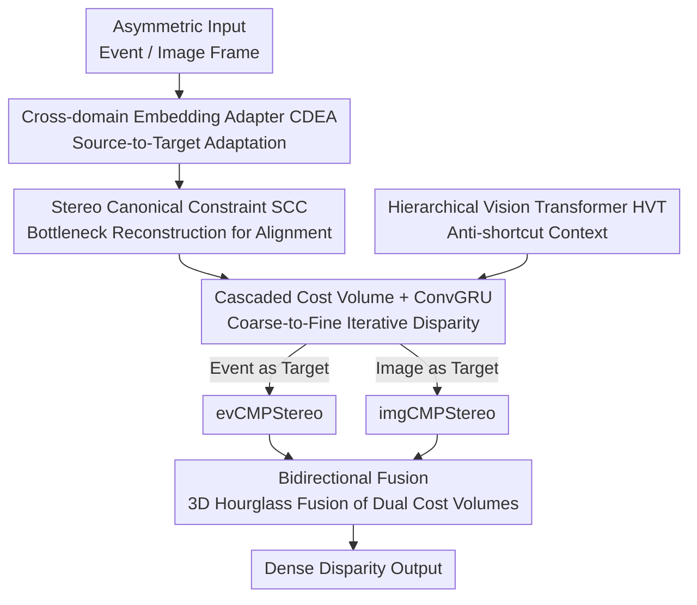

# Bidirectional Cross-Modal Prompting for Event-Frame Asymmetric Stereo

**Conference**: CVPR 2026  
**Paper**: [CVF Open Access](https://openaccess.thecvf.com/content/CVPR2026/html/Xu_Bidirectional_Cross-Modal_Prompting_for_Event_Frame_Asymmetric_Stereo_CVPR_2026_paper.html)  
**Code**: https://github.com/xnh97/BiCMPStereo  
**Area**: 3D Vision  
**Keywords**: Event Camera, Asymmetric Stereo Matching, Cross-Modal Alignment, Disparity Estimation, Cross-Modal Prompting  

## TL;DR
Addressing asymmetric stereo matching where "one eye is an event camera and the other is a standard RGB camera," this paper proposes Bi-CMPStereo. It utilizes a cross-domain adapter and self-reconstruction constraints to align both modalities into a "canonical space of a single target domain." By alternating between event and image as the target domain in a bidirectional fashion and fusing the results, the method significantly outperforms previous SOTA models (e.g., ZEST) in accuracy and generalization on DSEC, MVSEC, and M3ED datasets.

## Background & Motivation
**Background**: Stereo matching (finding correspondences between views to calculate disparity and depth) is well-established for RGB cameras, with iterative refinement methods like RAFT-Stereo being mainstream. Event cameras are bio-inspired neuromorphic sensors that detect pixel-wise brightness changes asynchronously, offering microsecond time resolution and 120 dB high dynamic range, excelling in high-speed motion and extreme lighting. However, symmetric event stereo struggles with dense estimation in static or low-texture regions due to event sparsity, and dual event-camera setups are costly. Thus, **asymmetric stereo** ("one event + one RGB") provides a robust and cost-effective alternative.

**Limitations of Prior Work**: In asymmetric configurations, the two view modalities differ fundamentally—events represent sparse brightness changes, while frames represent dense intensity images. Stereo matching models inherently assume that left and right views are comparable in the same feature space. The massive **modality gap** between events and frames disrupts this alignment assumption.

**Key Challenge**: Existing remedies follow two paths: ① Domain-level alignment: unifying events and frames into a common representation for a Siamese extractor; ② Feature-level alignment: using separate extractors and seeking a shared embedding. Both approaches **pursue cross-modal commonality**, which results in **marginalizing** discriminative domain-specific cues that are prominent in only one domain. For example, color cues easily obtained from images are marginalized because they are difficult to extract from events, causing asymmetric methods to underperform compared to symmetric event stereo.

**Goal & Core Idea**: The objective is to learn representations that are both aligned and preserve domain-specific discriminative information. The **Key Insight** is to avoid forcing a compromised shared space. Instead, the method **alternately designates one modality as the "target domain" and uses its domain as the canonical space for alignment**. The source domain is then "prompted" into this canonical space while self-reconstruction forces the model to preserve details. By executing this in both directions—"event as target" and "image as target"—the complementary information is fused through Bidirectional Cross-Modal Prompting.

## Method

### Overall Architecture
The system estimates dense disparity from calibrated asymmetric event-frame inputs. The core component, **CMPStereo**, learns to align stereo representations within a specific target domain's canonical space. It consists of two symmetric instances: **evCMPStereo** (Event as target domain $X_t$, represented by event count maps E; Frame as source domain $X_s$) and **imgCMPStereo** (Image frame as target domain; Events encoded as voxel grids V as source domain). After individual end-to-end training, these networks are frozen as feature extractors, and **Bi-CMPStereo** fuses multi-scale cost volumes from both branches for final disparity refinement.

Inside a single CMPStereo: the source modality passes through a **Cross-domain Embedding Adapter (CDEA)** for initial "source-to-target" adaptation → both source and target pass through domain-specific encoders $F_s(\cdot)$ and $F_t(\cdot)$, constrained by a **Stereo Canonical Constraint (SCC)** at the bottleneck to land in the same canonical space → a shared decoder $F_D(\cdot)$ produces multi-scale stereo features → a group-wise correlation cost volume is constructed → cascaded ConvGRUs iteratively refine disparity. Context features are separately extracted from the image frame using a **Hierarchical Vision Transformer (HVT)** to prevent the network from taking "shortcuts" based solely on frame context.

### Key Designs

**1. Cross-domain Embedding Adapter (CDEA): Activating Source Modalities into Target Domain Cues**

Discriminative cues needed by the target domain are often latent in the source modality, but standard encoding fails to activate them. CDEA places a U-shaped adapter $A_{s2t}(\cdot)$ at the start of the source branch to map $X_s$ to an embedding space aligned with the target domain, explicitly activating latent cues. To guide this, a **shared domain classifier $C(\cdot)$** distinguishes between event and frame embeddings, supervising the adaptation:

$$L_{cdea} = \ell_{ce}(C(E), 1) + \ell_{ce}(C(F), 0) + \ell_{ce}(C(A_{s2t}(X_s)), Y_t)$$

where $\ell_{ce}$ is binary cross-entropy and $Y_t$ is the target domain label. This forces each adapter to map its source modality specifically toward the designated target side, ensuring complementary representations.

**2. Stereo Canonical Constraint (SCC): Preserving Discriminative Cues via Self-Reconstruction**

Joint optimization of stereo matching often causes the bottleneck space to collapse into overly similar representations, marginalizing domain-specific cues. SCC's **Mechanism** posits that a robust intermediate representation should faithfully reconstruct the original input in the target space. A training-time constraint uses a lightweight shared decoder $F_R(\cdot)$ to map both representations back to target-domain reconstructions:

$$L_{scc} = \lVert F_R(F_s(A_{s2t}(X_s))) - X_s^{(t)} \rVert_1 + \lVert F_R(F_t(X_t)) - X_t \rVert_1$$

where $X_s^{(t)} := W(X_{t}, d_{gt})$ represents the source modality expressed in the target space via warping with ground truth disparity $d_{gt}$. $F_R$ is **intentionally lightweight** to prevent it from synthesizing missing details, forcing the encoder to maintain fine-grained cues. This constraint is removed during inference.

**3. Hierarchical Vision Transformer (HVT): Blocking "Frame-only Context" Shortcuts**

Context features are vital for ConvGRU updates. However, in cross-modal stereo, networks may **over-rely on frame context to bypass difficult cross-modal alignment**, learning shortcuts rather than true correspondences. HVT synthesizes augmented views $\{T_G(F), T_L(F), T_P(F)\}$ across global/local/pixel scales and enforces context invariance. To ensure visual diversity, it first minimizes similarity between original and transformed frames:  
$$L_{sim} = \sum_{J} \mathrm{Cos}(\phi(T_J(F)), \phi(F)), \quad J \in \{G, L, P\}$$  
then constrains feature consistency via $L_{dist} = \sum_J \lVert F_c(T_J(F)) - F_c(F) \rVert_2$.

**4. Bidirectional Fusion (Bi-CMPStereo) + Cascaded Disparity Refinement**

Bi-CMPStereo **freezes** evCMPStereo and imgCMPStereo as extractors. It constructs two sets of multi-scale cost volumes. At 1/16 and 1/8 scales, volumes are concatenated; at the 1/4 scale, a **3D Hourglass Network** aggregates complementary cues. Disparity is refined via cascaded ConvGRUs where coarse-scale results (with narrower modality gaps) provide priors for high-resolution stages.

### Loss & Training
The disparity loss $L_d$ uses exponentially weighted Smooth L1 across all iterations. The pre-training objective is $L_{pre} = L_d + \lambda_1 L_{cdea} + \lambda_2 L_{scc} + \lambda_3 L_{HVT}$. The final fusion stage trains the 3D Hourglass and ConvGRUs while freezing the branches.

## Key Experimental Results

### Main Results
DSEC Dataset (Outdoor Driving): MAE / 1PE / 2PE / RMSE (Lower is better):

| Method | MAE↓ | 1PE↓ | 2PE↓ | RMSE↓ | Note |
|------|------|------|------|-------|------|
| ZEST† [41] | 0.763 | 20.382 | 4.646 | 1.438 | Prev. SOTA Asymmetric |
| SEVFI [18] | 0.711 | 16.932 | 4.307 | 1.509 | Asymmetric |
| evCMPStereo (Ours) | 0.577 | 12.309 | 2.909 | 1.310 | Event-target |
| imgCMPStereo (Ours) | 0.565 | 11.432 | 2.790 | 1.292 | Image-target |
| **Bi-CMPStereo (Ours)** | **0.532** | **10.613** | **2.415** | **1.210** | Bidirectional |
| SE-CFF [48] | 0.612 | 12.477 | 3.288 | 1.445 | Symmetric Event |

Key Finding: The **asymmetric Bi-CMPStereo outperforms symmetric event stereo models** (SE-CFF/DTC) because it preserves complementary cues.

Zero-shot Generalization (Train on DSEC, test direct on MVSEC/M3ED):

| Dataset | Metric | ZEST [41] | Bi-CMPStereo |
|--------|------|-----------|--------------|
| MVSEC | MAE↓ | 5.220 | **1.858** |
| M3ED | MAE↓ | 2.060 | **1.557** |

### Ablation Study
On imgCMPStereo:
- w/o CDEA & SCC: MAE 0.594
- w/o CDEA: MAE 0.583
- w/o SCC: MAE 0.589
- **Full**: **0.565**

On Bi-CMPStereo, removing HVT during DSEC→MVSEC generalization drops MAE from 1.858 to 2.093.

### Key Findings
- **SCC drives accuracy, HVT drives generalization**: SCC preserves discriminative details, while HVT prevents context-based shortcuts that fail on new datasets.
- **Asymmetric > Symmetric**: Preserving dual-modality complementarity is more effective than forcing homogeneous inputs which are limited by event sparsity.
- **Cascaded architecture is essential**: Propagating coarse semantic consistency to high resolution avoids fine-grained structural misalignment.

## Highlights & Insights
- **Alternating Target Domains**: Instead of an "average" common space that loses unique info, the model uses two "canonical" spaces and fuses them.
- **Lightweight Reconstruction as Regularization**: Explicitly making the reconstruction decoder weak forces the encoder to capture fine-grained details in the latent space.
- **Zero Inference Overhead**: CDEA, SCC, and HVT are training-time constraints, ensuring standard runtime efficiency.

## Limitations & Future Work
- **Training Complexity**: Requires a three-stage training process (two pre-trains + one fusion).
- **Ground Truth Dependency**: SCC requires $d_{gt}$ for warping, making unsupervised adaptation difficult.
- **Memory/Computation**: Running dual branches plus a 3D Hourglass fusion increases computational budget compared to single-modal baselines.

## Related Work & Insights
- **vs ZEST [41]**: ZEST relies on large-scale RGB pre-trained models for zero-shot capability; Bi-CMPStereo outperforms ZEST solely through structural design that preserves domain cues.
- **vs Siamese/Shared Embedding**: These traditional methods marginalize domain-specific features by focusing strictly on commonalities.
- **vs Symmetric Event Stereo**: Bi-CMPStereo breaks the paradigm that symmetric inputs are naturally superior by leveraging the dense intensity information from the RGB frame effectively.

## Rating
- Novelty: ⭐⭐⭐⭐⭐ 
- Experimental Thoroughness: ⭐⭐⭐⭐⭐ 
- Writing Quality: ⭐⭐⭐⭐ 
- Value: ⭐⭐⭐⭐ 

<!-- RELATED:START -->

## Related Papers

- [\[CVPR 2026\] ARES: Unifying Asymmetric RGB-Event Stereo for Probabilistic Scene Flow Estimation](ares_unifying_asymmetric_rgb-event_stereo_for_probabilistic_scene_flow_estimatio.md)
- [\[CVPR 2026\] AIMDepth: Asymmetric Image-Event Mamba for Monocular Depth Estimation](aimdepth_asymmetric_image-event_mamba_for_monocular_depth_estimation.md)
- [\[CVPR 2026\] AffordGrasp: Cross-Modal Diffusion for Affordance-Aware Grasp Synthesis](affordgrasp_cross-modal_diffusion_for_affordance-aware_grasp_synthesis.md)
- [\[CVPR 2026\] CMHANet: A Cross-Modal Hybrid Attention Network for Point Cloud Registration](cmhanet_a_cross-modal_hybrid_attention_network_for_point_cloud_registration.md)
- [\[CVPR 2026\] Geometry-Aware Cross-Modal Graph Alignment for Referring Segmentation in 3D Gaussian Splatting](geometry-aware_cross-modal_graph_alignment_for_referring_segmentation_in_3d_gaus.md)

<!-- RELATED:END -->
