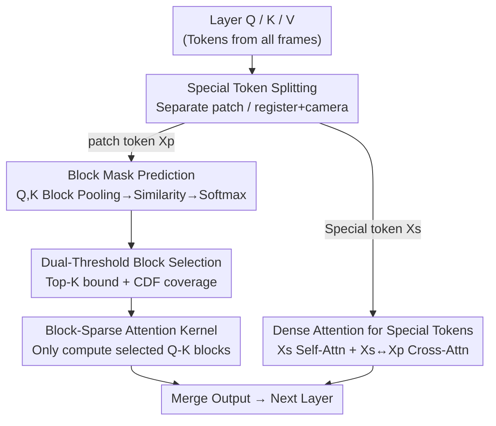

# Block-Sparse Global Attention for Efficient Multi-View Geometry Transformers

**Conference**: CVPR 2026  
**Paper**: [CVF Open Access](https://openaccess.thecvf.com/content/CVPR2026/html/Wang_Block-Sparse_Global_Attention_for_Efficient_Multi_View_Geometry_Transformers_CVPR_2026_paper.html)  
**Code**: Project Page https://vision.rwth-aachen.de/sparse-vggt (public repository not yet seen)  
**Area**: 3D Vision  
**Keywords**: Multi-view geometry, block-sparse attention, feed-forward reconstruction, inference acceleration, VGGT  

## TL;DR
For feed-forward multi-view geometry Transformers such as VGGT / π³ / MapAnything, the authors observed that global attention matrices are highly sparse (probability mass is concentrated on a few patch pairs corresponding to cross-view geometric matches). Consequently, a **training-free** block-sparse attention was used to directly replace dense global attention, achieving 3× inference speedup (even more on long sequences) with negligible loss in reconstruction or pose accuracy.

## Background & Motivation
**Background**: Feed-forward reconstruction of 3D geometry and camera motion from multiple images is a "learned version" of SfM. VGGT employs an Aggregator with alternating "intra-frame + global attention" to perform scene-level reasoning in a single forward pass, reaching SOTA in reconstruction, pointmaps, and point tracking. π³ extends this by removing camera embeddings for permutation invariance, while MapAnything introduces a Transformer supporting optional geometric inputs. Their shared backbone is **global attention**.

**Limitations of Prior Work**: Global attention has quadratic complexity relative to the number of tokens. In multi-view scenarios, the number of tokens = frames × patches per frame, which grows linearly with the number of frames. Thus, attention overhead **expands quadratically** with frame count. Empirical measurements (Fig. 1, H100 + FlashAttention2, 518² resolution) show that as frame counts increase, global attention quickly dominates patchification, intra-frame attention, and FFN, becoming an absolute bottleneck that limits scalability to more images. An attention matrix for 10 frames at 294×518 resolution contains ~$1.2 \times 10^8$ elements (>100MB in half-precision); for 1000 frames, it would require >1TB.

**Key Challenge**: Global attention is both the key to achieving scene-level consistency (aligning and disambiguating distant views) and the primary cause of poor scalability—a quadratic trade-off between consistency and computational cost.

**Key Insight**: Inspection of mid-layer (layer 15) post-softmax attention maps in VGGT (Fig. 3, 4) reveals that the **vast majority of entries are near zero, with probability mass concentrated on very few patch-patch pairs corresponding to geometrically meaningful cross-view correspondences**. The attention maps resemble sparse correspondence matrices of SIFT in traditional SfM. Essentially, the model uses global attention for "brute-force correspondence search," but only a small fraction of token pairs are actually utilized.

**Core Idea**: Since over 75% of dense attention is wasted, a block-sparse mask can be predicted **without training** to compute only "important blocks." Replacing global attention with this block-sparse version allows costs to grow with the number of activated blocks rather than the full quadratic scale, accelerating inference without performance drops.

## Method

### Overall Architecture
The method maintains the encoders and task heads of VGGT/π³/MapAnything, only replacing the **global attention layers** within the Aggregator. The processing flow for one global attention layer is as follows: first, Q and K are average-pooled with block size $b$ to obtain low-resolution approximations. These are used to calculate inter-block similarity and softmax to find the importance distribution. A **Top-K + CDF dual threshold** then converts this distribution into a binary block mask. Finally, this mask is passed to a standard block-sparse attention kernel (reusing the SpargeAttention kernel but decoupled from its mechanism) to compute only selected Q-K blocks. A key engineering detail is that **special tokens (registers / cameras) do not follow the sparse path** and are handled separately with dense attention.

The replacement is local and layer-wise. The following diagram describes how one dense global attention layer is modified into block-sparse global attention:

### Key Designs

**1. Block Mask Prediction: Approximating Sparse Structure with Low-Res Attention Maps**

The challenge is that sparse attention requires knowing "which blocks are important," but calculating the full $QK^\top$ defeats the purpose of saving computation. The approach is to **downsample before deciding**: pool Q and K by block size $b$ to get $P_b(Q)$ and $P_b(K)$, calculate inter-block similarity $S = P_b(Q) P_b(K)^\top$ at low resolution, and apply softmax to get the block probability distribution. This low-cost "thumbnail attention map" allows for ranking and selecting relevant blocks. Adding a linear projection after pooling showed no improvement, so the mechanism remains extremely lightweight—this is key to being "training-free" with no learnable parameters.

Standard dense self-attention is:

$$\text{Attention}(\mathbf{Q},\mathbf{K},\mathbf{V}) = \text{softmax}\!\left(\frac{\mathbf{Q}\mathbf{K}^\top}{\sqrt{d_h}}\right)\mathbf{V}$$

The block-sparse version multiplies $QK^\top$ by a binary mask $\mathbf{M}$:

$$\text{SparseAttn}(\mathbf{Q},\mathbf{K},\mathbf{V}) = \text{softmax}\!\left(\frac{(\mathbf{Q}\mathbf{K}^\top)\odot\mathbf{M}}{\sqrt{d_h}}\right)\mathbf{V}$$

where $\odot$ denotes element-wise multiplication. Using a **block** structure instead of arbitrary sparsity ensures friendliness to modern accelerators and efficient memory access.

**2. Top-K + CDF Dual-Threshold Block Selection: Stability Across Layers**

Using a single threshold is problematic: a pure CDF threshold $\tau$ ensures selected blocks cover a $\tau$ proportion of cumulative probability, but in "uniform" layers, this might select too many blocks. Conversely, a fixed sparsity rate $\rho$ might select too few blocks in some layers, hurting accuracy. The authors use a **complementary approach**: the CDF threshold $\tau$ acts as a **coverage floor**, while the sparsity rate $\rho$ acts as a **block count floor**—forcing the retention of at least $k = \lfloor B\cdot(1-\rho)\rfloor$ top-ranked blocks ($B$ is total blocks). This dual constraint ensures robustness at **high sparsity rates (>75%)** compared to CDF-only methods like SpargeAttention.

**3. Dense Paths for Special Tokens: Registers and Cameras**

VGGT appends 1 camera token + 4 register tokens per frame to carry camera information and distinguish frame roles. Their attention behavior is **fundamentally different** from patch tokens (Fig. 4). Pooling them with patch tokens for sparsity leads to significant accuracy drops. Therefore, tokens are split into patch tokens $X_p$ and special tokens $X_s$. **The block-sparse mask is only predicted and used for $X_p$**, while self-attention for $X_s$ and cross-attention between $X_s$ and $X_p$ remain fully dense. Ablations show this is essential for maintaining accuracy at high sparsity.

> Difference from SpargeAttention: While reusing its kernel, this method **removes** self-similarity filtering, Hilbert curve reordering, and sparse online softmax, using only Top-K + CDF selection and dense special tokens. This makes mask prediction kernel-agnostic and easier to maintain.

### Loss & Training
**Training-free**. The entire method is a plug-and-play inference-time replacement. It requires no changes to encoders or task heads, no backpropagation, and no re-labeling. Only block selection hyperparameters (CDF threshold $\tau$, sparsity rate $\rho$, block size $b$) are adjusted.

## Key Experimental Results

Implemented on VGGT, π³, and MapAnything across tasks including relative pose estimation (Real Estate 10K, CO3Dv2, TUM, ScanNet), pointmap estimation (7Scenes, NRGBD, DTU, ETH3D), and scene-level pose (Tanks & Temples).

### Main Results: Sparsity vs. Accuracy / Acceleration

| Task / Dataset | Metric | Observation (as effective sparsity ↑) |
|--------------|------|----------------------|
| Relative Pose (CO3Dv2, RealEstate10K) | AUC@30 ↑ | Pose accuracy decreases slightly but remains competitive with SOTA like Fast3r/CUT3R/FLARE even at high sparsity. |
| Pose (TUM, ScanNet) | ATE ↓ | Maintains acceptable levels at high sparsity. |
| Pointmaps (7Scenes, NRGBD, DTU) | Chamfer dist. ↓ | Minimal degradation; improvement on ETH3D attributed to randomness. |
| Long Sequences (Tanks & Temples, 200 frames) | AUC@30 ↑ | Minimal degradation at 75% effective sparsity. |
| End-to-end Speed (Long seq, H100) | wall-clock | >3× acceleration; 200-frame π³ + 75% sparsity is ~2× faster than baseline; gain increases with sequence length. |

### Ablation Study

| Configuration | Key Phenomenon | Description |
|------|---------|------|
| Ours (Top-K + CDF + dense special) | Most stable at high sparsity | Full method |
| Ours w/o Dense Special | Significant drop at high sparsity | Verifies necessity of keeping special tokens dense. |
| CDF only | Faster degradation as sparsity increases | Equivalent to SpargeAttention mechanism. |
| SpargeAttn / w/ high sim thr. | Trails Ours at high sparsity | Self-similarity filtering is less stable for large sparsity. |
| Random / Random w/ dense special | Collapses as sparsity increases | Proves sparsity must follow geometric structure. |

### Key Findings
- **Sparsity derives from geometric correspondence**: High-activation entries align with cross-frame geometric matches, acting as learned "correspondence search."
- **Mid-layers are critical**: Maximum activation peaks in the middle of the Aggregator, primarily driven by patch-patch interactions.
- **Scaling acceleration**: Since global attention's share of computation increases with frame count and resolution, end-to-end gains are more significant for long, high-resolution sequences.
- **Generalization**: The same mechanism works seamlessly across different architectures (MapAnything), showing a universal accuracy-efficiency trade-off for global cross-view attention.

## Highlights & Insights
- **Adapting LLM sparse attention to vision geometry**: Unlike LLMs that rely on causal masks or temporal continuity, this method exploits the domain-specific observation that "attention maps ≈ geometric correspondence matrices."
- **Plug-and-play without training**: No weight changes or fine-tuning required. A zero-cost acceleration path for existing large reconstruction models.
- **Robust dual-threshold design**: The Top-K + CDF approach adapts to varying sparsity distributions across layers better than single-threshold methods.
- **Special token splitting**: Highlights that tokens carrying global information (registers/cameras) must not be sparsified like content tokens to preserve scene-level consistency.

## Limitations & Future Work
- The method is for acceleration, not for improving accuracy beyond the baseline.
- Acceleration depends on the ratio of global attention; gains are limited for low frames/resolutions.
- Hyperparameters ($b$, $\tau$, $\rho$) require tuning per model or scene.
- Future work: Integrating sparse attention into training to further reduce accuracy loss or using it to accelerate higher-resolution inputs.

## Related Work & Insights
- **vs SpargeAttention**: Reuses the kernel but simplifies the mechanism for better stability at high sparsity and cross-GPU maintenance.
- **vs SeerAttention / PixelatedButterfly**: Avoids the need for learnable parameters or optimization/training.
- **vs Two-view + Global Alignment (DUSt3R/MASt3R)**: These split views into pairs and use expensive global alignment; this method enables the "one-shot global attention" route to scale to large image sets.

## Rating
- Novelty: ⭐⭐⭐⭐ Innovative application of geometric correspondence for training-free sparse acceleration.
- Experimental Thoroughness: ⭐⭐⭐⭐ Broad coverage across models, tasks, and long sequences.
- Writing Quality: ⭐⭐⭐⭐⭐ Logical flow from visualization to architecture and experiments.
- Value: ⭐⭐⭐⭐ High practical value for scaling feed-forward multi-view geometry models.

<!-- RELATED:START -->

## Related Papers

- [\[CVPR 2026\] Any Resolution Any Geometry: From Multi-View To Multi-Patch](any_resolution_any_geometry_from_multi-view_to_multi-patch.md)
- [\[CVPR 2026\] FlashVGGT: Efficient and Scalable Visual Geometry Transformers with Compressed Descriptor Attention](flashvggt_efficient_and_scalable_visual_geometry_transformers_with_compressed_descr.md)
- [\[CVPR 2026\] Generalizable Human Gaussian Splatting via Multi-view Semantic Consistency](generalizable_human_gaussian_splatting_via_multi-view_semantic_consistency.md)
- [\[CVPR 2026\] Intrinsic Geometry-Appearance Consistency Optimization for Sparse-View Gaussian Splatting](intrinsic_geometry-appearance_consistency_optimization_for_sparse-view_gaussian_.md)
- [\[CVPR 2026\] Fast SceneScript: Fast and Accurate Language-Based 3D Scene Understanding via Multi-Token Prediction](fast_scenescript_fast_and_accurate_language-based_3d_scene_understanding_via_mul.md)

<!-- RELATED:END -->
