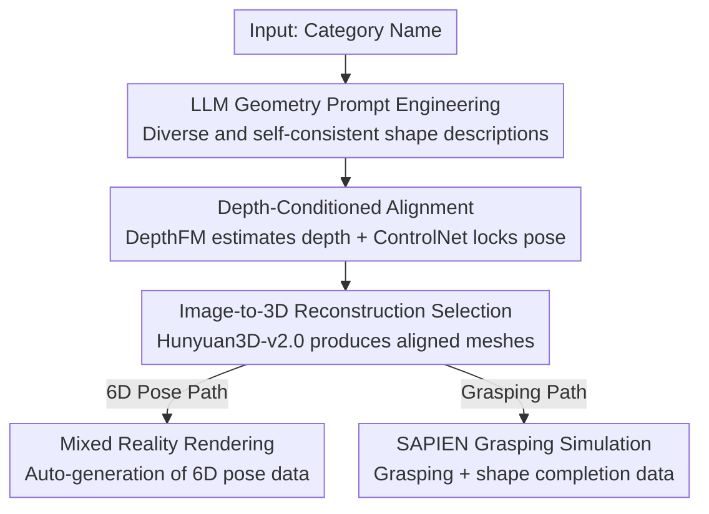

# Breaking the 3D Dataset Bottleneck: Fast Scalable Generation of Aligned 3D Assets from Scratch for Category 6D Pose Estimation and Robotic Grasping

**Conference**: CVPR 2026  
**Paper**: [CVF Open Access](https://openaccess.thecvf.com/content/CVPR2026/html/Guillaume_Breaking_the_3D_Dataset_Bottleneck_Fast_Scalable_Generation_of_Aligned_CVPR_2026_paper.html)  
**Code**: https://genomni3d.github.io/  
**Area**: 3D Vision  
**Keywords**: 3D asset generation, 6D pose estimation, canonical alignment, depth-conditioned generation, robotic grasping  

## TL;DR
Given only a category name, a fully automated "text → image → 3D" pipeline generates canonically aligned textured meshes within 3 minutes, along with 6D pose and grasping datasets. The core mechanism utilizes depth-conditioned generation to boost pose consistency from 57% to 96%, allowing the 153K generated meshes to be used directly for zero-shot sim2real pose estimation and real-world robotic grasping.

## Background & Motivation
**Background**: 2D vision has flourished due to large-scale datasets such as ImageNet, while 3D vision remains bottlenecked by the "scarcity of high-quality, canonically aligned annotated data." Category-level 6D pose estimation (predicting the position and orientation of objects from a single RGB-D image without instance models) is a typical victim of this predicament: it requires massive intra-class variations in shape/texture while demanding all instances be aligned within a single canonical coordinate system.

**Limitations of Prior Work**: Generating such datasets faces three hurdles. ① **Asset Acquisition**: Relying on manual 3D scanning (15–60 mins per object) or existing repositories—synthetic datasets lack realism, high-quality scanning datasets are too small, and internet repositories (like Objaverse) have inconsistent mesh quality, poor alignment, and sparse category coverage (e.g., only 127 mugs in Objaverse 1.0). ② **Mesh Alignment**: Canonical alignment across instances requires heavy manual labor, making it unscalable and forcing methods to settle for cross-category transfer rather than strong intra-category learning. ③ **Pose Annotation**: Real-world 6D annotation requires pre-scanning assets plus iterative optimization (e.g., ICP), which is error-prone and difficult to scale across categories and scenes.

**Key Challenge**: In the existing "3D assets first, annotation later" paradigm, scale, alignment quality, and realism cannot be satisfied simultaneously—scaling up sacrifices alignment (Objaverse), while prioritizing alignment sacrifices scale (scanning datasets). The most relevant generative approach (GenVegeFruits3D) can only handle symmetric fruits/vegetables, avoiding the pose challenges of arbitrary shapes, and achieves only a 57% pose consistency rate.

**Goal**: To completely bypass the need for "pre-existing 3D assets" and start from pure text category descriptions to generate ① canonically aligned 3D meshes, ② category-level 6D pose datasets, and ③ robotic grasping datasets in an end-to-end manner.

**Key Insight**: The authors observe that the orientation of meshes generated by image-to-3D models is almost entirely determined by the viewpoint of the input image. Thus, the problem of "3D alignment" can be transformed into "maintaining 2D pose consistency during the generation phase"—the latter of which can be "locked" using depth maps as a strong conditional signal.

**Core Idea**: Incorporate canonical alignment directly into the generation process via "depth-conditioned controllable text-to-image generation," followed by image-to-3D reconstruction and mixed-reality rendering to automate the entire "category name → aligned mesh → 6D/grasping data" pipeline.

## Method

### Overall Architecture
The methodology is split into two main sections: the first half (Section 3 of the paper) is **Asset Generation**—creating a batch of canonically aligned textured meshes from a single category name; the second half (Sections 4–5) is **Dataset Synthesis**—feeding these meshes into renderers and robotic simulators to automatically produce annotated 6D pose and grasping data.

Asset generation is a four-stage serial pipeline: LLM generates geometric prompts → Diffusion model generates images and estimates depth → Use depth maps as conditions for batch texture variant generation → Image-to-3D reconstruction of aligned meshes. The core solution for "alignment" lies in the **depth-conditioned generation** of the second and third stages: DepthFM first estimates depth maps from a few filtered images, then ControlNet uses these depth maps as conditions to drive the generation of all subsequent texture variants. This ensures that object poses across all images within a category are highly consistent, thereby ensuring reconstructed meshes are aligned in the same canonical coordinate system. The pipeline takes 3 minutes per object—5–20× faster than scanning—and requires only ~100 depth maps per category to scale to 1000 aligned meshes, reducing manual filtering by over 15× compared to prior work.

After obtaining aligned meshes, they are fed into two downstream tasks: **Mixed Reality Rendering** via BlenderProc to generate 6D pose datasets (RGB-D, instance/semantic masks, NOCS maps, 6D poses) and **SAPIEN Simulation** to generate grasping datasets.

### Key Designs

**1. LLM Geometry Prompt Engineering: Growing Diverse and Consistent Shapes from a Category Name**

The pain point is that using a single templated text prompt for diffusion models results in either repetitive shapes lacking intra-class diversity or outputs that deviate from the category. The authors task an LLM with generating prompts containing "randomized shape descriptions" for each category—e.g., "mug" is expanded into specific descriptions of handle shapes, diameters, and heights to inject shape diversity at the source. Crucially, the LLM performs **self-verification** on the generated prompts to check for realism and category consistency, filtering out unreasonable or off-topic descriptions. This step handles "shape content," while pose is handled in the next step.

**2. Depth-Conditioned Alignment: "Welding" Canonical Alignment at the 2D Generation Stage**

This is the core of the paper, directly addressing the hurdle of manual canonical alignment across instances. The authors identify the root cause: the orientation of a mesh generated by an image-to-3D model is determined by the input image viewpoint; thus, alignment is equivalent to "maintaining 2D pose consistency." Pure text-conditioned generation fails—experiments show text conditions achieve only ~80% pose consistency for symmetric objects (bottles, bowls) and drop as low as 20% for complex asymmetric objects (cameras, laptops), requiring 5000+ images to find 1000 usable ones. This is due to the diffusion model's lack of explicit 3D structural understanding and the inherent ambiguity of natural language descriptions of pose.

The solution: estimate depth maps via DepthFM from a small set of manually selected ( <10 mins per category) images with correct poses, then use these depth maps as ControlNet condition signals to drive all subsequent texture variant generation. The elegance of a depth map is that it "constrains global structure and spatial orientation without constraining local geometry and texture details"—locking the pose while allowing shape/texture diversity. Formally, pose consistency is defined as the ratio of generated images where the object pose falls within the canonical orientation. Depth conditioning pulls the average pose consistency from 57% to 97% across 6 NOCS categories and reaches 96% across 153 Omni6Dpose categories, proving the alignment is category-agnostic. Canny edges were also tested but introduced artifacts due to missing/extra edges and retained irrelevant texture details, proving inferior to depth.

**3. Image-to-3D Reconstruction Selection: Using Hunyuan3D-v2.0 to Eliminate Manual Mesh Filtering**

With pose-consistent images ready, a reliable image-to-3D model is needed to convert them into meshes. The authors evaluated four methods (FS3D, SPAR3D, InstantMesh, Hunyuan3D-v2.0) based on three criteria: speed (<1 min), suitability for robotic grasping, and cross-category reliability. Conclusion: FS3D/SPAR3D are fast (<10s) but unstable, especially for concave objects like mugs; InstantMesh has better quality (<1min) but struggles with non-convex geometry crucial for grasping; Hunyuan3D-v2.0 offers the best overall quality and reliability for large-scale generation, effectively eliminating the manual mesh filtering step. Notably, while modern models like Hunyuan3D have "canonical alignment" built-in, it only guarantees 90° rotational alignment, which is insufficient for category-level precision—reinforcing that depth-conditioned pose control at the image level is necessary.

**4. Mixed Reality Rendering: Generating 6D Labels Automatically with Rendering**

The final hurdle is pose annotation—real labels rely on slow and error-prone pre-scanning and ICP. The authors integrate aligned meshes into BlenderProc, reproducing and open-sourcing two rendering pipelines: one is **Full 3D Simulation** (loading scanned real scenes, placing objects randomly, capturing 10 viewpoints with 5 random light sources); the other is **Mixed Reality Rendering**—aligning the camera viewpoint to background images in BlenderProc, using multi-view raycasting to place objects on real planes with gravity for physical plausibility, and using a "render shadow-only objects" trick to overlay objects and their shadows onto real backgrounds and real depth maps. Furthermore, partially synthetic depth is used to complete real depth sensor data missing on dark objects. Since object poses are known during rendering, annotations for RGB-D, instance/semantic masks, NOCS maps, and 6D poses are generated automatically. Experiments prove mixed reality + shadows are key to closing the sim2real gap.

## Key Experimental Results

### Dataset Scale Comparison
| 3D Dataset | Type | #Objects | #Categories | #Obj/Cat | Aligned | Time per Obj |
|-----------|------|-------|-------|----------|------|------------|
| OmniObject3D | Real Scan | 6K | 190 | 32 | Yes | 15m–1h |
| Objaverse1.0 | Real+Syn | 800K | – | 100 | No | – |
| GenVegeFruits3D | Gen | 100K | 100 | 1000 | Yes | 15min |
| **GenOmni3D (Ours)** | Gen | **153K** | **153** | **1000** | Yes | **3min** |

GenOmni3D achieves "large-scale + built-in alignment + high quality + speed" simultaneously, with >40× more instances per category than previous aligned real datasets.

### Zero-Shot Sim2Real Pose Estimation on NOCS REAL275 (DualPoseNet Baseline)
| Training Data | IoU75 | 10°5cm | Avg |
|----------|-------|--------|-----|
| Replica Full-Syn | 34.33 | 17.12 | 33.10 |
| Mix-syn (Orig. NOCS mesh + shadow) | 31.50 | 17.81 | 33.24 |
| **Mix-SAI (Ours mesh + shadow)** | **35.42** | **22.19** | **34.75** |
| Mix-SAI (No shadow) | 28.86 | 14.13 | 30.83 |

The comparisons validate: Mixed reality > Full-syn (34.75 vs 33.10), Ours mesh > Original NOCS mesh (23.91 vs 15.66 on synth val), and Shadows > No shadows (30.83 → 34.75). It approaches the performance of models trained on real data without using any real training data.

### Grasping and Shape Completion (SAPIEN, CenterGrasp Framework)
| Method | Grasp Success ↑ | Bi-directional Err $bi$ ↓ | IoU ↑ |
|------|-------------|--------------|-------|
| GIGA | 0.638 | 55.2 | 0.146 |
| CenterGrasp | 0.790 | 27.0 | 0.314 |
| **Custom-CG (Ours)** | **0.868** | **23.5** | **0.475** |

Ours achieves a grasp success rate of 87.8% and a shape completion IoU of 0.475, significantly outperforming CenterGrasp (0.314) and GIGA (0.146).

### Key Findings
- **Depth condition is the key to alignment**: Pose consistency increased from 57% with text-only to 96% with depth conditioning, with the largest gains in asymmetric objects like cameras (30% → 97%) and laptops (20% → 90%).
- **Shadows are vital for sim2real**: For both the proposed and original meshes, enabling shadows consistently and significantly outperformed disabling them, showing that modeling real lighting is necessary to bridge the sim2real gap.
- **Aligned meshes are a prerequisite for grasping**: In real-world experiments, a laptop yielded 0% detection/grasp success under the baseline, but jumped to 100% with specialized data from this work, demonstrating that canonically aligned meshes are indispensable for robotic manipulation.

## Highlights & Insights
- **Reducing 3D alignment to 2D pose consistency**: By identifying that image-to-3D mesh orientation is driven by image viewpoint, the authors use mature ControlNet + depth conditioning to solve a 3D problem that previously required massive manual labor.
- **Optimal trade-off in depth conditioning**: It strongly constrains global orientation while weakly constraining local geometry, satisfying the dual requirements of "consistent pose" and "diverse shape." The failure of Canny edges highlights the importance of choosing the right conditional signal.
- **Complete ecosystem rather than a single point**: Beyond generating meshes, the work bridges 6D annotation (MR rendering) and grasping (SAPIEN + V-HACD), solving data scarcity by enabling "infinite generation from scratch."
- **Transferable logic**: The strategy of "using a strong conditional signal in the 2D stage to lock a 3D attribute" can be generalized—e.g., to achieve consistent scale or articulation.

## Limitations & Future Work
- **Reliance on minor manual filtering**: Each category still requires <10 mins of manual effort to pick correctly posed seed images; bias in seed selection propagates to all 1000 variants.
- **Bound by off-the-shelf model quality**: Pose consistency and mesh quality are capped by the performance of upstream models like DepthFM and Hunyuan3D-v2.0, which may struggle with highly complex or occluded categories. ⚠️ The paper lacks a detailed breakdown of failure cases by category.
- **Grasping simulation scale**: Due to computational overhead, the grasping dataset is limited to 100 objects per category (600 meshes total), far smaller than the 1000/category for pose.
- **Future directions**: Automating seed selection with a pose discriminator or introducing multi-view consistency constraints to raise the alignment ceiling for asymmetric objects.

## Related Work & Insights
- **vs. GenVegeFruits3D**: Both use generative 3D asset creation, but the former only handles symmetric fruits, avoiding arbitrary pose issues, uses a high-overhead CPU texture pipeline, and achieves 57% pose consistency. This work achieves 96% alignment for asymmetric categories, takes 3 mins per object (vs. 15 mins), and reduces manual filtering by 15×.
- **vs. Objaverse / ObjaverseXL**: Internet-scale repositories offer quantity (800K–10.2M) but suffer from inconsistent quality, poor alignment, and sparse category coverage. This work trades "web scraping" for "on-demand generation" to get built-in alignment and high intra-class density (1000/cat).
- **vs. Omni6D / Omni6Dpose**: These benchmarks rely on OmniObject3D scans, limited in diversity, and use closed-source rendering pipelines. This work removes the dependency on scans and open-sources two rendering pipelines for infinite category generation.

## Rating
- Novelty: ⭐⭐⭐⭐⭐ Translating the 3D canonical alignment challenge into 2D depth-conditioned pose control; first automated text-to-aligned-3D framework.
- Experimental Thoroughness: ⭐⭐⭐⭐ Covers data scale, sim2real pose, grasping, and real-world robot testing, though per-category error analysis and failure cases are sparse.
- Writing Quality: ⭐⭐⭐⭐ Clear structure (three hurdles → four-stage pipeline → two downstream paths) with high-density tables.
- Value: ⭐⭐⭐⭐⭐ Open-sources the largest aligned mesh/6D dataset + complete pipeline, directly addressing 3D data scarcity with infrastructure-level significance.

<!-- RELATED:START -->

## Related Papers

- [\[CVPR 2026\] MimiCAT: Mimic with Correspondence-Aware Cascade-Transformer for Category-Free 3D Pose Transfer](mimicat_mimic_with_correspondence-aware_cascade-transformer_for_category-free_3d.md)
- [\[CVPR 2026\] MajutsuCity: Language-driven Aesthetic-adaptive City Generation with Controllable 3D Assets and Layouts](majutsucity_language-driven_aesthetic-adaptive_city_generation_with_controllable.md)
- [\[CVPR 2026\] 3D sans 3D Scans: Scalable Pre-training from Video-Generated Point Clouds](3d_sans_3d_scans_scalable_pre-training_from_video-generated_point_clouds.md)
- [\[CVPR 2026\] Cov2Pose: Leveraging Spatial Covariance for Direct Manifold-aware 6-DoF Object Pose Estimation](cov2pose_leveraging_spatial_covariance_for_direct_manifold-aware_6-dof_object_po.md)
- [\[CVPR 2026\] Generalizable Structure-Aware Keypoint Correspondence for Category-Unified 3D Single Object Tracking](generalizable_structure-aware_keypoint_correspondence_for_category-unified_3d_si.md)

<!-- RELATED:END -->
