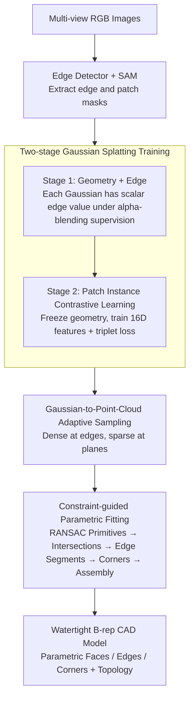

# BRepGaussian: CAD Reconstruction from Multi-View Images with Gaussian Splatting

**Conference**: CVPR 2026  
**arXiv**: [2602.21105](https://arxiv.org/abs/2602.21105)  
**Code**: Coming soon (to be released after acceptance)  
**Area**: 3D Vision  
**Keywords**: CAD reconstruction, B-rep, Gaussian Splatting, Parametric surface fitting, Contrastive learning

## TL;DR

BRepGaussian achieves for the first time the direct reconstruction of complete B-rep CAD models from multi-view images. It learns edge and patch features through two-stage 2D Gaussian Splatting, followed by parametric fitting to generate watertight boundary representations without requiring point cloud supervision.

## Background & Motivation

**Background**: CAD reconstruction (reverse engineering) is a classic problem in computer vision and graphics. Traditional methods primarily take high-quality point clouds as input, performing semantic segmentation to obtain patch labels before fitting parametric primitives. Learning-based methods such as SPFN and ParSeNet have achieved significant results.

**Limitations of Prior Work**: The acquisition of high-quality point clouds is expensive and relies on professional equipment. Existing methods require extensive manual labeling and exhibit limited generalization to new shapes, often relying heavily on dataset-specific network designs.

**Key Challenge**: Image data is much easier to obtain and scale than point clouds, but a huge gap exists between images and parametric 3D modeling—existing methods cannot bypass the step of "obtaining high-quality point clouds first."

**Goal**: How to directly recover the complete B-rep representation (parametric faces, edges, corners, and their topological connections) from multi-view RGB images?

**Key Insight**: Utilize 2D Gaussian Splatting (2DGS) as an intermediate representation—its flat disk-like primitives naturally fit the planar or low-curvature surfaces in CAD models, and each Gaussian can carry learnable semantic features.

**Core Idea**: Extend 2DGS into an edge- and patch-aware representation. Use two-stage training to decouple geometry/edge learning from patch instance learning, then perform parametric fitting from labeled point clouds to obtain the B-rep model.

## Method

### Overall Architecture

The input consists of multi-view RGB images of the CAD object. The pipeline consists of four steps: (1) extracting edge and patch masks from 2D images using an edge detector and SAM; (2) two-stage 2DGS training—first learning geometry and edge features, then learning patch instance features; (3) converting Gaussian primitives into labeled dense point clouds; (4) a constraint-guided parametric fitting module to assemble the point clouds into a watertight B-rep model. The output is a complete B-rep CAD model containing parametric faces (planes/cylinders/spheres), edges (lines/curves), and corners.

### Key Designs

**1. Two-stage Gaussian Splatting Training: Decoupling geometric reconstruction and patch identification**

The simplest approach would be to let a single network learn geometry, edges, and patch labels simultaneously. However, it was found that the complex gradients from patch contrastive learning tend to degrade the geometric reconstruction quality. Thus, training is split into two stages. Stage 1 focuses on geometry and edges: each 2DGS primitive is assigned a scalar edge value $e_i \in [0,1]$. During rendering, it undergoes alpha-blending similar to color to produce an edge map $E(u) = \sum_i w_i e_i$, which is supervised by the 2D edge detector's output using L2 loss. Stage 2 freezes all geometric parameters (position xyz, spherical harmonics, etc.) and only trains a 16D feature vector $\mathbf{f}_i \in \mathbb{R}^{16}$ for each Gaussian to encode patch membership.

**2. Contrastive Learning of Patch Instances: Clustering Gaussians of the same patch without cross-view correspondence**

The difficulty lies in patch labels being instance-level rather than semantic classes—mask IDs from SAM across different views are independent (e.g., "patch 3" in view 1 is not the same as "patch 3" in view 2). Contrastive learning is used to achieve automatic clustering in the feature space using a triplet loss. For each mask region $\mathcal{M}_k$, an anchor $\mathbf{p}_a$ and a positive sample $\mathbf{p}_p$ are selected, while the feature-wise closest (most confusing) pixel from other masks is chosen as the hardest negative sample $\mathbf{p}_n$. Distance is measured by cosine similarity $d(\mathbf{p}_i, \mathbf{p}_j) = 1 - \tilde{\mathbf{f}}_{\mathbf{p}_i} \cdot \tilde{\mathbf{f}}_{\mathbf{p}_j}$:

$$\mathcal{L}_{\text{tri}} = \max\big(0,\; d(\mathbf{p}_a, \mathbf{p}_p) - d(\mathbf{p}_a, \mathbf{p}_n) + m\big).$$

This forces features of the same physical patch to converge even if their mask IDs across views are unrelated.

**3. Gaussian-to-Point-Cloud Adaptive Sampling: Aligning sampling density with geometry**

Trained Gaussians must be converted to labeled dense point clouds. Simply taking Gaussian centers causes under-sampling at edges, where many elongated Gaussians exist, compared to flat areas with fewer spherical ones. The method uses shape-adaptive sampling: the center of each Gaussian is sampled, and for elongated Gaussians, four additional points are sampled along the principal axes. This ensures the point density aligns with curvature, providing enough support for edge fitting.

**4. Constraint-guided Parametric Fitting: Bottom-up assembly of labeled point clouds into watertight B-reps**

This step converts labeled point clouds into a parametric CAD model through five stages: (1) fitting planes, cylinders, or spheres to each patch using RANSAC and selecting the best fit; (2) computing intersections between primitive pairs; (3) using edge point clouds to constrain the valid parameter range of these intersection curves; (4) clustering intersection points of three planes or two curves to define corners; (5) bottom-up assembly (faces → edges → corners) with boolean operations to finalize a watertight B-rep. The edge labels are critical for determining segment boundaries.

### Loss & Training

- **Stage 1**: $\mathcal{L}_{\text{stage1}} = \mathcal{L}_{\text{geo}} + 0.1 \mathcal{L}_{\text{edge}}$, where $\mathcal{L}_{\text{geo}} = (1-\lambda)\mathcal{L}_1 + \lambda\mathcal{L}_{\text{D-SSIM}}$
- **Stage 2**: Triplet loss $\mathcal{L}_{\text{tri}}$ using hard negative mining and a margin hyperparameter $m$.

## Key Experimental Results

### Main Results

Evaluation of patch segmentation on the ABC-NEF dataset (Precision/Recall/F1):

| Method | Input | Prec ↑ | Rec ↑ | F1 ↑ |
|------|------|--------|-------|------|
| ParSeNet | GT Point Cloud | 0.511 | 0.265 | 0.349 |
| PCER-Net | GT Point Cloud | 0.876 | 0.912 | 0.894 |
| SED-Net | GT Point Cloud | 0.949 | 1.000 | 0.974 |
| ParSeNet | Densified Point Cloud | 0.623 | 0.236 | 0.343 |
| PCER-Net | Densified Point Cloud | 0.536 | 0.792 | 0.639 |
| **BRepGaussian (Ours)** | **Multi-view Images** | **0.890** | **0.918** | **0.904** |

CAD reconstruction quality comparison ($D_c$: Chamfer Distance $\times 10^{-2}$, $D_h$: Hausdorff Distance $\times 10^{-1}$):

| Method | Input | CD(Surface) | CD(Curve) | HD(Surface) | HD(Curve) |
|------|------|-------------|-----------|-------------|-----------|
| Point2CAD | Our Labels | 3.38 | 5.42 | 2.413 | 3.858 |
| Point2CAD | PCER-Net | 7.08 | 20.45 | 3.394 | 7.276 |
| Split-and-Fit | Densified | 6.23 | 13.98 | 3.523 | 4.962 |
| **BRepGaussian (Ours)** | **Our Point Cloud** | 4.90 | **5.01** | **3.351** | **3.626** |

### Ablation Study

| Configuration | Effect | Description |
|------|------|------|
| Two-stage Training | Optimal | Geometry is not degraded by patch learning |
| Single-stage Joint Training | Decrease | Patch gradients interfere with geometry |
| Feature Dim d=16 | Optimal | Best feature space size for patch instances |
| Center-only Sampling | Decrease | Under-sampling in edge regions |
| Elliptical Adaptive Sampling | Optimal | Sufficient edge coverage |

### Key Findings

- BRepGaussian's patch segmentation F1 (0.904) starting from images surpasses PCER-Net using GT point clouds (0.894), indicating that multi-view features learned via contrastive learning are more effective than direct point cloud segmentation.
- Curve reconstruction metrics are overall optimal (CD=5.01, HD=3.626), as edge detection provides decisive guidance for parametric fitting.
- While Point2CAD achieved a lower Surface CD (3.38) when using our labels, qualitative analysis shows it generates redundant patches, whereas BRepGaussian produces cleaner, more compact results.

## Highlights & Insights

- **First image-to-B-rep end-to-end framework**: Completely skips the point cloud acquisition phase, extending the advantages of Gaussian Splatting to structured 3D modeling. This paradigm shift proves GS can do engineering-level parametric reconstruction.
- **Freeze-geometry-train-feature strategy**: A simple yet effective decoupling of geometry and semantics that avoids gradient conflicts in multi-task learning.
- **Selection of 2DGS**: The disk-like primitives naturally align with the planar/low-curvature surfaces of CAD models, providing surface sampling quality superior to 3DGS.

## Limitations & Future Work

- Only supports planes, cylinders, and spheres; cannot handle freeform surfaces like B-splines/NURBS.
- Mask quality from SAM on low-texture CAD images is not high and requires manual correction (~3 minutes/object).
- Evaluated only on an ABC-NEF subset; generalization to real-world photographed CAD parts is yet to be verified.
- Primitive fitting relies on traditional RANSAC; differentiable fitting for end-to-end optimization could be explored.

## Related Work & Insights

- **vs Point2CAD**: A pure fitting method that relies on external labels. While it has lower Surface CD with our labels, it produces redundant patches; BRepGaussian’s constraint-guided fitting is cleaner.
- **vs SED-Net**: Achieves the highest F1 (0.974) with GT point clouds but fails to generalize to densified point clouds from images. BRepGaussian is more robust for image-based inputs.
- **vs Curve-Aware GS**: While that work only recovers parametric curves, BRepGaussian recovers the full face+edge+corner+topology structure.

## Rating

- Novelty: ⭐⭐⭐⭐⭐ First complete pipeline from images to B-rep.
- Experimental Thoroughness: ⭐⭐⭐⭐ Extensive comparison on ABC-NEF, though lacks real-world scene validation.
- Writing Quality: ⭐⭐⭐⭐ Clear structure and intuitive pipeline diagrams.
- Value: ⭐⭐⭐⭐⭐ Defines a new paradigm for CAD reverse engineering from images.

<!-- RELATED:START -->

## Related Papers

- [\[CVPR 2026\] EcoSplat: Efficiency-controllable Feed-forward 3D Gaussian Splatting from Multi-view Images](ecosplat_efficiency-controllable_feed-forward_3d_gaussian_splatting_from_multi-v.md)
- [\[CVPR 2026\] ClipGStream: Clip-Stream Gaussian Splatting for Any Length and Any Motion Multi-View Dynamic Scene Reconstruction](clipgstream_clip-stream_gaussian_splatting_for_any_length_and_any_motion_multi-v.md)
- [\[CVPR 2026\] FSFSplatter: Geometrically Accurate Reconstruction with Free Sparse-view Images within 2 minutes](fsfsplatter_geometrically_accurate_reconstruction_with_free_sparse-view_images_w.md)
- [\[CVPR 2026\] Confidence-Guided Multi-Scale Aggregation for Sparse-View High-Resolution 3D Gaussian Splatting](confidence-guided_multi-scale_aggregation_for_sparse-view_high-resolution_3d_gau.md)
- [\[CVPR 2026\] Intrinsic Image Fusion for Multi-View 3D Material Reconstruction](intrinsic_image_fusion_for_multi-view_3d_material_reconstruction.md)

<!-- RELATED:END -->
