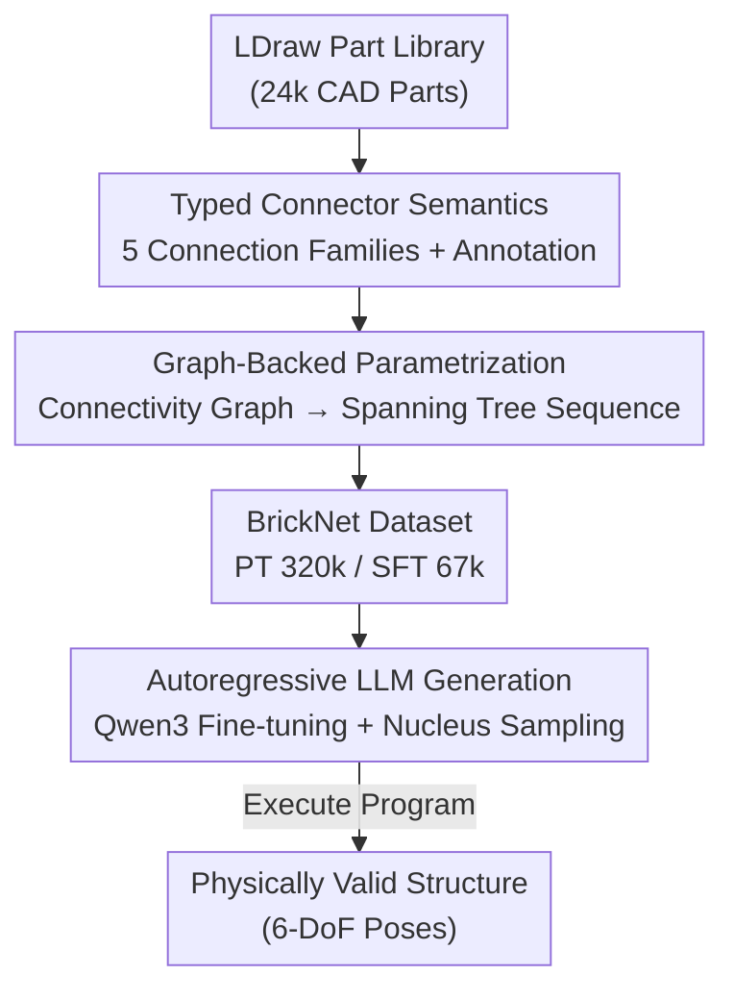

# BrickNet: Graph-Backed Generative Brick Assembly

**Conference**: CVPR 2026  
**arXiv**: [2604.22984](https://arxiv.org/abs/2604.22984)  
**Code**: https://kulits.github.io/BrickNet (Project page, dataset and models available)  
**Area**: 3D Vision / Procedural Generation / LLM Sequence Modeling  
**Keywords**: LEGO Brick Assembly, Graph Parametrization, Autoregressive Generation, LDraw Dataset, Connector Semantics

## TL;DR
This paper treats LEGO brick assembly sequences as "programs" for autoregressive generation via LLMs. The key innovation is moving away from direct regression of 6-DoF coordinates for each brick, instead using a graph-backed parametrization (spanning trees) where "connectivity" is treated as a first-class citizen. Combined with the newly constructed BrickNet dataset—comprising 320,000 large-scale human-designed LDraw samples—the model improves the number of valid connected steps from < 50 to 94+.

## Background & Motivation
**Background**: Many objects are naturally emerging from "parts + how parts are configured." Recent work in 3D generation has begun to explicitly model these relationships through part graphs and executable shape programs. Sequential LEGO assembly is a compact instance of this problem: a brick structure is defined not just by the spatial arrangement of parts but by its "assembly process," where each addition must satisfy discrete connectivity rules.

**Limitations of Prior Work**: Existing generative brick assembly works are restricted to "toy subsets," assuming a discrete grid and using only a few brick types (e.g., BrickGPT uses only 8 types and is limited to a $20\times20\times20$ voxel grid). These settings lose the true expressive power of LEGO, which involves thousands of parts with rich connectivity diversity and semantics.

**Key Challenge**: Expanding from grids to real-world samples introduces a representation dilemma. In simple grids, "up is up" and rotation coordinate systems are constant, making coordinate prediction natural. Real samples do not follow these assumptions. Taking the dragonfly in the paper (Fig. 2b) as an example, to assemble parts 1 through 5, a model must track the 6-DoF pose of each brick along shifting rotation coordinates. This becomes a **numerical precision** issue; direct pose prediction fails after just a few steps in a sequence.

**Goal**: (1) Address the lack of suitable training data; (2) Find a structural representation capable of handling arbitrary connectivity without precision explosion; (3) Train an autoregressive model capable of generating physically valid sequences.

**Key Insight**: Although parts are placed in 3D space, the global structure is defined by the **spatial relationships between parts**. Therefore, "connectivity" should be treated as a first-class citizen rather than predicting absolute coordinates.

**Core Idea**: Parametrize the structure using "typed connectors + spanning trees of the connection graph." This transforms each edge into an executable instruction that determines the local $SE(3)$ transformation between two parts, thereby converting the "precision accumulation" problem into a "discrete connectivity selection" problem.

## Method

### Overall Architecture
The BrickNet pipeline begins by annotating each part in the standard LDraw library with **typed connectors** (5 connectivity semantic classes). An unordered set of parts is then connected into a **connectivity graph** based on pairing semantics. A **spanning tree** is sampled from the graph to obtain an assembly sequence (where each edge is a discrete placement action). The sequence is textualized and used to fine-tune an LLM for autoregressive generation. During inference, the model generates "which part to add + how to connect" step-by-step. Executing this "program" recovers the 6-DoF pose for every brick. Crucially, coordinates are never directly predicted; they are calculated by executing the connectivity relations.

### Key Designs

**1. Typed Connector Semantics: Compressing 6-DoF Connections into Discrete/Low-dimensional Parameters**

Direct pose prediction fails due to the need for precise accumulation of rotations and translations in floating-point space. This work addresses this by annotating each part with typed connectors and categorizing brick-to-brick connections into 5 families. Each family requires minimal parameters to determine the $SE(3)$ transformation between two parts: **Stud** (stud-to-hole) is most common, requiring only a yaw angle once the specific stud and hole are identified; **Hinge** adds a boolean "flip" parameter to one rotational degree of freedom; **Axle** adds a "sliding" scalar along the axis to the hinge parameters; **Ball** involves 3 rotational degrees of freedom; **Fixed** (e.g., wheel hub to tire) has no degrees of freedom—knowing the pairing is sufficient. Each family includes sub-classes with specific pairing rules (e.g., pins only pair with pin sockets).

Annotation is achieved through a hybrid "procedural + manual" pipeline. LDraw parts are defined by hierarchical sub-parts; by identifying `stud.dat` at the primitive level and checking scales in the composite rotation matrices, precise connector locations are inferred. The difficulty lies in collision detection—real bricks require plastic deformation to snap, meaning "good connections" inherently involve some collision. Furthermore, since brick geometry is highly non-convex and often non-watertight, standard convex decomposition like VHACD is inapplicable. The authors designed a multi-stage pipeline to make part meshes "watertight" and used a modified PFPOffset to inset all faces by 0.25 LDU (0.1mm) for standard collision detection.

**2. Graph-Backed Parametrization: Serializing Structures into Executable Programs**

With typed connectors, the design answers how to represent the entire structure compactly as a sequence. Given an unordered set of part instances, connectors are paired based on semantics to form edges. **Each edge defines the complete local $SE(3)$ transformation between two paired parts.** All edges together form a connectivity graph. Since a single edge is sufficient to determine relative transformation, the entire structure can be compactly and interpretably represented by a **spanning tree** of this graph. Starting from a root part, a series of assembly steps—specifying "which part to add + how it connects to the existing structure"—is sampled. This sequence is a program that outputs a set of parts with 6-DoF poses upon execution. Rotation parameters are rounded to the nearest degree and sliding scalars to the nearest LDU for serialization.

This is the fundamental reason why it outperforms direct pose prediction: connectivity is **directly encoded into the representation**. The model does not need to accumulate transformations in floating-point space or maintain long-range numerical precision; it only needs to perform discrete selections of connectors, pairings, and a small number of low-dimensional parameters. The probability of generation is formulated as a standard chain rule decomposition $p(x)=\prod_{i=1}^{n}p(s_i\mid s_1,\ldots,s_{i-1})$. The trade-off is that the model must have prior knowledge of the domain—specifically, connector locations on each part must be learned during pre-training, making generalization to new part vocabularies a challenge.

**3. BrickNet Large-Scale Human-Designed Dataset: Filling the Gap in "Real Brick" Training Data**

For this representation to work, complex, human-designed brick structures are required for training. These have historically been scarce and cannot be easily bootstrapped like voxels. The authors curated BrickNet from public online sources: 320,808 samples, 9,743 unique parts, and a total of 40,549,969 placed bricks. It is divided into two overlapping subsets: **BrickNet-PT** (Pre-training) preserves the long tail, including massive structures with thousands of bricks; **BrickNet-SFT** (Supervised Fine-Tuning) contains 67,185 samples with 4–100 bricks, satisfying part-color-type diversity and zero-collision constraints, complete with 8-view renders and text descriptions generated by Gemini 2.5. A separate test set of 512 samples is reserved. Compared to BrickGPT (8 brick types) or OMR (1,814 samples), BrickNet is orders of magnitude larger in scale and expressiveness.

**4. Autoregressive LLM Fine-tuning & Nucleus Sampling: Enabling LLMs to Learn "Brick Programs"**

The sequences are fed into LLMs. The authors fine-tuned Qwen3 models (0.6b to 14b instruct versions) with a sequence length limit of 4096 tokens using standard next-token cross-entropy. A key engineering discovery was that using pure temperature-based Ancestral Sampling (AS) at a length of 4096 results in a success rate of < 1.7% for a fully valid sequence, even if only 0.1% of the probability mass falls on illegal tokens. Switching to **Nucleus Sampling (NS, top-k=20, top-p=0.95)** doubled the connectivity validity. Text-conditioned generation was performed by further fine-tuning the PT models on BrickNet-SFT using the same objective.

### Loss & Training
The training goal is standard autoregressive next-token-prediction cross-entropy (Equation 1), without additional structural or physical constraint losses. A two-stage strategy was employed: unconditional pre-training on BrickNet-PT, followed by text-conditional fine-tuning on BrickNet-SFT. During sampling, nucleus sampling (top-k=20, top-p=0.95) was used, and the EOS token was suppressed in unconditional experiments to force the generation of 100 steps.

## Key Experimental Results

### Main Results
Unconditional Generation (Tab. 2): Each model generated $2^{16}$ full-length (100 bricks) sequences. The metric reported is the "average successful assembly steps before the first failure." Graph-backed parametrization (Graph) shows a massive advantage in connectivity over direct pose prediction (Pose); collision performance is similar for both.

| Model Size | Connectivity Graph (NS) | Connectivity Pose (NS) | Collision Graph (NS) | Collision Pose (NS) |
|------------|-------------------------|------------------------|----------------------|---------------------|
| 0.6b       | 94.1                    | 31.8                   | 16.0                 | 14.5                |
| 1.7b       | 95.1                    | 35.5                   | 16.6                 | 16.1                |
| 4b         | 96.9                    | 45.1                   | 18.0                 | 20.3                |
| 8b         | 97.0                    | 44.9                   | 18.7                 | 20.1                |
| 14b        | 96.9                    | 49.9                   | 19.1                 | 22.4                |

Text-Conditional Generation (Tab. 3, 512 evaluation samples): $P_{\text{inv}}$ represents the ratio of illegal placements, while VQAScore/PE/SigLIP 2 denote text-image similarity. Compared to BrickGPT, text-image similarity improved by an order of magnitude, though the relationship between model scale and perceptual quality is non-monotonic.

| Model | $P_{\text{inv}}$↓ | VQAScore↑ | PE↑ | SigLIP 2↑ |
|-------|-------------------|-----------|-----|-----------|
| BrickGPT | 0.063          | 0.050     | 0.157 | 0.052   |
| 0.6b   | 0.256             | 0.557     | 0.279 | 0.603   |
| 1.7b   | 0.260             | 0.593     | 0.282 | 0.631   |
| 4b     | 0.239             | 0.615     | 0.283 | 0.639   |
| 8b     | 0.233             | 0.608     | 0.284 | **0.647** |
| 14b    | **0.231**         | 0.602     | 0.283 | 0.625   |

### Ablation Study
Training Stage Ablation (Tab. 4a, Perplexity, lower is better): The PT→SFT two-stage pipeline consistently outperformed "SFT without PT," proving that priors learned from unconditional pre-training are transferable.

| Model | PT (Unconditional) | PT + SFT (Conditional) | No-PT + SFT |
|-------|--------------------|------------------------|-------------|
| 0.6b  | 1.331              | 1.298                  | 1.343       |
| 4b    | 1.307              | **1.274**              | 1.311       |
| 14b   | 1.300              | **1.266**              | 1.298       |

Data Scaling Ablation (Tab. 4b, 14b, Perplexity): Performance improved monotonically with more PT and SFT data.

| PT \ SFT | Full | Half | Quarter | None |
|----------|------|------|---------|------|
| Full     | **1.266** | 1.279 | 1.288 | 1.300 |
| Half     | 1.273 | 1.284 | 1.296 | 1.318 |
| Quarter  | 1.276 | 1.292 | 1.305 | 1.361 |

### Key Findings
- **Graph parametrization is the game-changer**: Regarding connectivity validity, Graph (94+ steps) is nearly double that of Pose (< 50 steps). Pose validity decays sharply with step count (Fig. 7), while Graph remains stable because connectivity is directly encoded.
- **Collision remains the bottleneck**: When collision-free status is included in valid steps, both representations drop to approximately 20 steps, indicating that collision avoidance in long sequences remains an unsolved challenge.
- **Diminishing and non-monotonic returns on scale**: While 0.6b is consistently the worst, improvements from larger models diminish. Under text-conditional settings, perceptual quality is even non-monotonic (1.7b outperforms 14b on certain metrics). The authors hypothesize the bottleneck is not capacity but a **mismatch between the training objective (next-token minimization) and the sampling task**.
- **Sampling strategy is critical**: Temperature-based ancestral sampling almost always fails; nucleus sampling doubles connectivity validity and is the key engineering factor making the method viable.

## Highlights & Insights
- **"Connectivity as a first-class citizen" is the core insight**: Replacing absolute coordinate regression with discrete connectivity selection transforms the difficulty of "long-range numerical precision" into "discrete combinations."
- **Spanning tree serialization is compact and executable**: Each edge contains everything needed for a local $SE(3)$ transform. Using a spanning tree allows lossless reconstruction of structures while being naturally processable as token sequences for LLMs.
- **Transparency in engineering details (Watertightness + 0.25 LDU inset)**: The non-convexity and non-watertight nature of bricks break standard collision detection. The authors' systematic mesh recovery pipeline is highly reusable for physical validity-constrained generation.
- **Honest diagnosis of training-sampling mismatch**: By contrasting monotonic perplexity with non-monotonic perceptual quality, the paper notes that a "correctly minimized loss" does not necessarily align with the "sampling task," a valuable insight for all autoregressive generative work.

## Limitations & Future Work
- **Author's Admissions**: The model struggles to generate long sequences without inter-part collisions (valid steps drop to ~20). The representation requires the model to know connector positions beforehand; while learned during pre-training for a closed vocabulary, **generalization to new parts remains a weakness**. Assembly sequences were capped at 100 bricks for compute reasons, unlike real-world sets.
- **The SFT evaluation was intentionally kept simple** (focusing on data and representation); the authors admit that stronger post-training techniques would likely yield significant gains.
- **Discovered Limitations**: Non-monotonic perceptual quality under text conditions suggests existing metrics/objectives might miss key aesthetic or structural nuances. Perplexity is parametrization-dependent and cannot directly compare the inherent quality of Pose vs. Graph. 
- **Future Directions**: The authors suggest introducing inference-time decoding guidance for active collision avoidance and spatial reasoning, exploring generation under part-set constraints, and transferring learned priors to downstream tasks like reconstruction or editing.

## Related Work & Insights
- **vs. BrickGPT**: Both serialize brick placement into text for LLM tuning. However, BrickGPT predicts voxel coordinates within an $8\times 20^3$ grid. This work uses graph-backed parametrization and thousands of real parts, achieving far longer valid sequences and higher text similarity.
- **vs. Peysakhov & Regli / Thompson et al.**: Previous works used graph parametrization for simple rectangular snap connections via genetic algorithms or GNNs restricted to single brick types. This work scales to 5 major typed connector families covering arbitrary connectivity.
- **vs. Walsman et al. (LDCad snap system)**: While using broader part sets, those methods were non-generative and relied on visual snapping point selection. This work provides systematic typed connector annotations for generation.
- **vs. ShapeAssembly / StructureNet / CSGNet (Procedural 3D)**: All model 3D structures via programs/graphs. This work specifically serializes assembly as "spanning trees on typed connectivity graphs," representing a specialized implementation for sequential LEGO assembly.

## Rating
- Novelty: ⭐⭐⭐⭐⭐ "Connectivity as a first-class citizen + Spanning tree serialization" elegantly converts 3D precision issues into discrete combinations.
- Experimental Thoroughness: ⭐⭐⭐⭐ Covers 5 model scales, unconditional/conditional tasks, and extensive ablations, though collision in long sequences remains a challenge.
- Writing Quality: ⭐⭐⭐⭐ Clear motivation and honest engineering detail; connector semantics are explained well.
- Value: ⭐⭐⭐⭐⭐ Release of 320k sample dataset + annotations + models provides a foundation for part-level 3D generative tasks.

<!-- RELATED:START -->

## Related Papers

- [\[CVPR 2026\] AssemblyBench: Physics-Aware Assembly of Complex Industrial Objects](assemblybench_physics-aware_assembly_of_complex_industrial_objects.md)
- [\[CVPR 2026\] Generative Diffusion Priors for 3D Mapping of the Dark Universe](generative_diffusion_priors_for_3d_mapping_of_the_dark_universe.md)
- [\[CVPR 2026\] GenMatter: Perceiving Physical Objects with Generative Matter Models](genmatter_perceiving_physical_objects_with_generative_matter_models.md)
- [\[CVPR 2026\] CraftMesh: High-Fidelity Generative Mesh Manipulation via Poisson Seamless Fusion](craftmesh_high-fidelity_generative_mesh_manipulation_via_poisson_seamless_fusion.md)
- [\[CVPR 2026\] MHopReg: Efficient Hierarchical Multi-Hop Graph Search for Point Cloud Registration](mhopreg_efficient_hierarchical_multi-hop_graph_search_for_point_cloud_registrati.md)

<!-- RELATED:END -->
