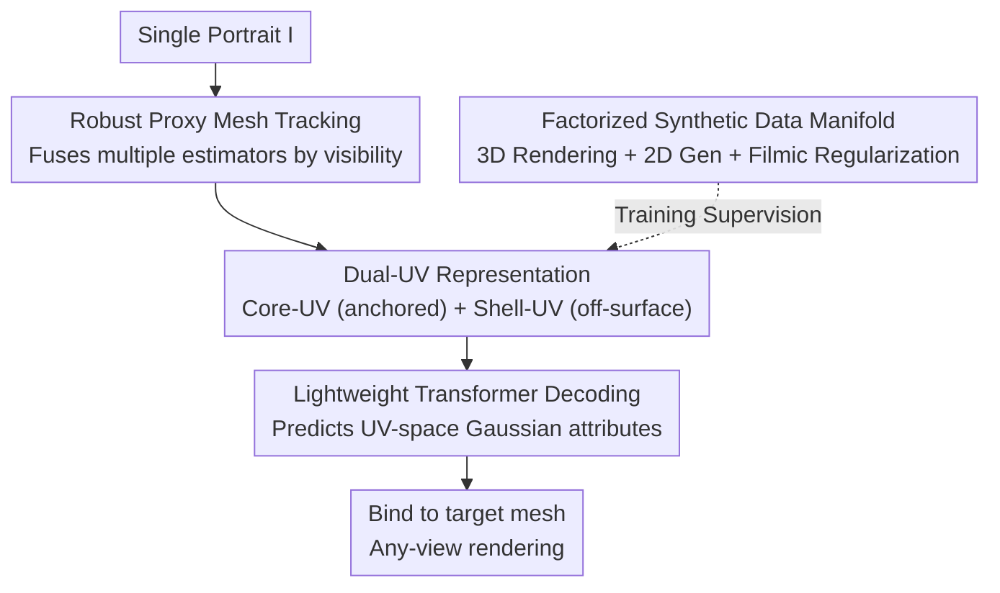

# Bringing Your Portrait to 3D Presence

**Conference**: CVPR 2026  
**Paper**: [CVF Open Access](https://openaccess.thecvf.com/content/CVPR2026/html/Zhang_Bringing_Your_Portrait_to_3D_Presence_CVPR_2026_paper.html)  
**Code**: To be confirmed  
**Area**: 3D Vision  
**Keywords**: Single-image 3D Avatar, Dual-UV representation, 3D Gaussian, Synthetic data, proxy mesh tracking

## TL;DR
Utilizing a **Dual-UV representation** that projects image features into a canonical UV space, paired with a factorized "3D rendering + 2D generation" synthetic data manifold and a robust proxy mesh tracker, this work enables the reconstruction of animatable 3D Gaussian avatars from a single portrait (head, half-body, or full-body). The model generalizes to real-world photos despite being trained exclusively on synthetic data.

## Background & Motivation

**Background**: Reconstructing animatable 3D avatars from single portraits is a core requirement for telepresence and VR. Recently, the Large Reconstruction Model (LRM) paradigm—such as LAM and LHM—has become dominant. These models encode input images into patch-level features and use a set of learnable tokens to query them via cross-attention, producing 3D outputs in a single forward pass without explicit geometric or texture optimization.

**Limitations of Prior Work**: This paradigm faces three major challenges. ① **Sensitivity to pose and framing**: ViT encoders lack strict translation invariance, requiring input images to be aligned to a fixed reference. However, human poses vary significantly and are often partially visible (half-body), leading to unstable alignment. Decoders must simultaneously associate patches with 3D space and adapt to token distribution shifts, resulting in identity drift and texture distortion. ② **Scalability of data**: High-quality multi-view portraits require expensive synchronized camera rigs; real monocular videos require extensive manual cleaning. Traditional rendering provides controllable geometry but lacks appearance diversity (domain gap), while 2D generative models offer realism but lack identity and cross-view consistency for direct 3D supervision. ③ **Non-robust proxy mesh estimation**: Existing trackers generally assume full-body visibility (some requiring hands or full silhouettes), whereas real snapshots are predominantly upper-body views.

**Key Challenge**: The LRM paradigm **ties the representation to the image feature space**—it must implicitly recover canonical structures from posed images. Since the proxy mesh already provides a deformation field, the decoder effectively wastes capacity re-learning geometric mappings. Furthermore, the definition of "half-body" is ambiguous (from shoulder to waist or thigh), leading to inconsistent spatial correspondences.

**Goal**: To develop a single model capable of processing head, half-body, and full-body inputs uniformly, relaxing requirements for input completeness and training data to advance truly in-the-wild single-image avatar reconstruction.

**Key Insight**: Rather than forcing the network to learn geometric alignment in image space, a **non-learned closed-form projection** can deterministically map image features into a canonical UV space (Dual-UV). This eliminates token drift caused by pose/framing at the source, allowing the network to focus solely on identity and appearance details.

## Method

### Overall Architecture

Given a single RGB portrait $I$, the goal is to reconstruct a set of 3D Gaussians $G=\{g_i=(\mu_i,\Sigma_i,c_i,\alpha_i)\}_{i=1}^N$. The authors decompose the latent space into two complementary parts $z=\{z_{uv}, z_{mesh}\}$: $z_{uv}$ is the Dual-UV representation encoding geometrically aligned appearance and visibility in canonical space; $z_{mesh}$ is the latent parameterized by the proxy mesh responsible for pose-dependent deformation. The mapping is defined as:

$$f_\theta: I \to z_{uv}, \qquad G = \Phi(z_{uv}, z_{mesh}),$$

where $f_\theta$ is the reconstruction network and $\Phi$ converts latents into posed 3D Gaussians.

The pipeline comprises three synergistic components: ① The **Dual-UV reconstruction model** scatters image features (from a frozen encoder) along visible rays into a canonical UV grid to obtain Core-UV and Shell-UV features. A lightweight transformer then decodes these into UV-space Gaussian attributes, which are bound to the target mesh for rendering. ② Training is driven by a **Factorized synthetic data manifold** (3D rendering + 2D generation branches). ③ Reconstruction relies on a **Hierarchical tracker** that provides stable proxy meshes across varying input completeness.

### Key Designs

**1. Dual-UV Representation: Eliminating pose/framing drift via closed-form projection**

This is the core of the system, addressing the identity drift in LRMs. Instead of using learnable tokens for cross-attention, the authors establish a **deterministic correspondence between image pixels and canonical mesh surfaces**. Using the UV layout of the human mesh, a differentiable "inverse parameterization" $(u,v)=M^{-1}(p;M)$ uniquely maps each surface point $p$ to UV coordinates.

The representation consists of two paths. **Core-UV (Surface-anchored)**: $N$ surface points are sampled on mesh $M$ with pre-stored face indices and barycentric coordinates. Given image $I$ and calibrated camera $\Pi$, features $F=E(I)$ are extracted using a frozen Sapiens-1B encoder. $M$ is rasterized under $\Pi$ (with back-face culling and z-buffering) to determine visibility. Each visible point $p_i$ is projected to image coordinates $x_i=\Pi(p_i)$ to sample features $f_i=S(F,x_i)$. These are scattered into a regular UV grid $\tilde U \in \mathbb{R}^{H_U\times W_U\times C}$:

$$\tilde U(u,v)=\frac{\sum_i m_i\, k\big((u,v)-(u_i,v_i)\big)\, f_i}{\sum_i m_i\, k\big((u,v)-(u_i,v_i)\big)+\varepsilon},$$

where $k(\cdot)$ is an aggregation kernel and $m_i$ is the visibility mask. **Shell-UV (Off-surface details)**: To capture volumetric details like hair or loose clothing not covered by the body mesh, an outer shell $M^+$ is defined via vertex normal extrusion. Features are sampled where the shell is visible but the body mesh $M$ is not, populating a coarser $\tilde U_{shell}$.

**2. MAE-aligned Lightweight Decoder: Filling visible UV grids as masked tokens**

Core-UV and Shell-UV tokens are concatenated and passed through a **shallow transformer stack**, then unpatched into UV attributes. Specific heads predict Gaussian color $c$, opacity $o$, offset $d$, rotation $r$, and scale $s$. The key observation is that projected image features **only fill visible UV grids, leaving occluded areas empty**—naturally corresponding to masked tokens in Masked Autoencoders (MAE). A compact transformer (decoding < 0.1B parameters, 8 self-attention layers) propagates information from visible to missing regions.

**3. Factorized Synthetic Data Manifold: 3D rendering for geometry + 2D generation for appearance**

To address data scalability, the authors use two complementary branches without real 3D supervision. The **Synthetic Rendering branch** uses parametric human models in HDRI environments to provide multi-view consistency (150K subjects). The **Generative branch** leverages 2D generation (300K clips). A GPT-5 and Qwen2.5-14B-Instruct pipeline acts as a "**realism regularizer**" to transform prompts into physically consistent filmic spaces (handling lighting, composition, and clothing).

The crucial element is **Directed Cross-view Consistency**: Generated frames are treated as "weakly correlated views." Constraints flow only from more reliable to less reliable views (e.g., Side → Back), **avoiding cyclic constraints** that amplify identity drift and texture aliasing.

**4. Robust Proxy Mesh Estimation: Hierarchical fusion based on visibility**

REliable proxy meshes are essential for canonical reconstruction. The authors benchmark multiple estimators (OSX for half-body, Multi-HMR for full-body, EMICA for head-dominant, HaMeR for hands) to identify their "reliable zones." A **hierarchical framework** activates and fuses outputs based on detected visibility, followed by joint refinement via keypoint re-projection and dense vertex alignment.

### Loss & Training
Training utilizes AdamW ($1\times10^{-4}$), mixed precision, and gradient clipping (norm 1.0) on 4 A100 80G GPUs for 3 days. Decoder outputs are unpatched into $8\times8$ patches to form $512\times512$ Gaussian attribute maps (262K Gaussians). Data is split 19:1 for training/validation.

## Key Experimental Results

### Main Results
Evaluation was conducted across Upper-body (OpenHumanVid), Head (RenderMe360), and Full-Body (SHHQ) settings. Notably, the model was **trained only on upper-body dominant synthetic data**.

| Setup | Metric | Ours | Strongest Baseline | Comparison |
|------|------|------|----------|------|
| Upper-Wild | PSNR↑ / SSIM↑ / LPIPS↓ | 21.09 / 0.851 / 0.143 | GUAVA 20.59 / 0.786 / 0.196 | Significantly lower LPIPS; better texture and identity. |
| Upper-Wan | PSNR↑ / SSIM↑ / LPIPS↓ | 20.38 / 0.787 / 0.164 | GUAVA 20.24 / 0.722 / 0.194 | Comprehensive lead. |
| Head | PSNR↑ / SSIM↑ / LPIPS↓ | 24.53 / 0.864 / 0.092 | IDOL 18.51 / 0.875 / 0.126 | Large lead in PSNR/LPIPS; reconstructs below the neck. |
| Full-Body | PSNR↑ / SSIM↑ / LPIPS↓ | 19.04 / 0.853 / 0.161 | LHM 21.53 / 0.915 / 0.073 | Competitive despite never seeing lower bodies in training. |

Key finding: Ours outperforms LRM-based models (IDOL, LHM-HF) in texture fidelity and identity preservation. While GUAVA is competitive in visible areas, it **requires hands to be visible**; ours remains robust under hand occlusion without 2D refinement.

### Ablation Study
(Evaluated on upper-body synthetic clips):

| Configuration | PSNR↑ | SSIM↑ | LPIPS↓ | 说明 |
|------|-------|-------|--------|------|
| 2-layer Decoder | 20.31 | 0.785 | 0.181 | Shallow |
| 8-layer Decoder (Default) | 20.38 | 0.787 | 0.164 | Depth provides stable LPIPS gains |
| w/o shell token | 20.35 | 0.785 | 0.180 | Poor off-surface details |
| Syn only (Rendering) | 19.57 | 0.758 | 0.242 | Worst generalization |
| Full (All sources) | 20.38 | 0.787 | 0.164 | Best performance |

### Key Findings
- **Data Combination > Single Source**: Purely synthetic rendering (syn) generalizes poorly; adding generative data (gen) mitigates this significantly.
- **Effectiveness of shell tokens**: Removing them increases LPIPS from 0.164 to 0.180, confirming their contribution to hair and clothing modeling.
- **Scaling benefits**: Both decoder depth and data volume show monotonic improvements, though the bottleneck appears to be representation and data quality rather than decoder capacity.

## Highlights & Insights
- **From Learning to Computation**: Replacing learnable queries with closed-form image $\to$ UV projection geometrically removes pose drift. This is why a small (<0.1B) decoder can achieve high generalization.
- **Non-strict Multi-view Consistency**: Instead of forcing diffusion models to be consistent, the use of a realism regularizer and directed consistency preserves 2D diversity while suppressing inconsistency risks.
- **Core/Shell Dual-UV**: Decouples "on-surface identity" from "off-surface volumetric details," offering a cleaner architecture than dual-branch templates (e.g., GUAVA).
- **Multi-view support**: Multi-view inputs can be fused via simple linear blending of UV features without specialized attention mechanisms.

## Limitations & Future Work
- **Proxy Mesh Dependence**: Errors in proxy mesh estimation under extreme or highly articulated poses lead to reconstruction artifacts.
- **View Coverage**: Despite identity diversity, the synthetic manifold still has sparse viewpoint coverage for side and back views.
- **Future Directions**: Exploring representation with weaker pose dependence and improving training viewpoint coverage.

## Related Work & Insights
- **vs LHM / LAM (LRM series)**: These rely on learned tokens in image space; Ours uses deterministic UV projection and a lightweight MAE-style decoder to eliminate geometric drift.
- **vs IDOL**: IDOL fine-tunes diffusion models for multi-view synthesis; Ours preserves raw 2D texture richness and avoids diversity bias by not enforcing strict generative consistency.
- **vs GUAVA**: GUAVA uses a separate template branch and requires subsequent refinement; Ours provides a single Dual-UV framework robust to hand occlusion.

## Rating
- Novelty: ⭐⭐⭐⭐⭐ Conceptually clean shift from learned queries to deterministic projection.
- Experimental Thoroughness: ⭐⭐⭐⭐ Extensive ablations, though performance on full-body lags behind specialized models.
- Writing Quality: ⭐⭐⭐⭐⭐ Clear mapping between challenges and design solutions.
- Value: ⭐⭐⭐⭐⭐ High practical value for in-the-wild avatar deployment from single images.

<!-- RELATED:START -->

## Related Papers

- [\[CVPR 2026\] Bringing a Personal Point of View: Evaluating Dynamic 3D Gaussian Splatting for Egocentric Scene Reconstruction](bringing_a_personal_point_of_view_evaluating_dynamic_3d_gaussian_splatting_for_e.md)
- [\[CVPR 2026\] Iris: Bringing Real-World Priors into Diffusion Model for Monocular Depth Estimation](iris_bringing_realworld_priors_into_diffusion_model_for_monocular_depth_estimation.md)
- [\[CVPR 2026\] D-Prism: Differentiable Primitives for Structured Dynamic Modeling](d-prism_differentiable_primitives_for_structured_dynamic_modeling.md)
- [\[CVPR 2026\] 3D-IDE: 3D Implicit Depth Emergent](3d-ide_3d_implicit_depth_emergent.md)
- [\[CVPR 2026\] ActionMesh: Animated 3D Mesh Generation with Temporal 3D Diffusion](actionmesh_animated_3d_mesh_generation_with_temporal_3d_diffusion.md)

<!-- RELATED:END -->
