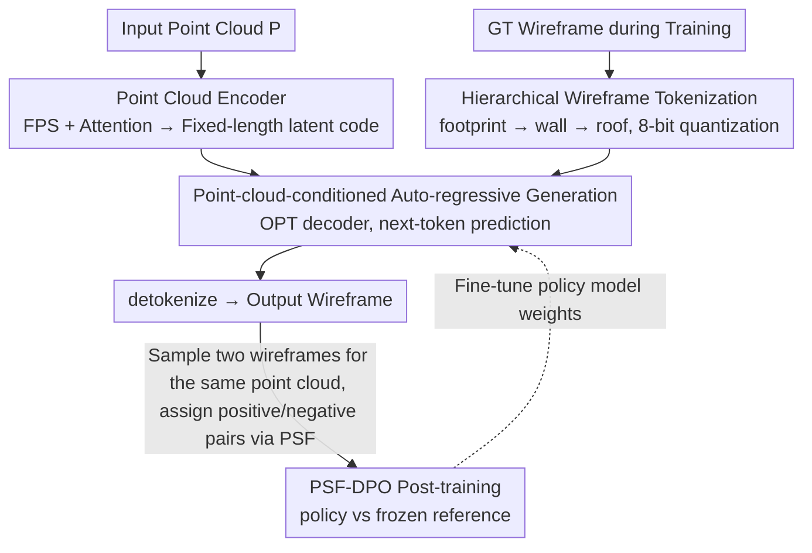

# BuildingGPT: Auto-Regressive Building Wireframe Reconstruction Model with Reinforcement Learning

**Conference**: CVPR 2026  
**Paper**: [CVF Open Access](https://openaccess.thecvf.com/content/CVPR2026/html/Liu_BuildingGPT_Auto-Regressive_Building_Wireframe_Reconstruction_Model_with_Reinforcement_Learning_CVPR_2026_paper.html)  
**Code**: https://github.com/3dv-casia/BuildingGPT/  
**Area**: 3D Vision / Reinforcement Learning  
**Keywords**: Building wireframe reconstruction, auto-regressive generation, point cloud, DPO, tokenization  

## TL;DR
BuildingGPT reformulates "building wireframe reconstruction from point clouds" as a sequence generation problem: it first encodes wireframes into discrete tokens using a hierarchical tokenization scheme in the order of "foundation → wall → roof," then generates tokens sequentially using a point-cloud-conditioned auto-regressive Transformer. Finally, it employs DPO post-training based on a custom Preference Score Function (PSF) to align with human preferences for geometric accuracy and topological correctness, comprehensively surpassing detection-based and diffusion-based SOTA on the large-scale MunichWF dataset.

## Background & Motivation
**Background**: A building wireframe is a lightweight yet precise 3D representation that connects structural elements like footprints, walls, and roofs via vertices and edges. Currently, there are two main technical routes for reconstructing wireframes from point clouds: **primitive detection** (detecting vertices first then connecting edges, or detecting edges directly followed by post-processing) and **conditional generation** (e.g., EdgeDiff uses an edge diffusion model to denoise from noisy edges).

**Limitations of Prior Work**: Detection-based methods focus only on local features and are prone to missing vertices or edges when encountering noisy or incomplete point clouds, leading to structural incompleteness. Diffusion-based methods use a fixed number of padding edges and still rely on post-processing like edge clustering, failing to achieve true end-to-end reconstruction. Both types of methods struggle to simultaneously ensure "geometric accuracy" and "topological correctness."

**Key Challenge**: Buildings naturally possess strong structural and semantic regularities—parallel, perpendicular, and coplanar edges, as well as specific connectivity between footprints, walls, and roofs. However, neither detection nor diffusion methods explicitly model these "global structural dependencies," often resulting in local accuracy but global topological chaos.

**Goal**: To develop an end-to-end reconstruction model capable of explicitly modeling long-range dependencies between edges and aligning with human preferences for a "good wireframe."

**Key Insight**: The authors noted that a building wireframe is essentially a sequence of interdependent edges, which perfectly fits the sequence modeling strengths of auto-regressive (next-token prediction) models. Furthermore, the RLHF/DPO post-training paradigm can inject preferences for "geometrically accurate and topologically correct" structures. The combination of these two has rarely been explored in wireframe reconstruction.

**Core Idea**: Transforming wireframe reconstruction into "auto-regressive generation of edge sequences"—where hierarchical tokenization determines the generation order, point cloud latent codes provide the condition, and DPO post-training performs calibration—essentially rewriting a 3D geometric reconstruction task in the language model paradigm.

## Method

### Overall Architecture
The input to BuildingGPT is a building point cloud $P$, and the output is a complete building wireframe (a set of edges with vertex coordinates). The pipeline consists of two training stages: **Stage 1 (Pre-training)** encodes the point cloud into fixed-length latent codes, and a decoder-only Transformer, conditioned on this code, generates wireframe sequences token-by-token auto-regressively starting from a BOS token. **Stage 2 (Post-training)** uses samples generated by the pre-trained model to construct "positive/negative preference pairs," then fine-tunes the policy model using DPO to align with human preferences.

The key transformation here is that the originally continuous wireframe coordinates are organized into a discrete token sequence by a "hierarchical tokenization" scheme following the semantic order of footprint → wall → roof, thus converting geometric reconstruction into a standard language modeling problem.

### Key Designs

**1. Hierarchical Building Wireframe Tokenization: Embedding Structural and Semantic Priors into Generation Order**

This step addresses the limitation that "neither detection nor diffusion encodes building structural semantic regularities." The authors organize the wireframe into three levels: **component**, **edge**, and **vertex**. Components are divided by height: edges with both endpoints on the ground are footprint edges, those with one endpoint on the ground are walls, and the rest are roofs. Components are ordered as footprint → wall → roof, mimicking the real-world construction process from the foundation up. Within each component, vertices are sorted in ascending $z\text{-}y\text{-}x$ order, and edges are sorted by their lowest vertex index followed by the second lowest. The entire wireframe sequence is represented as:

$$B = (F, W, R) = (f_1,\dots,f_{n_f},\ w_1,\dots,w_{n_w},\ r_1,\dots,r_{n_r})$$

Each edge $e_i$ is represented by six coordinates $(z^1_{e_i}, y^1_{e_i}, x^1_{e_i}, z^2_{e_i}, y^2_{e_i}, x^2_{e_i})$. Coordinates are normalized to a unit cube and 8-bit quantized into discrete tokens, with BOS/EOS tokens added. This "hierarchical by semantic component, ordered by construction" design allows the auto-regressive model to utilize structural consistency within components and vertical/parallel/orthogonal constraints between components. Ablations show that replacing vanilla $z\text{-}y\text{-}x$ sorting with this hierarchical sorting improves EF1 from 91.9% to 93.1%.

**2. Point-cloud-conditioned Auto-regressive Generation: Reconstruction as Next-token Prediction**

To explicitly model long-range edge dependencies end-to-end, a decoder-only Transformer learns the joint distribution of the wireframe sequence conditioned on the point cloud:

$$\mathrm{Pro}(S|P) = \prod_{i=1}^{n_s} \mathrm{Pro}(T_i \mid S_{1:i-1}, P)$$

The point cloud side uses an encoder inspired by Point Transformer: each point is embedded into local features, and farthest point sampling (FPS) selects $n_q$ query points. Self-attention and cross-attention aggregate global structure into the query features, forming a **fixed-length latent code**. This code is prepended to the BOS token as the condition. The generation network uses the OPT architecture (24 layers, 16 heads, hidden dim 1536). Discrete tokens are converted to continuous features via learnable embeddings, and stacked causal self-attention allows each token to attend to the latent code and all preceding tokens. Pre-training uses cross-entropy loss $L_{pre} = \mathrm{CE}(S, S_{gt})$. During inference, multinomial sampling with top-$k$ ($k=10$) is used with a hard constraint: **EOS is only allowed when the number of generated tokens is a multiple of 6**, ensuring every edge (6 coordinates) is fully generated to avoid structurally invalid outputs.

**3. PSF-based DPO Post-training: Aligning with "Human-preferred Good Wireframes"**

Even after pre-training, the model may commit errors that defy human intuition (missing structures, unordered edges). DPO post-training is introduced for alignment. The difficulty lies in defining why one wireframe is better than another. Thus, a **Preference Score Function (PSF)** was designed to merge geometric accuracy and topological correctness into a scalar:

$$\mathrm{PSF} = \frac{F_c + F_e}{F_{wed}}$$

Where $F_{wed}$ is the Wireframe Edit Distance (measuring topological correctness, lower is better), and $F_c, F_e$ are Corner F1 and Edge F1 (measuring geometric accuracy, higher is better). For each point cloud, the pre-trained model samples two different wireframes; the one with the higher PSF serves as the positive sample, and the lower as the negative sample, forming 40,000 preference pairs. Two models are used: a **reference model** initialized and frozen from the pre-trained weights, and a **policy model** similarly initialized but trainable. DPO encourages the policy model to assign higher likelihood to positive samples and lower to negative ones:

$$L_{DPO} = -\log\sigma\!\left(\beta\log\frac{\pi_p(y^+|p)}{\pi_r(y^+|p)} - \beta\log\frac{\pi_p(y^-|p)}{\pi_r(y^-|p)}\right)$$

Since positive and negative samples often share tokens at the start, the model might struggle to distinguish them or even suppress the likelihood of positive samples. Therefore, an additional length-normalized NLL loss for positive samples is added to stabilize training:

$$L_{NLL} = -\frac{\log\pi_p(y^+|p)}{|y^+|}$$

The total post-training loss is $L_{pos} = \mathbb{E}_{(p,y^+,y^-)\sim D}(L_{DPO} + L_{NLL})$ with $\beta=0.1$. This step further reduces WED from 1.19 to 0.98.

### Loss & Training
Pre-training uses cross-entropy $L_{pre}$, trained on 8×A800 for 4 days. Post-training uses $L_{pos}=L_{DPO}+L_{NLL}$, trained on a single A800 for 2 days with 40,000 preference pairs and $\beta=0.1$. Vertex coordinate quantization resolution is 256, query/input point counts are 2048/4096, and latent code length is 2048. Training includes random scaling, rotation, and noise augmentation.

## Key Experimental Results

### Main Results
The dataset is the newly constructed **MunichWF** (extracted from Munich LOD2 building meshes, 267K samples after filtering, 262K training / 5K testing), covering complete buildings (standard datasets often only have roofs). Metrics are grouped into Distance (WED↓, ACO↓), Corner (CP/CR/CF1), and Edge (EP/ER/EF1).

| Method | Source | WED↓ | ACO↓ | CF1↑ | EF1↑ |
|------|------|------|------|------|------|
| PC2WF | ICLR21 | 38.87 | 32.66 | 10.0 | 0.8 |
| Point2Roof | JPRS22 | 4.10 | 3.75 | 61.5 | 43.9 |
| PBWR | CVPR24 | 1.54 | 1.48 | 92.6 | 88.9 |
| EdgeDiff | CVPR25 | 1.39 | 1.32 | 93.9 | 91.6 |
| BWFormer | CVPR25 | 3.56 | 2.74 | 91.4 | 87.9 |
| **BuildingGPT** | - | **0.98** | **0.88** | **97.4** | **94.4** |

Compared to the previous SOTA, EdgeDiff, WED and ACO decreased by 29.5% and 33.3% respectively, while CF1/EF1 improved by 3.5%/2.8%, leading across all metrics.

### Ablation Study

| Configuration | WED↓ | ACO↓ | CF1↑ | EF1↑ | Description |
|------|------|------|------|------|------|
| Baseline (vanilla z-y-x order) | 1.39 | 1.25 | 96.0 | 91.9 | Pre-training only, basic tokenization |
| + Hierarchical tokenization | 1.19 | 1.08 | 96.7 | 93.1 | Switched to footprint→roof hierarchical order |
| + DPO Post-training | **0.98** | **0.88** | **97.4** | **94.4** | Complete model |

### Key Findings
- **Contributions are roughly equal**: Hierarchical tokenization reduced WED from 1.39 to 1.19 (EF1 +1.2 pts); DPO post-training further reduced WED to 0.98 (EF1 +1.3 pts). Structure-aware generation order and preference alignment are complementary.
- **LLM-like scaling behavior**: As the model size increased from 129M to 730M and data usage from 20% to 100%, test set cross-entropy decreased monotonically. Small models saturated as data increased, while larger models continued to benefit, suggesting room for further improvement via "more parameters + more data."
- **Robustness to degradation with a threshold**: Metrics remained stable under 25%/50% point removal or 0.01/0.02 noise (WED 1.09~1.97); however, performance crashed at 75% removal or 0.05 noise (CF1 dropped to ~85, EF1 to ~76). This is attributed to global context modeling reaching its limit.
- **Zero-shot cross-domain capability**: The model reconstructed topologically consistent wireframes on the unseen AHN3 dataset without fine-tuning (qualitative results).

## Highlights & Insights
- **Through "Language Modelization" of 3D Geometric Reconstruction**: From tokenization (generation order) → conditional auto-regression (long-range dependency) → DPO (preference alignment), the pipeline is a complete port of the LLM training paradigm to 3D reconstruction, even replicating the scaling law.
- **Clever PSF Design**: Using $\frac{F_c+F_e}{F_{wed}}$ unifies "geometric accuracy (numerator)" and "topological correctness (denominator)" into a single scalar, naturally reconciling two competing objectives into a comparable preference signal without manual annotation.
- **"EOS only at multiples of 6" is a low-cost, critical constraint**: This simple decoding rule eliminates structurally invalid "half-edges," a useful trick for discrete sequence generation in structured geometry.
- Using self-sampled preference pairs for DPO avoids manual labeling; this "self-generated preference data + DPO" approach is transferable to other structured generation tasks.

## Limitations & Future Work
- Authors acknowledge failure cases (local missing structures or unordered edges) for **extremely complex structures**.
- Performance degrades significantly under extreme input degradation (75% removal, 0.05 noise), indicating a limit to global context robustness.
- ⚠️ Auto-regressive token-by-token generation might be **slow for long wireframes** (complex buildings with many edges); inference latency comparison is missing.
- The PSF design is specific (combination of F1 and WED); whether it is optimal or universal for all building styles requires further discussion.
- Future Work: Introducing stronger geometric/physical constraints during decoding or expanding preference signals to include semantic human feedback may further reduce topological errors in complex buildings.

## Related Work & Insights
- **vs Detection-based (PC2WF / Point2Roof / BWFormer / PBWR)**: These focus on local features and suffer from missed detections under noise; they are not fully end-to-end. BuildingGPT generates entire edge sequences, models dependencies explicitly, and leads significantly in metrics (e.g., EF1 88.9 → 94.4).
- **vs Diffusion-based (EdgeDiff)**: EdgeDiff requires post-processing for its fixed padding edges; BuildingGPT uses adaptive sequence lengths and an EOS constraint, removing the need for padding or clustering (WED 1.39 → 0.98).
- **vs Auto-regressive Mesh Generation (PolyGen / MeshGPT)**: This work borrows the idea of ordering geometry into token sequences but introduces the footprint → roof hierarchical semantic tokenization and is the first to bring DPO preference alignment to wireframe reconstruction.

## Rating
- Novelty: ⭐⭐⭐⭐⭐ First complete "Hierarchical Tokenization + Conditioned Auto-regression + DPO" paradigm for wireframe reconstruction.
- Experimental Thoroughness: ⭐⭐⭐⭐⭐ Comprehensive comparisons, ablations, scaling, robustness, and cross-domain tests on a 267K dataset.
- Writing Quality: ⭐⭐⭐⭐ Clear motivation and method, though some implementation details (inference latency) are sparse.
- Value: ⭐⭐⭐⭐⭐ Successfully migrates LLM paradigms to 3D structured reconstruction with scaling behavior, offering high utility for city modeling and digital twins.

<!-- RELATED:START -->

## Related Papers

- [\[ICCV 2025\] DeepMesh: Auto-Regressive Artist-Mesh Creation with Reinforcement Learning](../../ICCV2025/3d_vision/deepmesh_auto-regressive_artist-mesh_creation_with_reinforcement_learning.md)
- [\[CVPR 2026\] Edges Compete for Trust: Group Relative Edge Optimization for Building Reconstruction from Point Clouds](edges_compete_for_trust_group_relative_edge_optimization_for_building_reconstruc.md)
- [\[ICLR 2026\] Topology-Preserved Auto-regressive Mesh Generation in the Manner of Weaving Silk](../../ICLR2026/3d_vision/topology-preserved_auto-regressive_mesh_generation_in_the_manner_of_weaving_silk.md)
- [\[CVPR 2026\] Adaptive 3D Perception for Small Aerial Targets Under Sparse Sampling via Reinforcement Learning](adaptive_3d_perception_for_small_aerial_targets_under_sparse_sampling_via_reinfo.md)
- [\[CVPR 2026\] Online3R: Online Learning for Consistent Sequential Reconstruction Based on Geometry Foundation Model](online3r_online_learning_for_consistent_sequential_reconstruction_based_on_geome.md)

<!-- RELATED:END -->
