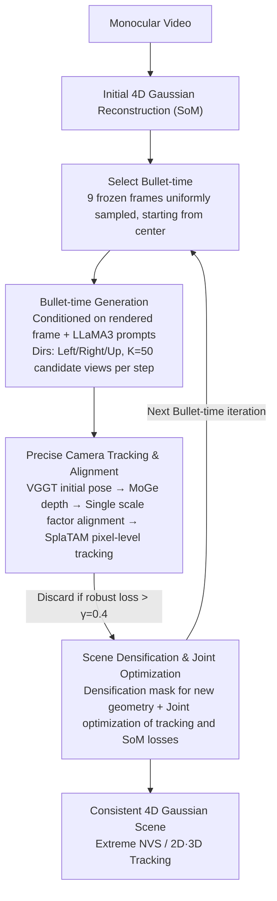

# BulletGen: Improving 4D Reconstruction with Bullet-Time Generation

**Conference**: CVPR 2026  
**arXiv**: [2506.18601](https://arxiv.org/abs/2506.18601)  
**Code**: None (Internal model)  
**Area**: 4D Reconstruction / 3D Vision  
**Keywords**: 4D Reconstruction, Bullet-time, Video Diffusion Models, Gaussian Splatting, Novel View Synthesis

## TL;DR
BulletGen is proposed to generate novel views using static video diffusion models at selected "bullet-time" frozen frames. After precise positioning, these views supervise 4D Gaussian scene optimization, achieving SOTA in extreme novel view synthesis and 2D/3D tracking with only monocular video input.

## Background & Motivation
**Background**: Reconstructing dynamic 4D scenes from monocular video is a highly under-constrained problem. Methods like Shape-of-Motion utilize depth priors and 2D trajectories to achieve decent reconstruction but still fail under extreme novel views.

**Limitations of Prior Work**: Monocular video provides only one viewpoint per timestep, making 4D reconstruction severely under-constrained and leading to local optima. Existing generative methods (CAT4D, Vivid4D) decouple optimization after generating multi-view videos, lacking precise camera control and spatio-temporal consistency.

**Key Challenge**: Pure optimization methods lack information for unobserved regions, while pure generative methods lack global consistency constraints. How can inconsistent 2D generation results be robustly integrated into a consistent 4D representation?

**Goal**: To combine the generative capabilities of video diffusion models with the global consistency advantages of per-scene optimization.

**Key Insight**: "Bullet-time"—freezing the scene at selected moments to generate novel views for those frozen instants (equivalent to static scene novel view synthesis) and then integrating the generated results into the 4D reconstruction.

**Core Idea**: Train diffusion models using abundant static training data (instead of scarce dynamic video data) to generate novel views at frozen moments, integrating 2D generation results into a global 3D representation via iterative optimization.

## Method

### Overall Architecture

BulletGen addresses the extreme under-constraint in monocular 4D reconstruction, where unobserved regions rely on estimation. The approach starts with an initial 4D Gaussian reconstruction based on Shape-of-Motion (SoM). It then selects several "bullet-time" frozen frames along the timeline, treats them as static scenes, generates novel views via image-to-video diffusion models, aligns these views precisely with the 4D reconstruction for Gaussian densification, and finally optimizes both generated content and original video into a unified global representation using joint losses. This process iterates over multiple bullet-time moments to gradually fill in unobserved regions.

### Key Designs

**1. Bullet-Time Generation: Decomposing Dynamic Reconstruction into Static NVS**

Monocular videos lack information from unobserved regions, and training dynamic multi-view diffusion models is data-scarce and quality-constrained. BulletGen reduces dimensionality by freezing the scene at time $t$. The task simplifies to "static novel view synthesis," where data is abundant and models are mature. Conditioned on current rendered frames and LLaMA3-generated text, the model supports left, right, and up directions, performing $n_G=7$ generations per bullet-time. This leverages massive static datasets to obtain high-quality novel views, avoiding the computational burden of dynamic diffusion models.

**2. Precise Camera Tracking and Alignment: Seaming 2D Generation to 3D Scenes**

Generated views must align perfectly with the existing 4D reconstruction to avoid artifacts. Initial relative poses are estimated using VGGT, followed by precise monocular depth from MoGe. These are aligned to the 4D reconstruction via a single scale factor. Finally, SplaTAM handles pixel-level tracking to optimize extrinsic parameters $\mathbf{E}_k$. The robust loss for alignment fuses multiple cues:

$$\mathcal{L} = \alpha_1 \text{L1} + \alpha_2 \text{LPIPS} + \alpha_3 \text{CLIP} + \alpha_4 \text{L1}_{depth}$$

Since pixel-level 3D consistency in generated images is imperfect, weights prioritize semantic/perceptual terms ($\alpha_2=\alpha_3=0.1$) to emphasize global semantics over per-pixel fits. Only views with loss below $\gamma=0.4$ are retained.

**3. Scene Densification and Joint Optimization: Anchoring Generated Content**

Unobserved regions require new geometry without damaging existing reconstruction. A densification mask targets low-density areas and regions where new geometry appears in front of current geometry. New Gaussians inherit static/dynamic attributes and motion basis weights from nearest neighbors. Joint optimization alternates between tracking loss for generated views and SoM loss for original video (100 epochs, batch size 8). This "generate-align-densify-optimize" loop mimics SLAM/BA, merging independent 2D predictions into a consistent 4D representation.

### Example

In a monocular video of a cat, SoM initially reconstructs the scene, but the cat's back is never captured. BulletGen samples 9 bullet-time moments. At a frozen frame, the model generates "right-side" views, producing $K=50$ candidates. VGGT+MoGe+SplaTAM align them, filtering those with loss $>\gamma=0.4$. Remaining $K' \le K$ high-quality views trigger densification, populating the cat's back with new Gaussians. Repeating this across iterations fills in missing areas like walls behind skaters while maintaining consistency with original footage.

### Loss & Training
- Camera Tracking: L1 + LPIPS + CLIP cosine similarity + Depth L1, 100 epochs.
- Scene Update: Tracking loss (global) + Default SoM loss, 100 epochs.
- Temporal Selection: $n_S=9$ bullet-time moments sampled uniformly, starting from the center.
- Generation: $K=50$ views per step, filtered to $K' \leq K$.

## Key Experimental Results

### Main Results (iPhone Dataset, Novel View Synthesis)

| Method | PSNR↑ | SSIM↑ | LPIPS↓ | CLIP-I↑ |
|------|-------|-------|--------|---------|
| HyperNeRF | 15.99 | 0.59 | 0.51 | 0.87 |
| Shape-of-Motion | 16.72 | 0.63 | 0.45 | 0.86 |
| CAT4D (no code) | 17.39 | 0.61 | 0.34 | - |
| **Ours** | **16.78** | **0.64** | **0.39** | **0.90** |

### 3D/2D Tracking (iPhone Dataset)

| Method | EPE↓ | $\delta_{3D}^{.05}$↑ | $\delta_{3D}^{.10}$↑ | AJ↑ |
|------|------|---------------------|---------------------|-----|
| TAPIR + DA | 0.114 | 38.1 | 63.2 | 27.8 |
| Shape-of-Motion | 0.082 | 43.0 | 73.3 | 34.4 |
| **Ours** | **0.071** | **51.6** | **77.6** | **36.6** |

### Ablation Study (Vivid4D Subset, iPhone)

| Method | PSNR↑ | SSIM↑ | LPIPS↓ |
|------|-------|-------|--------|
| Shape-of-Motion | 14.56 | 0.46 | 0.53 |
| Vivid4D (no code) | 15.20 | 0.50 | 0.49 |
| **Ours** | **16.38** | **0.51** | **0.45** |

### Key Findings
- BulletGen achieves SOTA in all 2D/3D tracking metrics as generated views provide stricter geometric constraints.
- Advantages are more pronounced on the Vivid4D subset (PSNR +1.82 vs SoM).
- Generated content integrates seamlessly into static and dynamic components (e.g., the cat's back, walls).
- The CLIP-I score of 0.90 significantly exceeds baselines, indicating superior semantic consistency.
- Effective dynamic scene improvement is achieved using only 5-9 bullet-time moments.

## Highlights & Insights
- The "Bullet-time + Static Diffusion" strategy is ingenious—transforming dynamic reconstruction into multiple static NVS tasks.
- Leverages static training data (orders of magnitude richer than dynamic data) to avoid dynamic model overhead.
- The iterative generation-optimization loop mirrors SLAM/BA, integrating independent predictions via global optimization.
- Substantial gains in 3D tracking validate the contribution of generated views to geometric constraints.

## Limitations & Future Work
- Dependency on an internal, non-public diffusion model limits reproducibility.
- Average optimization time of ~3 hours per sequence (including 1.5h for SoM) is far from real-time.
- The generative model currently supports only static scenes and limited directions (left, right, up), lacking downward views.
- Potential inconsistencies between different bullet-time generations are mitigated but not entirely solved by global optimization.
- View-dependent lighting changes are not explicitly modeled.

## Related Work & Insights
- Shape-of-Motion provides a robust initial 4D foundation upon which BulletGen adds generative enhancement.
- Unlike the decoupled "generate then optimize" strategy of CAT4D/Vivid4D, BulletGen's iterative approach is more tightly integrated.
- SplaTAM's Gaussian SLAM provides essential tools for precise camera tracking.
- Insight: When data is scarce, "generating synthetic data → merging via global optimization" remains a powerful paradigm.

## Rating
- Novelty: ⭐⭐⭐⭐⭐ The bullet-time + static diffusion concept is highly innovative in leveraging data imbalance.
- Experimental Thoroughness: ⭐⭐⭐⭐ Comprehensive evaluation across NVS and tracking, though dependent on internal models.
- Writing Quality: ⭐⭐⭐⭐ Clear pipeline description and excellent illustrations.
- Value: ⭐⭐⭐⭐⭐ Provides a practical generative enhancement for monocular 4D reconstruction.

<!-- RELATED:START -->

## Related Papers

- [\[CVPR 2026\] GaussFusion: Improving 3D Reconstruction in the Wild with A Geometry-Informed Video Generator](gaussfusion_improving_3d_reconstruction_in_the_wild_with_a_geometry-informed_vid.md)
- [\[CVPR 2026\] 4D Primitive-Mâché: Glueing Primitives for Persistent 4D Scene Reconstruction](4d_primitive-mache_glueing_primitives_for_persistent_4d_scene_reconstruction.md)
- [\[CVPR 2026\] LumiMotion: Improving Gaussian Relighting with Scene Dynamics](lumimotion_gaussian_relighting_dynamics.md)
- [\[CVPR 2026\] Faster-GS: Analyzing and Improving Gaussian Splatting Optimization](faster-gs_analyzing_and_improving_gaussian_splatting_optimization.md)
- [\[CVPR 2026\] Improving Human Image Animation via Semantic Representation Alignment](improving_human_image_animation_via_semantic_representation_alignment.md)

<!-- RELATED:END -->
