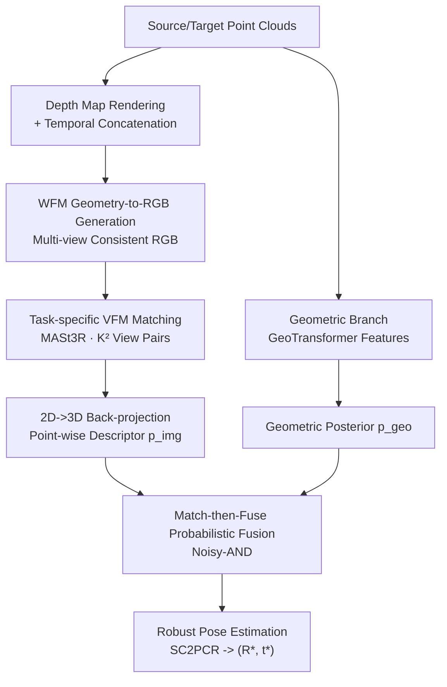

# C-GenReg: Training-Free 3D Point Cloud Registration by Multi-View-Consistent Geometry-to-Image Generation with Probabilistic Modalities Fusion

**Conference**: CVPR 2026  
**arXiv**: [2604.16680](https://arxiv.org/abs/2604.16680)  
**Code**: https://github.com/yuvalH9/CGenReg (Available)  
**Area**: 3D Vision / Point Cloud Registration / Diffusion & Generative Priors  
**Keywords**: Point Cloud Registration, Training-Free, World Foundation Model, Vision Foundation Model, Probabilistic Fusion

## TL;DR
C-GenReg utilizes a pretrained World Foundation Model (Cosmos-Transfer) to render the geometry of input point clouds into "multi-view consistent RGB views." It then extracts correspondences using a Vision Foundation Model (VFM) pretrained for dense matching (MASt3R) and merges the correspondence posteriors from the image and original geometric branches via a Noisy-AND probabilistic fusion. This zero-training, plug-and-play framework is the first generative registration method to successfully operate on real-world outdoor LiDAR.

## Background & Motivation

**Background**: The standard pipeline for point cloud registration involves "feature extraction $\rightarrow$ feature matching $\rightarrow$ robust pose estimation (e.g., RANSAC)." In the deep learning era, learned 3D descriptors like FCGF, Predator, GeoTransformer, and RoITr have replaced handcrafted features like FPFH and SHOT. However, the pipeline structure remains the same, and the performance bottleneck persists in "inaccurate feature matching."

**Limitations of Prior Work**: Learned 3D features are heavily dependent on the acquisition domain—performance drops significantly when sensor modality, point cloud density, or the environment changes. Methods trained on indoor RGB-D data degrade noticeably when applied to different sensors or outdoor LiDAR, showing poor cross-domain generalization.

**Key Challenge**: The image domain has largely overcome the generalization problem through Vision Foundation Models (VFMs) pretrained on massive heterogeneous data, but **there is still no corresponding foundation model for 3D point clouds.** Consequently, a structural gap exists between "domain-dependent 3D features" and the desired "zero-shot generalization."

**Goal**: To "transfer" the 3D registration problem to the image domain where VFMs excel, without losing geometric information from the original point clouds, ultimately achieving zero-shot performance on both indoor RGB-D and outdoor LiDAR.

**Key Insight**: For geometry-to-image transfer to be effective, the generated RGB must satisfy two conditions: (i) **multi-view consistency** between source and target views, and (ii) **geometric coherence** with the underlying 3D structure. Otherwise, generated images will diverge or introduce geometric distortions, leading to unreliable correspondences. The authors observe that recent World Foundation Models (WFMs, e.g., Cosmos-Transfer) naturally encode world-level priors and multi-view geometric reasoning, enabling "off-the-shelf" generation of cross-view consistent RGB from depth control signals. Crucially, the generated images **do not need to match the real scene appearance** (colors and textures can differ), as long as the geometry is preserved across views. This perfectly suits registration needs.

**Core Idea**: Use a pretrained WFM to convert geometry into multi-view consistent RGB (replacing single-view diffusion that requires fine-tuning), extract matches using a task-specific VFM, and finally merge the correspondence posteriors from the image and geometric branches via probabilistic fusion (rather than simple feature concatenation). All three components are frozen off-the-shelf models, requiring zero training.

## Method

### Overall Architecture
Given a source point cloud $P\in\mathbb{R}^{N\times3}$ and a target point cloud $Q\in\mathbb{R}^{M\times3}$, the goal is to estimate the rigid transformation $(R,t)\in SE(3)$ to align $P$ to $Q$. Once a set of reliable correspondences is established, the optimal transformation has a closed-form solution (least squares per Eq. 1). The difficulty lies in "establishing reliable correspondences." C-GenReg uses a **dual-branch + probabilistic fusion** approach: one **Generative-RGB branch** transfers geometry to the image domain to leverage VFMs, while a **Geometric branch** takes original point clouds to preserve geometric inductive biases. Each branch produces a correspondence posterior map, which are merged into a unified posterior via "Match-then-Fuse." Finally, mutual nearest neighbor matches are sampled, and $(R,t)$ is robustly estimated using SC2PCR.

### Key Designs

**1. WFM Geometry-to-RGB Generation: Zero-training Multi-view Consistent Auxiliary Channels**

Previous generative registration methods (e.g., GPCR) mostly used single-view diffusion models, which lack mechanisms for handling multiple geometrically related views and thus **require fine-tuning** to enforce cross-view consistency. C-GenReg directly utilizes World Foundation Models—specifically Cosmos-Transfer (Depth), which supports controllable world generation from modalities like segmentation, edges, or depth. It excels at producing multi-view consistent RGB videos from depth signals. In practice, since 3DMatch/ScanNet point clouds are aggregated from temporal depth frames $\{D\}_{l=1}^{L}$, the authors use this sequence as the conditioning signal. Since the WFM expects video input, source and target depth sequences are **concatenated along the temporal dimension** and fed as a single video, allowing the model to generate them as two related sequences. For LiDAR data, a virtual camera is used to project 3D points into depth maps. The key is that it ensures cross-view geometric consistency **off-the-shelf**, advancing registration from "requiring fine-tuning" to "zero-shot." The generated textures can be unrealistic as long as geometry is maintained. (Experiments show that rough or minimal prompts cause almost no performance drop).

**2. Task-specific VFM Visual Matching: MASt3R for Dense Matching**

The quality of correspondences depends on the features extracted from the generated RGB. Representation from general VFMs (e.g., DINOv2) is not aligned with the "matching" objective. The authors utilize a **task-specific** VFM, MASt3R, which is trained for dense, correspondence-aware features. **View selection** is critical: MASt3R processes source-target image pairs via a cross-attention decoder; a single source image paired with different target images yields **different** feature maps. To exploit this, the authors sample $K$ views from each domain and evaluate all $K^2$ combinations, resulting in $K^2$ conditional feature maps ($F^{img}_n\in\mathbb{R}^{K^2\times N_n\times d_{img}}$). Due to high redundancy in the sequence $L$, a small $K \ll L$ ($K=4$, $L=50$) provides sufficient diversity. After extraction, **2D-to-3D back-projection** uses known camera intrinsics to lift image features back to 3D points.

**3. Match-then-Fuse Probabilistic Fusion: Merging Posteriors to Preserve Inductive Biases**

Instead of simple feature concatenation (Fuse-then-Match), C-GenReg performs "**Match-then-Fuse**." Each modality first calculates its own source-target similarity matrix—$S^{geo}$ for the geometric branch and $S^{img}$ (taking the **maximum** similarity across $K^2$ view pairs) for the image branch. These are converted via row-wise softmax into modality posteriors $p^m_{ij}=\mathrm{Softmax}_j(S^m_{ij}/\tau_m)$. Under the assumption of conditional independence given true correspondences, the **Noisy-AND** (Joint Posterior Fusion) merges them, favoring correspondences supported by **both** modalities:

$$p^{fuse}_{ij}=\frac{p^{img}_{ij}\,p^{geo}_{ij}(1-\pi_{ij})}{p^{img}_{ij}\,p^{geo}_{ij}(1-\pi_{ij})+\bigl(1-p^{img}_{ij}\bigr)\bigl(1-p^{geo}_{ij}\bigr)\pi_{ij}}$$

where $\pi_{ij}\triangleq\Pr(M_{ij}=1)$ is the prior matching probability. A **Noisy-OR** variant is also provided, which boosts confidence if *either* modality strongly supports a match. Noisy-AND is the default as it produces high-precision matches. This fusion requires no training and preserves the priors of two frozen models.

### Loss & Training
There is no training loss: WFM, VFM, and the geometric feature extractor all use public pretrained weights and are **completely frozen**. The fusion module is a closed-form probabilistic formula. Implementation uses Cosmos-Transfer-v1 (Depth) as WFM, MASt3R as VFM, GeoTransformer as the geometric backbone, and SC2PCR for robust pose estimation.

## Key Experimental Results

### Main Results

3DMatch (Indoor, RRE in deg / RTE in cm, Accuracy as % of pairs within threshold):

| Method | Input | RRE@5↑ | RRE@10↑ | RRE mean↓ | RTE@25↑ | RTE mean↓ |
|------|------|--------|---------|-----------|---------|-----------|
| FPFH (Handcrafted) | PC | 41.4 | 56.7 | 39.2 | 35.1 | 50.9 |
| GeoTransformer | PC | 88.9 | 91.8 | 12.0 | 90.1 | 24.6 |
| FCGF | PC | 90.4 | 93.7 | 9.4 | 91.0 | 19.2 |
| GPCR (Generative) | PC | **94.3** | 96.7 | 4.5 | 93.1 | 12.5 |
| **Ours** | PC | 94.2 | **97.5** | **3.8** | **95.7** | **11.9** |
| Ours-Oracle (Real RGB) | RGB-D | 95.1 | 99.6 | 2.1 | 98.3 | 7.3 |

Waymo (Outdoor LiDAR, RRE in deg / RTE in m, baselines trained on KITTI):

| Method | RRE@1↑ | RRE@2↑ | RRE mean↓ | RTE@0.6↑ | RTE mean↓ |
|------|--------|--------|-----------|----------|-----------|
| GeoTransformer | 17.0 | 39.6 | 7.3 | 2.2 | 4.1 |
| Predator | 21.0 | 49.0 | 10.0 | 1.4 | 4.9 |
| **Ours** | **61.8** | **76.2** | **2.4** | **41.1** | **1.7** |

The learning-based baselines degrade on Waymo due to sensor differences, while C-GenReg leads significantly—this is the first time a generative registration framework has succeeded on real outdoor LiDAR.

### Ablation Study (3DMatch, MASt3R as VFM)

| Configuration | RRE@5↑ | RRE mean↓ | RTE mean↓ | Note |
|------|--------|-----------|-----------|------|
| DINOv2 (General VFM, Image branch only) | 57.6 | 27.4 | 73.3 | Not aligned with matching task |
| MASt3R (Task-specific, Image branch only) | 82.7 | 11.7 | 32.5 | Task-specific is ~2.3× better |
| MASt3R + GeoTrans + Concat | 79.4 | 21.9 | 60.1 | Simple feature concatenation |
| **MASt3R + GeoTrans + Noisy-AND** | **94.2** | **3.8** | **11.9** | Default configuration |

### Key Findings
- **Task-specific VFMs are essential**: Replacing DINOv2 with MASt3R reduces mean RRE from 27.4 to ~11.
- **Probabilistic fusion >> Feature concatenation**: On GeoTransformer, Noisy-AND improves mean RRE from 21.9 to 3.8 (a ~5× improvement).
- **Geometric backbones are interchangeable**: C-GenReg acts as a "performance booster" for FCGF, Predator, and GeoTransformer.
- **Robustness to prompts**: Detailed scene descriptions can be replaced with generic tags like "indoor scene" without significant loss in accuracy.

## Highlights & Insights
- **"Generative images need not be realistic, only geometrically consistent"**: This insight allows the use of off-the-shelf WFMs without the fine-tuning required by GPCR.
- **Aligning VFM inductive bias**: Using MASt3R instead of DINOv2 precisely aligns the foundation model with the matching task.
- **Match-then-Fuse framework**: Lifting multi-modal fusion from "feature space" to "posterior space" preserves independent priors and provides calibrated confidence.
- **LiDAR adaptation**: By using virtual projection + WFM, the benefits of image-domain VFMs are successfully extended to LiDAR registration.

## Limitations & Future Work
- **Computational Overhead**: $K^2$ view pairs and WFM generation are costly compared to pure geometric methods.
- **Dependency on WFM consistency**: The reliability depends on the WFM's ability to maintain consistency across out-of-distribution geometries.
- **Oracle Gap**: The gap between Oracle (Real RGB) and the generative version (mean RRE 2.1 vs 3.8) suggests room for improving generation fidelity.

## Related Work & Insights
- **vs GPCR**: GPCR requires **fine-tuning** for consistency and uses simple concatenation. C-GenReg is zero-shot, uses task-specific VFMs, and employs probabilistic fusion.
- **vs ZeroMatch / FreeReg**: These depend on **real RGB observations**, whereas C-GenReg requires only point clouds.
- **vs Learning-based Methods (GeoTransformer, etc.)**: C-GenReg acts as a plug-and-play enhancer that mitigates domain shift issues for these backbones.

## Rating
- Novelty: ⭐⭐⭐⭐⭐ (WFM for consistency + task-specific VFM + probabilistic fusion).
- Experimental Thoroughness: ⭐⭐⭐⭐ (Comprehensive indoor/outdoor testing and ablations).
- Writing Quality: ⭐⭐⭐⭐⭐ (Clear motivation and mathematical derivation).
- Value: ⭐⭐⭐⭐⭐ (Zero-training, cross-domain, first success on LiDAR).

<!-- RELATED:START -->

## Related Papers

- [\[CVPR 2026\] Hg-I2P: Bridging Modalities for Generalizable Image-to-Point-Cloud Registration via Heterogeneous Graphs](hg-i2p_bridging_modalities_for_generalizable_image-to-point-cloud_registration_v.md)
- [\[CVPR 2026\] SuP: Sub-cloud Driven Point Cloud Registration](sup_sub-cloud_driven_point_cloud_registration.md)
- [\[CVPR 2026\] Fast3Dcache: Training-free 3D Geometry Synthesis Acceleration](fast3dcache_training-free_3d_geometry_synthesis_acceleration.md)
- [\[CVPR 2026\] MHopReg: Efficient Hierarchical Multi-Hop Graph Search for Point Cloud Registration](mhopreg_efficient_hierarchical_multi-hop_graph_search_for_point_cloud_registrati.md)
- [\[CVPR 2026\] Generalized-CVO: Fast and Correspondence-Free Local Point Cloud Registration with Second Order Riemannian Optimization](generalized-cvo_fast_and_correspondence-free_local_point_cloud_registration_with.md)

<!-- RELATED:END -->
