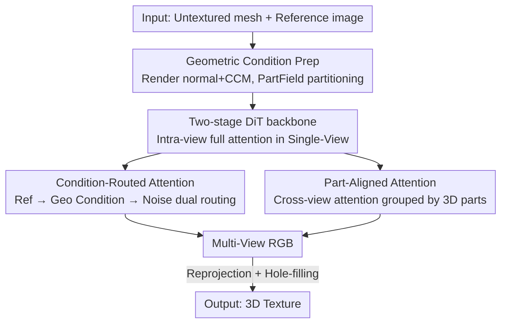

# CaliTex: Geometry-Calibrated Attention for View-Coherent 3D Texture Generation

**Conference**: CVPR 2026  
**Paper**: [CVF Open Access](https://openaccess.thecvf.com/content/CVPR2026/html/Liu_CaliTex_Geometry-Calibrated_Attention_for_View-Coherent_3D_Texture_Generation_CVPR_2026_paper.html)  
**Code**: Project Page <https://calitex-project.github.io> (Open-source repo not yet available)  
**Area**: 3D Vision / Diffusion Models  
**Keywords**: 3D texture generation, multi-view diffusion, attention mechanism, geometric consistency, part priors

## TL;DR
CaliTex diagnoses the root cause of "cross-view texture inconsistency" as **attention ambiguity caused by undiscriminated full attention** in multi-view diffusion. It proposes two types of geometry-calibrated attention: Part-Aligned Attention (calculating cross-view attention grouped by 3D semantic parts) and Condition-Routed Attention (routing reference appearance through geometric conditions before injecting into noise). Implemented on a two-stage DiT, it transforms geometric consistency into an inherent behavior of the network, with texture fidelity and cross-view consistency significantly outperforming open-source and commercial baselines.

## Background & Motivation

**Background**: The current mainstream 3D texture generation follows a "two-stage" paradigm: first generate the geometry, then generate the texture conditioned on that geometry. Specifically, 2D priors from image diffusion models (FLUX, SD, etc.) are used to synthesize multiple view images, which are then reprojected onto the mesh surface to form a texture map. This pipeline yields high appearance quality by leveraging powerful 2D generative priors.

**Limitations of Prior Work**: This process often suffers from failures in **cross-view consistency**, where the same surface area appears differently across different generated views, leading to seams and blurring after reprojection. The authors emphasize that these artifacts are not rendering issues but "misalignments at the representation level" within the model.

**Key Challenge**: Current SOTA methods (UniTEX, MV-Adapter, etc.) simply apply **full attention** indiscriminately across all tokens and views, assuming that "correspondence will emerge naturally." This assumption fails, leading to two types of attention ambiguity: ① **Cross-view ambiguity**: Geometrically similar but semantically distinct regions (e.g., left and right limbs) attend to each other, causing the model to treat them as the same location and generate nearly identical local textures, which results in seams when projected onto inconsistent surface regions. ② **Cross-modal ambiguity**: Noise tokens alternate between attending to the reference image and the geometric conditions, leading to either appearance overfitting (directly copying reference visual patterns) or excessive geometric dependence (losing appearance fidelity), resulting in textures that "look real but are geometrically incorrect."

**Goal**: To make the geometric consistency of texture generation an "inherent property of the network" rather than a "by-product of training," without introducing additional supervision or manual priors.

**Key Insight**: The authors argue that geometric consistency does not emerge automatically from training but requires **architecture-level calibration**. Rather than adding supervision, it is better to **redesign the attention itself to be geometry-aware**, informing the model "where to look" and "how information flows between modalities."

**Core Idea**: Replace "undiscriminated full attention" with "geometry-calibrated attention," explicitly injecting 3D structure into attention calculations at both the spatial level (grouping by parts) and the information flow level (routing by geometric conditions).

## Method

### Overall Architecture

CaliTex aims to generate 6 geometrically aligned and cross-view consistent images given an untextured mesh and a reference image, followed by reprojection and hole-filling to synthesize the texture. While maintaining a "multi-view diffusion + reprojection" backbone, its core innovation lies in the **attention design of the two-stage DiT**.

Input side: Normal maps and canonical coordinate maps (CCM) are rendered from the mesh at 6 predefined viewpoints. These are averaged and encoded via VAE into geometric condition latents $z_{\text{cond}}$. The reference image is encoded as $z_{\text{ref}}$ and replicated 6 times. The noise latent is denoted as $z_t$. These are concatenated along the sequence dimension to obtain $\hat{z}_t \in \mathbb{R}^{6\times 3L\times C}$ (where $L$ is tokens per view, $C$ is feature dimension, and 6 views are laid out in the batch dimension). Simultaneously, a PartField partitions the mesh into semantic parts and renders a "part coloring map," assigning part labels to each token for subsequent PAA.

Two-stage processing: **Single-View DiT** first performs batch-wise full attention to capture local semantics among noise, conditions, and reference within each view. Subsequently, the batch dimension is unfolded, and noise/condition latents from all views are concatenated with the view-averaged reference latent to form $\tilde{z}_{\text{mv}} \in \mathbb{R}^{1\times 13L\times C}$. This is passed to **Multi-View DiT**, where **Condition-Routed Attention (CRA)** and **Part-Aligned Attention (PAA)** enforce cross-view and cross-modal consistency. Finally, the noise latent portion $z'_{\text{img}}$ is decoded into 6 multi-view RGB images, reprojected, and filled to obtain the final texture. The entire network is trained with a flow-matching objective.

### Key Designs

**1. Two-stage DiT backbone: Decoupling "intra-view" and "inter-view" tasks**

The Design Motivation is that if full attention is performed across all views and modalities from the start, the model must simultaneously manage local semantics and cross-view alignment. Mixing these tasks of different difficulties creates a breeding ground for attention ambiguity. CaliTex, fine-tuned on FLUX.1-Kontext, splits the process: The Single-View DiT stage arranges 6 views in the batch dimension for **batch-wise full attention**, aligning noise, geometric conditions, and reference latents only within single views to solidify "intra-view semantics." In the Multi-View DiT stage, the batch dimension is unfolded to form a long sequence $\tilde{z}_{\text{mv}} \in \mathbb{R}^{1\times 13L\times C}$ specifically for "cross-view and cross-modal consistency." Geometric conditions are VAE-encoded averages of normal maps and CCMs rather than using an extra network, keeping it lightweight. The entire backbone is adapted using only rank=16 LoRA. This split provides clear boundaries for the two calibrated attention modules, which are only implemented in the Multi-View DiT.

**2. Condition-Routed Attention (CRA): Forcing reference appearance through geometric conditions**

This addresses cross-modal ambiguity where noise tokens oscillate between the reference and geometric conditions. CRA replaces the standard full attention in Multi-View DiT with **two parallel paths**, forcing appearance information to flow "with geometry as an intermediary." Tokens are divided into two groups: ① **condition–reference group**, which performs self-attention between geometric conditions and reference tokens to fuse visual priors with geometric ones, capturing "appearance as it should be under geometric conditions":

$$\text{Attn}_{\text{c-r}} = \text{Softmax}\!\left(\frac{Q_{\text{c-r}} K_{\text{c-r}}^{\top}}{\sqrt{d}}\right) V_{\text{c-r}}$$

② **noise–condition group**, which injects the geometry-aware features from the previous step into the noise latent, guiding the generation toward geometric alignment (this branch's attention $\text{Attn}_{\text{n-c}}$ is implemented by PAA, see Design 3). The outputs of both branches are merged as:

$$\text{Attn}_{\text{CRA}} = \text{Attn}_{\text{n-c}} \cup \text{Attn}_{\text{c-r}}$$

where $\cup$ indicates that attention is calculated only once for each pair of tokens. This dual-routing runs through all 38 blocks of the Multi-View DiT: visual priors of reference tokens fuse into geometric condition tokens in each block, which then guide the generation in the next. The key is that noise tokens **no longer directly** attend to the reference image; the reference appearance is always "filtered" by geometric conditions, suppressing "direct copying" and ensuring the texture fits the underlying 3D surface.

**3. Part-Aligned Attention (PAA): Delimiting cross-view attention by 3D semantic parts**

This addresses cross-view ambiguity where semantically different but geometrically similar regions (e.g., limbs) attend to each other across views. PAA constrains cross-view attention within the same 3D semantic part using **part-level geometric priors**. The mesh $M$ is decomposed into $K$ semantic parts ($K=20$) via PartField: $M = \{P_1, \dots, P_K\}$, with each face assigned a part index $k$. During rendering, all faces of the same part across 6 views are colored identically, creating a "part coloring map." During latent preparation, condition/reference images are VAE-encoded (downsampling factor $F$) and patched into $P\times P$ blocks (each token corresponding to an $FP\times FP$ image area). For each token $t_i$, if any pixel within its patch belongs to part $k$, it is assigned to group $G_k$:

$$G_k = \{t_i \mid \exists\, p \in \text{Patch}(t_i),\ c(p) = k\},\quad k=1,\dots,K$$

Note that a token can belong to multiple groups (at part boundaries). Self-attention is then performed **within each part group** for noise and condition latents: $\text{Attn}_k = \text{Softmax}(Q_k K_k^{\top}/\sqrt{d})\,V_k$. Results are merged as $\text{Attn}_{\text{PAA}} = \bigcup_{k=1}^{K}\text{Attn}_k$. To maintain global perception, intra-view full attention $\text{Attn}^{(v)}_{\text{intra}}$ is preserved for each view. The final noise–condition attention is:

$$\text{Attn}_{\text{n-c}} = \text{Attn}_{\text{PAA}} \cup \text{Attn}_{\text{intra}}$$

Thus, cross-view attention is restricted to "small, semantically coherent 3D segments," preventing interference between similar but distinct parts and ensuring consistency for symmetric or self-occluding objects.

### Loss & Training
The noise latent portion $z'_{\text{img}}$ is the prediction target, trained with a flow-matching objective: $\mathcal{L}(\theta) = \mathbb{E}_{t,z_0,\epsilon}\big[\lVert z'_{\text{img}} - (\epsilon - z_0)\rVert^2\big]$. The backbone is initialized from FLUX.1-Kontext, training only rank=16 LoRA. Training data consists of 80k objects selected from Objaverse-XL and Texverse, each rendered at 6 predefined views ($768\times 768$) as GT and one random view as reference. The reprojection and hole-filling module follows Lumitex. Training took approximately 600 GPU hours on 8 cards.

## Key Experimental Results

### Main Results
Evaluated on Objaverse objects and high-quality game assets, each mesh was rendered from 32 views for comparison with GT albedo. For a fair comparison with PBR methods, unlit albedo renders were used as reference images. Metrics include FID / CLIP-FID / CMMD / CLIP-I / LPIPS, plus a user study with 25 participants (1–5 scale for Texture Quality (Qual), Geometry Alignment (GeoAlign), and Multi-View Consistency (MV-Cons)).

| Method | FID↓ | CLIP-FID↓ | CMMD↓ | CLIP-I↑ | LPIPS↓ | Qual↑ | GeoAlign↑ | MV-Cons↑ |
|------|------|-----------|-------|---------|--------|-------|-----------|----------|
| Step1X-3D | 254.1 | 28.23 | 3.914 | 0.8433 | 0.3154 | 2.06 | 2.09 | 2.07 |
| UniTEX | 176.2 | 17.19 | 1.156 | 0.8818 | 0.3335 | 3.10 | 3.21 | 3.15 |
| MV-Adapter | 169.4 | 13.61 | 0.747 | 0.8975 | 0.2939 | 3.02 | 3.03 | 2.88 |
| Hunyuan3D-2.1 | 167.4 | 16.21 | 1.067 | 0.8867 | 0.3215 | 2.48 | 2.60 | 2.51 |
| **CaliTex (Ours)** | **157.8** | **12.85** | **0.672** | **0.9106** | **0.2508** | **4.53** | **4.47** | **4.52** |

CaliTex achieved the best scores across all 5 objective metrics and 3 subjective dimensions. The gap in the user study is particularly significant (Qual 4.53 vs. runner-up 3.10), indicating that the advantage of "seamless, geometry-aligned" results is much more pronounced to human perception than objective metrics suggest. Qualitatively, MV-Adapter and Hunyuan3D show blurring in complex geometric areas, while UniTEX produces over-smoothed results with visible seams. CaliTex preserves nearly all details from the reference image with minimal seams.

### Ablation Study
The authors defined **MV-MSE** (Multi-View Mean Squared Error) to measure pixel-level cross-view consistency: for each pair of views $(i,j)$, the error $\lVert I_i(p) - I_j(\pi_j(X_p))\rVert_2^2$ is averaged over the set of "3D-corresponding" pixels $\Omega_i(j)$ (where $X_p$ is the 3D position of pixel $p$ and $\pi_j$ is the projection into view $j$):

$$\text{MV-MSE} = \frac{2}{N(N-1)}\sum_{(i,j)} \frac{1}{|\Omega_i(j)|}\sum_{p\in\Omega_i(j)} \lVert I_i(p) - I_j(\pi_j(X_p))\rVert_2^2$$

| Configuration | MV-MSE↓ | Description |
|------|---------|------|
| Full (Ours) | **0.0384** | Complete model |
| w/o Part-Aligned | 0.0415 | Removing PAA degrades cross-view consistency (+0.0031) |
| w/o Condition-Routed | 0.0403 | Removing CRA degrades geometry-texture alignment (+0.0019) |

### Key Findings
- **PAA contributes more to cross-view consistency**: The increase in MV-MSE when removing PAA (+0.0031) is larger than when removing CRA (+0.0019), aligning with the division of labor where PAA directly constrains cross-view attention and CRA manages cross-modal alignment. Qualitatively, removing PAA causes geometrically similar regions to be erroneously aligned, creating artifacts.
- **CRA primarily treats geometry-texture mismatch**: Removing CRA leads to inconsistencies between the generated view and the geometric condition, caused by "reference appearance not being routed through geometry," leading to direct plagiarism or geometric offsets.
- **Modules are complementary**: One manages "where to look spatially" (PAA), while the other manages "how information flows" (CRA). Together, they correctly handle the most difficult geometries like symmetry and self-occlusion.

## Highlights & Insights
- **Tracing engineering defects (seams) back to the attention mechanism**: instead of modifying post-processing like reprojection or hole-filling, the authors demonstrate that seams stem from representation misalignments caused by "undiscriminated full attention." This root-cause diagnosis is the paper's most valuable insight.
- **Two orthogonal ways of injecting geometric priors into attention**: PAA modifies the "connection structure of attention" (restricting attend ranges by part grouping), while CRA modifies the "information flow of attention" (forcing appearance through geometric routing). This clean separation of spatial and informational dimensions is transferable to any "multimodal + multi-view" generation task (e.g., PBR materials, 4D generation).
- **Consistency through architecture without extra supervision**: By rearranging attention grouping and routing without adding losses or manual priors, geometric consistency becomes an inherent behavior. The approach is engineering-efficient (rank-16 LoRA, 600 GPU hours).

## Limitations & Future Work
- The part count $K=20$ is a fixed manual value. While the authors claim it "fits most common objects," its sufficiency and sensitivity for hyper-complex scenes (e.g., dense machinery, vegetation) remain unanalyzed in the ablation study. ⚠️ Refer to the original text.
- PAA depends on the 3D segmentation quality of PartField. If the part segmentation is incorrect (messy boundaries, over-segmentation), the error propagates directly into the attention grouping. Robustness to segmentation failure is not discussed.
- Although the evaluation includes game assets, both training and testing lean toward Objaverse-style datasets. Generalization to real-world scanned meshes (noisy geometry, non-manifold) has not been verified.
- The specific engineering implementation of the dual-path merge $\cup$ in CRA (calculating attention only once per token pair) is relegated to the supplementary materials.

## Related Work & Insights
- **vs. UniTEX**: UniTEX uses a two-stage "multi-view diffusion + transformer-based Large Texturing Model predicting texture functions in 3D space." While it avoids self-occlusion, it is limited by sparse, low-quality 3D training data, resulting in over-smoothed textures and visible cross-view seams. CaliTex leverages 2D priors for quality while ensuring consistency via geometry-calibrated attention (FID 157.8 vs. 176.2).
- **vs. Romantex / AlignTex**: Romantex uses 3D-aware RoPE for spatial information and geometry-dependent CFG; AlignTex fuses image and geometry features during diffusion. While they enhance "feature-level" geometric awareness, CaliTex directly modifies the "attention grouping and routing structure," providing more explicit control over token interactions and information flow.
- **vs. SeqTex / Elevate3D**: SeqTex generates textures directly in UV space to avoid reprojection but depends on automatic UV unwrapping (xatlas), which can lead to fragmented degradation. Elevate3D iteratively refines single views and modifies geometry for consistency, potentially altering original geometric details. CaliTex modifies neither the UV pipeline nor the geometry, focusing on correcting consistency during the multi-view generation stage.

## Rating
- Novelty: ⭐⭐⭐⭐⭐ Tracing seams to attention ambiguity and solving it systematically with part grouping and condition routing is highly effective.
- Experimental Thoroughness: ⭐⭐⭐⭐ Complete objective and subjective metrics including commercial models, but ablation only provides one quantitative table for MV-MSE; sensitivity to $K$ and segmentation quality is missing.
- Writing Quality: ⭐⭐⭐⭐⭐ Logical loop from problem diagnosis (two types of ambiguity) to two corresponding mechanisms. Clear writing and diagrams.
- Value: ⭐⭐⭐⭐⭐ Seams and geometric alignment are core pain points in 3D texture generation. The methodology is lightweight and transferable, offering direct value to industrial asset generation.

<!-- RELATED:START -->

## Related Papers

- [\[CVPR 2026\] FlashVGGT: Efficient and Scalable Visual Geometry Transformers with Compressed Descriptor Attention](flashvggt_efficient_and_scalable_visual_geometry_transformers_with_compressed_descr.md)
- [\[CVPR 2026\] FreeScale: Scaling 3D Scenes via Certainty-Aware Free-View Generation](freescale_scaling_3d_scenes.md)
- [\[CVPR 2026\] Block-Sparse Global Attention for Efficient Multi-View Geometry Transformers](block-sparse_global_attention_for_efficient_multi-view_geometry_transformers.md)
- [\[CVPR 2026\] Intrinsic Geometry-Appearance Consistency Optimization for Sparse-View Gaussian Splatting](intrinsic_geometry-appearance_consistency_optimization_for_sparse-view_gaussian_.md)
- [\[CVPR 2026\] Curvature-Aware Captioning: Leveraging Geodesic Attention for 3D Scene Understanding](curvature-aware_captioning_leveraging_geodesic_attention_for_3d_scene_understand.md)

<!-- RELATED:END -->
