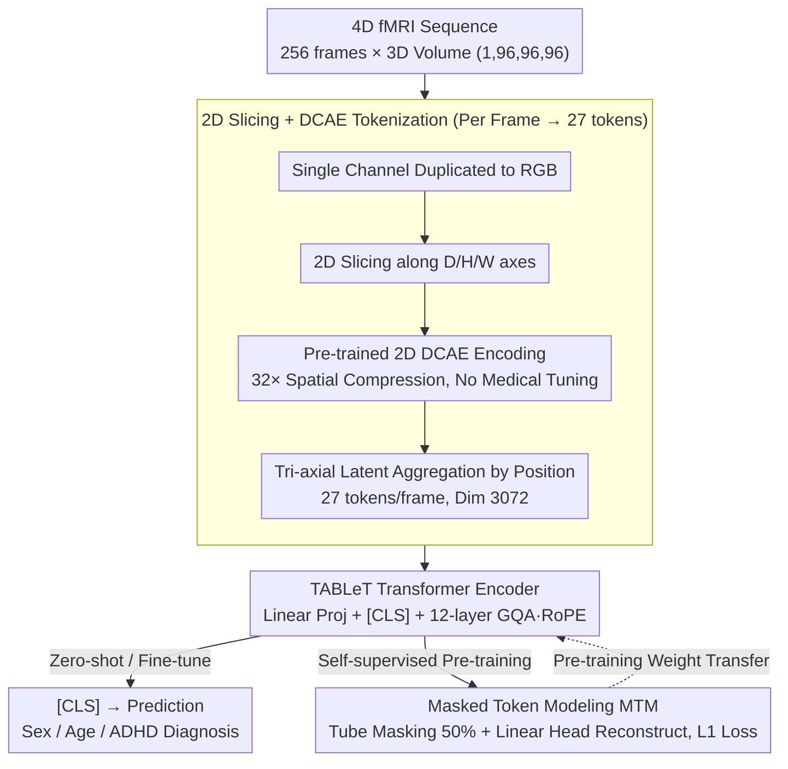

# Can Natural Image Autoencoders Compactly Tokenize fMRI Volumes for Long-Range Dynamics Modeling?

**Conference**: CVPR 2026  
**arXiv**: [2604.03619](https://arxiv.org/abs/2604.03619)  
**Code**: [GitHub](https://github.com/beotborry/TABLeT)  
**Area**: 3D Vision  
**Keywords**: fMRI analysis, Autoencoder transfer, Long-range modeling, Transformer, Masked token modeling

## TL;DR
TABLeT is proposed, utilizing a pre-trained 2D natural image autoencoder (DCAE) to compress 3D fMRI volumes into just 27 continuous tokens. Paired with a simple Transformer encoder, it achieves unprecedented long-range temporal modeling (256 frames), surpassing SOTA voxel-based methods on tasks across UKB, HCP, and ADHD-200 with significantly improved computational efficiency.

## Background & Motivation
**Background**: fMRI analysis methods are categorized into ROI-based and voxel-based approaches. ROI methods (e.g., BrainNetCNN, BNT) are efficient but lose spatial information; voxel methods (e.g., TFF, SwiFT) preserve full information but suffer from extreme memory requirements, typically only processing ~20 time frames.

**Limitations of Prior Work**: fMRI is a 4D signal (3D space + time). Due to GPU memory constraints, voxel-based methods are restricted to very short time windows (e.g., 20 frames), failing to capture critical long-range temporal dynamics such as ultra-slow BOLD-LFP coupling or whole-brain arousal waves.

**Key Challenge**: Modeling long temporal sequences requires compressing the spatial dimension, but excessive compression often leads to the loss of key spatial information (the limitation of traditional ROI methods). The research question remains: how to achieve high compression ratios while retaining sufficient information?

**Goal**: To design a compact tokenization scheme for fMRI volumes that allows Transformers to process significantly longer time sequences within limited biological memory constraints.

**Key Insight**: A counter-intuitive discovery reveals that a 2D autoencoder pre-trained on natural images—without any fine-tuning on medical data—can effectively tokenize fMRI volumes.

**Core Idea**: 3D fMRI volumes are sliced into 2D images along three axes and encoded by a pre-trained DCAE (32× spatial compression ratio). These representations are then regrouped into 27 tokens per frame, enabling the system to input long sequences of up to 256 frames.

## Method

### Overall Architecture

This paper addresses the long-standing difficulty of long-sequence fMRI modeling: voxel methods preserve spatial info but crash memory, limiting them to ~20 frames. TABLeT’s strategy is to aggressively compress the spatial dimension to free up the budget for time. The pipeline consists of three stages: ① **Tokenization**—slicing 4D fMRI frames along three axes into 2D images, encoding them with a **pre-trained 2D natural image autoencoder** (DCAE, not fine-tuned on medical data), and aggregating them by spatial position into just 27 tokens per frame; ② **Transformer Encoder**—since compression is finalized in the tokenization stage, the downstream uses a standard Transformer to process the long sequence (256 frames × 27 tokens), using the [CLS] token for predictions; ③ **Self-supervised Pre-training**—performing Masked Token Modeling (MTM) directly in the token space followed by downstream fine-tuning. The discovery that "natural image AEs can directly tokenize fMRI" is the counter-intuitive premise that renders expensive medical-specific AE training unnecessary.

### Key Designs

**1. 2D Slicing + DCAE Tokenization: Compressing each frame to 27 tokens**

This is the cornerstone of TABLeT, corresponding to the `TOK` group in the architecture. While voxel methods generate tens of thousands of tokens per frame, TABLeT duplicates single-channel fMRI to RGB and **slices along the D/H/W axes**. Each 2D slice is encoded by DCAE into a latent representation of $C' \times \frac{H}{32} \times \frac{W}{32}$. Aggregating these across three axes based on spatial location results in a downsampled grid of $\frac{96}{32}\times\frac{96}{32}\times\frac{96}{32}=3\times3\times3=27$ tokens per frame. Each token has a dimension of $96 \times C' = 96 \times 32 = 3072$ (compared to SwiFT’s ~12K voxel tokens).

This approach relies on the **counter-intuitive empirical discovery** that a 2D DCAE, even without fine-tuning on medical data, yields reconstruction quality on fMRI comparable to specialized 3D DCAEs. It preserves coarse-grained spatial details and global functional patterns. This is because natural image pre-trained AEs learn **universal low-level spatial feature extraction**, which is transferable cross-domain. This eliminates the need for data-hungry medical AE training while the tri-axial slicing ensures spatial coverage.

**2. TABLeT Transformer Architecture: Standardized downstream after compression**

Since compression is handled by tokenization, the downstream uses a standard Transformer encoder (12 layers, 14 attention heads, 2 KV heads via Grouped Query Attention, GQA) with modern LLM components: Rotary Positional Encoding (RoPE) and `F.scaled_dot_product_attention`. Input tokens are normalized and projected before a [CLS] token is added. The model processes $T=256$ frames (vs. SwiFT's $T=20$). GQA is utilized to reduce memory overhead for long sequences.

**3. Self-supervised Pre-training (Masked Token Modeling, MTM): Reconstruction in token space**

Inspired by SimMIM, TABLeT performs **masking directly on the tokens output by DCAE** rather than on pixels. 50% of tokens are randomly replaced by a [MASK] token. The model reconstructs the masked tokens using $L = \frac{1}{\Omega(\mathbf{Z}_M)} \|\mathbf{y}_M - \mathbf{Z}_M\|_1$. A **tube masking** strategy (consistent mask patterns across frames for the same spatial location) is used to prevent the model from "cheating" by looking at adjacent frames. Pre-training in the compressed token space avoids repeated loading of heavy image decoders.

### Loss & Training
- Classification Tasks: Cross-Entropy Loss
- Regression Tasks: MSE Loss
- Pre-training: $\ell_1$ Masked Reconstruction Loss
- Randomly samples 256 frames during training; processes full sequences in segments during validation and averages them.

## Key Experimental Results

### Main Results

| Method | UKB Sex ACC | UKB Age MAE↓ | HCP Sex ACC | HCP Age ρ↑ | ADHD ACC |
|------|------------|-------------|------------|-----------|---------|
| BNT (ROI) | 92.4 | 0.588 | 86.3 | 0.444 | 63.6 |
| SwiFT (T=20) | 97.4 | 0.480 | 93.1 | 0.450 | 63.3 |
| SwiFT (T=50) | 98.1 | 0.477 | 92.2 | 0.460 | 63.9 |
| **TABLeT (T=256)** | 97.7 | **0.466** | **93.8** | **0.473** | **65.8** |

### Ablation Study (Pre-training effect, HCP)

| Configuration | Sex ACC | Age ρ↑ | Intelligence ρ↑ |
|------|---------|--------|-----------------|
| TABLeT (From Scratch) | 93.8 | 0.473 | 0.392 |
| TABLeT (Pre-train + Fine-tune) | **95.3** | **0.552** | **0.435** |

| Comparison | HCP Sex | ADHD Diagnosis | Note |
|------|---------|---------------|------|
| 2D DCAE tokenizer | **93.8** | **65.8** | Natural Image AE |
| 3D DCAE tokenizer | 93.5 | 65.6 | fMRI-specific AE |

### Key Findings
- TABLeT outperforms or matches all baselines (ROI and voxel methods) on most tasks.
- Long-range modeling (256 vs 20 frames) provides the largest gains in Intelligence prediction and ADHD diagnosis, suggesting these tasks require long-term dependencies.
- 2D Natural Image DCAE performs almost identically to 3D fMRI DCAE, validating the core hypothesis.
- Pre-training significantly boosts performance, particularly for Age regression (ρ from 0.473 to 0.552).
- Efficiency: At identical input scales, TABLeT requires much less memory and computation than SwiFT.

## Highlights & Insights
- The discovery that "Natural Image AE can tokenize fMRI" suggests that low-level visual feature extraction capabilities have cross-domain transferability.
- Extreme compression (27 tokens/frame) makes modeling long sequences (256 frames vs 20 frames) a reality.
- The tube masking strategy effectively prevents information leakage in the temporal dimension.
- The experiments are extensive, covering three large-scale datasets (UKB 8K+, HCP 1K+, ADHD-200 533).

## Limitations & Future Work
- Overall improvements are modest, potentially due to the weak signal-to-noise ratio in resting-state fMRI.
- Validation is limited to resting-state fMRI; task-based fMRI (with stronger temporal dynamics) might benefit more.
- Freezing DCAE without fine-tuning might miss low-level features specific to fMRI.
- High spatial compression limits high-resolution spatial analysis.

## Related Work & Insights
- SwiFT is a strong voxel baseline but is limited by the memory requirements of 4D window attention.
- DCAE's 32× compression, originally designed for diffusion models in image generation, is uniquely applied here to fMRI.
- The MAE/VideoMAE masked pre-training paradigm is successfully transferred to the fMRI token space.
- Insight: The transferability of pre-trained models may be stronger than expected, even across domains as distinct as natural images and functional brain imaging.

## Rating
- Novelty: ⭐⭐⭐⭐⭐ (The discovery regarding Natural Image AE is highly original)
- Experimental Thoroughness: ⭐⭐⭐⭐ (Extensive datasets and tasks, though gains are modest)
- Writing Quality: ⭐⭐⭐⭐ (Clear motivation and rigorous design)
- Value: ⭐⭐⭐⭐ (Opens a new path for long-sequence fMRI modeling)

<!-- RELATED:START -->

## Related Papers

- [\[CVPR 2026\] MoRel: Long-Range Flicker-Free 4D Motion Modeling via Anchor Relay-based Bidirectional Blending with Hierarchical Densification](morel_long-range_flicker-free_4d_motion_modeling_via_anchor_relay-based_bidirect.md)
- [\[CVPR 2026\] Long-SCOPE: Fully Sparse Long-Range Cooperative 3D Perception](long_scope_fully_sparse_long_range_cooperative_3d_perception.md)
- [\[CVPR 2026\] CUBE: Representing 3D Faces with Learnable B-Spline Volumes](cube_bspline_3d_faces.md)
- [\[CVPR 2026\] HumanNOVA: Photorealistic, Universal and Rapid 3D Human Avatar Modeling from a Single Image](humannova_photorealistic_universal_and_rapid_3d_human_avatar_modeling_from_a_sin.md)
- [\[CVPR 2026\] Motion 3-to-4: 3D Motion Reconstruction for 4D Synthesis](motion_3-to-4_3d_motion_reconstruction_for_4d_synthesis.md)

<!-- RELATED:END -->
