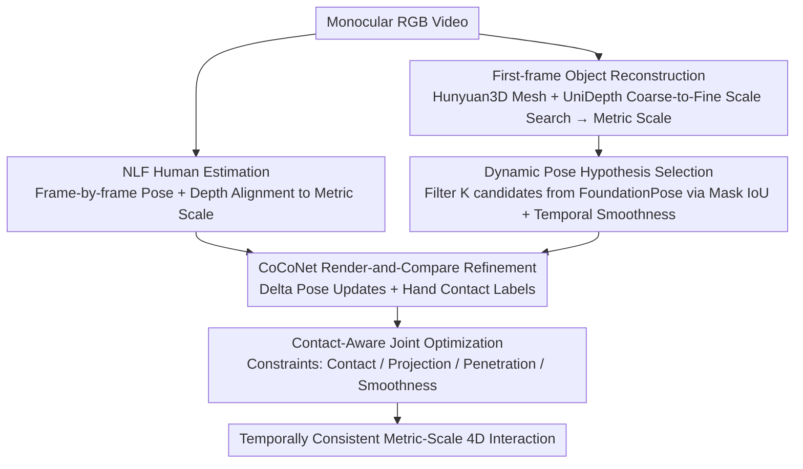

# CARI4D: Category Agnostic 4D Reconstruction of Human-Object Interaction

**Conference**: CVPR 2026  
**arXiv**: [2512.11988](https://arxiv.org/abs/2512.11988)  
**Code**: [Project Page](https://nvlabs.github.io/CARI4D/)  
**Area**: 3D Vision / Human Understanding  
**Keywords**: Human-object interaction reconstruction, category-agnostic, monocular video, 4D tracking, contact reasoning

## TL;DR

Proposes CARI4D, the first category-agnostic method to reconstruct metric-scale 4D human-object interactions from monocular RGB video—comprising object shape reconstruction, pose tracking, hand contact reasoning, and physically constrained optimization, generalizing zero-shot to unseen categories.

## Background & Motivation

Capturing human-object interactions from monocular video is crucial for gaming, robot learning, and human understanding, but faces three primary challenges: significant variations in human and object shapes/poses; lack of depth information making scale recovery difficult; and the need to reason about shape, scale, pose, and dynamics under severe occlusion.

**Limitations of Prior Work**:
- VisTracker requires known object templates.
- InterTrack can only handle training categories.
- PICO (image-based) is temporally inconsistent in video, and contact retrieval is limited to annotated categories.

Foundation models (shape reconstruction, pose estimation, depth estimation) have made significant progress independently, but their predictions reside in different coordinate systems, are affected by noise, and do not consider fine-grained contact. The **Core Idea** of this paper is to carefully align foundation model predictions for robust initialization, then train an interaction-specific model to reason about contact and perform further optimization.

## Method

### Overall Architecture

CARI4D addresses a difficult inverse problem: recovering the complete metric-scale 4D state of humans and objects over time from a single monocular RGB video—including object geometry, human poses, relative positions, and identifying which frames involve hand-object contact. The challenges lie in unknown object categories, lack of depth information, and frequent occlusion by hands and the body.

The **Mechanism** follows a "foundation model-based coarse initialization followed by interaction-specific refinement to align with real contacts" approach. Specifically, starting from the first frame: Hunyuan3D reconstructs the object mesh from a single image, and UniDepth, combined with a coarse-to-fine scale search, places it at a metric scale. Next, FoundationPose tracks object poses frame-by-frame, while NLF estimates human poses and performs depth alignment to the metric scale, resulting in a noisy but roughly correct initialization. Finally, CoCoNet uses a "render-and-compare" paradigm to iteratively refine the human-object relative pose and predict hand contact labels, followed by a contact-aware joint optimization to output temporally consistent metric-scale 4D interactions.

> The third key design, "Training-time Depth Alignment," is a strategy effective only during the training phase of CoCoNet (not performed during testing without ground truth), thus it is not shown in the inference flow above.

### Key Designs

**1. Dynamic Pose Hypothesis Selection: Filtering the correct candidate from the pool**

Directly using the top-1 prediction from FoundationPose often fails in interaction scenarios—the object is obscured by hands, and depth is noisy, causing the top-1 pose to jitter significantly (e.g., object CD can soar to 1565cm). The **Design Motivation** stems from the observation that the correct pose is often present within the $K$ candidates generated by FoundationPose, even if not ranked first. This mechanism scores the $K$ candidates based on two criteria: mask IoU (subtracting regions occluded by the human body to avoid misjudging good candidates) and temporal smoothness (measured by the geodesic distance between rotations of adjacent frames). This selection mechanism reduces object CD from 1565cm to 16.85cm, serving as the lifeline of the pipeline.

**2. CoCoNet: Reasoning about category-agnostic contact via render-and-compare**

Foundation models operate independently—object reconstruction is unaware of humans, and human estimation is unaware of objects. When combined, objects often float or penetrate the body. CoCoNet corrects this using a "render-and-compare" paradigm: it renders the current human estimate (with SMPL vertices colored with textures to help the network learn correspondences) and the object into RGB, depth, and masks. By comparing these with input observations through spatio-temporal attention, it outputs a delta pose update and binary hand contact labels. Because the judgment relies on rendered appearance rather than category priors, it is inherently category-agnostic and generalizes to unseen objects.

**3. Training-time Depth Alignment: Removing absolute depth error to learn relative relationships**

Training data is mixed from multiple datasets, each with different error patterns in depth estimators. If trained directly on noisy estimated depths, CoCoNet might overfit these patterns. The **Core Idea** is to align estimated depth with ground-truth (GT) depth during training using a median-based scale $s$ and offset $t$. This removes absolute depth error, leaving only the relative structures for the network to focus on. This alignment is not used at test time.

### Loss & Training

- **CoCoNet Training**: $L_1$ pose loss + BCE contact loss + Symmetry loss for symmetric objects.
- **Joint Optimization**: Contact distance loss + 2D joint projection loss + Occlusion-aware mask loss + Penetration loss + Acceleration smoothness loss.

## Key Experimental Results

### Main Results (BEHAVE Test Set)

| Method | CD-h(cm)↓ | CD-o(cm)↓ | CD-c(cm)↓ | Acc-o↓ |
|------|-----------|-----------|-----------|--------|
| InterTrack | 25.71 | 47.66 | 30.20 | 5.64 |
| VisTracker (Template req.) | 13.52 | 18.29 | 14.22 | 0.77 |
| CARI4D (Ours) | 7.74 | 12.05 | 9.23 | 0.35 |

### Zero-shot Generalization (InterCap, unseen dataset)

| Method | CD-h↓ | CD-o↓ | CD-c↓ |
|------|-------|-------|-------|
| VisTracker | 16.12 | 27.41 | 20.17 |
| CARI4D (Ours) | 11.06 | 15.69 | 12.88 |

### Ablation Study

| Configuration | CD-c↓ | Description |
|------|-------|------|
| Raw NLF + FP tracking | 405.13 | Direct FP tracking fails completely |
| Proposed Initialization | 10.79 | Hypothesis selection significantly improves results |
| + CoCoNet (no alignment) | 9.95 | Refinement effective but affected by depth error |
| + CoCoNet (w/ alignment) | 8.62 | Alignment eliminates depth error bias |
| + Joint Optimization | 9.35 | Smoothness and contact consistency improved |

### Key Findings

- The pose hypothesis selection algorithm is critical, reducing object CD from 1565.42 to 16.85.
- The depth alignment training strategy is vital for CoCoNet (human CD worsens without it).
- Joint optimization primarily improves motion smoothness (Acc-o drops from 3.78 to 0.38) and contact consistency.
- Using GT object meshes or depth only yields minor improvements, suggesting the method approaches the upper bound.

## Highlights & Insights

- First category-agnostic 4D human-object interaction reconstruction method, capable of zero-shot generalization to in-the-wild videos.
- Clever integration of multiple foundation models (Hunyuan3D, FoundationPose, UniDepth, NLF).
- The render-and-compare paradigm of CoCoNet and the colored SMPL vertex texture design are exemplary.
- Showcases the significant potential of foundation model ensembles in NVIDIA's work.

## Limitations & Future Work

- Assumes most of the object is visible in the first frame, limiting application scenarios.
- Object meshes reconstructed by Hunyuan3D are not always perfect, especially for complex shapes.
- CD slightly increases after joint optimization (8.62 → 9.35), possibly due to over-regularization.
- Multi-object interactions and non-rigid object deformations are not yet handled.

## Related Work & Insights

- **vs VisTracker**: Requires known object templates, fails to generalize to new categories; CARI4D reconstructs the object from a single image.
- **vs InterTrack**: Only handles training categories and outputs point clouds without surfaces; CARI4D is category-agnostic and outputs complete meshes.
- **vs PICO**: Image-based method lacks temporal consistency and relies on contact retrieval libraries; CARI4D is a video-based method that is temporally consistent and category-agnostic.

## Rating

- **Novelty**: ⭐⭐⭐⭐ First category-agnostic 4D interaction reconstruction; unique pose selection and CoCoNet design.
- **Experimental Thoroughness**: ⭐⭐⭐⭐⭐ Comprehensive coverage across in-distribution, zero-shot, and in-the-wild videos; detailed ablation and visualization.
- **Writing Quality**: ⭐⭐⭐⭐ Clear pipeline description with well-articulated design motivations for each module.
- **Value**: ⭐⭐⭐⭐⭐ Direct application value for robot learning and AR/VR; demonstrates a paradigm for foundation model combinations.

<!-- RELATED:START -->

## Related Papers

- [\[CVPR 2026\] Generalizable Structure-Aware Keypoint Correspondence for Category-Unified 3D Single Object Tracking](generalizable_structure-aware_keypoint_correspondence_for_category-unified_3d_si.md)
- [\[CVPR 2026\] 4D Primitive-Mâché: Glueing Primitives for Persistent 4D Scene Reconstruction](4d_primitive-mache_glueing_primitives_for_persistent_4d_scene_reconstruction.md)
- [\[CVPR 2026\] Illumination-Consistent Human-Scene Reconstruction from Monocular Video](illumination-consistent_human-scene_reconstruction_from_monocular_video.md)
- [\[CVPR 2026\] HumanOrbit: 3D Human Reconstruction as 360° Orbit Generation](humanorbit_3d_human_reconstruction_as_360_orbit_generation.md)
- [\[CVPR 2026\] BulletGen: Improving 4D Reconstruction with Bullet-Time Generation](bulletgen_improving_4d_reconstruction_with_bullet-time_generation.md)

<!-- RELATED:END -->
