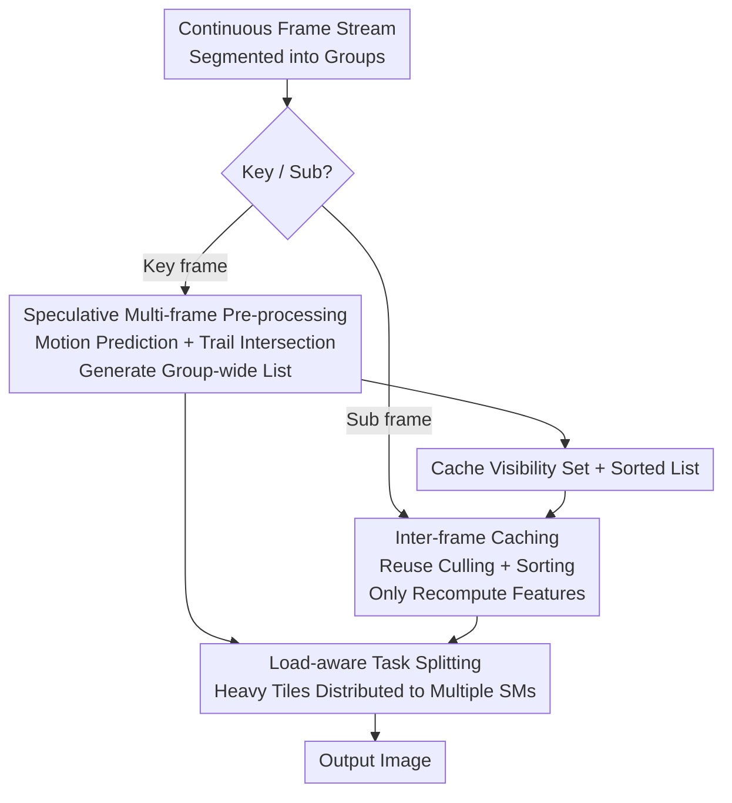

# CaT-GS: Efficient 3DGS Rendering for Large-Scale Scenes with Inter-frame Caching and Tile Scheduling

**Conference**: CVPR 2026  
**Paper**: [CVF Open Access](https://openaccess.thecvf.com/content/CVPR2026/html/Zhang_CaT-GS_Efficient_3DGS_Rendering_for_Large-Scale_Scenes_with_Inter-frame_Caching_CVPR_2026_paper.html)  
**Code**: TBD (No repository link provided; UAV dataset promised to be open-sourced)  
**Area**: 3D Vision  
**Keywords**: 3D Gaussian Splatting, Real-time Rendering, Inter-frame Caching, Speculative Pre-processing, Load Balancing  

## TL;DR
CaT-GS transforms the 3DGS rendering pipeline from "per-frame computation" to "frame-group reuse." By employing speculative multi-frame pre-processing and inter-frame caching, it eliminates redundant view-frustum culling, sorting, and tile intersection across consecutive frames. Combined with a load-aware CUDA kernel split for heavy tiles to balance GPU utilization, it achieves up to a 10× speedup over vanilla 3DGS and is up to 70% faster than previous SOTA methods in large-scale scenes.

## Background & Motivation
**Background**: 3DGS represents scenes as a collection of 3D Gaussians. Its rendering follows a three-stage pipeline: "Pre-processing (frustum culling + feature calculation + tile intersection) → Depth Sorting → Rasterization with alpha blending." By utilizing tile-level parallelism to saturate GPU resources, its quality and speed significantly outperform NeRF, making it widely used in interactive scenarios like autonomous driving, immersive streaming, and virtual tours.

**Limitations of Prior Work**: As scenes scale to city-level (tens of millions of Gaussians), rendering latency increases sharply, making high frame rates difficult to maintain. Existing acceleration methods follow two paths but miss critical optimizations. One path (model compression/pruning) only reduces the number of Gaussians without optimizing the pipeline and **requires retraining**. The other (ADR-GS, Flash-GS) focuses only on the **rasterization stage** using tighter AABB bounding boxes or opacity pruning to shorten intersection lists, optimizing only **intra-frame redundancy**.

**Key Challenge**: Interactive rendering is essentially a **continuous video stream** where camera poses change slowly frame-by-frame. Consequently, pre-processing results (visible Gaussians, depth ordering) for adjacent frames remain nearly identical. However, current methods treat each frame as an independent static image, re-executing culling and sorting for every frame. The authors observe (Fig. 2) that pre-processing and sorting occupy a significant portion of rendering time in large-scale scenes, yet this **inter-frame redundancy** is entirely ignored. Another neglected issue is **tile load imbalance**: dense Gaussian regions cause 10% of tiles to account for over 50% of the computation, with "heavy tiles" bottlenecking single SMs and slowing down overall parallelism.

**Goal**: Without retraining or quality loss, (1) eliminate pre-processing/sorting redundancy between consecutive frames; (2) balance tile load during rasterization to improve GPU utilization.

**Core Idea**: Divide continuous frames into "frame groups." The first frame (key frame) performs a complete "speculative pre-processing" covering the group's motion range. Subsequent frames (sub-frames) reuse the cached visibility sets and sorted lists to skip these stages. Meanwhile, heavy tile tasks are subdivided and distributed across multiple SMs.

## Method

### Overall Architecture
CaT-GS segments the input frame stream into **frame groups** based on motion. Within a group, two types of frames follow different pipelines:

- **Key frame**: Executes a complete but "widened" pre-processing. It uses **motion prediction** to estimate camera movement within the group and performs fine-grained tile intersection based on "Gaussian trails" (the sweep area of a Gaussian). This ensures the generated visible list and sorting results **cover the entire group**.
- **Sub-frame**: Relies on **inter-frame caching** to skip frustum culling, tile intersection, and sorting by reusing the key frame's results. It only recomputes view-dependent features (color/shape/opacity) before rasterization.

Final rasterization for both frame types passes through a **load-aware split kernel**, which divides "heavy tiles" (those with loads > 2× average) into multiple sub-tasks distributed across several SMs to prevent bottlenecks.

### Key Designs

**1. Speculative Multi-frame Pre-processing: Pre-computing Coverage for Group Motion**

To ensure sub-frames do not miss Gaussians, the key frame's list must encompass all Gaussians required by the entire group. CaT-GS employs **motion prediction**: instantaneous camera movement is decomposed into translation, scaling, and rotation. By measuring changes in the translation vector $T$ and rotation matrix $R$ within a short window, each Gaussian center is projected into pixel coordinates using $\begin{bmatrix}u & v & 1\end{bmatrix}^\top = \frac{1}{z_c}K(R\cdot(x_g,y_g,z_g)^\top + T)$. This calculates the pixel displacement $(\Delta u, \Delta v)$ across the group, forming a **Gaussian trail**.

Next, it performs **fine-grained trail intersection**. Instead of per-Gaussian intersection tests, it determines which tiles intersect the "swept area." The trail boundary consists of two semi-ellipses (centered at $(u,v)$ and $(u+\Delta u, v+\Delta v)$) connected by parallel lines. A tile is considered valid if it intersects any boundary or if its center lies within the rectangle formed by the ellipse centers. This ensures sub-frames can safely reuse the list.

**2. Motion-adaptive Scheduling: Automatic Group Shrinking for High-speed Motion**

Speculative pre-processing risks overhead if the camera moves too fast, as trails may sweep overly large areas. CaT-GS sets a boundary condition: since pixel displacement depends on depth $z_c$ (nearer Gaussians move more), it only inspects Gaussians deeper than a threshold $d$. If the displacement $M=\sqrt{\Delta u^2+\Delta v^2}$ for these Gaussians exceeds the tile length $l$, the window size $W_{\text{initial}}$ is reduced to $\lfloor W_{\text{initial}}\cdot \frac{l}{M}\rfloor$. If the motion is so extreme that $M$ exceeds $l$ between just two frames, speculation is abandoned for that frame.

**3. Inter-frame Caching: Skipping Culling and Sorting**

In the standard pipeline, only **feature calculation** (color/shape) is strictly view-dependent. The other steps are cached. **Frustum caching**: Sub-frames skip affine transformations and visibility tests by directly using the hashed indices of visible Gaussians from the key frame. **Sort caching**: At high frame rates, Gaussian depth order remains stable. Sub-frames skip sorting, tile intersection, and key-duplication, which constitutes the bulk of the speedup.

**4. Load-aware Task Splitting: Distributing Heavy Tiles across SMs**

Standard rasterization binds one tile to one SM. CaT-GS **reconstructs rasterization** by splitting the ordered alpha blending of $N$ splats into $k$ segments $N_1,\dots,N_k$, processed in parallel:

$$C = \sum_{i=1}^{k}\Big(\sum_{j=1}^{|N_i|} c_j \omega_j T_j\Big) R_i, \qquad R_i = \prod_{m=1}^{i-1}(1-A_m),\quad A_m = \sum_{j=1}^{|N_m|}\omega_j T_j.$$

Blocks calculate local color $C_k$ and transmittance $A_k$, which are then merged. Tiles exceeding twice the average workload $l=L/t$ are designated as "heavy tiles" and split into multiple thread blocks, ensuring dense regions do not bottleneck single SMs.

## Key Experimental Results

Tested on RTX 5090 + Ryzen 9 9950X using standard sets (Tanks & Temples, MipNeRF360) and custom UAV city datasets (5.9M–8.3M Gaussians). Evaluations performed on 10 user-interaction trajectories at 120 FPS (1920×1080).

### Main Results (Average FPS, Excerpt)

| Scene (# Gaussians) | 3DGS | ADR-GS | Flash-GS | CaT-GS | Gain vs SOTA |
|------|------|--------|----------|--------|------|
| Train (1.0M) | 89.4 | 482.1 | 528.3 | **892.2** | +68% |
| Garden (4.2M) | 92.6 | 204.1 | 201.1 | **295.5** | +46% |
| UAV-1 (6.9M) | 25.2 | 116.8 | 129.2 | **241.5** | +83% |
| UAV-2 (7.2M) | 23.2 | 98.3 | 113.1 | **202.5** | +78% |
| UAV-5 (7.4M) | 36.1 | 111.1 | 132.3 | **217.3** | +65% |

CaT-GS exceeds 200 FPS on all large UAV scenes, whereas baselines fail to maintain 120 FPS. The advantage grows with scene scale.

### Ablation Study

| Configuration | Garden | Truck | UAV-1 | UAV-2 | Note |
|------|--------|-------|-------|-------|------|
| Ours-Full | 295.5 | 736.5 | 241.5 | 202.5 | Full Model |
| w/o Inter-frame Caching | 242.4 | 494.4 | 155.3 | 133.2 | Max drop (~80%) |
| w/o Task Splitting | 279.4 | 672.3 | 210.3 | 178.4 | ~10% drop |

### Key Findings
- **Inter-frame caching is the primary contributor**: Its removal causes up to an 80% performance drop, as it simultaneously eliminates culling, sorting, and intersection tests.
- **Scale-dependent returns**: In complex models, pre-processing and sorting are heavier; thus, the absolute time saved by caching is greater in large-scale UAV scenes.
- **Negligible quality cost**: Sub-frame PSNR drops by only 0.03~0.05, proving the speculative "Gaussian trail" strategy effectively covers visible elements without introducing artifacts.

## Highlights & Insights
- **Reconceptualizing "Single-frame Rendering" as "Video-stream Rendering"**: The core insight is that interactive rendering is naturally temporal. Exploiting inter-frame redundancy—a dimension ignored by intra-frame optimizers—is a goldmine for large-scale acceleration.
- **Effective Gaussian Trail Intersection**: Instead of simple union sets, the "capsule-shaped" trail intersection precisely controls redundancy while ensuring coverage.
- **Transferable Parallel Alpha Blending**: The "segment + residual synthesis" approach for ordered blending provides a blueprint for parallelizing other order-dependent accumulation tasks.
- **Inference-only, Plug-and-play**: Requires no retraining or weight modification, offering significantly better deployment feasibility than compression-based approaches.

## Limitations & Future Work
- **Dependency on Temporal Similarity**: Effectiveness relies on smooth camera motion and high frame rates. In extreme motion, it reverts to key-frame-only rendering, losing most caching benefits.
- **Motion Prediction Approximations**: Treats changes in Gaussian projected shapes as negligible during rotation. Large rotations or dense foreground subjects may introduce more visible sub-frame misalignment.
- **Availability**: Code and UAV datasets have not been released yet, posing a barrier to immediate replication.

## Related Work & Insights
- **vs. Vanilla 3DGS**: Original 3DGS recomputes everything per frame; CaT-GS caches the pipeline across groups, achieving up to 10× speedup with near-identical quality.
- **vs. Flash-GS (Prev. SOTA)**: Flash-GS addresses **intra-frame** redundancy via adaptive intersection. CaT-GS achieves an additional 70% speedup by tackling **inter-frame** redundancy and load balancing.
- **vs. ADR-GS**: ADR-GS uses retraining and tile-aware loss to mitigate imbalance at the cost of **reduced quality**. CaT-GS solves this during inference via task splitting without quality loss.

## Rating
- Novelty: ⭐⭐⭐⭐⭐ First to systematically exploit inter-frame redundancy for large-scale 3DGS rendering.
- Experimental Thoroughness: ⭐⭐⭐⭐ Comprehensive testing across standard and large-scale UAV sets, though lacks comparison with some very recent concurrent works.
- Writing Quality: ⭐⭐⭐⭐ Clear explanation of mechanisms and pipelines; some geometric derivations are slightly condensed.
- Value: ⭐⭐⭐⭐⭐ Plug-and-play, no retraining, and massive speedups for city-scale real-time deployment.

<!-- RELATED:START -->

## Related Papers

- [\[CVPR 2026\] MetroGS: Efficient and Stable Reconstruction of Geometrically Accurate High-Fidelity Large-Scale Scenes](metrogs_efficient_and_stable_reconstruction_of_geometrically_accurate_high-fidel.md)
- [\[CVPR 2026\] EDGS: Eliminating Densification for Efficient Convergence of 3DGS](edgs_eliminating_densification_for_efficient_convergence_of_3dgs.md)
- [\[CVPR 2026\] BEA-GS: BEyond RAdiance Supervision in 3DGS for Precise Object Extraction](bea-gs_beyond_radiance_supervision_in_3dgs_for_precise_object_extraction.md)
- [\[ICLR 2026\] Implicit 4D Gaussian Splatting for Fast Motion with Large Inter-Frame Displacements](../../ICLR2026/3d_vision/implicit_4d_gaussian_splatting_for_fast_motion_with_large_inter-frame_displaceme.md)
- [\[CVPR 2026\] OLATverse: A Large-scale Real-world Object Dataset with Precise Lighting Control](olatverse_a_large-scale_real-world_object_dataset_with_precise_lighting_control.md)

<!-- RELATED:END -->
