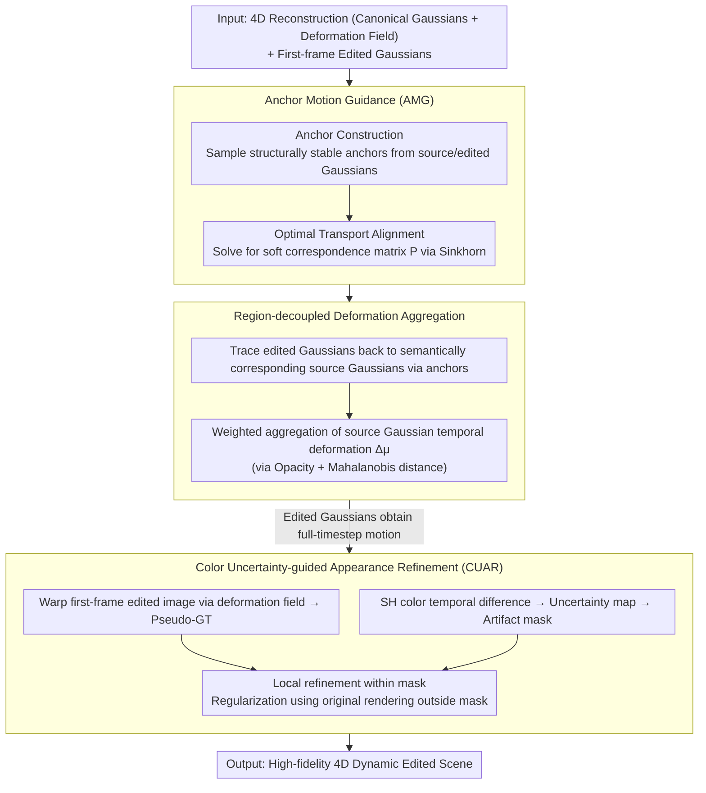

# Catalyst4D: High-Fidelity 3D-to-4D Scene Editing via Dynamic Propagation

**Conference**: CVPR 2026  
**arXiv**: [2603.12766](https://arxiv.org/abs/2603.12766)  
**Code**: None  
**Area**: 3D Vision  
**Keywords**: 4D Editing, 3DGS, Dynamic Scene, Motion Propagation, Optimal Transport, Color Uncertainty

## TL;DR

Ours proposes the Catalyst4D framework, which propagates mature 3D static editing results to 4D dynamic Gaussian scenes via Anchor Motion Guidance (AMG, establishing region-level correspondences based on optimal transport) and Color Uncertainty-guided Appearance Refinement (CUAR, automatically identifying and repairing occlusion artifacts), consistently outperforming existing methods in CLIP semantic similarity.

## Background & Motivation

**Background**: Static scene editing for 3DGS is quite mature—methods like DGE, DreamCatalyst, and SGSST support fine-grained object manipulation and global style transfer with excellent spatial consistency. 4D scene reconstruction has also made significant progress (e.g., Swift4D, 4DGS), typically employing canonical 3D Gaussians combined with a learned deformation field $\mathcal{F}_\theta$ for dynamic representation.

**Limitations of Prior Work**: Dynamic 4D scene editing remains challenging. Existing approaches (e.g., Instruct 4D-to-4D, CTRL-D, Instruct-4DGS) primarily rely on 2D diffusion models to edit images frame-by-frame before fitting them to a 4D representation, which leads to: (1) spatial distortion—2D editing lacks geometric reasoning; (2) temporal flickering—inconsistent 2D edits across frames; (3) unintended modifications to non-target regions—due to the global influence of 2D diffusion models.

**Key Challenge**: While 3D editing quality is high, it is limited to static scenes. The deformation networks of 4D representations are trained only on the original geometry. Once Gaussians are edited (via cloning, splitting, or pruning), they deviate from the original distribution, rendering the deformation network unable to infer their motion as the new Gaussians lack motion priors.

**Goal**: Transfer mature 3D static editing capabilities to 4D dynamic scenes while maintaining geometric accuracy and temporal consistency.

**Key Insight**: Decouple spatial editing from temporal propagation—first edit the initial frame using a mature 3D editor, then extend the editing results to all timesteps via geometry-aware motion propagation.

**Core Idea**: Establish region-level motion correspondences between pre- and post-edit Gaussians using anchor matching and optimal transport. This allows the aggregation and propagation of known deformations from source Gaussians to edited Gaussians, followed by appearance refinement driven by color uncertainty to fix temporal artifacts.

## Method

### Overall Architecture

This paper addresses dynamic 4D scene editing: while 3D static editing and 4D dynamic reconstruction are mature, merging "editing" into dynamic scenes has been problematic—using 2D diffusion models for frame-by-frame modification followed by 4D fitting causes geometric distortion and temporal flickering. Catalyst4D cleverly decouples "editing" from "dynamics": it first edits the **first frame** using an existing 3D editor, then ensures this result "moves" according to the original scene's motion laws.

Specifically, the input consists of an existing 4D reconstruction $(\mathcal{G}_c, \mathcal{F}_\theta)$ (canonical Gaussians + deformation field) and the edited Gaussians for the first frame $\mathcal{G}_{\text{edit}}^1$. The pipeline follows two steps. The first step is motion propagation: stable anchors are sampled from both original first-frame Gaussians $\mathcal{G}^1$ and edited Gaussians $\mathcal{G}_{\text{edit}}^1$. These anchors are aligned via optimal transport (AMG), allowing each edited Gaussian to "borrow" full-timestep motion from its corresponding source Gaussian (Region-decoupled Deformation Aggregation). The second step is appearance refinement (CUAR): as edited Gaussians move, changes in occlusion reveal unedited colors. The deformation field is used to warp the first-frame edited image into subsequent frames as pseudo-ground truth, followed by local refinement only in areas with high color variation. This method requires no retraining of the deformation network and is compatible with both Swift4D (multi-camera) and 4DGS (monocular) representations.

### Key Designs

**1. Anchor Motion Guidance (AMG): Animating new Gaussians following old motion laws**

Edited Gaussians, having undergone cloning, splitting, and pruning, deviate from the distribution seen during deformation network training. Feeding them directly into the network fails to produce reasonable motion. Furthermore, point-level KNN search for nearest neighbors in the original scene introduces noise, potentially cross-contaminating motion between unrelated parts. AMG addresses this by establishing correspondences at the **region level**. It constructs anchors for both original and edited Gaussian sets: candidate rays are generated by uniformly sampling point pairs on the point cloud's minimum bounding sphere. True interior rays are filtered using a cylinder test with radius $\delta=\frac{\sqrt{3}}{2}d_{\text{mean}}$ relative to the local neighborhood $\mathcal{N}_{ei}$, and the distance-weighted centroid $\mathbf{p}=\frac{\sum_{\mathbf{x}\in\mathcal{N}_{ei}}d_x\mathbf{x}}{\sum d_x}$ is taken as the anchor. These anchors serve as structurally stable, spatially representative reference points. An unbalanced optimal transport (solved via Sinkhorn) determines the soft correspondence matrix $P\in\mathbb{R}^{n\times m}$ between anchor sets $A_{\text{src}}$ and $A_{\text{edit}}$. The strength of optimal transport lies in its semantically consistent global matching, which naturally prevents misaligning hand motion to the torso.

**2. Region-decoupled Deformation Aggregation: Inheriting motion from semantically relevant regions**

Anchor correspondence alone is insufficient; specific motion for individual edited Gaussians requires a clear "inheritance chain" to avoid picking up motion from unrelated source Gaussians. This step uses anchor correspondence as a mediator: for each edited Gaussian $\mathbf{g}$, the system identifies influencing anchors $A_{\text{edit}}^{\text{sub}}$, maps them to source-side anchors $A_{\text{src}}^{\text{sub}}$ via the correspondence matrix, and finally traces back to the source Gaussians $\mathcal{G}_{\text{src}}^{1,\text{sub}}$ that contributed to those anchors. Their temporal deformations $\Delta\boldsymbol{\mu}^t$ are then aggregated. Weights are determined by both opacity and spatial proximity (Mahalanobis distance):

$$w_{\mathbf{g}'}=\sigma_{\mathbf{g}'}\exp\!\Big(-\tfrac{1}{2}(\boldsymbol{\mu}_{\mathbf{g}'}-\boldsymbol{\mu}_{\mathbf{g}})^{\!\top}\boldsymbol{\Sigma}_{\mathbf{g}'}^{-1}(\boldsymbol{\mu}_{\mathbf{g}'}-\boldsymbol{\mu}_{\mathbf{g}})\Big)$$

Consequently, each edited Gaussian "sees" only the motion signals from its semantically matched region. Compared to direct global KNN, this anchor-mediated layer prevents cross-component motion interference.

**3. Color Uncertainty-guided Appearance Refinement (CUAR): Identifying and fixing temporal "leaks"**

Editing inevitably affects internal Gaussians. As these move with the scene and occlusion relationships change, previously hidden, unedited colors may be exposed as artifacts. Instead of using a diffusion model for post-processing (which would introduce temporal inconsistency), CUAR utilizes the high-confidence first-frame edit for supervision. The deformation field renders the optical flow $F_{1\to t}^v$ from the first frame to frame $t$, warping the first-frame edited image into subsequent frames as pseudo-ground truth. Areas requiring repair are identified by color uncertainty, measuring the Spherical Harmonic (SH) color difference of a Gaussian between frame $t$ and frame 1:

$$\xi_t^v=1-\exp\!\big(-\|SH(\mathbf{sh},\mathbf{v})_t-SH(\mathbf{sh},\mathbf{v})_1\|_1\big)$$

Pixel-level uncertainty maps $U_t^v$ are synthesized via $\alpha$-blending, and binarized into artifact masks $M_t^v=\big(U_t^v>\epsilon\cdot\text{mean}(U_t^v)\big)$. Refinement targets only high-uncertainty regions within the mask ($L_1 + SSIM$ alignment with warped pseudo-GT), while regions outside the mask are regularized using original renderings to prevent degradation of correct areas. This process ensures the entire sequence remains consistent with the first-frame edit.

### Loss & Training

The refinement loss is $L_{\text{refine}}=(1-\zeta)L_{\text{fore}}+\zeta L_{\text{back}}$, where $L_{\text{fore}}$ is the $L_1+SSIM$ ($\eta=0.2$) between the rendered image and the warped pseudo-GT within the masked region, and $L_{\text{back}}$ is $L_1$ regularization between the rendered image and the pre-refinement rendering for non-mask regions. Hyperparameters are set to $\zeta=0.3$, with $\epsilon$ controlling mask coverage. This process does not require retraining the deformation network. Anchor construction takes $<30s$, Sinkhorn solver ~15s, motion guidance ~1min, and CUAR 25-35min, totaling ~50min per scene.

## Key Experimental Results

### Main Results

| Scene | Method | CLIP Sim↑ | Consistency↑ | Time↓ |
|------|------|----------|-------------|------|
| Sear-steak | **Ours** | **0.252** | 0.983 | 50min |
| Sear-steak | CTRL-D | 0.249 | **0.985** | 55min |
| Sear-steak | Instruct-4DGS | 0.220 | 0.980 | 40min |
| Sear-steak | IN4D | 0.246 | 0.962 | 2h(2GPU) |
| Coffee-martini | **Ours** | **0.249** | **0.986** | 50min |
| Coffee-martini | CTRL-D | 0.246 | 0.983 | 55min |
| Trimming | **Ours** | **0.251** | **0.967** | 40min |
| Trimming | CTRL-D | 0.248 | 0.962 | 50min |

### Ablation Study

| Config | CLIP Sim↑ | Consistency↑ | Notes |
|------|----------|-------------|------|
| Full model | **0.252** | **0.971** | Full model with AMG+CUAR |
| w/o AMG | 0.245 | 0.966 | Semantic and temporal drop due to missing motion guidance |
| w/o CUAR | 0.248 | 0.969 | Color artifacts due to missing appearance refinement |
| KNN-Guide | — | — | Cross-component motion entanglement (hand motion affects torso) |
| DeformNet-Guide | — | — | Geometric artifacts as edited Gaussians deviate from distribution |

### Key Findings

- AMG is the core contribution—removing it drops CLIP Sim by 0.007, a larger impact than removing CUAR (0.004).
- KNN baseline exhibits typical cross-semantic motion entanglement, validating the necessity of region-level anchor correspondence.
- Direct deformation network inference for edited Gaussians fails because editing pushes Gaussians away from the canonical training distribution.
- Ours consistently achieves the best semantic fidelity (CLIP Sim) and competitive temporal consistency.
- Training time of 50min is superior to IN4D (2h on dual GPUs) and comparable to CTRL-D.

## Highlights & Insights

- The decoupling strategy of "3D editing first, then 4D propagation" elegantly avoids the difficulties of direct 4D editing and inherits the quality of mature 3D editors.
- Establishing region-level correspondences via optimal transport is more stable and semantically consistent than point-wise KNN, proving to be a high-quality tool for 3D correspondence.
- Appearance refinement via color uncertainty is a clever way to automatically identify repair areas without extra labeling, leveraging SH color temporal differences.
- High versatility, supporting both monocular and multi-camera scenes and compatible with various 4D representations (Swift4D/4DGS).

## Limitations & Future Work

- Editing quality is capped by the first-frame 3D editor—it can only propagate what it receives.
- Without modifying the deformation network or re-optimizing Gaussian density, motion guidance may locally fail if the underlying 4D reconstruction is poor.
- Scenes with severe topological changes (objects appearing/disappearing) may challenge anchor correspondence.
- Failure cases observed in D-NeRF "trex" scene where background Gaussians drift into the edited foreground.
- Evaluated on only 3 datasets; generalization to larger scales and more edit types (e.g., lighting, materials) requires further validation.

## Related Work & Insights

- **vs Instruct 4D-to-4D / Instruct-4DGS**: These rely on 2D diffusion for frame-by-frame editing, lacking precise localization. Ours starts from 3D editing and constrains Gaussians via gradients, offering better precision without modifying non-target regions.
- **vs CTRL-D**: Uses a 2D-to-4D pipeline with DreamBooth fine-tuning; while visually similar, the 2D-to-4D reconstruction gap leads to blurriness and over-smoothing, and non-target areas (e.g., objects on a table) are often unintendedly modified.
- **vs Static 3D Editors (DGE/DreamCatalyst/SGSST)**: Ours extends their capabilities from static to dynamic scenes.

## Rating

- Novelty: ⭐⭐⭐⭐ (Clear innovation in 3D-to-4D propagation and anchor+optimal transport mechanism)
- Experimental Thoroughness: ⭐⭐⭐⭐ (Three datasets, four comparison methods, independent AMG/CUAR ablations, honest disclosure of failures)
- Writing Quality: ⭐⭐⭐⭐ (Clear logic, intuitive diagrams, standardized math)
- Value: ⭐⭐⭐ (4D editing is a frontier problem with specialized applications; the method inspires other cross-representation transfer tasks)

<!-- RELATED:START -->

## Related Papers

- [\[CVPR 2026\] 4D Reconstruction from Sparse Dynamic Cameras](4d_reconstruction_from_sparse_dynamic_cameras.md)
- [\[CVPR 2026\] CustomTex: High-fidelity Indoor Scene Texturing via Multi-Reference Customization](customtex_high-fidelity_indoor_scene_texturing_via_multi-reference_customization.md)
- [\[CVPR 2026\] CrowdGaussian: Reconstructing High-Fidelity 3D Gaussians for Human Crowd from a Single Image](crowdgaussian_reconstructing_high-fidelity_3d_gaussians_for_human_crowd_from_a_s.md)
- [\[CVPR 2026\] CraftMesh: High-Fidelity Generative Mesh Manipulation via Poisson Seamless Fusion](craftmesh_high-fidelity_generative_mesh_manipulation_via_poisson_seamless_fusion.md)
- [\[CVPR 2026\] InstantHDR: Single-forward Gaussian Splatting for High Dynamic Range 3D Reconstruction](instanthdr_singleforward_gaussian_splatting_for_hi.md)

<!-- RELATED:END -->
