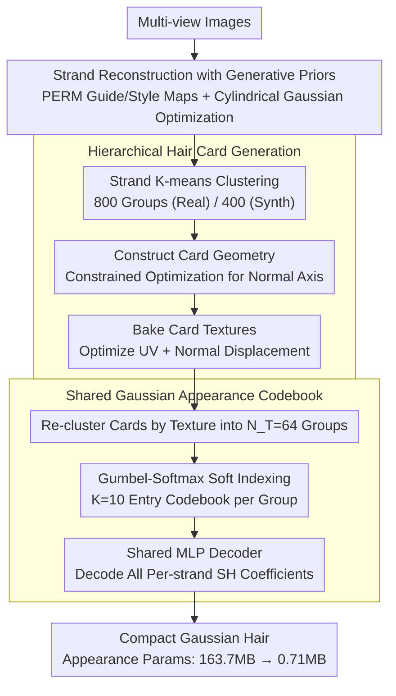

# CGHair: Compact Gaussian Hair Reconstruction with Card Clustering

**Conference**: CVPR 2026  
**arXiv**: [2604.03716](https://arxiv.org/abs/2604.03716)  
**Code**: [Project Page](https://humansensinglab.github.io/CGHair/)  
**Area**: 3D Vision  
**Keywords**: 3D Gaussian Splatting, hair reconstruction, hair card clustering, compact representation, appearance compression

## TL;DR

CGHair is proposed to achieve over 200x appearance parameter compression and 4x hair reconstruction acceleration while maintaining comparable visual quality through hair-card-guided hierarchical clustering and a shared Gaussian appearance codebook.

## Background & Motivation

**Background**: 3DGS-based hair reconstruction methods (such as GaussianHair) model hair strands using cylindrical Gaussian chains, achieving high-fidelity real-time rendering. However, modeling dense hair requires millions of Gaussian primitives, resulting in enormous storage and rendering costs.

**Limitations of Prior Work**: Methods like GaussianHair assign Spherical Harmonic (SH) coefficients independently to each strand. This ignores the strong structural and appearance redundancies inherent in hair within the same hairstyle, leading to significant parameter redundancy.

**Key Challenge**: High fidelity requires a large number of independent parameters vs. practical deployment requires a compact representation.

**Goal**: To design a compact Gaussian hair representation by leveraging the intrinsic structural similarity of hair.

**Key Insight**: Borrowing the "hair card" concept widely used in the gaming and film industries—clustering similar strands into cards and sharing textures.

**Core Idea**: Hierarchical clustering + shared appearance codebook to achieve both strand-level high fidelity and extreme compression.

## Method

### Overall Architecture

The core problem CGHair addresses is that dense hair can easily consist of millions of strands; assigning appearance parameters to each strand results in hundreds of MBs of storage, even though strands in the same hairstyle are highly similar in geometry and color. This redundancy is systematically "squeezed out": first, strand geometry is reconstructed rapidly using generative priors; then, thousands of strands are clustered into hundreds of "hair cards" (a simplification unit used in film and games); subsequently, groups of hair cards share the same appearance codebook; finally, multi-view optimization recovers visual details. The pipeline converges from "per-strand independence" to "one codebook per card group," reducing storage from 163.7MB to 0.71MB.

### Key Designs

**1. Generative Prior-Accelerated Strand Reconstruction: Bypassing Costly Diffusion Regularization**

Traditional methods optimize strand geometry directly on latent textures, which converges slowly and requires expensive diffusion regularization to maintain plausibility. CGHair uses the PERM parametric hair model as a prior: in scalp UV space, hair is represented by a guide map $\mathbf{G} = \mathcal{D}_{guide}(\alpha)$ and a style map $\mathbf{S} = \mathcal{D}_{style}(\beta)$, generated by pre-trained StyleGAN2 and VAE decoders. During reconstruction, the hair codes $\alpha, \beta$ and the decoders themselves are jointly optimized, with cylindrical Gaussians placed along strands for photometric supervision. By injecting strong geometry priors of "what hair should look like," the optimization fine-tunes on a reasonable manifold, achieving ~4x speedup over GaussianHaircut with a fully automated process.

**2. Hierarchical Hair Card Generation: Explicit Redundancy Reduction via Industrial Standards**

After reconstructing strands, CGHair employs the "hair card" concept—replacing a bundle of strands with a thin card mapped with hair textures—to explicitly compress redundancy. First, strand clustering is performed: 3D points of each strand are concatenated into a vector and clustered into $N_c$ groups (800 for real hair) via k-means. Next, card geometry is constructed by using the cluster center strand as the axis and solving a constrained optimization for the card's normal:

$$\{n_k^*\} = \arg\min \sum_k \sum_{p_i} \|(p_i - \bar{p}_{k}) \cdot n_k\|$$

The plane is fitted to the strands within the group. Finally, textures are baked by optimizing UV coordinates and normal displacement $\delta_i$ for each strand, projecting 3D strands onto the card surface. Thus, one hair card encodes both the geometric flow and appearance of its strand bundle.

**3. Shared Gaussian Appearance Codebook: Extreme Compression via Latent Codebooks and Shared Decoders**

Even with fewer cards, storing full Spherical Harmonic (SH) coefficients per card remains costly. CGHair adds another layer of clustering: $N_c$ hair cards are re-clustered into $N_T=64$ groups based on texture features, with each group sharing an appearance codebook containing $K=10$ entries of dimension $D=64$. For each strand, Gumbel-Softmax is used for soft indexing to retrieve features:

$$\mathbf{F}_{strand} = \sum_{k=1}^K \pi_k \cdot \mathbf{F}_k$$

where $\pi_k$ represents soft indexing weights. This 64D feature is fed into a globally shared MLP decoder $\phi_{dec}$ to decode all SH coefficients for the Gaussians along that strand:

$$[\mathbf{SH}_1, ..., \mathbf{SH}_{|\mathcal{S}|}] = \phi_{dec}(\mathbf{F}_{strand})$$

Crucially, this avoids mapping codebook entries directly to thousands of SH coefficients, which would cause dimensionality explosion. By storing only the low-dimensional codebook and decoder, appearance parameters are compressed to 0.71MB. Gumbel-Softmax ensures the indexing is differentiable for end-to-end training and prevents codebook collapse.

### Loss & Training

$$\dots$$  
$$\mathcal{L} = \mathcal{L}_p + \mathcal{L}_a + \mathcal{L}_o$$
- $\mathcal{L}_p$: L1 + D-SSIM photometric loss.
- $\mathcal{L}_a$: Alpha mask supervision loss.
- $\mathcal{L}_o$: Opacity smoothing regularization.
- Strategy: Geometry parameters are frozen for the first 7k iterations, followed by joint optimization with a lower learning rate.

## Key Experimental Results

### Main Results — Strand Reconstruction Quality

| Metric | CGHair | $\mathcal{D}_{PCA}$ Only | Frozen $\alpha,\beta$ | $\mathcal{D}_{style}$ Only |
| :--- | :--- | :--- | :--- | :--- |
| Pos. Error ↓ | **0.148** | 0.162 | 0.159 | 0.182 |
| Cur. Error ↓ | **6.73** | 9.12 | 6.98 | 7.48 |

### Ablation Study — Compact Representation

| Method | PSNR↑ | SSIM↑ | LPIPS↓ | Size (MB) ↓ | Gain (Ratio) ↑ |
| :--- | :--- | :--- | :--- | :--- | :--- |
| Unique (Per-strand SH) | 33.99 | 0.982 | 0.019 | 163.7 | 1.0 |
| No Card Clustering | 28.00 | 0.938 | 0.042 | 22.42 | 7.30 |
| Single-SH | 30.48 | 0.958 | 0.037 | 0.46 | 355.9 |
| **Latents (Full Ours)** | **32.40** | **0.970** | **0.026** | **0.71** | **230.6** |

### Key Findings

1. The full CGHair model uses only 0.71MB for appearance parameters to achieve a PSNR of 32.40. Compared to independent SH (163.7MB), it achieves 230x compression with only a 1.59 drop in PSNR.
2. Hair card clustering is essential: without clustering, global sharing results in a PSNR of only 28.00, proving the necessity of card-level structural clustering.
3. A codebook size of $K=10$ is sufficient; increasing it to 90 provides marginal PSNR gains but significantly increases storage.
4. Latent dimension $D=64$ represents the optimal balance.

## Highlights & Insights

- Sophisticatedly introduces the industrial "hair card" concept into academic hair reconstruction, unifying structural priors with data-driven reconstruction.
- Hierarchical compression strategy: Strands → Hair Cards → Card Groups → Shared Codebook, utilizing redundancy at different granularities.
- Plug-and-play design: The CGHair module can be directly applied to strands reconstructed by GaussianHair as a post-processing compression module.
- Gumbel-Softmax soft indexing allows end-to-end training and avoids common VQ codebook collapse.

## Limitations & Future Work

- Clustering counts $N_c, N_T$ are manually set; adaptive determination could be considered.
- Currently supports only static hair; dynamic or moving scenes are not addressed.
- After compression, PSNR is still ~1.6dB lower than the uncompressed version, which may be insufficient for scenarios with extreme detail requirements.
- Relies on PERM pre-trained priors; generalization to highly unconventional hairstyles is not fully verified.

## Related Work & Insights

- General 3DGS compression methods like CompGS do not exploit hair-specific structural redundancies, making CGHair a paradigm for domain-specific compression.
- The quantized encoding logic of VQVAE is successfully transferred to 3D hair representation.
- Provides inspiration for other 3D reconstruction tasks with strong structural redundancy, such as fabrics or vegetation.

## Rating

- Novelty: ⭐⭐⭐⭐ Combination of card clustering and shared codebooks is novel, though individual components are relatively mature.
- Experimental Thoroughness: ⭐⭐⭐⭐⭐ Multi-granularity ablation is highly comprehensive.
- Writing Quality: ⭐⭐⭐⭐ Clear pipeline and rich illustrations.
- Value: ⭐⭐⭐⭐ 200x compression is of great significance for practical deployment.

<!-- RELATED:START -->

## Related Papers

- [\[CVPR 2026\] 3D Gaussian Splatting at Arbitrary Resolutions with Compact Proxy Anchors](3d_gaussian_splatting_at_arbitrary_resolutions_with_compact_proxy_anchors.md)
- [\[CVPR 2026\] Nope-SGS: 3D Gaussian Reconstruction from Unposed Spike Streams](3d_gaussian_splatting_from_unposed_spike_stream.md)
- [\[CVPR 2026\] E2EGS: Event-to-Edge Gaussian Splatting for Pose-Free 3D Reconstruction](e2egs_event-to-edge_gaussian_splatting_for_pose-free_3d_reconstruction.md)
- [\[CVPR 2026\] InstantHDR: Single-forward Gaussian Splatting for High Dynamic Range 3D Reconstruction](instanthdr_singleforward_gaussian_splatting_for_hi.md)
- [\[CVPR 2026\] AeroDGS: Physically Consistent Dynamic Gaussian Splatting for Single-Sequence Aerial 4D Reconstruction](aerodgs_physically_consistent_dynamic_gaussian_splatting_for_single-sequence_aer.md)

<!-- RELATED:END -->
