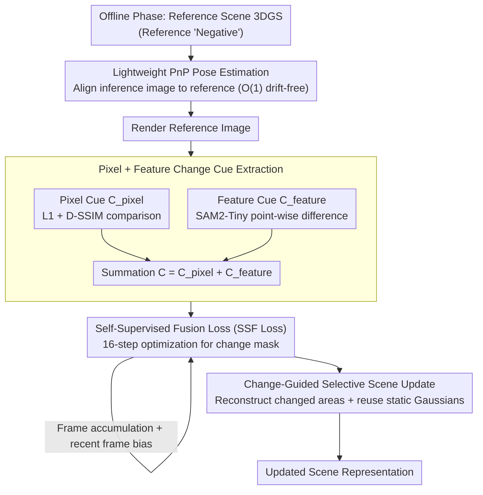

# Changes in Real Time: Online Scene Change Detection with Multi-View Fusion

**Conference**: CVPR 2026  
**arXiv**: [2511.12370](https://arxiv.org/abs/2511.12370)  
**Code**: [https://chumsy0725.github.io/O-SCD/](https://chumsy0725.github.io/O-SCD/)  
**Area**: 3D Vision  
**Keywords**: Scene Change Detection, 3D Gaussian Splatting, Online Inference, Self-supervised Fusion, Scene Update

## TL;DR

Ours proposes the first scene change detection (SCD) method that is simultaneously online, pose-agnostic, label-free, and multi-view consistent. By integrating pixel-level and feature-level change cues into a 3DGS change representation via a self-supervised fusion loss, it surpasses the detection accuracy of all existing offline methods while operating at a real-time rate exceeding 10 FPS.

## Background & Motivation

**Background**: Scene change detection (SCD) is a core task in scene understanding, applied in environmental monitoring, infrastructure inspection, and damage assessment. Recent methods utilize NeRF and 3DGS to construct 3D representations for pose-agnostic SCD.

**Limitations of Prior Work**:
   - Leading SCD methods (e.g., MV3DCD, GeSCD) are **offline**, requiring all pre- and post-change observations before inference, which is unsuitable for real-time decision-making.
   - Existing online methods have significantly lower accuracy than offline counterparts, and most fail to maintain real-time performance (<1 FPS).
   - MV3DCD uses hard thresholds and intersection-based heuristics to fuse change cues, which easily loses subtle but critical change signals.

**Key Challenge**: The need for real-time, frame-by-frame change detection in online scenarios while maintaining cross-view consistency, whereas existing methods sacrifice either accuracy (online) or real-time performance (offline).

**Goal**: (a) Achievement of real-time online change inference; (b) Prevention of information loss caused by hard thresholds; (c) Efficient updating of scene representations.

**Key Insight**: Utilizing 3DGS change representation as cross-view "persistent memory," combined with a self-supervised loss to automatically learn the fusion of multi-view change cues, while designing PnP-based lightweight pose estimation and change-guided selective scene updates.

**Core Idea**: Replacing hard-threshold heuristics with a self-supervised fusion loss allows change information to naturally accumulate and propagate within the 3DGS representation, while reconstructing only changed regions to achieve scene updates in seconds.

## Method

### Overall Architecture

The system addresses the problem of a robot performing on-site inspections while **identifying changes in real-time** relative to a reference state, avoiding the need for full batch processing. In the offline phase, a standard 3DGS representation is built for the reference scene as a "negative." During the online phase, each incoming inference frame follows a pipeline: registration to the reference coordinate system (pose estimation), rendering of the reference image from the same viewpoint, extraction of pixel-level and feature-level change cues, fusion of these cues into a dedicated "change representation," and solving for the current frame's change mask. After the inspection, the accumulated change masks guide selective reconstruction of only the changed areas to update the reference scene.

### Key Designs

**1. Lightweight PnP Pose Estimation: Fast, drift-free alignment of each inference frame**

The first barrier for online SCD is localization. Unlike SplatPose, which optimizes camera poses against 3DGS and runs at <1 FPS, this method uses pure geometric matching. During the offline phase, XFeat extracts keypoints from reference images, which are pre-triangulated into 3D points. Online, descriptors are extracted for each frame, matched against the top-4 nearest reference frames, and solved via PnP + RANSAC followed by GPU-parallel miniBA. Since pose estimation is performed against a **fixed-size** reference set, the per-frame cost is $O(1)$ and avoids the drift typical of odometry.

**2. Pixel-level + Feature-level Change Cue Extraction: Complementary signals**

Pixel-level cues $C_{\text{pixel}}^k = (1-\lambda)L_1 + \lambda L_{\text{D-SSIM}}$ capture fine-grained texture changes but are sensitive to lighting and shadows. Feature-level cues $C_{\text{feature}}^k = \sum_i |f_{\text{inf}}^{k,i} - f_{\text{ren}}^{k,i}|$ using SAM2-Tiny are robust to such interference but may miss subtle changes between semantically similar objects. These are summed $C^k = C_{\text{pixel}}^k + C_{\text{feature}}^k$. This avoids the hard-threshold intersection used in MV3DCD, which tends to discard valid changes if one cue fails to detect them; here, all evidence is preserved for the self-supervised loss to weigh.

**3. Self-Supervised Fusion Loss (SSF Loss): 3DGS as persistent memory for cross-view fusion**

To aggregate multi-view cues into a 3D-consistent judgment, a change representation $\mathcal{R}_{\text{change}}$ is initialized from the reference 3DGS by replacing color parameters with a learnable change parameter $c$. For each inference frame, the SSF loss is optimized for $n=16$ steps:

$$L_{\text{SSF}} = C^i \odot (1 - \tilde{M}^i) + \log(1 + \text{mean}(\tilde{M}^i)^2)$$

The first term is a "data term" penalizing low predicted change probability $\tilde{M}^i$ where cues are strong. The second is a regularization term suppressing the mask mean to avoid trivial solutions where $\tilde{M}=1$. By randomly sampling historical frames (with a 1/3 bias toward the current frame $k$), $\mathcal{R}_{\text{change}}$ accumulates evidence into a single 3D representation, ensuring multi-view consistency and bypassing information loss.

**4. Change-Guided Selective Scene Update: Reconstructing only what changed**

After inspection, the reference scene is refreshed. Rather than full reconstruction, unchanged pixels are masked out $\hat{I}_{\text{inf}}^k = I_{\text{inf}}^k \odot M_{\text{refined}}^k$. A new set of Gaussians $\mathcal{R}_{\text{change}}^*$ is reconstructed only for changed regions and merged with reused reference Gaussians $\mathcal{R}_{\text{ref}}^*$. A final constrained global optimization is performed where adaptive density control only affects Gaussians corresponding to changed pixels. This reduces the number of Gaussians optimized, reaching rendering speeds >400 FPS and completing updates in tens of seconds (8–13x faster than full reconstruction).

### Loss & Training

- **SSF Loss**: $L_{\text{SSF}} = C^i \odot (1 - \tilde{M}^i) + \log(1 + \text{mean}(\tilde{M}^i)^2)$
- Reference Scene: Standard 3DGS (via Speedy-Splat) + SfM pose estimation.
- Online Inference: 16-step optimization per frame, sampling biased toward recent frames.
- Scene Update: Standard 3DGS optimization pipeline + restricted density control.

## Key Experimental Results

### Main Results

SCD results on the PASLCD dataset (10 indoor/outdoor scenes):

| Method | Label-free | Pose-agnostic | Multi-view | Online | mIoU ↑ | F1 ↑ | Speed |
|------|--------|---------|--------|------|--------|------|------|
| GeSCD (Offline) | ✓ | ✗ | ✗ | ✗ | 0.477 | 0.611 | 298s |
| MV3DCD (Offline) | ✓ | ✓ | ✓ | ✗ | 0.478 | 0.628 | 479s |
| **Ours (Offline)** | ✓ | ✓ | ✓ | ✗ | **0.552** | **0.694** | 156s |
| SplatPose+ (Online) | ✓ | ✓ | ✗ | ✓ | 0.237 | 0.358 | <1 FPS |
| CS+CYWS2D (Online) | ✗ | ✗ | ✗ | ✓ | 0.243 | 0.360 | 8.2 FPS |
| **Ours (Online)** | ✓ | ✓ | ✓ | ✓ | **0.486** | **0.638** | 11.2 FPS |

Scene representation updates (PASLCD + CL-Splats):

| Method | PSNR ↑ | SSIM ↑ | LPIPS ↓ | Time(s) ↓ |
|------|--------|--------|---------|-----------|
| 3DGS (Scratch) | 22.21 | 0.756 | 0.243 | 550 |
| 3DGS-LM | 22.26 | 0.756 | 0.242 | 340 |
| CLNeRF | 22.27 | 0.624 | 0.391 | 451 |
| **Ours** | **23.70** | **0.787** | **0.249** | **42** |

### Ablation Study

| Variant | mIoU ↑ | F1 ↑ |
|------|--------|------|
| Full model | 0.486 | 0.638 |
| w/o $L_1$ | 0.320 | 0.464 |
| w/o $L_{\text{D-SSIM}}$ | 0.447 | 0.620 |
| $C_{\text{pixel}}$ only | ✗ (No conv.) | ✗ |
| $C_{\text{feature}}$ only | ✗ (No conv.) | ✗ |
| w/o Regularization | ✗ (Trivial) | ✗ |
| MV3DCD Threshold/Int. | 0.350 | 0.495 |

### Key Findings

- **Pixel and Feature Cues are Indispensable**: SSF loss fails to converge if either is removed, confirming they provide complementary supervision.
- **SSF Loss vs. Hard Thresholds**: Replacing SSF loss with MV3DCD’s heuristic dropped F1 from 0.638 to 0.495, proving self-supervised fusion is superior.
- **Online Model Surpasses Offline SOTA**: The online version (0.486 mIoU) already outperforms the strongest offline competitor, MV3DCD (0.478).
- **Speed-Accuracy Trade-off**: Reducing iterations allows adjustment between 11-20 FPS with only a 3.6% F1 drop.
- **Update Speed**: Reusing static Gaussians makes scene updates 8-13x faster than training from scratch while achieving higher PSNR.

## Highlights & Insights

- **3DGS as Persistent Memory**: Embedding change parameters into 3DGS primitives allows multi-view change information to accumulate and propagate naturally in 3D space.
- **Elegant SSF Loss**: A simple two-term loss achieves end-to-end multi-modal fusion and consistency without any labels. The core insight is "learning to fuse" rather than "manual fusion."
- **Selective Reconstruction**: Since changed areas require fewer Gaussians, rendering exceeds 400 FPS, significantly accelerating optimization for long-term monitoring.

## Limitations & Future Work

- XFeat may fail under extreme appearance changes (e.g., seasonal variations), affecting pose estimation.
- Currently relies on SAM2-Tiny; stronger vision foundation models could improve detection accuracy.
- Strategy assumes changes are static within a single inspection pass.
- Detection of very small object changes still has room for improvement.

## Related Work & Insights

- **vs MV3DCD**: Direct competitor. Ours replaces heuristic fusion with learnable SSF loss, improving mIoU by ~15% even in the online version.
- **vs SplatPose/SplatPose+**: These optimize poses per frame (<1 FPS). Ours uses a PnP scheme for $O(1)$ complexity and no drift.
- **vs CL-Splats/GaussianUpdate**: These require longer update times. Ours uses selective reconstruction for high efficiency.

## Rating

- Novelty: ⭐⭐⭐⭐⭐ First to integrate online + pose-agnostic + label-free + multi-view consistency.
- Experimental Thoroughness: ⭐⭐⭐⭐⭐ Comprehensive online/offline baselines and speed analysis.
- Writing Quality: ⭐⭐⭐⭐⭐ Clear logic with well-defined problem-solution mapping.
- Value: ⭐⭐⭐⭐⭐ Directly practical for robotic inspection and long-term monitoring.

<!-- RELATED:START -->

## Related Papers

- [\[CVPR 2026\] ChronoGS: Disentangling Invariants and Changes in Multi-Period Scenes](chronogs_disentangling_invariants_and_changes_in_multi-period_scenes.md)
- [\[CVPR 2026\] Intrinsic Image Fusion for Multi-View 3D Material Reconstruction](intrinsic_image_fusion_for_multi-view_3d_material_reconstruction.md)
- [\[CVPR 2026\] SRGCD: Stability-Driven Region Growth Framework for 3D Change Detection](srgcd_stability-driven_region_growth_framework_for_3d_change_detection.md)
- [\[CVPR 2026\] SAMosaic3D: Modular Scene Assembly for Real-Time 3D Segment Anything](samosaic3d_modular_scene_assembly_for_real-time_3d_segment_anything.md)
- [\[CVPR 2026\] Real-Time Dynamic Scene Rendering with Controlled Compressibility and Contact Awareness](real-time_dynamic_scene_rendering_with_controlled_compressibility_and_contact_aw.md)

<!-- RELATED:END -->
