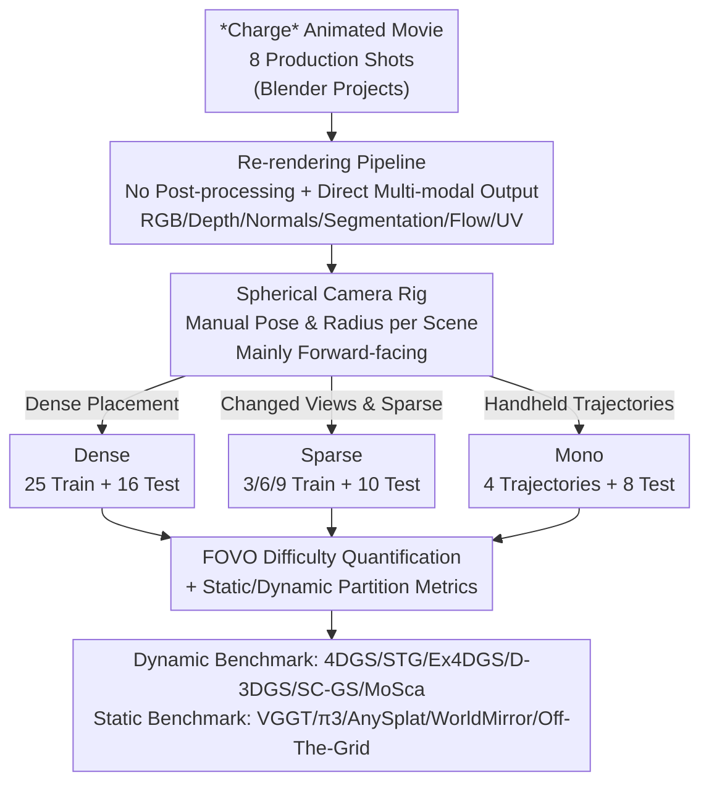

# Charge: A Comprehensive Novel View Synthesis Benchmark and Dataset to Bind Them All

**Conference**: CVPR 2026  
**Paper**: [CVF Open Access](https://openaccess.thecvf.com/content/CVPR2026/html/Nazarczuk_Charge_A_Comprehensive_Novel_View_Synthesis_Benchmark_and_Dataset_to_CVPR_2026_paper.html)  
**Code**: [charge-benchmark.github.io](https://charge-benchmark.github.io)  
**Area**: 3D Vision  
**Keywords**: Novel view synthesis, dynamic scenes, 4D reconstruction, synthetic dataset, benchmark evaluation

## TL;DR
The authors re-render the open-source Blender animated short movie *Charge* into a unified Novel View Synthesis (NVS) dataset that simultaneously provides three camera setups (Dense / Sparse / Mono), 6 pixel-level annotations (RGB, depth, normal, segmentation, optical flow, UV), and **perfect ground-truth camera poses** under the same set of scenes. This dataset is used to systematically benchmark state-of-the-art dynamic 3DGS methods and 3D foundation models (such as VGGT) under a unified standard, exposing their limitations in large motions, sparse views, and geometry-appearance coupling.

## Background & Motivation

**Background**: NeRF [26] and 3DGS [15] have matured NVS to practical levels, relying on differentiable rendering and photometric losses to reconstruct scenes by fitting posed 2D images. Recently, feed-forward 3D foundation models like VGGT [39] have advanced further, predicting camera poses, metric depth, point clouds, and 3D Gaussians in a single forward pass. Dynamic (4D) reconstruction is also progressing rapidly through NeRF temporal deformation and various 3DGS variants (4DGS, STG, Ex4DGS, Deformable-3DGS, SC-GS, MoSca, etc.).

**Limitations of Prior Work**: Existing datasets for evaluating these methods are severely lacking and suffer from critical drawbacks. Real-world dynamic datasets either rely on expensive hardware-synchronized multi-camera rigs (e.g., Neural 3D Video, Technicolor), which feature low dynamic content ratios, slow motions, and retain **only one test camera**; or utilize spherical outward-facing rigs (e.g., Google Immersive) with severe fisheye distortion and low view overlap. Monocular datasets (e.g., Nerfies, HyperNeRF) fake multi-view setups using "alternating frames", causing camera teleportation. Although DyCheck improves on this, its camera poses remain imperfect. More critically, motion in dynamic scenes degrades feature matching, leading to inaccurate SfM-estimated camera poses — meaning the evaluation of 4D reconstruction inherits pose errors from the very start.

**Key Challenge**: To rigorously evaluate the geometric and synthesis accuracy of a 4D reconstruction method, one requires **accurate ground-truth camera poses, dense evaluation views, and abundant, diverse dynamic content**. However, these three properties are almost impossible to achieve simultaneously in real-world captures due to hardware costs, physical space constraints, and unresolved pose estimation in dynamic scenes. Furthermore, although 3D foundation models like VGGT output multiple modalities (poses, depth, NVS) simultaneously, they are almost exclusively evaluated on **single-modality benchmarks** separately, leaving the relationship between modalities (geometry vs. appearance) unexamined.

**Goal**: To build a unified dataset that simultaneously supports static/dynamic, Dense/Sparse/Mono setups, contains perfect ground-truth, and consolidates fragmented evaluations from imperfect datasets into a single benchmark.

**Key Insight**: The authors draw inspiration from MPI Sintel [4], which uses synthetic animation to generate optical flow ground truth. Since perfect poses are unobtainable in physical captures of dynamic environments, they leverage a professionally produced animation movie *Charge* (rendered via Blender with photorealistic quality) to directly export geometric and coordinate ground truth from the rendering pipeline.

**Core Idea**: Utilize a high-quality animated film as a "scene library" to simultaneously deploy three camera setups and six annotation modalities within the same set of scenes, bringing static/dynamic, dense/sparse/monocular settings "all in one" unified dataset.

## Method

### Overall Architecture
Charge is not an algorithm, but a **dataset and benchmarking protocol**. Its construction logic involves: acquiring complete Blender project files (including animation, lighting, and asset libraries) for 8 production shots of the movie *Charge* $\to$ replacing the original rendering pipeline to ensure 3D consistency $\to$ manually designing spherical camera rigs for each scene and partitioning them into three sets of training and test cameras for Dense, Sparse, and Monocular purposes $\to$ directly rendering RGB along with multi-modal ground truths such as depth, normals, segmentation, and optical flow $\to$ deploying an evaluation protocol with difficulty quantification (FOVO) to test dynamic 3DGS methods and static 3D foundation models, respectively. The workflow yields 8 scenes, 185,600 frames, 2048×858 resolution, and 96 fps data.

### Key Designs

**1. Three Camera Setups in One Scene: Binding Dense / Sparse / Mono to the Same Shots**

The biggest issue with existing datasets is that "one dataset only serves one setup"—dense rig data cannot evaluate sparse methods, and monocular data relies on a different acquisition pipeline, lacking comparability. The core approach of Charge is to offer three camera setups within the **exact same scenes**, making performances under different data densities directly comparable. All three sets of cameras are placed on a region of a sphere (mainly forward-facing, matching real-world capture but allowing view changes), with rig positions and sphere radii manually adjusted for each scene. **Dense** uses 25 training and 16 test cameras, benchmarking against Neural 3D Video / Technicolor, which only provide 1 test camera due to cost constraints; Charge provides 16, allowing a much higher evaluation density. **Sparse** provides 3 / 6 / 9 training cameras + 10 test cameras. Crucially, the sparse cameras are **not simply downsampled from the Dense set** but cover the scene from a different perspective. Therefore, they emphasize "view extrapolation" rather than "interpolation", bringing higher difficulty and research value.

**2. Physically Plausible Monocular Trajectory Design: Fast/Slow × Spline/RandomWalk Four-Quadrant Matrix**

Evaluating monocular dynamic reconstruction has a hidden trap. DyCheck notes that if a monocular camera trajectory's "effective multi-view factor" is too high (i.e., the camera teleports or moves extremely fast), it essentially degenerates into pseudo-multi-view capture, failing to evaluate true monocular difficulty. Charge carefully designs monocular camera motion based on empirical measurements of handheld phone capture from roughly $1\!-\!2\,\text{m}$ distance, estimating reasonable device speeds around $15\!-\!50\,\text{cm/s}$. It utilizes these upper and lower bounds to construct **Fast / Slow** speeds. They are then combined with **Spline** trajectories (constrained to a spline curve covering most training camera positions, thus more regular) and **Random Walk** trajectories (random direction per time step with a smoothing factor, covering a wider, more irregular space), yielding four configurations: SplineFast, SplineSlow, RandomWalkFast, and RandomWalkSlow. At evaluation time, each trajectory is paired with 8 cameras — 4 central test cameras from the Dense set (enabling direct comparison with multi-view setups) and 4 defined relative to the training camera (including stereo pair cameras with different baselines and a camera orbiting the training camera), directly aligning with downstream tasks like stabilization and spatial video (stereo pair generation).

**3. FOVO Difficulty Quantification: Converting "How Hard a Test View Is" into a Single Number via Field-of-View Overlap**

The difficulty of different test views varies drastically, but prior evaluations usually report only a single average PSNR, masking which views are inherently hard to reconstruct. The authors propose **Field-of-View Overlap (FOVO)** to quantify the task difficulty: for each test view, its image plane is back-projected to all training views to obtain a set of coverage masks $\{m_i\}$ (indicating which regions of the test view can be seen by a given training view); these masks are summed and normalized by the total pixels of training views $n_{train}\cdot HW$ to yield a weighted co-visibility proxy that approaches 1 when seen by more training cameras; finally, we average over the $n_{test}$ test views:

$$\mathrm{FOVO}=\frac{1}{n_{test}}\left(\frac{\sum_{n_{train}} m_i}{n_{train}\cdot HW}\right)$$

A lower FOVO indicates a harder task. It provides the first quantitative proof for intuitive assumptions like "Sparse is harder than Dense," "3-view is much harder than 9-view," and "monocular is harder than dense" under a comparable metric (e.g., Dense is ~0.70, Sparse-3 is ~0.54, Mono is ~0.38–0.42). It also explains why the difficulty jump from 6 to 3 views is significantly harsher than from 9 to 6. ⚠️ The precise variable definitions in the FOVO formula are subject to the original paper.

**4. Static/Dynamic Partitioning Metrics + Perfect Multi-modal Ground Truth: Exposing Exactly Where the Shortcomings Lie**

Reporting only whole-image PSNR dilutes reconstruction failures in dynamic regions. Benefiting from the dynamic masks inherently provided by synthetic data, Charge breaks PSNR down into a dynamic region metric **PSNR-D** and a static region metric **PSNR-S**. Similarly, tight bounding box versions of SSIM and LPIPS are reported as **-D** variants based on the dynamic mask, isolating how poorly the dynamic parts are reconstructed. Crucially, the synthetic source enables Charge to provide data that real-world captures cannot: precise camera poses (without relying on COLMAP estimation), metric depth, normals, segmentation, optical flow, UV maps, and dynamic masks (6 modalities in total). Exactly because the authors hold both perfect geometric and appearance ground truth, they can reveal phenomena in the static benchmark such as "pose-shape ambiguity" and "coupled geometry-appearance tasks dragging each other down" — insights only visible with perfect ground truth. Charge's dynamic content accounts for 25.1% on average, double that of the closest competitor DyCheck (12.6%), with a wider coverage of large motions.

### Loss & Training
No new model is trained in this work. All evaluated methods are trained on Charge using their original configurations and evaluated at full resolution. For the dynamic benchmark, 4DGS [43] (adapted for both multi-view and single-view, evaluated under all three setups), STG [22], and Ex4DGS [16] (Dense / Sparse) are used, with Deformable-3DGS [44], SC-GS [11], and MoSca [17] added for monocular evaluation. The static benchmark evaluates VGGT [39], π3 [41] (geometry only), as well as AnySplat [12], WorldMirror [24], and Off-The-Grid [27] (Gaussian splatting output).

## Key Experimental Results

### Dataset Scale Comparison (vs. Existing Dynamic NVS Datasets, Table 1)

| Dataset | Dense | Sparse | Mono | Depth | FPS | Train Cameras | Test Cameras | Total Frames |
|--------|-------|--------|------|-------|-----|----------|----------|--------|
| Neural 3D Video [19] | ✓ | ✗ | ✗ | ✗ | 30 | 20 | 1 | 56,700 |
| Technicolor [33] | ✓ | ✗ | ✗ | ✗ | 30 | 15 | 1 | 25,696 |
| Google Immersive [3] | ✓ | ✗ | ✗ | ✗ | 30 | 45 | 1 | 157,320 |
| DyCheck [7] | ✗ | ✗ | ✓ | ✓ | 60 | 7+7 | 2/0 | 8,746 |
| **Charge (Ours)** | ✓ | ✓ | ✓ | ✓ | 96 | 25+9+4 | 16+10+16 | **185,600** |

Charge is the only dataset that checks all four columns (Dense/Sparse/Mono/Depth) while having a total frame count that far exceeds all existing datasets. Its dynamic content ratio is 25.1% (vs. DyCheck 12.6% / Neural 3D 10.9% / Technicolor 9.7%), with a resolution of 2048×858 at 96 fps.

### Dynamic Benchmark: Dense & Mono Setups (Table 3)

| Setup | Method | PSNR | PSNR-D | PSNR-S | LPIPS | FOVO |
|------|------|------|--------|--------|-------|------|
| Dense | 4DGS [43] | 28.94 | 26.84 | 31.85 | 0.231 | 0.70 |
| Dense | STG [22] | 29.29 | 28.15 | 31.33 | 0.193 | 0.70 |
| Dense | **Ex4DGS [16]** | **29.75** | **28.57** | 31.57 | **0.187** | 0.70 |
| Mono-SplineFast | 4DGS [43] | 24.85 | 22.69 | 27.25 | 0.264 | 0.42 |
| Mono-SplineFast | **D-3DGS [44]** | **24.88** | 22.91 | 27.24 | **0.201** | 0.42 |
| Mono-SplineFast | SC-GS [11] | 23.97 | 23.57 | 25.89 | 0.217 | 0.42 |
| Mono-SplineFast | MoSca [17] | 23.39 | 22.84 | 24.10 | 0.255 | 0.42 |

Under the Dense setup, PSNR for the three methods ranges from 28.94 to 29.75, showing that Charge presents a challenging but not impossible difficulty for current SOTA methods. PSNR-D is consistently 3-5 dB lower than PSNR-S, indicating dynamic regions are significantly more difficult. In monocular setups, FOVO drops to 0.38-0.42, with difficulty rising sharply. Under RandomWalkSlow (lowest FOVO of 0.38), MoSca catches up to PSNR 24.29, but performs the worst under SplineFast with large motions. The authors attribute this to the failure of trajectory pre-processing, which MoSca heavily relies on, in the presence of large motion.

### Dynamic Benchmark: Sparse Setup (Table 4, 4DGS)

| No. of Train Views | PSNR | SSIM | LPIPS | FOVO |
|------------|------|------|-------|------|
| 3 | 19.71 | 0.776 | 0.358 | 0.54 |
| 6 | 23.93 | 0.840 | 0.277 | 0.62 |
| 9 | 26.67 | 0.874 | 0.226 | 0.64 |

Sparse view performance changes drastically with the number of cameras, and the performance drop from 6$\to$3 (4.22 dB) is more severe than from 9$\to$6 (2.74 dB), which aligns with the non-linear decline of FOVO (0.54/0.62/0.64). ⚠️ There is a slight discrepancy between Table 1 and the main text regarding the number of Sparse training cameras (3/6/9 vs. '9+10'); please refer to the original paper for accuracy.

### Static Benchmark: 3D Foundation Models (Table 5, Selected Dense Setup)

| Method | AUC@5↑ | AbsRel↓ | NVS PSNR↑ | NVS† PSNR↑ |
|------|--------|---------|-----------|------------|
| VGGT [39] | 0.5149 | 0.1085 | - | - |
| π3 [41] | 0.4071 | **0.1344** | - | - |
| AnySplat [12] | 0.3359 | 0.2248 | 18.74 | 23.12 |
| WorldMirror [24] | 0.5126 | 0.1811 | 20.10 | 24.44 |
| **Off-The-Grid [27]** | **0.6318** | 0.1438 | 20.08 | **25.16** |

### Key Findings
- **Dynamic regions are a universal weakness**: All methods yield a PSNR-D significantly lower than PSNR-S. Even under Dense multi-view setups, reconstructing highly non-rigid motions like "paint splattering" remains poor, indicating that 4D reconstruction with large motions is far from solved.
- **Coupling of geometry and appearance tasks drags each other down**: Although AnySplat is initialized from VGGT, its camera pose (AUC@5 of only 0.34) degrades compared to VGGT (0.51), and depth estimation of models outputting Gaussian splatting also deteriorates under photometric supervision. π3 has the most accurate depth (lowest AbsRel) but weaker pose metrics at low thresholds. This "pose-shape ambiguity" can only be laid bare using datasets containing perfect ground truth for both geometry and appearance, like Charge.
- **There is no one-size-fits-all method**: Ex4DGS performs best under Dense setups; 4DGS/Ex4DGS slightly outperform STG under sparse low-view conditions; while for monocular settings, the best-performing method shifts between D-3DGS and MoSca depending on the trajectory. Method choice is highly configuration-dependent.

## Highlights & Insights
- **"Using a movie as a dataset" is an ingenious and reproducible approach**: Professional animation projects inherently feature photorealism, rich scene compositions, and complex motions. Re-rendering enables obtaining perfect poses and multi-modal ground truths that are forever unattainable in physical captures — transforming "acquisition impossibility" into "rendering availability."
- **FOVO converts difficulty into a comparable scalar**: While "sparse is harder than dense" was previously stated qualitatively, FOVO uses field-of-view back-projection coverage to produce a value between 0 and 1. This provides quantitative backing for cross-setup difficulty comparison and finer details (e.g., why performance drops steeper from 6 to 3 than from 9 to 6). This metric itself is transferable to other multi-view tasks.
- **Static/dynamic partitioned evaluation strikes the key pain point**: Splitting PSNR into PSNR-D / PSNR-S directly exposes dynamic failures that are typically diluted by whole-image averaging. This is a small yet highly effective trick in evaluation protocol design.
- **The unity of "binding all setups"**: Supporting static/dynamic, Dense/Sparse/Mono setups simultaneously within the same set of scenes enables cross-method comparative analyses to finally stand on a unified foundation.

## Limitations & Future Work
- **Domain gap between synthetic and real-world data**: The data originates entirely from an animated film. Although textures, lighting, and motions are photorealistic, they remain rendered environments. Methods performing well on Charge may not seamlessly transfer to real-world handheld videos; the paper lacks verification of synthetic-to-real domain transfer.
- **Scene diversity is constrained by movie content**: There are only 8 scenes, all of which are shots from the same movie *Charge*. The coverage of scene types and object categories is limited by the artistic design of this specific film.
- **Metrics across setups are not directly comparable**: The authors themselves point out that the Sparse cameras do not overlap with the Dense cameras, meaning their absolute PSNR values cannot be directly compared. Readers should keep this *caveat* in mind to avoid misinterpretation.
- **Future directions**: The benchmark can be extended to more animated films/scenes to increase diversity; future work could complete generalization studies from synthetic training to real-world testing; and other fine-grained difficulty dimensions (such as motion magnitude and occlusion degree) could be introduced alongside FOVO.

## Related Work & Insights
- **vs. Neural 3D Video / Technicolor [19, 33]**: These are captured using real hardware rigs. They feature low dynamic content proportions (~10%), slow motion, and retain only 1 evaluation camera. Conversely, Charge synthesizes 16 test cameras, achieves 25.1% dynamic content ratio, and provides perfect poses, yielding much higher evaluation density and reliability.
- **vs. DyCheck [7]**: DyCheck uses 2 static cameras for monocular evaluation and introduces the concept of an "effective multi-view factor", yet suffers from imperfect camera poses. Charge inherits its trajectory design philosophy (avoiding camera teleportation) but leverages synthesis to deliver perfect ground-truth poses and double the dynamic content ratio.
- **vs. D-NeRF / Synthetic Datasets [31]**: D-NeRF also utilizes synthetic dynamics, but suffers from low asset quality, plain white backgrounds, and creates monocular sequences by sampling sequential cameras (causing teleportation issues). Charge provides high-quality cinematic renders and physically plausible, carefully designed monocular trajectories.
- **vs. MPI Sintel [4]**: While Sintel also leverages an animated movie for synthetic labels targeting optical flow, Charge extends this philosophy to unified 3D/4D reconstruction benchmarks, introducing various camera setups and ground-truth poses.

## Rating
- Novelty: ⭐⭐⭐⭐ Utilizing animated films to bind all NVS setups accompanied by the FOVO difficulty metric is a solid and rarely seen dataset contribution, though not a paradigm shift at the algorithmic level.
- Experimental Thoroughness: ⭐⭐⭐⭐⭐ Exceedingly comprehensive with 6 dynamic methods tested across three setups, 5 static foundation models, multi-modal and multi-metric evaluations, alongside in-depth FOVO difficulty analyses.
- Writing Quality: ⭐⭐⭐⭐ Clear presentation of motivations and dataset design, high information density in tables, though there are slight discrepancies in sparse camera accounts.
- Value: ⭐⭐⭐⭐⭐ Provides the first unified benchmark with perfect ground-truth poses spanning all configurations for 4D reconstruction and 3D foundation models, which is highly valuable for evaluating and standardizing progress in the community.

<!-- RELATED:START -->

## Related Papers

- [\[CVPR 2026\] From None to All: Self-Supervised 3D Reconstruction via Novel View Synthesis](from_none_to_all_self-supervised_3d_reconstruction_via_novel_view_synthesis.md)
- [\[CVPR 2026\] RF4D: Neural Radar Fields for Novel View Synthesis in Outdoor Dynamic Scenes](rf4dneural_radar_fields_for_novel_view_synthesis_in_outdoor_dynamic_scenes.md)
- [\[CVPR 2026\] PhysGaia: A Physics-Aware Benchmark with Multi-Body Interactions for Dynamic Novel View Synthesis](physgaia_a_physics-aware_benchmark_with_multi-body_interactions_for_dynamic_nove.md)
- [\[CVPR 2026\] GeodesicNVS: Probability Density Geodesic Flow Matching for Novel View Synthesis](geodesicnvs_probability_density_geodesic_flow_matching_for_novel_view_synthesis.md)
- [\[CVPR 2026\] SmokeSVD: Smoke Reconstruction from A Single View via Progressive Novel View Synthesis and Refinement with Diffusion Models](smokesvd_smoke_reconstruction_from_a_single_view_via_progressive_novel_view_synt.md)

<!-- RELATED:END -->
